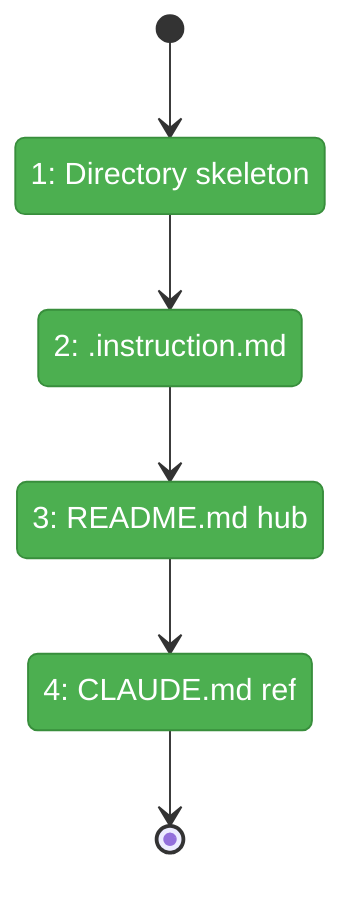
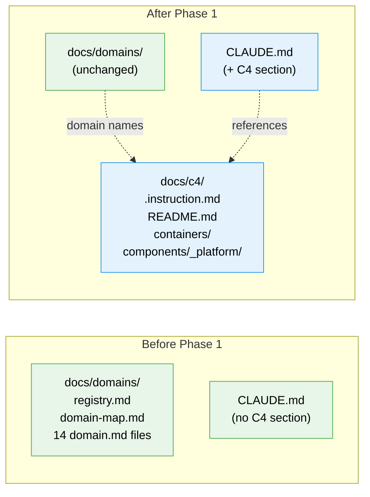

# Flight Plan: Phase 1 — Foundation & Design Principles

**Plan**: [c4-models-plan.md](../../c4-models-plan.md)
**Phase**: Phase 1: Foundation & Design Principles
**Generated**: 2026-03-02
**Status**: Landed

---

## Departure → Destination

**Where we are**: The `docs/c4/` directory does not exist. No `.instruction.md` pattern exists in the codebase. CLAUDE.md has no reference to C4 architecture diagrams. The rendering infrastructure (Mermaid v11, MermaidRenderer, MarkdownViewer) is ready but there is no C4 content to render.

**Where we're going**: A developer or AI agent opening `docs/c4/README.md` finds a complete navigation hub linking to all C4 levels and every active domain. `.github/instructions/c4-authoring.instructions.md` provides 10 design principles governing C4 authoring (using the official GitHub Copilot CLI instructions pattern). CLAUDE.md references the instruction file so all AI tools discover C4 conventions. The directory skeleton is ready for Phase 2-4 diagram files.

---

## Domain Context

### Domains We're Changing

| Domain | What Changes | Key Files |
|--------|-------------|-----------|
| — (docs) | New `docs/c4/` directory with `README.md` | `docs/c4/README.md` |
| — (root) | New `.github/instructions/c4-authoring.instructions.md` | `.github/instructions/c4-authoring.instructions.md` |
| — (root) | Add C4 Architecture Diagrams section | `CLAUDE.md` |

### Domains We Depend On (no changes)

| Domain | What We Consume | Contract |
|--------|----------------|----------|
| — (docs) | Domain names from registry | `docs/domains/registry.md` (read-only) |
| — (docs) | Design principles from workshop | `docs/plans/063-c4-models/workshops/001-c4-design-and-layout.md` (read-only) |

---

## Flight Status

<!-- Updated by /plan-6-v2: pending → active → done. Use blocked for problems/input needed. -->

**Legend**: grey = pending | yellow = active | red = blocked/needs input | green = done

---

## Stages

<!-- Updated by /plan-6-v2 during implementation: [ ] → [~] → [x] -->

- [x] **Stage 1: Create directory skeleton** — `docs/c4/containers/`, `docs/c4/components/_platform/`, `.github/instructions/`
- [x] **Stage 2: Write instructions file** — 10 design principles with `applyTo` frontmatter (`.github/instructions/c4-authoring.instructions.md` — new file, official GitHub pattern)
- [x] **Stage 3: Write README.md hub** — navigation table + quick links for all 13 domains (`docs/c4/README.md` — new file)
- [x] **Stage 4: Add CLAUDE.md reference** — C4 Architecture Diagrams section after Architecture (`CLAUDE.md` — modify)

---

## Architecture: Before & After

**Legend**: existing (green, unchanged) | new (blue, created)

---

## Acceptance Criteria

- [x] AC-01: `docs/c4/README.md` exists with navigation table (L1, L2, L3)
- [x] AC-02: `.github/instructions/c4-authoring.instructions.md` exists with `applyTo: "docs/c4/**"` and 8+ principles
- [x] AC-08: README.md lists all infrastructure and business domains with relative links
- [x] AC-11: Instructions file covers domain mirroring, contracts on edges, progressive detail, actionable descriptions, one diagram per file, cross-reference, navigation footer, sync strategy
- [x] AC-12: `CLAUDE.md` references `.github/instructions/c4-authoring.instructions.md`

## Goals & Non-Goals

**Goals**: `.github/instructions/c4-authoring.instructions.md` with 10 principles, README.md hub, CLAUDE.md reference, directory skeleton
**Non-Goals**: No C4 diagrams, no application code, no rendering changes

---

## Checklist

- [x] T001: Create `.github/instructions/c4-authoring.instructions.md` with 10 design principles
- [x] T002: Create `docs/c4/README.md` navigation hub
- [x] T003: Add C4 Architecture Diagrams section to `CLAUDE.md`
- [x] T004: Create directory skeleton (`containers/`, `components/_platform/`, `.github/instructions/`)
