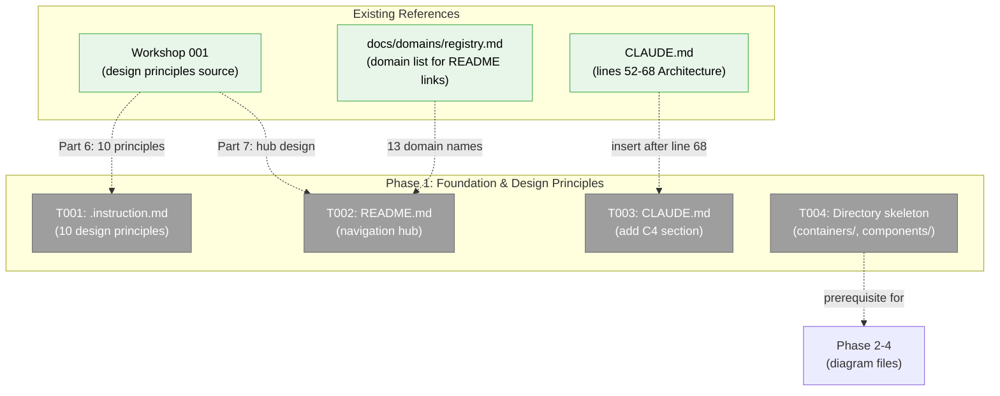
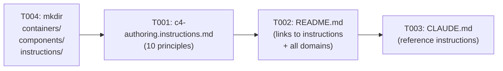
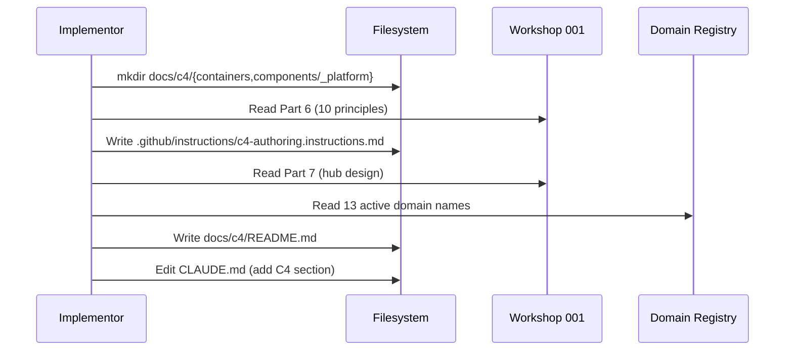

# Phase 1: Foundation & Design Principles — Tasks

**Plan**: [c4-models-plan.md](../../c4-models-plan.md)
**Spec**: [c4-models-spec.md](../../c4-models-spec.md)
**Workshop**: [001-c4-design-and-layout.md](../../workshops/001-c4-design-and-layout.md)
**Phase**: 1 of 5
**Complexity**: CS-1
**Status**: Phase 1 Complete
**Delivers**: AC-01, AC-02, AC-08, AC-11, AC-12

---

## Executive Briefing

**Purpose**: Establish the `docs/c4/` directory structure, design principles (`.instruction.md`), navigation hub (`README.md`), and AI agent discoverability (`CLAUDE.md` reference). This phase creates the foundation that all subsequent phases build on.

**What We're Building**: Three markdown files and a directory skeleton — the scaffolding for a complete C4 architecture model. The `.instruction.md` is the first instance of this pattern in the codebase.

**Goals**:
- ✅ `.github/instructions/c4-authoring.instructions.md` with 10 design principles and `applyTo` frontmatter (official GitHub pattern)
- ✅ `docs/c4/README.md` navigation hub linking all C4 levels and domains
- ✅ `CLAUDE.md` section referencing `.instruction.md` for AI agent discovery
- ✅ Directory skeleton for containers and components

**Non-Goals**:
- ❌ Creating any C4 diagrams (that's Phase 2+)
- ❌ Runtime enforcement of `.instruction.md` (convention-only)
- ❌ Modifying any application code or viewer components

---

## Pre-Implementation Check

| File | Exists? | Domain Check | Notes |
|------|---------|-------------|-------|
| `.github/instructions/c4-authoring.instructions.md` | No — create | N/A (root) | Official GitHub Copilot CLI path-specific instructions pattern |
| `docs/c4/README.md` | No — create | N/A (docs) | C4 navigation hub |
| `CLAUDE.md` | Yes — modify | N/A (root) | Add section after "Architecture" (line 68), before "Critical Patterns" (line 70) |
| `docs/c4/containers/` | No — create dir | N/A (docs) | Empty directory for Phase 2 |
| `docs/c4/components/_platform/` | No — create dir | N/A (docs) | Empty directory for Phase 3 |
| `.github/instructions/` | No — create dir | N/A (root) | First use of official instructions directory |

No concept search needed — this phase creates documentation infrastructure with no application code overlap.

---

## Architecture Map



---

## Tasks

| Status | ID | Task | Domain | Path(s) | Done When | Notes |
|--------|-----|------|--------|---------|-----------|-------|
| [x] | T001 | Create `.github/instructions/c4-authoring.instructions.md` with 10 C4 design principles | — (root) | `.github/instructions/c4-authoring.instructions.md` | File exists with YAML frontmatter `applyTo: "docs/c4/**"` and 10 numbered principles covering: (1) mirror domain boundaries, (2) contracts on edges, (3) progressive detail, (4) actionable descriptions, (5) one diagram per file, (6) cross-reference block required, (7) navigation footer required, (8) keep in sync, (9) infrastructure before business, (10) use `<br/>` for newlines | Official GitHub `.instructions.md` pattern. Source: Workshop 001 Part 6. |
| [x] | T002 | Create `docs/c4/README.md` navigation hub | — (docs) | `docs/c4/README.md` | File contains: (1) C4 model intro, (2) navigation table with L1/L2/L3 entry points, (3) quick links for 10 infrastructure domains + 3 business domains, (4) link to `.github/instructions/c4-authoring.instructions.md`, (5) links to domain registry and domain map | Source: Workshop 001 Part 7. Links use relative paths. Domain names from registry.md. |
| [x] | T003 | Add "C4 Architecture Diagrams" section to CLAUDE.md | — (root) | `CLAUDE.md` | CLAUDE.md has a new `## C4 Architecture Diagrams` section between "Architecture" (line 68) and "Critical Patterns" (line 70) referencing `.github/instructions/c4-authoring.instructions.md` for C4 authoring rules | Finding 06. Keep concise — 3-5 lines maximum. |
| [x] | T004 | Create directory skeleton for Phase 2-4 content | — (docs) | `docs/c4/containers/`, `docs/c4/components/_platform/`, `.github/instructions/` | All directories exist | Prerequisite for Phase 2 (containers), Phase 3 (components), and T001 (instructions). |

---

## Context Brief

**Key findings from plan**:
- Finding 02: `docs/c4/` directory does not exist yet → T004 creates it
- Finding 03: No `.github/instructions/` directory exists → T004 creates it, T001 is the first instructions file
- Finding 06: CLAUDE.md has no C4 section → T003 adds it after "Architecture" section (line 68)

**Domain dependencies**: None — this phase creates documentation infrastructure with no application code or domain contract consumption.

**Domain constraints**: None — all files are in `docs/` outside any domain boundary.

**Reusable from prior phases**: N/A — this is Phase 1.

**Content sources**:
- Workshop 001 Part 6 (10 design principles) → T001
- Workshop 001 Part 7 (README hub design) → T002
- `docs/domains/registry.md` (13 active domain names for README links) → T002
- `docs/domains/domain-map.md` (referenced by README) → T002

**Implementation flow**:



**Sequence**:



---

## Discoveries & Learnings

_Populated during implementation by plan-6._

| Date | Task | Type | Discovery | Resolution | References |
|------|------|------|-----------|------------|------------|

---

## Directory Layout

```
docs/plans/063-c4-models/
  ├── c4-models-spec.md
  ├── c4-models-plan.md
  ├── research-dossier.md
  ├── workshops/
  │   └── 001-c4-design-and-layout.md
  └── tasks/phase-1-foundation-and-design-principles/
      ├── tasks.md                    ← this file
      ├── tasks.fltplan.md            ← flight plan (below)
      └── execution.log.md           ← created by plan-6
```
