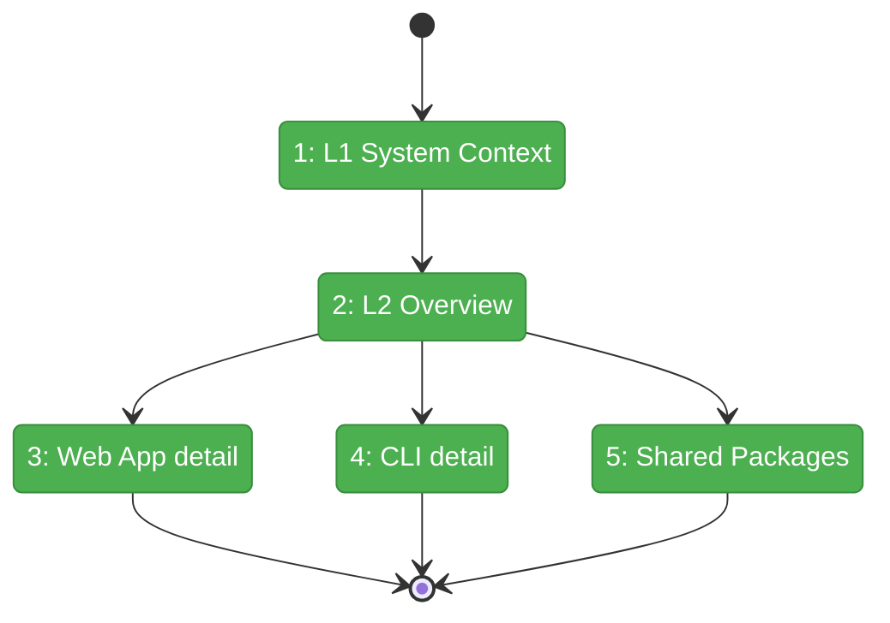
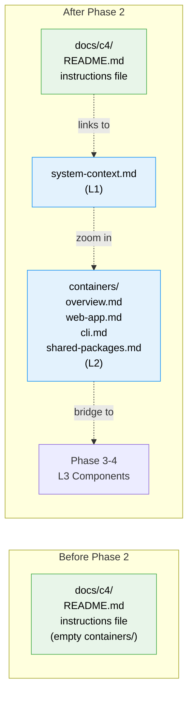

# Flight Plan: Phase 2 — L1 System Context & L2 Containers

**Plan**: [c4-models-plan.md](../../c4-models-plan.md)
**Phase**: Phase 2: L1 System Context & L2 Containers
**Generated**: 2026-03-02
**Status**: Landed

---

## Departure → Destination

**Where we are**: `docs/c4/` has a README.md hub and instructions file but no actual C4 diagrams. The `containers/` directory is empty. Developers browsing `docs/c4/` see links to files that don't exist yet.

**Where we're going**: A developer opening `docs/c4/system-context.md` sees the complete system landscape — who uses Chainglass and what it connects to. Drilling into `containers/overview.md` reveals the three deployable units. `web-app.md` serves as the zoom bridge listing all 13 domains with links to their L3 component diagrams (Phase 3+4).

---

## Domain Context

### Domains We're Changing

| Domain | What Changes | Key Files |
|--------|-------------|-----------|
| — (docs) | New L1 system context diagram | `docs/c4/system-context.md` |
| — (docs) | New L2 container overview + 3 detail files | `docs/c4/containers/overview.md`, `web-app.md`, `cli.md`, `shared-packages.md` |

### Domains We Depend On (no changes)

| Domain | What We Consume | Contract |
|--------|----------------|----------|
| — (docs) | Domain names and types | `docs/domains/registry.md` (read-only) |
| — (docs) | Domain map topology | `docs/domains/domain-map.md` (read-only) |
| — (root) | System overview | `docs/project-rules/architecture.md` (read-only) |

---

## Flight Status

<!-- Updated by /plan-6-v2: pending → active → done. Use blocked for problems/input needed. -->

**Legend**: grey = pending | yellow = active | red = blocked/needs input | green = done

---

## Stages

<!-- Updated by /plan-6-v2 during implementation: [ ] → [~] → [x] -->

- [x] **Stage 1: L1 System Context** — C4Context diagram with persons, systems, externals (`docs/c4/system-context.md` — new file)
- [x] **Stage 2: L2 Container Overview** — C4Container diagram with web, cli, shared (`docs/c4/containers/overview.md` — new file)
- [x] **Stage 3: Web App Detail** — domain groupings as zoom bridge to L3 (`docs/c4/containers/web-app.md` — new file)
- [x] **Stage 4: CLI Detail** — command group structure (`docs/c4/containers/cli.md` — new file)
- [x] **Stage 5: Shared Packages** — interface/type exports (`docs/c4/containers/shared-packages.md` — new file)

---

## Architecture: Before & After

**Legend**: existing (green, unchanged) | new (blue, created)

---

## Acceptance Criteria

- [x] AC-03: `docs/c4/system-context.md` exists with `C4Context` diagram (Developer, AI Agent, Web App, CLI, MCP Server, Git, Filesystem)
- [x] AC-04: `docs/c4/containers/overview.md` exists with `C4Container` diagram (apps/web, apps/cli, packages/mcp-server, packages/shared)
- [x] AC-07: All 5 files have Navigation footers (Zoom Out, Zoom In, Hub)
- [x] AC-13: L1 includes Developer, AI Agent, Web App, CLI, MCP Server, Git, Filesystem with labeled relationships
- [x] AC-14: L2 includes apps/web, apps/cli, packages/mcp-server, packages/shared with technology labels and descriptions

## Goals & Non-Goals

**Goals**: L1 System Context, L2 Container overview + 3 detail files, navigation footers, zoom bridge to L3
**Non-Goals**: No L3 component diagrams, no code changes, no interactive zoom

---

## Checklist

- [x] T001: Create `docs/c4/system-context.md` (L1 C4Context)
- [x] T002: Create `docs/c4/containers/overview.md` (L2 C4Container)
- [x] T003: Create `docs/c4/containers/web-app.md` (L2 detail + domain bridge)
- [x] T004: Create `docs/c4/containers/cli.md` (L2 detail)
- [x] T005: Create `docs/c4/containers/shared-packages.md` (L2 detail)
