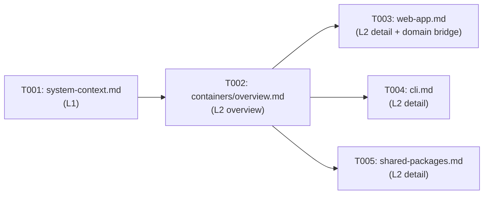
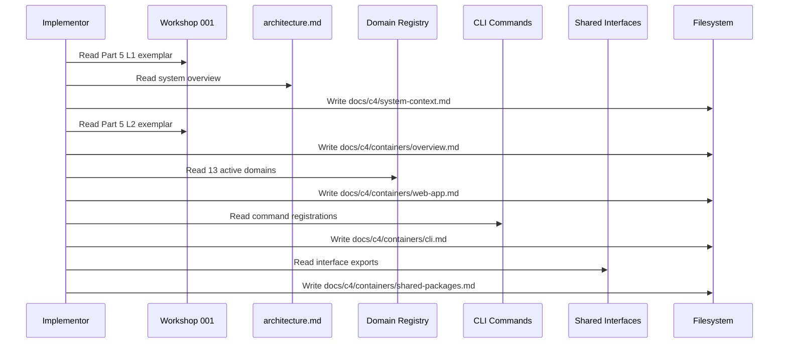

# Phase 2: L1 System Context & L2 Containers — Tasks

**Plan**: [c4-models-plan.md](../../c4-models-plan.md)
**Spec**: [c4-models-spec.md](../../c4-models-spec.md)
**Workshop**: [001-c4-design-and-layout.md](../../workshops/001-c4-design-and-layout.md)
**Phase**: 2 of 5
**Complexity**: CS-1
**Status**: Pending
**Delivers**: AC-03, AC-04, AC-07 (partial), AC-13, AC-14

---

## Executive Briefing

**Purpose**: Create the top two C4 levels — L1 System Context (who uses Chainglass and what it connects to) and L2 Container diagrams (what the deployable pieces are). These are the entry points for architecture discovery.

**What We're Building**: 5 markdown files with Mermaid C4 diagrams — one L1 system context, one L2 container overview, and three L2 container detail files (web app, CLI, shared packages). The web-app detail serves as the zoom bridge into L3 domain components.

**Goals**:
- ✅ L1 System Context diagram showing developers, AI agents, and external systems
- ✅ L2 Container overview showing apps/web, apps/cli, packages/shared
- ✅ L2 Web App detail with domain groupings (bridge to L3)
- ✅ L2 CLI detail with command groups
- ✅ L2 Shared Packages detail with exported interfaces
- ✅ Navigation footers on all files

**Non-Goals**:
- ❌ L3 Component diagrams (that's Phase 3+4)
- ❌ Interactive zoom between layers
- ❌ Any code changes

---

## Prior Phase Context

### Phase 1: Foundation & Design Principles (Complete)

**A. Deliverables**:
- `.github/instructions/c4-authoring.instructions.md` — 10 design principles with `applyTo: "docs/c4/**"` (3.2KB)
- `docs/c4/README.md` — Navigation hub with L1/L2/L3 table and 13 domain quick links (2.7KB)
- `CLAUDE.md` — Added "C4 Architecture Diagrams" section referencing instructions file
- Directory skeleton: `docs/c4/containers/`, `docs/c4/components/_platform/`, `.github/instructions/`

**B. Dependencies Exported**:
- `docs/c4/containers/` directory — ready to receive L2 files
- Navigation hub links to files we'll create: `system-context.md`, `containers/overview.md`, `containers/web-app.md`, `containers/cli.md`, `containers/shared-packages.md`
- Instructions file establishes authoring principles to follow

**C. Gotchas & Debt**:
- Mermaid C4 diagrams render but styling is basic/ugly — deferred to future enhancement
- Official GitHub `.instructions.md` pattern adopted (not custom `.instruction.md`)

**D. Incomplete Items**: None — Phase 1 fully complete (all 5 ACs passed).

**E. Patterns to Follow**:
- Use `<br/>` for multi-line Mermaid labels (Principle 10)
- Navigation footer format from instructions file (Principle 7)
- Each file has exactly one primary C4 diagram (Principle 5)

---

## Pre-Implementation Check

| File | Exists? | Domain Check | Notes |
|------|---------|-------------|-------|
| `docs/c4/system-context.md` | No — create | N/A (docs) | L1 diagram. Workshop 001 has exemplar. |
| `docs/c4/containers/overview.md` | No — create | N/A (docs) | L2 overview. Workshop 001 has exemplar. |
| `docs/c4/containers/web-app.md` | No — create | N/A (docs) | L2 detail. Domain grouping bridge to L3. |
| `docs/c4/containers/cli.md` | No — create | N/A (docs) | L2 detail. CLI command groups from `apps/cli/src/commands/`. |
| `docs/c4/containers/shared-packages.md` | No — create | N/A (docs) | L2 detail. Shared interfaces from `packages/shared/src/interfaces/`. |

No concept search needed — pure documentation files.

---

## Architecture Map

```mermaid
flowchart TD
    classDef pending fill:#9E9E9E,stroke:#757575,color:#fff
    classDef completed fill:#4CAF50,stroke:#388E3C,color:#fff

    subgraph Phase1["Phase 1 (Complete)"]
        P1_README["README.md hub"]:::completed
        P1_INST["instructions file"]:::completed
        P1_CLAUDE["CLAUDE.md ref"]:::completed
    end

    subgraph Phase2["Phase 2: L1 & L2 Diagrams"]
        T001["T001: system-context.md<br/>(L1 C4Context)"]:::completed
        T002["T002: containers/overview.md<br/>(L2 C4Container)"]:::pending
        T003["T003: containers/web-app.md<br/>(L2 detail + domain bridge)"]:::pending
        T004["T004: containers/cli.md<br/>(L2 detail)"]:::pending
        T005["T005: containers/shared-packages.md<br/>(L2 detail)"]:::pending
    end

    subgraph Sources["Content Sources"]
        WS["Workshop 001<br/>Part 5 exemplars"]:::completed
        ARCH["architecture.md<br/>system overview"]:::completed
        CLI_SRC["apps/cli/src/commands/<br/>(14 command files)"]:::completed
        PKG_SRC["packages/shared/src/<br/>interfaces/"]:::completed
    end

    P1_README -.->|"links to"| T001
    P1_README -.->|"links to"| T002
    WS -.->|"L1 exemplar"| T001
    WS -.->|"L2 exemplar"| T002
    ARCH -.->|"system overview"| T001
    CLI_SRC -.->|"command groups"| T004
    PKG_SRC -.->|"shared interfaces"| T005
    T001 -.->|"zoom in"| T002
    T002 -.->|"zoom in"| T003
    T003 -.->|"bridge to L3"| Phase3["Phase 3-4<br/>(L3 components)"]
```

---

## Tasks

| Status | ID | Task | Domain | Path(s) | Done When | Notes |
|--------|-----|------|--------|---------|-----------|-------|
| [ ] | T001 | Create `docs/c4/system-context.md` with L1 `C4Context` diagram | — (docs) | `docs/c4/system-context.md` | Mermaid `C4Context` diagram includes: Developer (Person), AI Agent (Person), Web Application (System), CLI Tool (System), Git (System_Ext), Filesystem (System_Ext). All relationships labeled with interaction descriptions and protocols. Navigation footer with Zoom In → containers/overview.md and Hub → README.md. | Workshop 001 Part 5 L1 exemplar. Content from architecture.md system overview. |
| [ ] | T002 | Create `docs/c4/containers/overview.md` with L2 `C4Container` diagram | — (docs) | `docs/c4/containers/overview.md` | Mermaid `C4Container` diagram includes: apps/web (Next.js 16, React 19), apps/cli (Node.js, Commander.js), packages/shared (TypeScript). Technology labels, descriptions, and relationship labels present. Navigation footer with Zoom Out → system-context.md, Zoom In → web-app.md, Hub → README.md. | Workshop 001 Part 5 L2 exemplar. |
| [ ] | T003 | Create `docs/c4/containers/web-app.md` with L2 Web Application detail | — (docs) | `docs/c4/containers/web-app.md` | Mermaid `C4Component` diagram showing Web Application container with Infrastructure Boundary (10 domains as components) and Business Boundary (3 domains as components). Each domain node links to its L3 component file via markdown table below diagram. Navigation footer with Zoom Out → overview.md, Zoom In → components/, Hub → README.md. | Zoom bridge between L2 and L3. Uses domain-map.md as content source. Shows all 13 active domains grouped by type. |
| [ ] | T004 | Create `docs/c4/containers/cli.md` with L2 CLI Tool detail | — (docs) | `docs/c4/containers/cli.md` | Shows CLI container internal structure: command groups (workflow, template, agent, positional-graph, unit, workgraph, phase, message, workspace, init, mcp, web, sample, runs). Uses standard Mermaid C4Component or flowchart showing command registration hierarchy. Navigation footer. | Content from `apps/cli/src/commands/` directory listing. |
| [ ] | T005 | Create `docs/c4/containers/shared-packages.md` with L2 Shared Packages detail | — (docs) | `docs/c4/containers/shared-packages.md` | Shows shared package structure: interfaces (ILogger, IFileSystem, IPathResolver, IConfigService, IYamlParser, ViewerFile, DiffError, IStateService, SDKCommand), fakes, adapters. Navigation footer. | Content from `packages/shared/src/interfaces/index.ts` exports. |

---

## Context Brief

**Key findings from plan**:
- Finding 01: All 13 domain.md files are complete — T003 can reference all domains
- Finding 08: L3 template needed before Phase 3 — T003's domain listing is the bridge

**Domain dependencies**: None — pure documentation. Content sourced from:
- `docs/project-rules/architecture.md` — system overview for L1
- `docs/domains/domain-map.md` — domain groupings for web-app.md
- `apps/cli/src/commands/` — CLI command groups
- `packages/shared/src/interfaces/` — shared package exports

**Domain constraints**: None — all files in `docs/c4/`.

**Reusable from Phase 1**:
- Navigation footer format from `.github/instructions/c4-authoring.instructions.md` Principle 7
- `<br/>` line break convention (Principle 10)
- Node naming convention from instructions file

**Content sources**:
- Workshop 001 Part 5: L1 and L2 exemplar diagrams (copy and refine)
- `docs/project-rules/architecture.md`: System overview diagram
- `docs/domains/registry.md`: 13 active domain names for web-app.md
- `apps/cli/src/commands/index.ts`: 14 command registrations for cli.md
- `packages/shared/src/interfaces/index.ts`: Interface exports for shared-packages.md

**Implementation flow**:



**Sequence**:



---

## Discoveries & Learnings

_Populated during implementation by plan-6._

| Date | Task | Type | Discovery | Resolution | References |
|------|------|------|-----------|------------|------------|

---

## Directory Layout

```
docs/plans/063-c4-models/
  ├── c4-models-spec.md
  ├── c4-models-plan.md
  ├── research-dossier.md
  ├── workshops/
  │   └── 001-c4-design-and-layout.md
  └── tasks/
      ├── phase-1-foundation-and-design-principles/
      │   ├── tasks.md              (complete)
      │   ├── tasks.fltplan.md      (landed)
      │   └── execution.log.md     (complete)
      └── phase-2-l1-system-context-and-l2-containers/
          ├── tasks.md              ← this file
          ├── tasks.fltplan.md      ← flight plan (below)
          └── execution.log.md     ← created by plan-6
```
