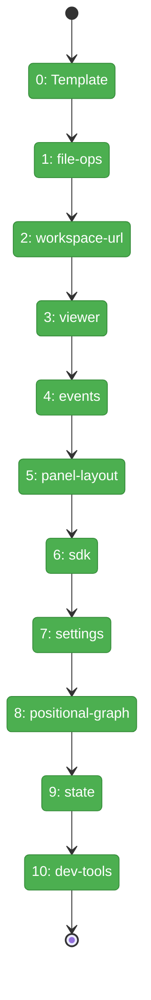
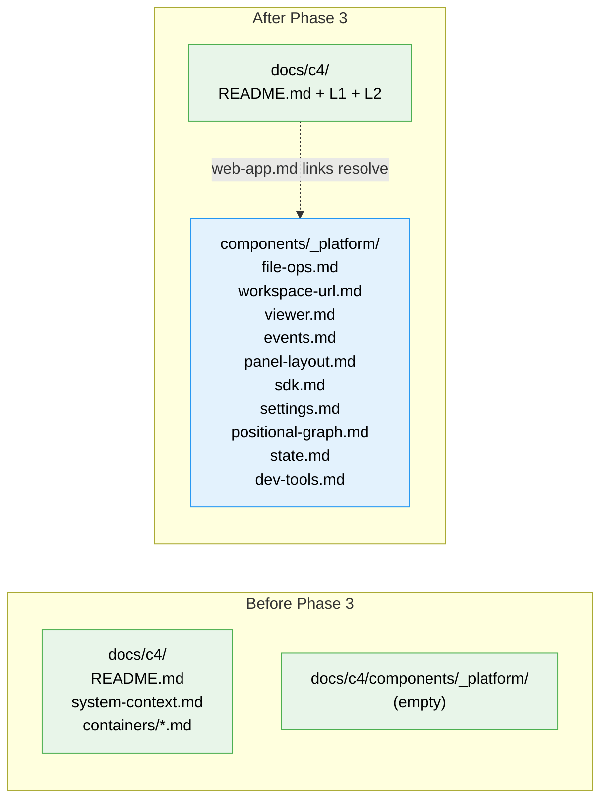

# Flight Plan: Phase 3 — L3 Infrastructure Domains

**Plan**: [c4-models-plan.md](../../c4-models-plan.md)
**Phase**: Phase 3: L3 Component Diagrams — Infrastructure Domains
**Generated**: 2026-03-02
**Status**: Landed

---

## Departure → Destination

**Where we are**: L1 System Context and L2 Container diagrams exist. `web-app.md` lists all 13 domains with links to L3 component files — but those files don't exist yet. The `docs/c4/components/_platform/` directory is empty.

**Where we're going**: Every infrastructure domain has a dedicated C4 Component diagram showing its internal structure. A developer clicking "Viewer" in `web-app.md`'s Domain Index lands on `components/_platform/viewer.md` and sees FileViewer, MarkdownViewer, DiffViewer, ShikiProcessor, etc. — all with relationships, cross-references back to `domain.md`, and navigation footers.

---

## Domain Context

### Domains We're Changing

| Domain | What Changes | Key Files |
|--------|-------------|-----------|
| — (docs) | 10 new C4 Component diagram files | `docs/c4/components/_platform/*.md` |

### Domains We Depend On (no changes)

| Domain | What We Consume | Contract |
|--------|----------------|----------|
| _platform/file-ops | domain.md content | `docs/domains/_platform/file-ops/domain.md` (read-only) |
| _platform/workspace-url | domain.md content | `docs/domains/_platform/workspace-url/domain.md` (read-only) |
| _platform/viewer | domain.md content | `docs/domains/_platform/viewer/domain.md` (read-only) |
| _platform/events | domain.md content | `docs/domains/_platform/events/domain.md` (read-only) |
| _platform/panel-layout | domain.md content | `docs/domains/_platform/panel-layout/domain.md` (read-only) |
| _platform/sdk | domain.md content | `docs/domains/_platform/sdk/domain.md` (read-only) |
| _platform/settings | domain.md content | `docs/domains/_platform/settings/domain.md` (read-only) |
| _platform/positional-graph | domain.md content | `docs/domains/_platform/positional-graph/domain.md` (read-only) |
| _platform/state | domain.md content | `docs/domains/_platform/state/domain.md` (read-only) |
| _platform/dev-tools | domain.md content | `docs/domains/_platform/dev-tools/domain.md` (read-only) |

---

## Flight Status

**Legend**: grey = pending | yellow = active | red = blocked/needs input | green = done

---

## Stages

- [x] **Stage 0: Template** — verify L3 template with TODO placeholders (inline in tasks.md)
- [x] **Stage 1: file-ops** — IFileSystem, IPathResolver, adapters, fakes
- [x] **Stage 2: workspace-url** — workspaceHref, params, caches
- [x] **Stage 3: viewer** — FileViewer, MarkdownViewer, DiffViewer, Shiki, CodeBlock, Mermaid (largest)
- [x] **Stage 4: events** — ICentralEventNotifier, SSE, FileChangeHub, toast
- [x] **Stage 5: panel-layout** — PanelShell, ExplorerPanel, LeftPanel, MainPanel
- [x] **Stage 6: sdk** — IUSDK, CommandRegistry, SettingsStore, KeybindingService
- [x] **Stage 7: settings** — SettingsPage, SettingControl, SettingsSearch (smallest)
- [x] **Stage 8: positional-graph** — PositionalGraphService, OrchestrationService, PodManager (most complex)
- [x] **Stage 9: state** — GlobalStateSystem, PathMatcher, hooks, providers
- [x] **Stage 10: dev-tools** — StateInspector, DomainOverview, EventStream (pure observer)

---

## Architecture: Before & After

---

## Acceptance Criteria

- [x] AC-05 (partial): 10 of 13 L3 component files exist with C4Component diagrams
- [x] AC-06 (partial): All 10 files have cross-reference block to domain.md
- [x] AC-07 (partial): All 10 files have navigation footer
- [x] AC-15: Each diagram shows owned components, exposed contracts, key relationships
- [x] AC-16: Consistent node naming (slug ID, display name, technology)

## Goals & Non-Goals

**Goals**: 10 infrastructure domain C4Component files with cross-refs and nav footers, using template for consistency
**Non-Goals**: No business domain diagrams (Phase 4), no domain.md modifications, no code changes

---

## Checklist

- [x] T000: Verify template embedded in tasks.md
- [x] T001: file-ops.md
- [x] T002: workspace-url.md
- [x] T003: viewer.md
- [x] T004: events.md
- [x] T005: panel-layout.md
- [x] T006: sdk.md
- [x] T007: settings.md
- [x] T008: positional-graph.md
- [x] T009: state.md
- [x] T010: dev-tools.md
