# Phase 3: L3 Component Diagrams — Infrastructure Domains — Tasks

**Plan**: [c4-models-plan.md](../../c4-models-plan.md)
**Spec**: [c4-models-spec.md](../../c4-models-spec.md)
**Workshop**: [001-c4-design-and-layout.md](../../workshops/001-c4-design-and-layout.md)
**Phase**: 3 of 5
**Complexity**: CS-2
**Status**: Pending
**Delivers**: AC-05 (partial — 10 of 13), AC-06 (partial), AC-07 (partial), AC-15, AC-16

---

## Executive Briefing

**Purpose**: Create C4 Component diagrams for all 10 infrastructure (`_platform/*`) domains. Each domain gets a dedicated markdown file showing its internal components, contracts, and relationships — the L3 zoom level that developers and AI agents use to understand domain internals.

**What We're Building**: 10 markdown files in `docs/c4/components/_platform/`, each containing a Mermaid `C4Component` diagram, cross-reference block linking to the domain's `domain.md`, and navigation footer. Plus one reusable template (T000) for consistency across all 13 L3 files (10 here + 3 in Phase 4).

**Goals**:
- ✅ One C4Component diagram per infrastructure domain (10 files)
- ✅ Cross-reference block on every file linking back to domain.md
- ✅ Navigation footer on every file
- ✅ Consistent node naming: slug IDs, display name labels, technology fields
- ✅ Reusable template with TODO placeholders for Phase 3+4

**Non-Goals**:
- ❌ Business domain diagrams (Phase 4)
- ❌ Bidirectional links to domain.md (Phase 4)
- ❌ Code changes of any kind

---

## Prior Phase Context

### Phase 1: Foundation & Design Principles (Complete)

**A. Deliverables**: `.github/instructions/c4-authoring.instructions.md`, `docs/c4/README.md`, CLAUDE.md C4 section, directory skeleton.
**B. Dependencies Exported**: Instructions file (10 principles), README hub (links to component files we're creating), directory `docs/c4/components/_platform/` ready.
**C. Gotchas**: Official GitHub `.instructions.md` pattern adopted (not custom `.instruction.md`).
**D. Incomplete Items**: None.
**E. Patterns to Follow**: `<br/>` for newlines (P10), navigation footer format (P7), cross-reference block (P6), one diagram per file (P5), infrastructure before business (P9).

### Phase 2: L1 System Context & L2 Containers (Complete)

**A. Deliverables**: `system-context.md` (L1), `containers/overview.md` (L2), `containers/web-app.md` (L2 detail with 13 domain nodes), `containers/cli.md`, `containers/shared-packages.md`.
**B. Dependencies Exported**: `web-app.md` Domain Index tables link to L3 files we're creating. Established C4Component diagram pattern (web-app.md uses it for domain decomposition).
**C. Gotchas**: MCP Server added to L1+L2 (was missing from workshop exemplars). L1 omits Zoom Out (top level). web-app.md uses C4Component in containers/ folder with explanatory note.
**D. Incomplete Items**: None.
**E. Patterns to Follow**: Use C4Component inside Container_Boundary with Boundary groupings. Action-oriented descriptions. Relationship labels reference contract names.

---

## L3 Component File Template

**Use this template for ALL L3 component files (T001-T010 and Phase 4 T001-T003).** Copy, fill in `{PLACEHOLDERS}`, remove this instruction block.

```markdown
# Component: {DOMAIN_NAME} (`{DOMAIN_SLUG}`)

> **Domain Definition**: [{DOMAIN_SLUG}/domain.md]({RELATIVE_PATH_TO_DOMAIN_MD})
> **Source**: `{SOURCE_PATH}`
> **Registry**: [registry.md](../../../../domains/registry.md) — Row: {DOMAIN_NAME}

{PROSE_DESCRIPTION}

​```mermaid
C4Component
    title Component diagram — {DOMAIN_NAME} ({DOMAIN_SLUG})

    Container_Boundary({BOUNDARY_ID}, "{DOMAIN_NAME}") {
        Component({id}, "{Name}", "{Technology}", "{Description}")
    }

    Rel({from}, {to}, "{label}")
​```

## Components

| Component | Type | Description |
|-----------|------|-------------|
| {Name} | {Type} | {Description} |

---

## Navigation

- **Zoom Out**: [Web App Container](../../containers/web-app.md) | [Container Overview](../../containers/overview.md)
- **Domain**: [{DOMAIN_SLUG}/domain.md]({RELATIVE_PATH_TO_DOMAIN_MD})
- **Hub**: [C4 Overview](../../README.md)
```

---

## Pre-Implementation Check

| File | Exists? | Domain Check | Notes |
|------|---------|-------------|-------|
| `docs/c4/components/_platform/file-ops.md` | No — create | N/A (docs) | domain.md has IFileSystem, IPathResolver |
| `docs/c4/components/_platform/workspace-url.md` | No — create | N/A (docs) | domain.md has workspaceHref, paramsCaches |
| `docs/c4/components/_platform/viewer.md` | No — create | N/A (docs) | domain.md has 9 components — Workshop 001 exemplar |
| `docs/c4/components/_platform/events.md` | No — create | N/A (docs) | domain.md has 6+ contracts |
| `docs/c4/components/_platform/panel-layout.md` | No — create | N/A (docs) | domain.md has PanelShell + 5 components |
| `docs/c4/components/_platform/sdk.md` | No — create | N/A (docs) | domain.md has IUSDK + 5 sub-services |
| `docs/c4/components/_platform/settings.md` | No — create | N/A (docs) | domain.md has Settings Page + 2 components |
| `docs/c4/components/_platform/positional-graph.md` | No — create | N/A (docs) | domain.md has 6 service interfaces |
| `docs/c4/components/_platform/state.md` | No — create | N/A (docs) | domain.md has IStateService + 5 components |
| `docs/c4/components/_platform/dev-tools.md` | No — create | N/A (docs) | domain.md has StateInspector + 3 components |

No concept search needed — pure documentation files.

---

## Tasks

| Status | ID | Task | Domain | Path(s) | Done When | Notes |
|--------|-----|------|--------|---------|-----------|-------|
| [ ] | T000 | Verify template embedded in this dossier | — | (inline) | Template section above is complete with all placeholders | Per Finding 08. DYK #4. |
| [ ] | T001 | Create `docs/c4/components/_platform/file-ops.md` | — (docs) | `docs/c4/components/_platform/file-ops.md` | C4Component with IFileSystem, IPathResolver, NodeFileSystemAdapter, FakeFileSystem, PathResolverAdapter. Cross-ref to domain.md. Nav footer. | Small domain — 5 components |
| [ ] | T002 | Create `docs/c4/components/_platform/workspace-url.md` | — (docs) | `docs/c4/components/_platform/workspace-url.md` | C4Component with workspaceHref, workspaceParams, workspaceParamsCache, NuqsAdapter. Cross-ref. Nav footer. | Small domain — 4 components |
| [ ] | T003 | Create `docs/c4/components/_platform/viewer.md` | — (docs) | `docs/c4/components/_platform/viewer.md` | C4Component with FileViewer, MarkdownViewer, DiffViewer, MarkdownServer, CodeBlock, MermaidRenderer, ShikiProcessor, detectLanguage, detectContentType. Cross-ref. Nav footer. | Largest domain — 9 components. Workshop 001 exemplar exists. |
| [ ] | T004 | Create `docs/c4/components/_platform/events.md` | — (docs) | `docs/c4/components/_platform/events.md` | C4Component with ICentralEventNotifier, ISSEBroadcaster, SSEManager, CentralWatcherService, FileChangeHub, useFileChanges, toast. Cross-ref. Nav footer. | 7 components |
| [ ] | T005 | Create `docs/c4/components/_platform/panel-layout.md` | — (docs) | `docs/c4/components/_platform/panel-layout.md` | C4Component with PanelShell, ExplorerPanel, LeftPanel, MainPanel, PanelHeader, CommandPaletteDropdown, BarHandler, AsciiSpinner. Cross-ref. Nav footer. | 8 components |
| [ ] | T006 | Create `docs/c4/components/_platform/sdk.md` | — (docs) | `docs/c4/components/_platform/sdk.md` | C4Component with IUSDK, CommandRegistry, SettingsStore, ContextKeyService, KeybindingService, SDKProvider. Cross-ref. Nav footer. | 6 components |
| [ ] | T007 | Create `docs/c4/components/_platform/settings.md` | — (docs) | `docs/c4/components/_platform/settings.md` | C4Component with SettingsPage, SettingControl, SettingsSearch. Cross-ref. Nav footer. | Small domain — 3 components |
| [ ] | T008 | Create `docs/c4/components/_platform/positional-graph.md` | — (docs) | `docs/c4/components/_platform/positional-graph.md` | C4Component with PositionalGraphService, OrchestrationService, GraphOrchestration, EventHandlerService, PodManager, TemplateService, InstanceService. Cross-ref. Nav footer. | Complex domain — 7+ components |
| [ ] | T009 | Create `docs/c4/components/_platform/state.md` | — (docs) | `docs/c4/components/_platform/state.md` | C4Component with GlobalStateSystem, StateStore, PathMatcher, GlobalStateProvider, GlobalStateConnector, StateChangeLog, useGlobalState, useGlobalStateList. Cross-ref. Nav footer. | 8 components |
| [ ] | T010 | Create `docs/c4/components/_platform/dev-tools.md` | — (docs) | `docs/c4/components/_platform/dev-tools.md` | C4Component with StateInspector, DomainOverview, StateEntriesTable, EventStream, useStateChangeLog, useStateInspector. Cross-ref. Nav footer. | Small domain — 6 components. Pure observer. |

---

## Context Brief

**Key findings from plan**:
- Finding 01: All 13 domain.md files have complete content — mechanical translation confirmed
- Finding 08: L3 template needed for consistency — embedded above as reusable template

**Domain dependencies**: None — pure documentation. Each file reads from its corresponding `docs/domains/_platform/*/domain.md`.

**Domain constraints**: None — all files in `docs/c4/components/_platform/`.

**Reusable from prior phases**:
- Navigation footer format from instructions file (Principle 7)
- C4Component diagram pattern from `containers/web-app.md` (Phase 2)
- `<br/>` line break convention (Principle 10)
- Node naming convention from instructions file
- Cross-reference block format from instructions file (Principle 6)

**Content sources per domain**:

| Domain | Source File | Key Components |
|--------|-----------|----------------|
| file-ops | `docs/domains/_platform/file-ops/domain.md` | IFileSystem, IPathResolver, NodeFS, FakeFS |
| workspace-url | `docs/domains/_platform/workspace-url/domain.md` | workspaceHref, workspaceParams, NuqsAdapter |
| viewer | `docs/domains/_platform/viewer/domain.md` | FileViewer, MarkdownViewer, DiffViewer, Shiki, CodeBlock, Mermaid |
| events | `docs/domains/_platform/events/domain.md` | ICentralEventNotifier, SSEManager, FileChangeHub, toast |
| panel-layout | `docs/domains/_platform/panel-layout/domain.md` | PanelShell, ExplorerPanel, LeftPanel, MainPanel |
| sdk | `docs/domains/_platform/sdk/domain.md` | IUSDK, CommandRegistry, SettingsStore, KeybindingService |
| settings | `docs/domains/_platform/settings/domain.md` | SettingsPage, SettingControl, SettingsSearch |
| positional-graph | `docs/domains/_platform/positional-graph/domain.md` | PositionalGraphService, OrchestrationService, PodManager |
| state | `docs/domains/_platform/state/domain.md` | GlobalStateSystem, StateStore, PathMatcher, hooks |
| dev-tools | `docs/domains/_platform/dev-tools/domain.md` | StateInspector, DomainOverview, EventStream |

**Implementation flow**:

```mermaid
flowchart LR
    T000["T000: Verify template"] --> T001["T001: file-ops"]
    T001 --> T002["T002: workspace-url"]
    T002 --> T003["T003: viewer"]
    T003 --> T004["T004: events"]
    T004 --> T005["T005: panel-layout"]
    T005 --> T006["T006: sdk"]
    T006 --> T007["T007: settings"]
    T007 --> T008["T008: positional-graph"]
    T008 --> T009["T009: state"]
    T009 --> T010["T010: dev-tools"]
```



Note: T001-T010 are independent — they can be created in any order. Sequential flow shown for implementor clarity.

**Sequence**:

```mermaid
sequenceDiagram
    participant I as Implementor
    participant TPL as Template
    participant DOM as domain.md
    participant FS as Filesystem

    loop For each of 10 domains
        I->>TPL: Copy template
        I->>DOM: Read domain.md (Owns, Contracts, Composition)
        I->>I: Fill placeholders, write C4Component diagram
        I->>FS: Write docs/c4/components/_platform/{slug}.md
    end
```

---

## Discoveries & Learnings

_Populated during implementation by plan-6._

| Date | Task | Type | Discovery | Resolution | References |
|------|------|------|-----------|------------|------------|

---

## Directory Layout

```
docs/plans/063-c4-models/
  ├── c4-models-spec.md
  ├── c4-models-plan.md
  ├── research-dossier.md
  ├── workshops/
  │   └── 001-c4-design-and-layout.md
  └── tasks/
      ├── phase-1-foundation-and-design-principles/  (complete)
      ├── phase-2-l1-system-context-and-l2-containers/  (complete)
      └── phase-3-l3-infrastructure-domains/
          ├── tasks.md              ← this file
          ├── tasks.fltplan.md      ← flight plan (below)
          └── execution.log.md     ← created by plan-6
```
