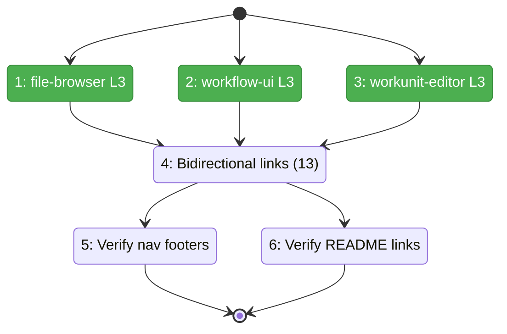
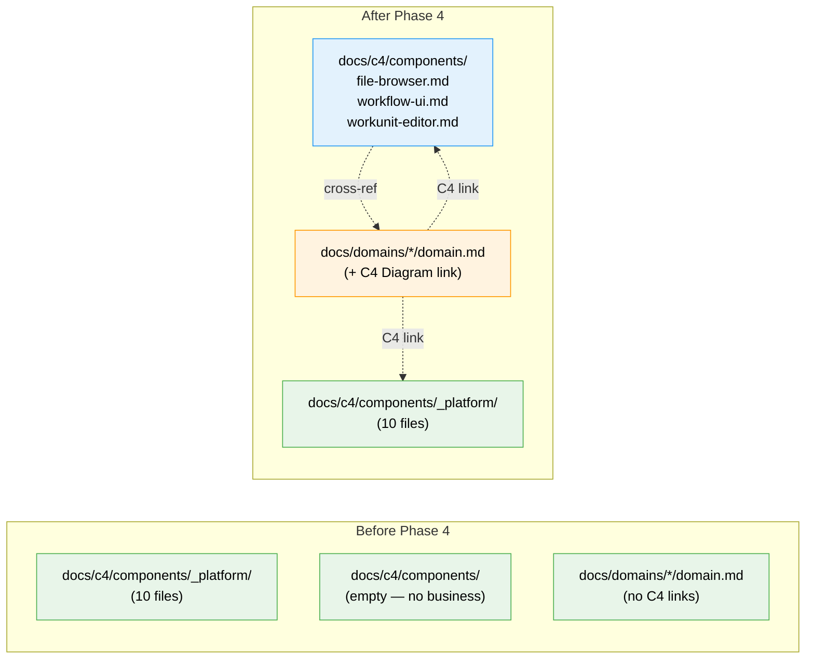

# Flight Plan: Phase 4 — L3 Business Domains & Navigation Polish

**Plan**: [c4-models-plan.md](../../c4-models-plan.md)
**Phase**: Phase 4: L3 Business Domains & Navigation Polish
**Generated**: 2026-03-02
**Status**: Landed

---

## Departure → Destination

**Where we are**: 10 of 13 L3 component files exist (all infrastructure domains). The 3 business domain links in `web-app.md` and `README.md` point to files that don't exist yet. Domain.md files have no links back to their C4 diagrams (one-directional).

**Where we're going**: All 13 L3 component files exist. Every domain.md has a "C4 Diagram" link creating bidirectional navigation. All README.md quick links resolve. All navigation footers verified across 20 C4 files.

---

## Domain Context

### Domains We're Changing

| Domain | What Changes | Key Files |
|--------|-------------|-----------|
| — (docs) | 3 new L3 business domain files | `docs/c4/components/file-browser.md`, `workflow-ui.md`, `workunit-editor.md` |
| 13 domains | Add 1-line C4 Diagram link to each domain.md | `docs/domains/*/domain.md` (13 files) |

### Domains We Depend On (no changes)

| Domain | What We Consume | Contract |
|--------|----------------|----------|
| — (docs) | Domain content for diagrams | `docs/domains/*/domain.md` (read for content, write 1 line) |

---

## Flight Status

**Legend**: grey = pending | yellow = active | red = blocked/needs input | green = done

---

## Stages

- [x] **Stage 1: Business L3 files** — create 3 C4Component diagrams (file-browser, workflow-ui, workunit-editor)
- [x] **Stage 2: Bidirectional links** — add C4 Diagram line to all 13 domain.md files
- [x] **Stage 3: Verification** — verify nav footers (20 files) + README links (16 links)

---

## Architecture: Before & After

**Legend**: existing (green) | new (blue) | changed (orange, modified)

---

## Acceptance Criteria

- [x] AC-05: All 13 L3 component files exist with C4Component diagrams
- [x] AC-06: Every L3 file has cross-reference block to domain.md
- [x] AC-07: Every C4 file has navigation footer
- [x] AC-08: README.md quick links all resolve
- [x] AC-17: Every domain.md has C4 Diagram link to component file

## Goals & Non-Goals

**Goals**: Complete L3, bidirectional links, verified navigation
**Non-Goals**: No rendering verification (Phase 5), no code changes

---

## Checklist

- [x] T001: file-browser.md
- [x] T002: workflow-ui.md
- [x] T003: workunit-editor.md
- [x] T004: Bidirectional links (13 domain.md edits)
- [x] T005: Verify navigation footers
- [x] T006: Verify README links
