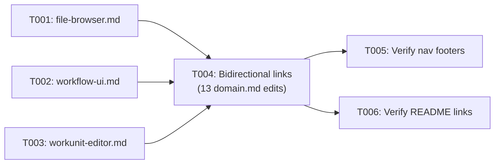

# Phase 4: L3 Business Domains & Navigation Polish — Tasks

**Plan**: [c4-models-plan.md](../../c4-models-plan.md)
**Spec**: [c4-models-spec.md](../../c4-models-spec.md)
**Phase**: 4 of 5
**Complexity**: CS-1
**Status**: Pending
**Delivers**: AC-05 (complete — 13 of 13), AC-06 (complete), AC-07 (complete), AC-08 (verify), AC-17

---

## Executive Briefing

**Purpose**: Complete the L3 layer with 3 business domain diagrams, add bidirectional cross-reference links from all 13 domain.md files back to their C4 diagrams, and verify all navigation links work across the entire C4 file set.

**What We're Building**: 3 business domain C4 Component files + 13 domain.md edits (one-line C4 link each) + verification of all navigation and cross-reference links across 20+ files.

**Goals**:
- ✅ L3 component diagrams for file-browser, workflow-ui, workunit-editor
- ✅ Bidirectional links: every domain.md links to its C4 diagram
- ✅ All navigation footers verified across all 20 C4 files
- ✅ README.md quick links all resolve

**Non-Goals**:
- ❌ L4 Code-level diagrams
- ❌ Any application code changes
- ❌ Rendering verification (Phase 5)

---

## Prior Phase Context

### Phase 3: L3 Infrastructure Domains (Complete)

**A. Deliverables**: 10 L3 component files in `docs/c4/components/_platform/` — file-ops, workspace-url, viewer (14 components), events (12), panel-layout (9), sdk (9), settings (4), positional-graph (16 — full orchestration internals), state (9), dev-tools (6). Total: ~39KB, 103 components.

**B. Dependencies Exported**: All 10 infrastructure domain L3 files now exist. `web-app.md` Domain Index links to these files now resolve. Template pattern established (cross-ref block, C4Component diagram, Components table, External Dependencies prose, Navigation footer).

**C. Gotchas & Debt**: Principle 5 (Show Implementation Detail) added mid-phase — all diagrams include internal implementation guts, not just API surface. Principle 4 (Internal Relationships Only) means external deps are prose-only, not diagram arrows.

**D. Incomplete Items**: None — all 10 files created, all ACs passed.

**E. Patterns to Follow**: Same template as Phase 3. Relative path prefix for business domains differs: `../../../domains/file-browser/domain.md` (3 levels up, not 4) because business domain files are at `docs/c4/components/X.md` not `docs/c4/components/_platform/X.md`.

---

## Pre-Implementation Check

| File | Exists? | Domain Check | Notes |
|------|---------|-------------|-------|
| `docs/c4/components/file-browser.md` | No — create | N/A (docs) | Business domain. 3-level relative path to domain.md. |
| `docs/c4/components/workflow-ui.md` | No — create | N/A (docs) | Business domain. Leaf consumer (no downstream). |
| `docs/c4/components/workunit-editor.md` | No — create | N/A (docs) | Business domain. Leaf consumer. |
| `docs/domains/_platform/file-ops/domain.md` | Yes — modify | _platform/file-ops | Add 1-line C4 Diagram link |
| `docs/domains/_platform/workspace-url/domain.md` | Yes — modify | _platform/workspace-url | Add 1-line C4 Diagram link |
| `docs/domains/_platform/viewer/domain.md` | Yes — modify | _platform/viewer | Add 1-line C4 Diagram link |
| `docs/domains/_platform/events/domain.md` | Yes — modify | _platform/events | Add 1-line C4 Diagram link |
| `docs/domains/_platform/panel-layout/domain.md` | Yes — modify | _platform/panel-layout | Add 1-line C4 Diagram link |
| `docs/domains/_platform/sdk/domain.md` | Yes — modify | _platform/sdk | Add 1-line C4 Diagram link |
| `docs/domains/_platform/settings/domain.md` | Yes — modify | _platform/settings | Add 1-line C4 Diagram link |
| `docs/domains/_platform/positional-graph/domain.md` | Yes — modify | _platform/positional-graph | Add 1-line C4 Diagram link |
| `docs/domains/_platform/state/domain.md` | Yes — modify | _platform/state | Add 1-line C4 Diagram link |
| `docs/domains/_platform/dev-tools/domain.md` | Yes — modify | _platform/dev-tools | Add 1-line C4 Diagram link |
| `docs/domains/file-browser/domain.md` | Yes — modify | file-browser | Add 1-line C4 Diagram link |
| `docs/domains/workflow-ui/domain.md` | Yes — modify | workflow-ui | Add 1-line C4 Diagram link |
| `docs/domains/058-workunit-editor/domain.md` | Yes — modify | 058-workunit-editor | Add 1-line C4 Diagram link |

---

## Tasks

| Status | ID | Task | Domain | Path(s) | Done When | Notes |
|--------|-----|------|--------|---------|-----------|-------|
| [ ] | T001 | Create `docs/c4/components/file-browser.md` | — (docs) | `docs/c4/components/file-browser.md` | C4Component with Browser page, FileTree, FileViewerPanel, CodeEditor wrapper, readFile/saveFile actions, directory listing service, file list service, UndoRedoManager, binary viewers. Cross-ref to `docs/domains/file-browser/domain.md`. Nav footer. Show internal implementation detail per Principle 5. | Largest business domain. Rel path: `../../../domains/file-browser/domain.md` |
| [ ] | T002 | Create `docs/c4/components/workflow-ui.md` | — (docs) | `docs/c4/components/workflow-ui.md` | C4Component with WorkflowCanvas, WorkflowLine, WorkflowNodeCard, WorkUnitToolbox, NodePropertiesPanel, QAModal, UndoRedoManager, useWorkflowSSE, context flow indicators, doping system. Cross-ref + nav footer. | Leaf consumer. Complex internals: canvas + toolbox + properties + Q&A + undo. |
| [ ] | T003 | Create `docs/c4/components/workunit-editor.md` | — (docs) | `docs/c4/components/workunit-editor.md` | C4Component with unit list page, editor page, agent/code/user-input type editors, creation modal, InputOutputCard, auto-save, workunit-actions. Cross-ref + nav footer. | Leaf consumer. Smallest business domain. |
| [ ] | T004 | Add "C4 Diagram" link to all 13 domain.md files | various | 13 domain.md files (see Pre-Implementation Check) | Each domain.md has `**C4 Diagram**: [path](link)` in header block after Status line. All 13 links point to correct C4 component file with working relative path. | Insert after `**Status**: active` line. Infrastructure: `../../c4/components/_platform/{slug}.md`. Business: `../../c4/components/{slug}.md`. |
| [ ] | T005 | Verify all navigation footers across all C4 files | — | All 20 C4 files | Every C4 file has Navigation section with Zoom Out, Zoom In (if applicable), Domain (if L3), Hub. All links resolve to existing files. | Walk all files in docs/c4/. |
| [ ] | T006 | Verify README.md quick links | — | `docs/c4/README.md` | All 13 domain links resolve. All 4 container links resolve. System context link resolves. No broken relative paths. | After T001-T003 create the last 3 L3 files, README should be fully linked. |

---

## Context Brief

**Key findings from plan**:
- Finding 07: Cross-references are bidirectional — domain.md links to C4, C4 links to domain.md (AC-17)
- Finding 08: Template from Phase 3 ensures consistency — same pattern for business domains

**Domain dependencies**: None — pure documentation. Content from domain.md files.

**Domain constraints**: None — all files in `docs/c4/` and `docs/domains/`.

**Reusable from Phase 3**:
- Template pattern (cross-ref block, C4Component, Components table, External Dependencies, Nav footer)
- Principle 4 (internal relationships only) + Principle 5 (show implementation detail)
- All 10 infrastructure L3 files provide examples to follow

**Bidirectional link format**:

For infrastructure domains (path from `docs/domains/_platform/{slug}/domain.md`):
```markdown
**C4 Diagram**: [C4 Component](../../../c4/components/_platform/{slug}.md)
```

For business domains (path from `docs/domains/{slug}/domain.md`):
```markdown
**C4 Diagram**: [C4 Component](../../c4/components/{slug}.md)
```

**Implementation flow**:



---

## Discoveries & Learnings

_Populated during implementation by plan-6._

| Date | Task | Type | Discovery | Resolution | References |
|------|------|------|-----------|------------|------------|
