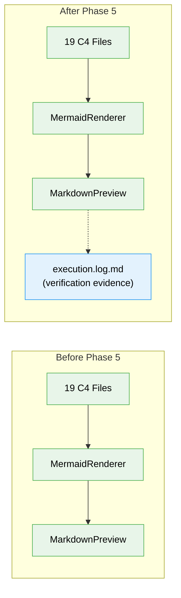

# Flight Plan: Phase 5 — Rendering Verification

**Plan**: [c4-models-plan.md](../../c4-models-plan.md)
**Phase**: Phase 5: Rendering Verification
**Generated**: 2026-03-02
**Status**: Complete

---

## Departure → Destination

**Where we are**: All 19 C4 markdown files are created across 3 zoom levels (L1 System Context, L2 Containers, L3 Components). Cross-references are bidirectional, navigation footers are complete, and relative link navigation works in the file browser. Rendering has been informally confirmed by the user but not formally documented.

**Where we're going**: A developer can open any C4 diagram in the file browser preview and see a correctly rendered Mermaid SVG with readable labels in both light and dark themes. Known styling limitations are documented. AC-09 and AC-10 are formally verified with evidence in the execution log.

---

## Domain Context

### Domains We're Changing

_No domains are changed. This is a verification-only phase._

### Domains We Depend On (no changes)

| Domain | What We Consume | Contract |
|--------|----------------|----------|
| _platform/viewer | MermaidRenderer renders C4 Mermaid as SVG | `mermaid.render()` via `MermaidRenderer.tsx` |
| _platform/viewer | MarkdownPreview hosts rendered content | `markdown-preview.tsx` |
| _platform/viewer | Theme switching (light/dark) | `next-themes` provider |

---

## Flight Status

<!-- Updated by /plan-6-v2: pending → active → done. Use blocked for problems/input needed. -->

```mermaid
stateDiagram-v2
    classDef pending fill:#9E9E9E,stroke:#757575,color:#fff
    classDef active fill:#FFC107,stroke:#FFA000,color:#000
    classDef done fill:#4CAF50,stroke:#388E3C,color:#fff
    classDef blocked fill:#F44336,stroke:#D32F2F,color:#fff

    state "1: Start dev server" as S1
    state "2: Verify L1 C4Context" as S2
    state "3: Verify L2 C4Container" as S3
    state "4: Spot-check L3 C4Component" as S4
    state "5: Document findings" as S5

    [*] --> S1
    S1 --> S2
    S1 --> S3
    S1 --> S4
    S2 --> S5
    S3 --> S5
    S4 --> S5
    S5 --> [*]

    class S1,S2,S3,S4,S5 done
```

**Legend**: grey = pending | yellow = active | red = blocked/needs input | green = done

---

## Stages

<!-- Updated by /plan-6-v2 during implementation: [ ] → [~] → [x] -->

- [x] **Stage 1: Start dev server** — Run `just dev`, navigate to `docs/c4/` in file browser
- [x] **Stage 2: Verify L1+L2 diagrams** — Check system-context.md and containers/ files render in both themes
- [x] **Stage 3: Spot-check L3 diagrams** — Check 6 representative L3 files (3 infra + 3 business)
- [x] **Stage 4: Document findings** — Record results in execution log, mark ACs

---

## Architecture: Before & After



**Legend**: existing (green, unchanged) | new (blue, created)

---

## Acceptance Criteria

- [x] AC-09: All C4 diagram types render as SVG in MarkdownViewer preview
- [x] AC-10: C4 diagrams render in both light and dark themes

## Goals & Non-Goals

**Goals**:
- Formally verify rendering of all 3 C4 diagram types (C4Context, C4Container, C4Component)
- Verify readability in light and dark themes
- Document any rendering issues as known limitations

**Non-Goals**:
- Custom Mermaid theme/CSS improvements (FX002)
- Interactive zoom/click navigation
- Automated rendering tests

---

## Checklist

- [x] T001: Start dev server and navigate to `docs/c4/`
- [x] T002: Verify L1 C4Context renders in light + dark themes
- [x] T003: Verify L2 C4Container renders in light + dark themes
- [x] T004: Spot-check L3 C4Component diagrams (6 files)
- [x] T005: Document rendering issues and workarounds
