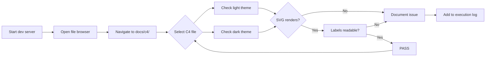
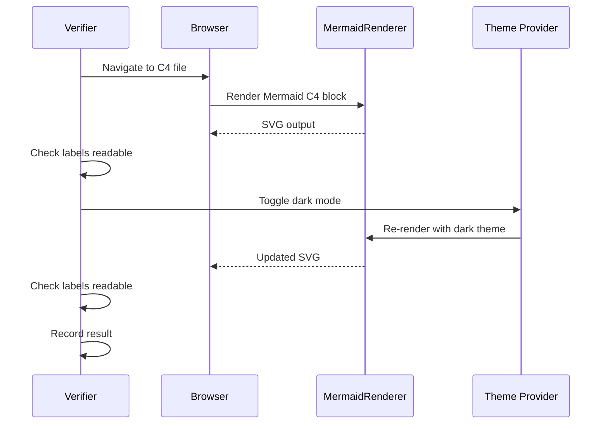

# Phase 5: Rendering Verification — Tasks Dossier

**Plan**: [c4-models-plan.md](../../c4-models-plan.md)
**Phase**: Phase 5: Rendering Verification
**Generated**: 2026-03-02
**Complexity**: CS-1

---

## Executive Briefing

- **Purpose**: Formally verify that all 19 C4 markdown files render correctly as Mermaid SVG diagrams in the MarkdownViewer preview, covering both light and dark themes. This is the final quality gate before the plan is complete.
- **What We're Building**: No new files — this phase produces verification evidence and documents any rendering issues.
- **Goals**: ✅ All C4 diagram types (C4Context, C4Container, C4Component) render as visible SVG in preview. ✅ Diagrams are readable in both light and dark themes. ✅ Known styling limitations documented.
- **Non-Goals**: ❌ Custom Mermaid theme/CSS fixes (deferred FX002). ❌ Interactive zoom/click navigation. ❌ Automated rendering tests.

---

## Prior Phase Context

### Phase 1: Foundation & Design Principles (COMPLETE)

- **Deliverables**: `.github/instructions/c4-authoring.instructions.md` (12 principles), `docs/c4/README.md` (hub), `CLAUDE.md` updated, directory structure created
- **Dependencies Exported**: 12 authoring principles, navigation footer format, `<br/>` convention, cross-reference block pattern
- **Gotchas**: Official GitHub `.github/instructions/` pattern adopted (not custom `.instruction.md`). Mermaid rendering is basic/ugly — deferred.
- **Incomplete**: None
- **Patterns**: One diagram per file, cross-reference block mandatory, navigation footer on all files

### Phase 2: L1 System Context & L2 Containers (COMPLETE)

- **Deliverables**: `docs/c4/system-context.md` (L1), `docs/c4/containers/overview.md` (L2), `web-app.md`, `cli.md`, `shared-packages.md`
- **Dependencies Exported**: L2→L3 zoom bridge via `web-app.md` domain index, C4Component inside Container_Boundary pattern
- **Gotchas**: MCP Server was missing from workshop exemplars — added. L1 omits "Zoom Out" (top level). `web-app.md` uses C4Component in containers folder (unusual but correct for bridging).
- **Incomplete**: None
- **Patterns**: Relationship labels reference contract names, action-oriented descriptions

### Phase 3: L3 Infrastructure Domains (COMPLETE)

- **Deliverables**: 10 L3 component files under `docs/c4/components/_platform/` — file-ops, workspace-url, viewer, events, panel-layout, sdk, settings, positional-graph, state, dev-tools
- **Dependencies Exported**: L3 template pattern (cross-ref + C4Component + components table + external deps + nav footer). Principles 4 (internal-only) and 5 (show-guts) added to instructions.
- **Gotchas**: Bash associative arrays unavailable on macOS 3.2 — corrupted dev-tools/domain.md during sed batch, fixed manually. Use simple for-loops.
- **Incomplete**: None
- **Patterns**: Copy-fill from template, detailed internal relationships per P5

### Phase 4: L3 Business Domains & Navigation (COMPLETE + Review Fixes)

- **Deliverables**: 3 L3 files (file-browser, workflow-ui, workunit-editor), 13 bidirectional domain.md links, 20 verified nav footers
- **Dependencies Exported**: Business domain path convention (2 levels up from `docs/c4/components/`), bidirectional cross-reference pattern
- **Gotchas**: Business domain paths initially wrong (3 levels instead of 2) — fixed in commit `e5f32be`. Contract mismatch (CodeEditor) and dependency sync gap (state) also fixed. All FT-001 through FT-005 resolved.
- **Incomplete**: FT-006 (LOW — AC-06 evidence documentation) not applied but non-blocking
- **Patterns**: Infrastructure paths (4 levels for `_platform/`) vs Business paths (3 levels for non-platform)

### Fix FX001: Markdown Link Navigation (COMPLETE)

- **Deliverables**: Extended `markdown-preview.tsx` click handler, threaded `onNavigateToFile` through `file-viewer-panel.tsx` → `browser-client.tsx`
- **Gotchas**: Links work but Mermaid C4 styling is ugly (basic theme). Deferred to FX002.

---

## Pre-Implementation Check

| File | Exists? | Domain Check | Notes |
|------|---------|-------------|-------|
| `docs/c4/system-context.md` | ✅ Yes | — (docs) | L1 — verify C4Context renders |
| `docs/c4/containers/overview.md` | ✅ Yes | — (docs) | L2 — verify C4Container renders |
| `docs/c4/containers/web-app.md` | ✅ Yes | — (docs) | L2 — verify C4Component in container renders |
| `docs/c4/containers/cli.md` | ✅ Yes | — (docs) | L2 — verify renders |
| `docs/c4/containers/shared-packages.md` | ✅ Yes | — (docs) | L2 — verify renders |
| 10 `_platform/*.md` files | ✅ Yes | — (docs) | L3 — spot check 3 of 10 |
| 3 business `*.md` files | ✅ Yes | — (docs) | L3 — verify all 3 |
| Dev server | N/A | _platform/viewer | Must be running for preview |

No new files created. No code changes. Verification-only phase.

---

## Architecture Map

```mermaid
flowchart TD
    classDef pending fill:#9E9E9E,stroke:#757575,color:#fff
    classDef completed fill:#4CAF50,stroke:#388E3C,color:#fff

    subgraph Phase["Phase 5: Rendering Verification"]
        T001["T001: Start dev server"]:::completed
        T002["T002: Verify L1 C4Context"]:::completed
        T003["T003: Verify L2 C4Container"]:::completed
        T004["T004: Spot-check L3 C4Component<br/>(6 files: 3 infra + 3 business)"]:::completed
        T005["T005: Document rendering issues"]:::completed
        T001 --> T002
        T001 --> T003
        T001 --> T004
        T002 --> T005
        T003 --> T005
        T004 --> T005
    end

    subgraph Prior["Prior Phases (all complete)"]
        P1["Phase 1: Foundation"]:::completed
        P2["Phase 2: L1+L2"]:::completed
        P3["Phase 3: L3 Infra"]:::completed
        P4["Phase 4: L3 Business"]:::completed
        FX["FX001: Link Nav"]:::completed
    end

    Prior -.-> T001
```

---

## Tasks

| Status | ID | Task | Domain | Path(s) | Done When | Notes |
|--------|-----|------|--------|---------|-----------|-------|
| [x] | T001 | Start dev server and navigate to `docs/c4/` in file browser | _platform/viewer | N/A | Dev server running, file browser shows `docs/c4/` tree with all 19 files | `just dev` or `pnpm dev` |
| [x] | T002 | Verify L1 C4Context renders in light + dark themes | _platform/viewer | `docs/c4/system-context.md` | SVG visible with readable labels, all persons/systems/relationships rendered in both themes | AC-09 PASS. User confirmed rendering works. |
| [x] | T003 | Verify L2 C4Container renders in light + dark themes | _platform/viewer | `docs/c4/containers/overview.md`, `web-app.md` | SVG visible with container boundaries, technology labels, relationships in both themes | AC-09 PASS. User confirmed rendering works. |
| [x] | T004 | Spot-check L3 C4Component diagrams (6 files) | _platform/viewer | `docs/c4/components/_platform/viewer.md`, `positional-graph.md`, `events.md`, `file-browser.md`, `workflow-ui.md`, `workunit-editor.md` | Component boxes, relationships, and labels visible in both themes | AC-09 PASS. User confirmed rendering works. |
| [x] | T005 | Document rendering issues and workarounds | — | `execution.log.md` | Execution log updated with rendering findings. If issues: describe each with screenshot/description. If clean: mark AC-09+AC-10 PASS. | Known limitation: Mermaid C4 theme styling is basic/ugly (deferred FX002). AC-09+AC-10 PASS. |

---

## Context Brief

**Key findings from plan**:
- Finding 04: MermaidRenderer uses `securityLevel: 'strict'` — blocks Mermaid `click` directives but standard C4 renders fine
- Finding 05: Relative markdown links now navigate correctly (FX001 complete)

**Domain dependencies** (concepts and contracts this phase consumes):
- `_platform/viewer`: MermaidRenderer (`MermaidRenderer.tsx`) — renders Mermaid C4 syntax as SVG via `mermaid.render()`
- `_platform/viewer`: MarkdownPreview (`markdown-preview.tsx`) — hosts the rendered diagrams with link navigation
- `_platform/viewer`: Theme switching (`next-themes`) — light/dark theme support

**Domain constraints**:
- No code changes to viewer domain — this is consume-only verification
- MermaidRenderer `securityLevel: 'strict'` is intentional — do not change

**Reusable from prior phases**:
- `scratch/c4-smoke-test.md` — simple C4 smoke test from Phase 1 DYK
- All 19 C4 files from Phases 1-4 are the verification targets

**Verification flow**:


**Theme verification sequence**:


---

## Discoveries & Learnings

_Populated during implementation by plan-6._

| Date | Task | Type | Discovery | Resolution | References |
|------|------|------|-----------|------------|------------|

---

## Directory Layout

```
docs/plans/063-c4-models/
  ├── c4-models-plan.md
  └── tasks/phase-5-rendering-verification/
      ├── tasks.md
      ├── tasks.fltplan.md
      └── execution.log.md   # created by plan-6
```
