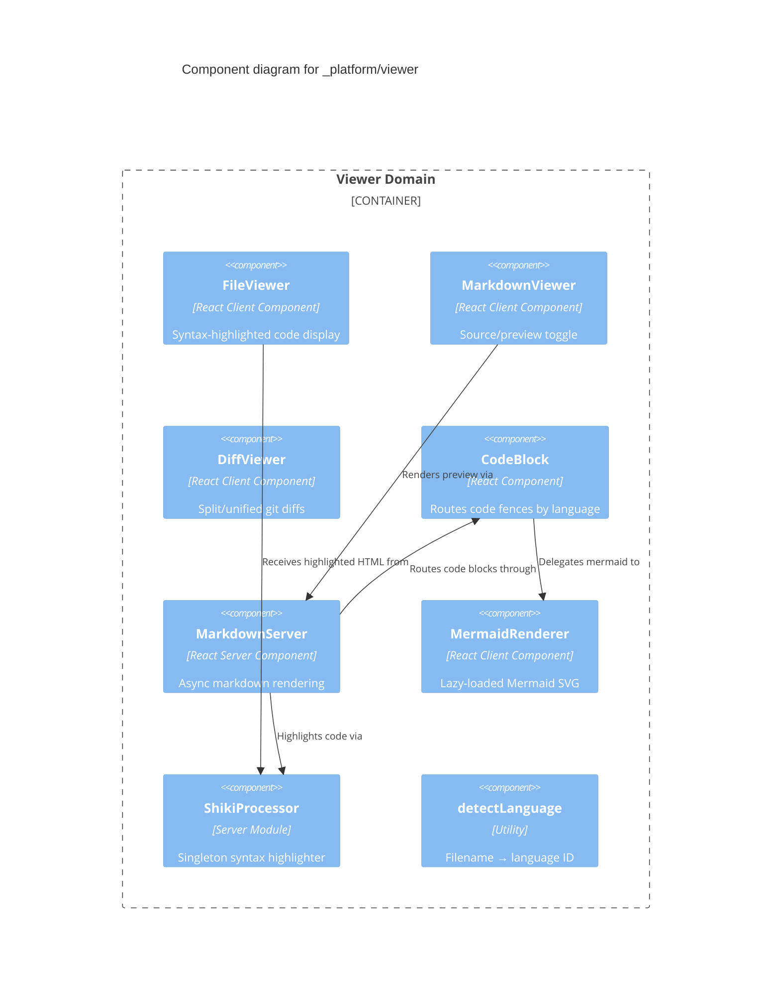
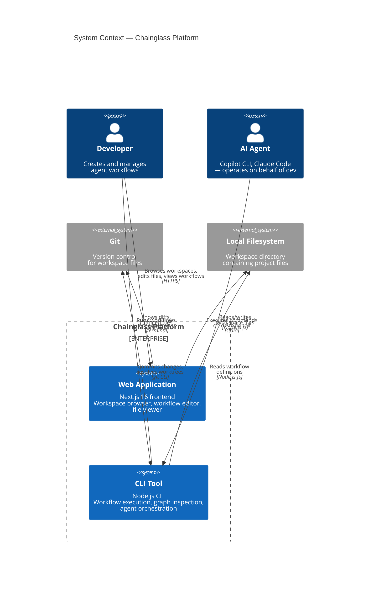
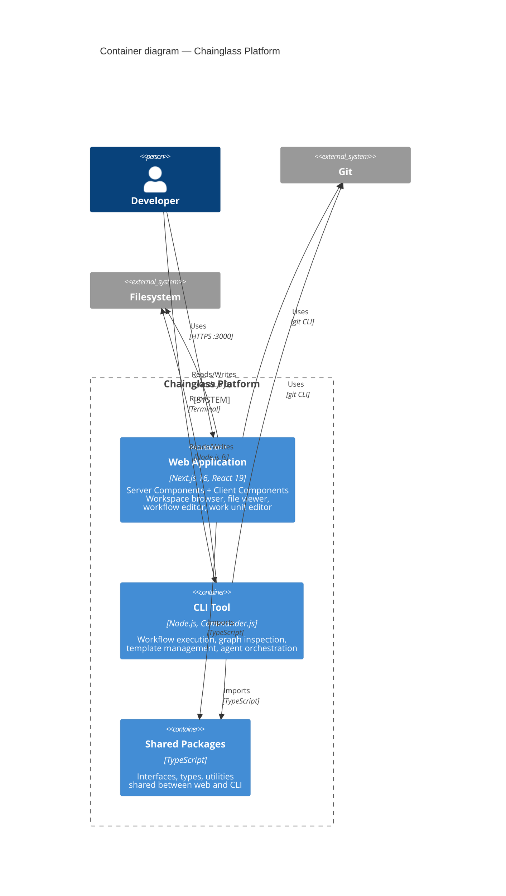
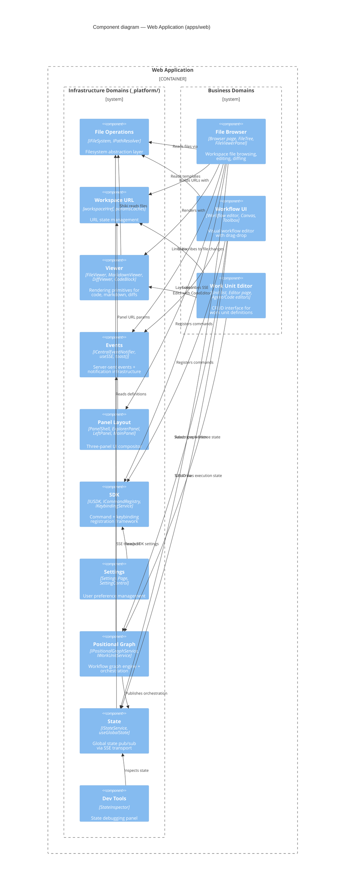
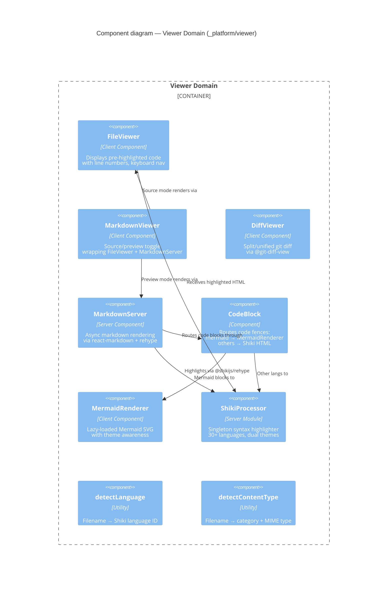

# Workshop: C4 Design Process and Layout

**Type**: Storage Design + Integration Pattern
**Plan**: 063-c4-models
**Research Dossier**: [research-dossier.md](../research-dossier.md)
**Created**: 2026-03-02
**Status**: Draft

**Related Documents**:
- [Domain Registry](../../../domains/registry.md)
- [Domain Map](../../../domains/domain-map.md)
- [Viewer Domain](../../../domains/_platform/viewer/domain.md)

**Domain Context**:
- **Primary Domain**: `_platform/viewer` (rendering infrastructure)
- **Related Domains**: `file-browser` (consumption), `_platform/panel-layout` (layout), `_platform/state` (zoom persistence)

---

## Purpose

Design the complete C4 model layout for Chainglass — file structure, layer mapping, navigation approach, .instruction.md pattern, and rendering integration. This workshop produces the blueprint that implementation phases follow.

## Key Questions Addressed

- How do C4 levels map to the existing domain system?
- What file layout best supports multi-layer C4 with cross-references?
- How does .instruction.md work (format, applyTo scoping, agent discovery)?
- How do we navigate between C4 layers in the viewer?
- What rendering approach works for Phase 1 (Mermaid) vs Phase 2 (interactive)?
- What C4 design principles should govern diagram authoring?
- How do C4 diagrams link back to domain.md files?

---

## Part 1: Domain → C4 Layer Mapping

### The Natural Mapping

The existing domain system maps cleanly to C4 levels. This isn't forced — domains already represent the right abstractions at each zoom level.

| C4 Level | What It Shows | Chainglass Mapping | Source of Truth |
|----------|---------------|--------------------|-----------------|
| **L1 — System Context** | System + external actors | Chainglass platform, developers, Git, filesystem, AI agents | New (to create) |
| **L2 — Container** | Deployable/runnable units | `apps/web`, `apps/cli`, `packages/shared` | `pnpm-workspace.yaml` |
| **L3 — Component** | Domain-level structure within a container | Each domain: `_platform/viewer`, `file-browser`, etc. | `docs/domains/registry.md` |
| **L4 — Code** | Internal implementation | Classes, hooks, server actions within a domain | `domain.md` → Source Location |

### Why This Mapping Works

```
┌─────────────────────────────────────────────────────────────────┐
│  L1: System Context                                             │
│  "Who uses Chainglass and what does it connect to?"             │
│                                                                 │
│  ┌───────────────────────────────────────────────────────────┐  │
│  │  L2: Container — apps/web                                 │  │
│  │  "What are the big deployable pieces?"                    │  │
│  │                                                           │  │
│  │  ┌─────────────────────────────────────────────────────┐  │  │
│  │  │  L3: Component — _platform/viewer                   │  │  │
│  │  │  "What does this domain own and expose?"            │  │  │
│  │  │                                                     │  │  │
│  │  │  ┌───────────────────────────────────────────────┐  │  │  │
│  │  │  │  L4: Code — FileViewer, MarkdownViewer, etc. │  │  │  │
│  │  │  │  "How is this component implemented?"         │  │  │  │
│  │  │  └───────────────────────────────────────────────┘  │  │  │
│  │  └─────────────────────────────────────────────────────┘  │  │
│  └───────────────────────────────────────────────────────────┘  │
└─────────────────────────────────────────────────────────────────┘
```

The domain registry IS the L3 component catalog. Each `domain.md` IS the component specification. The domain-map.md Mermaid graph IS the L3 dependency view. We're not creating a second architecture — we're providing C4-standard zoom levels for the one we already have.

### What Each Level Contains

**L1 — System Context** (`docs/c4/system-context.md`)
- The Chainglass platform as a single box
- Developer (person) who uses it
- External systems: Git, local filesystem, AI agents (Copilot CLI, Claude Code)
- Relationships: "uses via browser", "runs in terminal", "reads/writes files"

**L2 — Container** (`docs/c4/containers/`)
- `apps/web` — Next.js 16 frontend (Server Components + Client Components)
- `apps/cli` — Node.js CLI tool (esbuild-bundled, Commander.js)
- `packages/shared` — Shared TypeScript types, interfaces, utilities
- Relationships: web imports shared, CLI imports shared, web serves browser, CLI runs locally

**L3 — Component** (`docs/c4/components/`)
- One file per domain (mirrors `docs/domains/` structure)
- Shows: contracts exposed, contracts consumed, internal composition
- Cross-references: `→ [domain.md](../../domains/_platform/viewer/domain.md)`
- This is where the domain decomposition lives

**L4 — Code** (`docs/c4/code/`) — Optional, on-demand
- Class/interface diagrams for complex domains
- Only created when a domain's internals need visual documentation
- Links to actual source files

---

## Part 2: File Layout

### Proposed Structure

```
docs/
  c4/
    README.md                              # Navigation hub + C4 overview
    .instruction.md                        # C4 design principles (governs docs/c4/**)
    
    system-context.md                      # L1: System Context diagram
    
    containers/
      overview.md                          # L2: All containers in one view
      web-app.md                           # L2: apps/web detail + domain overview
      cli.md                               # L2: apps/cli detail
      shared-packages.md                   # L2: packages/shared detail
    
    components/
      _platform/                           # L3: Infrastructure domains
        viewer.md                          # → links to docs/domains/_platform/viewer/domain.md
        panel-layout.md
        state.md
        events.md
        sdk.md
        positional-graph.md
        file-ops.md
        workspace-url.md
        settings.md
        dev-tools.md
      file-browser.md                      # L3: Business domains
      workflow-ui.md
      workunit-editor.md
    
    code/                                  # L4: Code-level (optional, on-demand)
      viewer-internals.md                  # Example: Viewer rendering pipeline
```

### Why This Layout

| Decision | Rationale |
|----------|-----------|
| **Mirror `docs/domains/` structure** | Developers already know where domains live. Same mental model. |
| **One file per domain at L3** | Each domain gets a focused C4 Component diagram. Easy to maintain alongside `domain.md`. |
| **`_platform/` subfolder** | Matches domain slug convention. Infrastructure vs business distinction preserved. |
| **L4 is optional** | Not every domain needs code-level diagrams. Create on-demand when complexity warrants it. |
| **README.md as hub** | Single entry point for C4 navigation. Links to all levels. |
| **Containers separate from components** | Clear zoom boundary. Containers = deployment units. Components = domain internals. |

### Cross-Reference Pattern

Every C4 component file links back to its domain definition:

```markdown
<!-- In docs/c4/components/_platform/viewer.md -->

## Component: Viewer (`_platform/viewer`)

> **Domain Definition**: [docs/domains/_platform/viewer/domain.md](../../../domains/_platform/viewer/domain.md)
> **Source**: `apps/web/src/components/viewers/` + `apps/web/src/lib/server/`
> **Registry**: [docs/domains/registry.md](../../../domains/registry.md) — Row: Viewer



### Navigation Links

At the bottom of every C4 file, include navigation links:

```markdown
---

## Navigation

⬆️ **Zoom Out**: [Container: Web App](../containers/web-app.md) | [System Context](../system-context.md)
⬇️ **Zoom In**: [Code: Viewer Internals](../code/viewer-internals.md) _(if exists)_
↔️ **Domain**: [domain.md](../../../domains/_platform/viewer/domain.md)
🗺️ **Hub**: [C4 Overview](../README.md)
```

---

## Part 3: .instruction.md Design

### The Problem

There is no `.instruction.md` pattern in the codebase yet. The user wants C4 design principles that:
1. Are discoverable by AI agents
2. Apply only to C4 files (scoped via `applyTo`)
3. Define best practices for C4 diagram authoring
4. Work across AI tools (Claude Code, Copilot CLI, Cursor, etc.)

### Format Design

`.instruction.md` files are **scoped instruction documents** for AI agents. They provide context-specific guidance that supplements the root `CLAUDE.md`.

```markdown
<!-- docs/c4/.instruction.md -->

---
applyTo: "docs/c4/**"
---

# C4 Diagram Authoring Principles

## Scope

These principles apply when creating or modifying C4 architecture diagrams
in `docs/c4/`. They govern diagram content, structure, and cross-references.

## Rules

### 1. One Diagram Per File
Each `.md` file contains exactly one primary C4 diagram at a single level.
A file may include supplementary diagrams (e.g., a sequence diagram showing
interaction detail) but the primary diagram defines the file's level.

### 2. Use Mermaid C4 Syntax
All C4 diagrams use Mermaid's native C4 syntax:
- `C4Context` for Level 1 (System Context)
- `C4Container` for Level 2 (Container)
- `C4Component` for Level 3 (Component)
- Standard Mermaid class/sequence diagrams for Level 4 (Code)

### 3. Every Component Links to Its Domain
Level 3 component diagrams MUST include a link to the corresponding
`docs/domains/<slug>/domain.md` file. Use the cross-reference block:
```
> **Domain Definition**: [domain.md](relative/path/to/domain.md)
```

### 4. Navigation Footer Required
Every C4 file MUST end with a Navigation section containing:
- Zoom Out link (parent level)
- Zoom In link (child level, if exists)
- Domain link (domain.md)
- Hub link (README.md)

### 5. Consistent Node Naming
- Use the domain slug as the Mermaid node ID: `viewer`, `fileBrowser`, `sdk`
- Use the domain's display name in labels: "Viewer", "File Browser", "SDK"
- Include the domain type in technology field: "React Client Component",
  "Server Module", "Infrastructure Service"

### 6. Relationships Show Contracts
Edge labels on C4 diagrams MUST reference the actual contract name
from the domain's Contracts table:
```
Rel(fileBrowser, viewer, "Uses", "FileViewer, MarkdownViewer")
```

### 7. Keep Descriptions Action-Oriented
Component descriptions should state what the component DOES, not what it IS:
- Good: "Renders syntax-highlighted code with line numbers"
- Bad: "A file viewer component"

### 8. Infrastructure vs Business Styling
Use C4's boundary types to distinguish:
- `Enterprise_Boundary` for the overall system
- `Container_Boundary` for deployable units
- `Boundary` for domain groupings within a container
Infrastructure domains and business domains should be visually separated
in L2/L3 diagrams.

### 9. External Systems Use `_Ext` Suffix
All external systems use Mermaid C4's `System_Ext`, `Container_Ext`, or
`Component_Ext` variants.

### 10. Version with the Code
C4 diagrams are documentation-as-code. When a domain's contracts change,
its C4 component diagram MUST be updated in the same PR.
```

### How applyTo Works

The `applyTo` frontmatter tells AI agents: "When working on files that match this glob, also read these instructions."

**Discovery mechanism** (agent-agnostic):

```
1. Agent opens a file: docs/c4/components/_platform/viewer.md
2. Agent walks up the directory tree looking for .instruction.md
3. Finds: docs/c4/.instruction.md
4. Reads frontmatter: applyTo: "docs/c4/**"
5. Current file matches glob → instructions are active
6. Agent applies the rules from this .instruction.md
```

**Compatibility across tools**:

| Tool | Discovery Method | Status |
|------|-----------------|--------|
| Claude Code | `.claude/settings.local.json` → `instructions` array | Needs manual registration |
| Copilot CLI | Custom instructions in CLAUDE.md or .copilot | Reads CLAUDE.md references |
| Cursor | `.cursorrules` or `.cursor/rules/` | `.mdc` format with `globs` |
| Generic | Walk directory tree for `.instruction.md` | Convention-based |

**Practical approach for Phase 1**: Reference the `.instruction.md` from `CLAUDE.md` so it's always discoverable:

```markdown
<!-- In CLAUDE.md, add: -->

## C4 Architecture Diagrams

When creating or editing files in `docs/c4/`, follow the principles in
[docs/c4/.instruction.md](docs/c4/.instruction.md).
```

### Placement

```
docs/
  c4/
    .instruction.md        ← Governs all C4 files
    README.md
    system-context.md
    ...
```

Only one `.instruction.md` is needed for the C4 system. If sub-levels need different rules (unlikely), additional `.instruction.md` files can be placed in subdirectories with narrower `applyTo` globs.

---

## Part 4: Rendering and Preview

### Phase 1: Mermaid C4 (No Code Changes Required)

Mermaid v11.12.2 already supports C4 diagram types. The existing `MermaidRenderer` component handles them without modification.

**How it works today**:

```markdown
​```mermaid
C4Context
    title System Context for Chainglass
    Person(dev, "Developer", "Uses Chainglass")
    System(cg, "Chainglass", "Workflow management platform")
    System_Ext(git, "Git", "Version control")
    Rel(dev, cg, "Uses")
    Rel(cg, git, "Commits to")
​```
```

This renders as a C4 System Context diagram in MarkdownViewer preview mode — no changes to the rendering pipeline needed. The `remarkMermaid` plugin detects `mermaid` language, `MermaidRenderer` receives the code, Mermaid's C4 diagram type handles the rest.

**Verification needed**: Test that Mermaid's C4 diagram types (`C4Context`, `C4Container`, `C4Component`, `C4Dynamic`, `C4Deployment`) render correctly with the current theme configuration. The MermaidRenderer initializes with `theme: 'dark' | 'default'` — C4 diagrams may need specific theme tuning.

### Syntax Highlighting for C4 Source

When viewing C4 files in **source mode** (not preview), the Mermaid code appears as a fenced code block. Shiki doesn't have a dedicated C4 grammar, but Mermaid syntax gets basic highlighting. For Phase 1, this is acceptable.

**Phase 2 option**: Create a minimal TextMate grammar for C4 Mermaid syntax that highlights keywords like `Person`, `System`, `Container`, `Component`, `Rel`, `Boundary`, etc. Register it as a custom Shiki language.

### Phase 2: Interactive Layer Navigation

Three viable approaches, ranked by implementation effort:

#### Option A: Linked Markdown Navigation (Recommended for Phase 2a)

```
┌──────────────────────────────────────────────────────────┐
│  MarkdownViewer: docs/c4/system-context.md               │
│                                                          │
│  ┌─────────────────────────────────────────────────────┐ │
│  │  C4Context Diagram (Mermaid SVG)                    │ │
│  │                                                     │ │
│  │    [Developer] ──uses──▶ [Chainglass Platform]      │ │
│  │                              │                      │ │
│  │                         reads/writes                │ │
│  │                              ▼                      │ │
│  │                      [File System]                  │ │
│  └─────────────────────────────────────────────────────┘ │
│                                                          │
│  ## Zoom Into Containers                                 │
│                                                          │
│  | Container | Description | Drill Down |               │
│  |-----------|-------------|------------|               │
│  | Web App   | Next.js 16  | [→ View](containers/web)  │
│  | CLI       | Node.js CLI | [→ View](containers/cli)  │
│  | Shared    | TS packages | [→ View](containers/shared)│
│                                                          │
│  ← Back to Hub | ↓ Zoom In                               │
└──────────────────────────────────────────────────────────┘
```

**How**: Standard markdown links between C4 files. File browser navigates when user clicks. Zero new components. Works today.

**Trade-off**: Navigation is page-by-page, not interactive zoom. But it's consistent with how the file browser already works.

#### Option B: Collapsible Layer Sections

```markdown
## Level 1: System Context

```mermaid
C4Context
...
```

<details>
<summary>🔎 Zoom into Container: Web App</summary>

## Level 2: Web App Containers

```mermaid
C4Container
...
```

<details>
<summary>🔎 Zoom into Component: Viewer</summary>

## Level 3: Viewer Components

```mermaid
C4Component
...
```

</details>
</details>
```

**How**: Single markdown file with nested `<details>` elements. All layers in one file, progressively disclosed.

**Trade-off**: Single file gets large. Harder to maintain. But provides in-page drill-down without navigation.

#### Option C: React Flow Interactive Canvas (Phase 3)

```
┌──────────────────────────────────────────────────────────┐
│  C4 Diagram Viewer (custom component)                    │
│                                                          │
│  ┌─ Level Selector ─────────────────────────────────────┐│
│  │ [L1 Context] [L2 Container] [L3 Component] [L4 Code]││
│  └──────────────────────────────────────────────────────┘│
│                                                          │
│  ┌─ Interactive Canvas (@xyflow/react) ─────────────────┐│
│  │                                                      ││
│  │  ╔══════════════╗    ╔═══════════════════╗           ││
│  │  ║  Developer   ║───▶║  Chainglass       ║           ││
│  │  ╚══════════════╝    ║  Platform          ║          ││
│  │                      ║  [click to zoom]   ║          ││
│  │                      ╚═══════════════════╝           ││
│  │                             │                        ││
│  │                      ╔═════▼════════════╗            ││
│  │                      ║  File System     ║            ││
│  │                      ╚══════════════════╝            ││
│  │                                                      ││
│  └──────────────────────────────────────────────────────┘│
│                                                          │
│  ┌─ Detail Panel ───────────────────────────────────────┐│
│  │  Selected: Chainglass Platform                       ││
│  │  Type: System                                        ││
│  │  Description: Workflow management platform           ││
│  │  → View domain.md  → Zoom into containers            ││
│  └──────────────────────────────────────────────────────┘│
└──────────────────────────────────────────────────────────┘
```

**How**: Custom `C4DiagramViewer` component using `@xyflow/react` (already installed). Nodes represent C4 elements. Click-to-zoom transitions between levels. Detail panel shows metadata + links.

**Trade-off**: Significant implementation effort (~200-300 lines component + state hook). But provides the richest UX. Could be Phase 3 after linked markdown proves the content model.

### Rendering Decision

**RESOLVED**: Phase 1 uses **Mermaid C4 in markdown** (zero code changes). Phase 2 uses **Option A: Linked Markdown Navigation** (navigation tables + cross-reference links). Phase 3 considers **Option C: React Flow Canvas** if the content model is proven.

---

## Part 5: Exemplar C4 Diagrams

### L1 — System Context



### L2 — Container (Web App Focus)



### L3 — Component (Web App: Domain Decomposition)

This is the key diagram — it decomposes the Web Application container into its domain components. This mirrors `domain-map.md` but in proper C4 notation.



### L3 — Component (Single Domain: Viewer)

When zooming into a single domain, the L3 diagram shows internal composition:



---

## Part 6: C4 Design Principles

These principles are the content of `docs/c4/.instruction.md`. They define how C4 diagrams should be authored in this project.

### Principle 1: Mirror Domain Boundaries

C4 component boundaries MUST match domain boundaries. If `domain.md` says a domain owns something, the C4 diagram shows it inside that domain's boundary. No reorganizing for aesthetics.

**Why**: C4 diagrams are a view of the domain system, not a separate model. Drift between C4 and domains creates confusion.

### Principle 2: Contracts on Edges

Relationship labels reference actual contract names from `domain.md` Contracts tables. Don't invent relationship names — use what the code exposes.

```
# Good
Rel(fileBrowser, viewer, "Uses", "FileViewer, MarkdownViewer")

# Bad
Rel(fileBrowser, viewer, "Displays files with")
```

### Principle 3: Progressive Detail

Each level adds detail — never repeat the parent level's information. If L2 shows "Web Application", L3 doesn't redraw external systems. L3 focuses on what's INSIDE the web application.

### Principle 4: Actionable Descriptions

Descriptions state what a component DOES (verb phrase), not what it IS (noun phrase):

```
# Good: "Renders syntax-highlighted code with line numbers"
# Bad:  "A code viewer component"
# Bad:  "FileViewer"
```

### Principle 5: One Primary Diagram Per File

Each C4 file has exactly one primary Mermaid C4 diagram. Supplementary diagrams (sequence, state, class) are allowed when they clarify interactions, but the C4 diagram is the star.

### Principle 6: Cross-Reference Block Required

Every L3 component file MUST include:

```markdown
> **Domain Definition**: [domain.md](relative/path)
> **Source**: `path/to/source/`
> **Registry**: [registry.md](relative/path) — Row: Domain Name
```

### Principle 7: Navigation Footer Required

Every C4 file ends with:

```markdown
---
## Navigation
⬆️ **Zoom Out**: [Parent Level](link)
⬇️ **Zoom In**: [Child Level](link) _(if exists)_
↔️ **Domain**: [domain.md](link)
🗺️ **Hub**: [C4 Overview](../README.md)
```

### Principle 8: Keep In Sync

When a domain's contracts change (PR adds/removes/renames a contract), the corresponding C4 component diagram MUST be updated in the same PR. This is enforced by convention, not tooling.

### Principle 9: Infrastructure Before Business

In diagrams showing both infrastructure and business domains, infrastructure domains appear in a labeled boundary (`Boundary(infra, "Infrastructure")`) before business domains (`Boundary(biz, "Business")`). This mirrors the `_platform/` convention.

### Principle 10: Use `<br/>` for Newlines in Labels

Mermaid requires `<br/>` for multi-line labels. Never use `\n`.

```
# Good
Component(viewer, "Viewer", "Component", "Renders code,<br/>markdown, and diffs")

# Bad — \n renders literally
Component(viewer, "Viewer", "Component", "Renders code,\nmarkdown, and diffs")
```

---

## Part 7: README.md Hub Design

The README.md serves as the C4 navigation hub — the starting point for exploring architecture.

```markdown
# Chainglass Architecture (C4 Model)

This directory contains [C4 model](https://c4model.com) architecture diagrams
for the Chainglass platform. Diagrams decompose the system from high-level
context down to individual domain components.

## How to Navigate

Start at L1 and zoom in to the level of detail you need:

| Level | Name | What It Shows | Entry Point |
|-------|------|---------------|-------------|
| L1 | System Context | Chainglass + users + external systems | [system-context.md](system-context.md) |
| L2 | Container | Deployable units (web, CLI, packages) | [containers/overview.md](containers/overview.md) |
| L3 | Component | Domain decomposition within containers | [components/](components/) |
| L4 | Code | Internal implementation of domains | [code/](code/) _(on-demand)_ |

## Quick Links

### Containers
- [Web Application](containers/web-app.md) — Next.js 16 frontend
- [CLI Tool](containers/cli.md) — Node.js command-line interface
- [Shared Packages](containers/shared-packages.md) — TypeScript types and utilities

### Infrastructure Domains
- [File Operations](components/_platform/file-ops.md)
- [Workspace URL](components/_platform/workspace-url.md)
- [Viewer](components/_platform/viewer.md)
- [Events](components/_platform/events.md)
- [Panel Layout](components/_platform/panel-layout.md)
- [SDK](components/_platform/sdk.md)
- [Settings](components/_platform/settings.md)
- [Positional Graph](components/_platform/positional-graph.md)
- [State](components/_platform/state.md)
- [Dev Tools](components/_platform/dev-tools.md)

### Business Domains
- [File Browser](components/file-browser.md)
- [Workflow UI](components/workflow-ui.md)
- [Work Unit Editor](components/workunit-editor.md)

## Design Principles

See [.instruction.md](.instruction.md) for C4 authoring guidelines.

## Related

- [Domain Registry](../domains/registry.md) — All domains with status and contracts
- [Domain Map](../domains/domain-map.md) — Mermaid dependency graph (L3 overview)
```

---

## Part 8: Implementation Approach

### What Needs No Code Changes

1. **All C4 diagrams** — Mermaid C4 syntax works with the existing MermaidRenderer
2. **File browsing** — `docs/c4/` files are regular markdown, browsable in file-browser
3. **Preview** — MarkdownViewer renders C4 Mermaid diagrams in preview mode
4. **Cross-references** — Standard markdown links navigate between C4 files

### What Needs Minimal Code Changes (Phase 1)

| Change | File | Effort |
|--------|------|--------|
| Add `docs/c4/.instruction.md` reference to CLAUDE.md | `CLAUDE.md` | 2 lines |
| Test Mermaid C4 diagram types render correctly | Manual verification | None |

### What Needs Implementation (Phase 2+)

| Feature | Effort | Depends On |
|---------|--------|------------|
| Custom TextMate grammar for C4 syntax highlighting | Medium | Shiki grammar research |
| C4DiagramViewer interactive component | High | @xyflow/react integration |
| Language detection for `.c4` files | Low | `language-detection.ts` |
| Content type for diagram files | Low | `content-type-detection.ts` |

### Phasing Summary

```
Phase 1: Content + Principles (no code)
  ├─ Create docs/c4/ file structure
  ├─ Write .instruction.md with design principles
  ├─ Create all L1, L2, L3 exemplar diagrams
  ├─ Add cross-references to domain.md files
  ├─ Add README.md hub
  └─ Verify Mermaid C4 renders in preview

Phase 2: Enhanced Navigation (minimal code)
  ├─ Navigation tables at bottom of each C4 file
  ├─ Add CLAUDE.md reference to .instruction.md
  └─ Optional: Collapsible sections for inline zoom

Phase 3: Interactive Viewer (significant code)
  ├─ C4DiagramViewer component (@xyflow/react)
  ├─ useC4ViewerState hook (zoom level, selection)
  ├─ Level selector UI
  ├─ Detail panel with domain links
  └─ Integration with file-browser viewer panel
```

---

## Open Questions

### Q1: Should L4 (Code) diagrams be auto-generated from source?

**OPEN**: FlowSpace already has the code graph. Could we generate class/interface diagrams from `fs2 scan` data rather than hand-authoring them?

- Option A: Hand-author L4 when needed (consistent with L1-L3)
- Option B: Auto-generate from FlowSpace graph (novel, but possible)
- Option C: Skip L4 entirely — domain.md Source Location table is sufficient

### Q2: Should the domain-map.md be replaced by C4 L3?

**RESOLVED**: No. domain-map.md uses Mermaid flowchart syntax (not C4) and shows contract-level edges. C4 L3 shows component boundaries and relationship descriptions. They serve different purposes. Both should coexist, with domain-map.md remaining the "contract wiring diagram" and C4 L3 being the "architectural decomposition."

### Q3: How many L3 detail files do we need initially?

**RESOLVED**: Create one per active domain (14 files). Each is small (~30-50 lines of markdown + one Mermaid C4 diagram). The structure matters more than the volume.

### Q4: Should .instruction.md use a standard schema (JSON-LD, YAML frontmatter)?

**RESOLVED**: YAML frontmatter with `applyTo` glob is sufficient. No need for JSON-LD or complex schemas. Keep it simple — it's a markdown file with one frontmatter field and prose rules.

### Q5: Can Mermaid C4 diagrams support clickable links?

**OPEN**: Mermaid supports `click` directives for interactivity in some diagram types. Need to test whether `click` works in C4 diagrams to enable direct navigation to domain.md files from diagram nodes.

---

## Summary

| Aspect | Decision |
|--------|----------|
| **File layout** | `docs/c4/` with L1/L2/L3/L4 subdirectories mirroring domain structure |
| **Rendering** | Mermaid C4 native syntax, rendered by existing MermaidRenderer |
| **Navigation** | Linked markdown files (Phase 1), interactive viewer (Phase 3) |
| **Instruction format** | `.instruction.md` with `applyTo` YAML frontmatter |
| **Design principles** | 10 principles governing C4 authoring (in .instruction.md) |
| **Exemplar** | Full L1→L3 model of all 14 active domains |
| **Cross-references** | Every L3 file links to corresponding domain.md |
| **Sync strategy** | Manual — update C4 when domain contracts change (same PR) |
| **Phase 1 code changes** | Zero — all content, no implementation |
