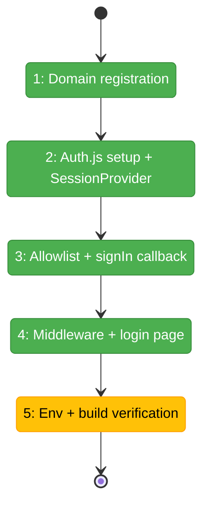
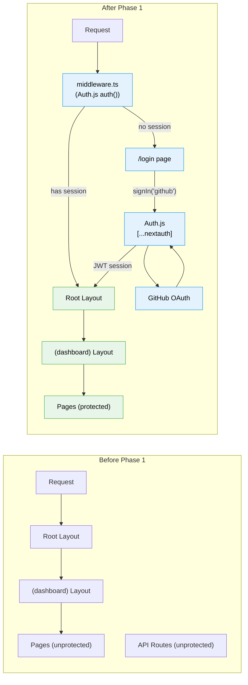

# Flight Plan: Phase 1 — Core Auth Infrastructure

**Plan**: [login-plan.md](../../login-plan.md)
**Phase**: Phase 1: Core Auth Infrastructure
**Generated**: 2026-03-01 (v2 — Auth.js rewrite)
**Status**: Ready for takeoff

---

## Departure → Destination

**Where we are**: Chainglass web app has zero authentication. All 25+ dashboard pages, 11 API routes, and 5 server action files are completely unprotected. No middleware, no session management, no auth library installed. The `_platform/auth` domain does not yet exist.

**Where we're going**: A developer can sign in via GitHub OAuth (powered by Auth.js v5), receive a JWT session, and access the dashboard. Users not on the `.chainglass/auth.yaml` allowlist are denied. Unauthenticated visitors are redirected to a minimal `/login` page. The `_platform/auth` domain is registered. The standalone build works correctly.

---

## Domain Context

### Domains We're Changing

| Domain | What Changes | Key Files |
|--------|-------------|-----------|
| _platform/auth (NEW) | Create entire domain: Auth.js config, allowlist, middleware, login page | `src/auth.ts`, `src/features/063-login/**`, `app/api/auth/**`, `app/login/**`, `middleware.ts` |
| cross-domain (docs) | Register new domain in system | `docs/domains/registry.md`, `docs/domains/domain-map.md` |
| cross-domain (providers) | Add SessionProvider | `src/components/providers.tsx` |
| cross-domain (config) | Add serverExternalPackages | `next.config.mjs` |

### Domains We Depend On (no changes)

| Domain | What We Consume | Contract |
|--------|----------------|----------|
| (none in Phase 1) | — | Self-contained foundation phase |

---

## Flight Status

**Legend**: grey = pending | yellow = active | red = blocked/needs input | green = done

---

## Architecture: Before & After

---

## Stages

- [x] **Stage 1: Register domain** — Create `domain.md`, update `registry.md` and `domain-map.md`
- [~] **Stage 2: Auth.js setup** — Install next-auth, create `src/auth.ts`, route handler, SessionProvider, update next.config.mjs
- [ ] **Stage 3: Allowlist** — Create `allowed-users.ts` with TDD, wire signIn callback, create default `auth.yaml`
- [ ] **Stage 4: Protection + login** — Create middleware with negative lookahead matcher, create minimal login page
- [ ] **Stage 5: Finalize** — `.env.example`, standalone build test, `just fft`

---

## Acceptance Criteria

- [ ] Unauthenticated users are redirected to `/login`
- [ ] "Sign in with GitHub" button initiates OAuth flow via Auth.js
- [ ] Successful OAuth creates JWT session (via Auth.js)
- [ ] Users not on `.chainglass/auth.yaml` allowlist are denied with `?error=AccessDenied`
- [ ] `/api/health` remains publicly accessible
- [ ] `pnpm build` succeeds (standalone output)
- [ ] `just fft` passes

---

## Checklist

- [x] T001: Create `_platform/auth` domain docs + registry + domain-map
- [x] T002: Install next-auth, create auth.ts, add SessionProvider, update next.config.mjs
- [x] T003: Create catch-all `[...nextauth]` route handler
- [x] T004: Create allowed-users.ts + signIn callback (TDD)
- [x] T005: Create default `.chainglass/auth.yaml`
- [x] T006: Create middleware.ts with Auth.js auth wrapper
- [x] T007: Create minimal /login page with error states
- [x] T008: Create .env.example
- [~] T009: Test standalone build + just fft
