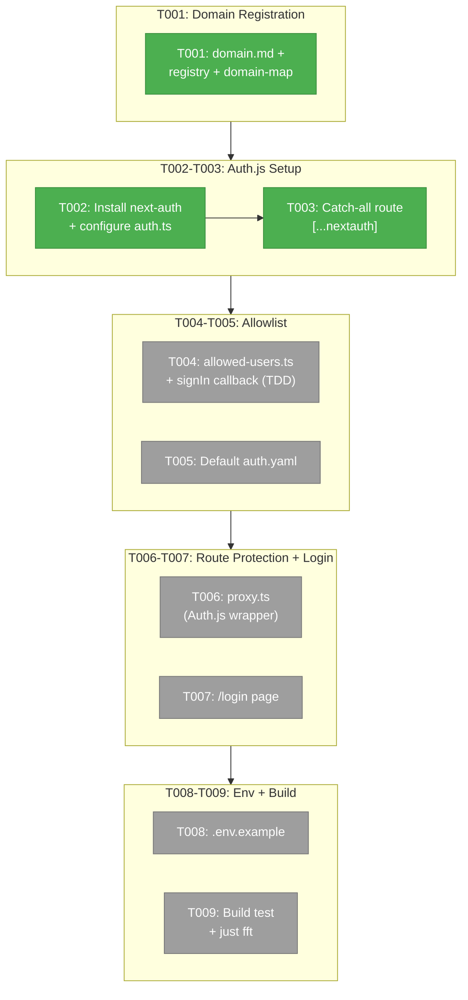
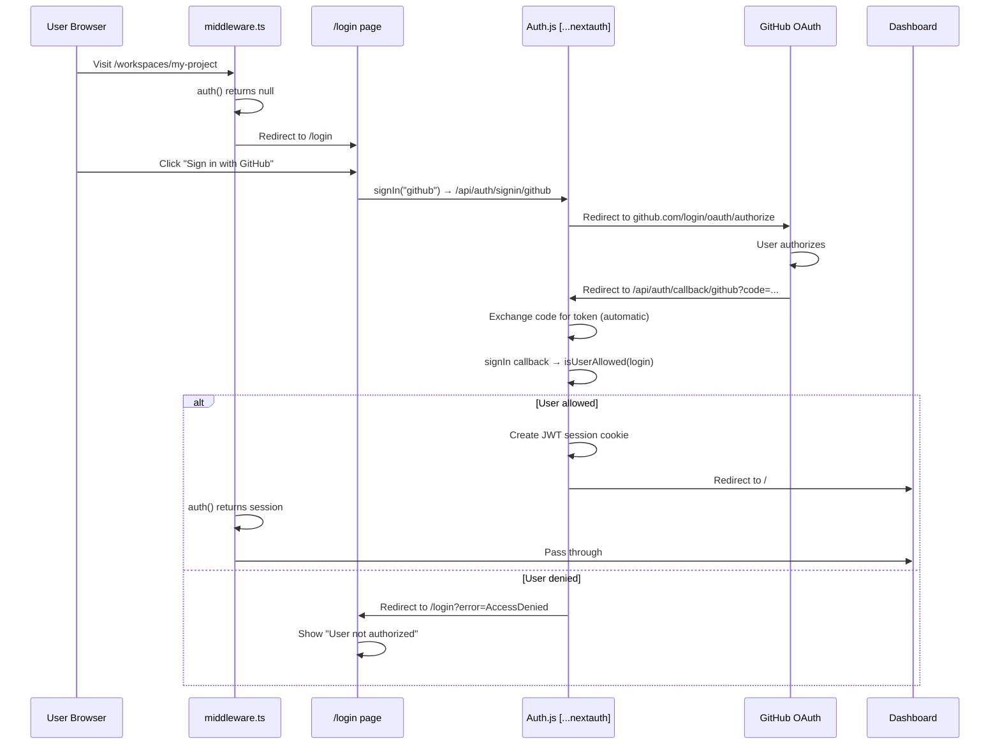

# Phase 1: Core Auth Infrastructure — Tasks

**Plan**: [login-plan.md](../../login-plan.md)
**Phase**: Phase 1: Core Auth Infrastructure
**Generated**: 2026-03-01 (v2 — Auth.js rewrite)
**Status**: Ready

---

## Executive Briefing

**Purpose**: Add GitHub OAuth authentication to Chainglass using Auth.js v5 (next-auth) — the idiomatic, community-standard approach for Next.js. Creates the new `_platform/auth` infrastructure domain. All subsequent phases (login UI, logout integration, docs) depend on this.

**What We're Building**: A working GitHub OAuth sign-in flow powered by Auth.js v5. Clicking "Sign in with GitHub" on a minimal login page redirects to GitHub, returns via Auth.js catch-all route handler, creates a JWT session, and redirects to the dashboard. An allowlist in `.chainglass/auth.yaml` gates access — users not on the list are denied. Unauthenticated requests are intercepted by Auth.js-powered middleware and redirected to `/login`.

**Why Auth.js v5**: The original plan hand-rolled JWT signing, OAuth token exchange, and 4 separate API routes. Auth.js handles all of this out of the box — edge-compatible sessions, CSRF protection, provider integration, and middleware auth. This reduces Phase 1 from 14 tasks to 9 and eliminates an entire category of security risk.

**Goals**:
- ✅ `_platform/auth` domain registered with full domain docs, registry entry, and domain-map node
- ✅ Auth.js v5 configured with GitHub provider and JWT session strategy
- ✅ Allowlist enforcement via `signIn` callback (reads `.chainglass/auth.yaml`)
- ✅ Middleware redirects unauthenticated users to `/login`
- ✅ Minimal `/login` page with sign-in button and error states
- ✅ `.env.example` documents required `AUTH_*` environment variables
- ✅ Standalone build passes with Auth.js dependencies bundled

**Non-Goals**:
- ❌ Styled login screen / ASCII art (Phase 2)
- ❌ Logout button in sidebar (Phase 3)
- ❌ Server action protection (Phase 3)
- ❌ User profiles, roles, or permissions (Non-goal of entire feature)

---

## Pre-Requisite: Create GitHub OAuth App

**Before writing any code**, follow [docs/how/auth/github-oauth-setup.md](../../../../docs/how/auth/github-oauth-setup.md) to:
1. Create a GitHub OAuth App with callback URL `http://localhost:3000/api/auth/callback/github`
2. Create `apps/web/.env.local` with `AUTH_GITHUB_ID`, `AUTH_GITHUB_SECRET`, `AUTH_SECRET`
3. Create `.chainglass/auth.yaml` with your username

Tasks T002-T007 cannot be tested without this.

---

## Pre-Implementation Check

| File | Exists? | Action | Notes |
|------|---------|--------|-------|
| `docs/domains/_platform/auth/domain.md` | N | create | T001 creates this |
| `docs/domains/registry.md` | Y | modify | Add auth row |
| `docs/domains/domain-map.md` | Y | modify | Add auth node + edges |
| `apps/web/src/auth.ts` | N | create | Auth.js config — must be at `src/` for `@/auth` import |
| `apps/web/app/api/auth/[...nextauth]/route.ts` | N | create | Auth.js catch-all handler |
| `apps/web/src/features/063-login/lib/allowed-users.ts` | N | create | Allowlist loader |
| `.chainglass/auth.yaml` | N | create | Default allowlist |
| `apps/web/proxy.ts` | N | create | Route protection (Next.js 16 proxy) |
| `apps/web/app/login/page.tsx` | N | create | Login page |
| `apps/web/app/login/layout.tsx` | N | create | Login layout (no dashboard nav) |
| `apps/web/.env.example` | N | create | Env var template |
| `apps/web/next.config.mjs` | Y | modify | Add `next-auth`, `@auth/core` to serverExternalPackages |
| `apps/web/src/components/providers.tsx` | Y | modify | Add SessionProvider from next-auth/react |
| `apps/web/package.json` | Y | modify | Add next-auth dependency |

**Concept duplication check**: No existing auth, session, JWT, OAuth, or middleware found. All greenfield.

**Path alias check**: `@/*` maps to `./src/*` in tsconfig.json. Auth.js config must be at `apps/web/src/auth.ts` (not project root) to be importable as `@/auth`.

---

## Architecture Map



---

## Tasks

| Status | ID | Task | Domain | Path(s) | Done When | Notes |
|--------|-----|------|--------|---------|-----------|-------|
| [x] | T001 | Create `_platform/auth` domain: write `domain.md` with boundary (owns: Auth.js config, middleware, login page, allowlist; excludes: user profiles, roles, SSE transport), contracts (auth(), signIn(), signOut(), middleware protection), and concepts table. Update `registry.md` with new row. Update `domain-map.md` Mermaid diagram with auth node + consume arrows to state/sdk/settings/events. | _platform/auth | `docs/domains/_platform/auth/domain.md`, `docs/domains/registry.md`, `docs/domains/domain-map.md` | Domain appears in registry, domain-map shows auth node with arrows, domain.md has boundary + contracts + concepts | **BLOCKER** — all subsequent tasks depend on domain being registered |
| [x] | T002 | Install `next-auth@5` via pnpm. Create `apps/web/src/auth.ts` configuring Auth.js with: GitHub provider, JWT session strategy (no database), `trustHost: true` (for HTTP localhost), `session.maxAge: 30 * 24 * 60 * 60` (30 days per spec). Export `{ auth, handlers, signIn, signOut }`. Add `SessionProvider` from `next-auth/react` to `providers.tsx` (wrap outermost). Update `next.config.mjs`: add `next-auth` and `@auth/core` to `serverExternalPackages`. | _platform/auth | `apps/web/src/auth.ts`, `apps/web/src/components/providers.tsx`, `apps/web/next.config.mjs`, `apps/web/package.json` | `pnpm dev` starts without errors. Auth.js config compiles. `import { auth } from "@/auth"` resolves. SessionProvider wraps app. | `trustHost: true` required for HTTP localhost. `@/*` maps to `./src/*` so auth.ts goes in `src/`. Default JWT maxAge is not 30 days — must set explicitly. |
| [x] | T003 | Create `apps/web/app/api/auth/[...nextauth]/route.ts` exporting `GET` and `POST` from `handlers` (imported from `@/auth`). | _platform/auth | `apps/web/app/api/auth/[...nextauth]/route.ts` | Visiting `/api/auth/signin` shows Auth.js sign-in page. `/api/auth/callback/github` is registered. `/api/auth/signout` works. | Single catch-all file handles all auth routes. |
| [x] | T004 | Create `apps/web/src/features/063-login/lib/allowed-users.ts`: load `.chainglass/auth.yaml`, parse with Zod schema (`{ allowed_users: z.array(z.string()) }`), return `Set<string>` of lowercase usernames. Handle missing file gracefully (log warning, deny all). Add `signIn` callback in `auth.ts` that calls `isUserAllowed(profile.login)` — return `true` to allow, `false` to deny. Auth.js auto-redirects denied users to `/login?error=AccessDenied`. | _platform/auth | `apps/web/src/features/063-login/lib/allowed-users.ts`, `apps/web/src/auth.ts` | TDD: parses valid YAML, rejects invalid, returns Set of lowercase usernames. Missing file denies all users. signIn callback correctly allows/denies. Case-insensitive matching. | Install `yaml` package for YAML parsing (or use existing dependency). |
| [x] | T005 | Create `.chainglass/auth.yaml` with default content: `allowed_users:\n  - jakkaj`. Verify `.gitignore` does NOT exclude this file (it's project config, should be committed). | _platform/auth | `.chainglass/auth.yaml` | File exists with correct YAML format. `jakkaj` is listed. File is tracked by git. | |
| [x] | T006 | Create `apps/web/proxy.ts` (Next.js 16 proxy convention). Import `auth` from `@/auth` and use as middleware wrapper. Check `auth` result — if no session, redirect to `/login` for page requests, return 401 for API requests. Export `config.matcher` with negative lookahead: `'/((?!login|api/health|api/auth|_next/static|_next/image|favicon\\.ico).*)'`. Use `export const runtime = 'nodejs'` for node:fs compatibility. | _platform/auth | `apps/web/proxy.ts` | Unauthenticated page requests redirect to `/login`. Unauthenticated API requests get 401. `/api/auth/*`, `/login`, `/_next/*`, `/api/health`, and favicon pass through. | Next.js 16 renamed middleware.ts to proxy.ts. Node.js runtime required for node:fs. |
| [x] | T007 | Create `/login` page. Layout at `app/login/layout.tsx` — minimal shell with ThemeProvider and SessionProvider (required for client-side `signIn()`), but NO dashboard nav, SDKProvider, or GlobalStateProvider. Page at `app/login/page.tsx` — server component that reads `searchParams.error`. Renders centered "Sign in with GitHub" button. If `?error=AccessDenied`, shows "User not authorized" message. Button calls `signIn("github")` via a client component wrapper. | _platform/auth | `apps/web/app/login/page.tsx`, `apps/web/app/login/layout.tsx` | Page renders without errors. Button initiates OAuth flow. `?error=AccessDenied` shows denial message. No dashboard sidebar visible. | Placeholder — fully styled in Phase 2. `searchParams` is async in Next.js 16 — must `await`. SessionProvider required for signIn() to work. |
| [x] | T008 | Create `apps/web/.env.example` documenting: `AUTH_GITHUB_ID` (GitHub OAuth App Client ID), `AUTH_GITHUB_SECRET` (GitHub OAuth App Client Secret), `AUTH_SECRET` (session encryption, generate with `openssl rand -base64 32`). | _platform/auth | `apps/web/.env.example` | File exists with all 3 vars, each with descriptive comment. | Auth.js auto-infers `AUTH_`-prefixed env vars. |
| [~] | T009 | Verify: run `pnpm build` from repo root (tests standalone output). Run `just fft` (lint + format + typecheck + test). If Auth.js fails to bundle in standalone, add packages to `serverExternalPackages`. Fix any lint/type errors introduced. | _platform/auth | `apps/web/next.config.mjs` (if modified) | `pnpm build` succeeds with zero errors. `just fft` passes. No missing module errors in standalone output. | Finding 02: standalone build risk. |

---

## Context Brief

### Key findings from plan

- **Finding 01** (Critical): Middleware runs at edge runtime. Auth.js `auth()` wrapper is edge-compatible, so we can do real session validation in middleware (not just cookie existence check). This is a significant improvement over the hand-rolled approach.
- **Finding 02** (Critical): `output: 'standalone'` may not bundle Auth.js. Add `next-auth` and `@auth/core` to `serverExternalPackages` in next.config.mjs.
- **Finding 05** (High): SidebarFooter exists but is empty. Ideal location for logout button (Phase 3).
- **DYK 01** (Critical): Route group `(dashboard)` is stripped from URLs. Middleware matcher must use negative lookahead, not `/(dashboard)/`.
- **DYK 02** (Critical): Chainglass is a local HTTP tool. Auth.js config needs `trustHost: true` to work on `http://localhost`.
- **DYK 05** (High): Auth.js callback URL is `/api/auth/callback/github` (not `/api/auth/github/callback`).

### Auth.js v5 key patterns

**Config file** (`src/auth.ts`):
```typescript
import NextAuth from "next-auth"
import GitHub from "next-auth/providers/github"
import { isUserAllowed } from "@/features/063-login/lib/allowed-users"

export const { auth, handlers, signIn, signOut } = NextAuth({
  providers: [GitHub],
  trustHost: true,  // Required for HTTP localhost
  session: {
    strategy: "jwt",
    maxAge: 30 * 24 * 60 * 60, // 30 days
  },
  callbacks: {
    signIn: async ({ profile }) => {
      return isUserAllowed(profile?.login ?? "")
    },
  },
})
```

**Route handler** (`app/api/auth/[...nextauth]/route.ts`):
```typescript
import { handlers } from "@/auth"
export const { GET, POST } = handlers
```

**Middleware** (`middleware.ts`):
```typescript
export { auth as middleware } from "@/auth"
export const config = {
  matcher: ['/((?!login|api/health|api/auth|_next/static|_next/image|favicon\\.ico).*)'],
}
```

**Server-side session check** (in server components or server actions):
```typescript
import { auth } from "@/auth"
const session = await auth()
if (!session) { /* redirect or return 401 */ }
```

**Client-side session** (via SessionProvider + useSession):
```typescript
"use client"
import { useSession, signOut } from "next-auth/react"
const { data: session, status } = useSession()
```

### OAuth flow with Auth.js



### Domain dependencies

- **No consumed domain contracts in Phase 1** — self-contained foundation phase
- **`_platform/state`**: Future auth state publishing (Phase 3+)
- **`_platform/sdk`**: Future logout command registration (Phase 3+)

### Domain constraints

- Auth code lives in `apps/web/src/features/063-login/` (app-specific)
- Auth.js config at `apps/web/src/auth.ts` (required for `@/auth` import alias)
- Middleware must use Auth.js `auth` export (edge-compatible)
- Session secrets via `AUTH_*` env vars (Auth.js auto-infers)
- Cookie `secure: false` — Chainglass is a local HTTP tool
- `trustHost: true` — required for HTTP localhost

### Reusable from codebase

- **Provider pattern**: Follow `providers.tsx` — add `SessionProvider` as outermost wrapper
- **Feature directory**: Follow `041-file-browser/` — `components/`, `hooks/`, `lib/`
- **API route pattern**: Follow `agents/route.ts` — `export const dynamic = 'force-dynamic'`
- **Server action pattern**: Follow `workspace-actions.ts` — `'use server'` + Zod + ActionState

---

## Discoveries & Learnings

_Populated during implementation by plan-6._

| Date | Task | Type | Discovery | Resolution | References |
|------|------|------|-----------|------------|------------|

