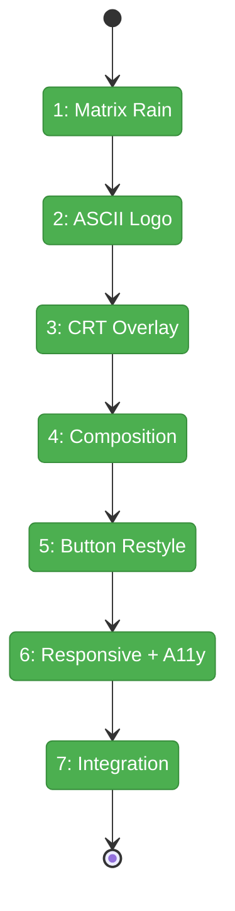
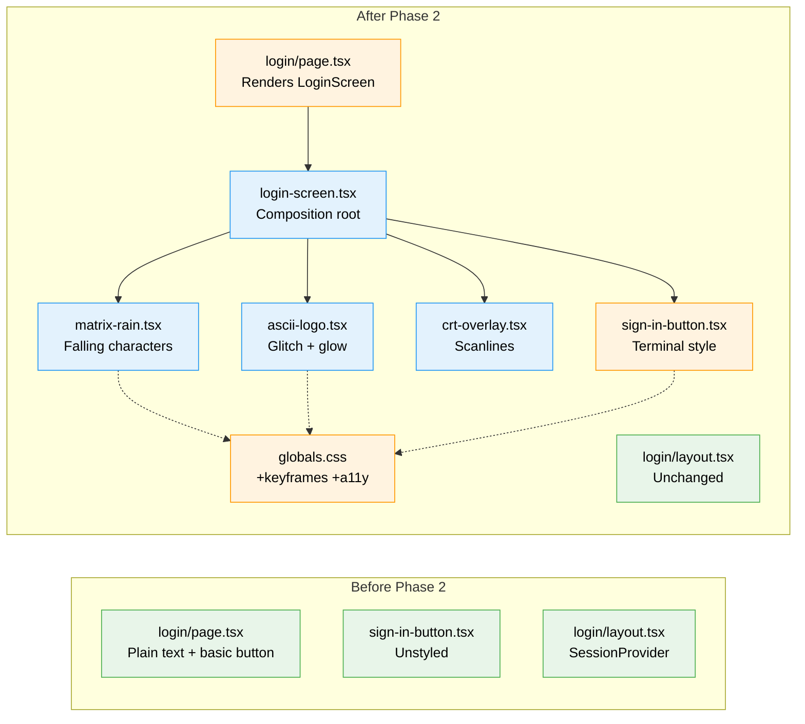

# Flight Plan: Phase 2 — ASCII Art Animated Login Screen

**Plan**: [login-plan.md](../../login-plan.md)
**Phase**: Phase 2: ASCII Art Animated Login Screen
**Generated**: 2026-03-02
**Status**: Landed

---

## Departure → Destination

**Where we are**: Phase 1 delivered a working GitHub OAuth flow with a minimal, unstyled login page — plain text "CHAINGLASS" heading, basic button, and error messages on a dark background. The auth infrastructure (Auth.js v5, middleware, allowlist) is complete and functional.

**Where we're going**: The login page becomes a visually striking hacker-console experience. Matrix-style characters rain down the screen, a large ASCII art "CHAINGLASS" logo glitches and glows in the center, CRT scanlines overlay everything, and a terminal-styled button with blinking cursor invites the user to sign in. It looks like logging into a classified system. All animations are CSS-driven for 60fps, with accessibility fallback for `prefers-reduced-motion`.

---

## Domain Context

### Domains We're Changing

| Domain | What Changes | Key Files |
|--------|-------------|-----------|
| _platform/auth | Add 4 new UI components (matrix rain, ASCII logo, CRT overlay, login screen composition), restyle sign-in button, replace login page placeholder, add CSS keyframes + a11y | `components/matrix-rain.tsx`, `ascii-logo.tsx`, `crt-overlay.tsx`, `login-screen.tsx`, `sign-in-button.tsx`, `app/login/page.tsx`, `globals.css` |

### Domains We Depend On (no changes)

| Domain | What We Consume | Contract |
|--------|----------------|----------|
| _platform/auth (Phase 1) | Login page, sign-in button, SessionProvider layout | `page.tsx`, `sign-in-button.tsx`, `layout.tsx` |

---

## Flight Status

<!-- Updated by /plan-6-v2: pending → active → done. Use blocked for problems/input needed. -->

**Legend**: grey = pending | yellow = active | red = blocked/needs input | green = done

---

## Stages

<!-- Updated by /plan-6-v2 during implementation: [ ] → [~] → [x] -->

- [x] **Stage 1: Matrix Rain** — Create CSS-driven falling character columns with matrix green glow (`matrix-rain.tsx`, `globals.css`)
- [x] **Stage 2: ASCII Logo** — Hardcoded ANSI Shadow logo with CSS glitch effect and glow pulse (`ascii-logo.tsx`, `globals.css`)
- [x] **Stage 3: CRT Overlay** — Pure CSS scanline + vignette overlay (`crt-overlay.tsx`)
- [x] **Stage 4: Composition** — Client composition root assembling all layers with content and error states (`login-screen.tsx`)
- [~] **Stage 5: Button Restyle** — Terminal aesthetic with blinking cursor and green glow hover (`sign-in-button.tsx`, `globals.css`)
- [x] **Stage 6: Responsive + A11y** — Breakpoints for mobile/tablet/desktop + `prefers-reduced-motion` static fallback (`globals.css`, components)
- [x] **Stage 7: Integration** — Replace login page placeholder with LoginScreen composition (`page.tsx`)

---

## Architecture: Before & After

**Legend**: existing (green, unchanged) | changed (orange, modified) | new (blue, created)

---

## Acceptance Criteria

- [ ] Login page displays animated ASCII art with hacker-console aesthetic
- [ ] Matrix rain characters fall smoothly at 60fps
- [ ] "CHAINGLASS" ASCII art logo renders with glitch effect
- [ ] CRT scanlines visible as subtle overlay
- [ ] "Sign in with GitHub" button styled with terminal aesthetic and blinking cursor
- [ ] Error states (AccessDenied, generic) render in terminal style
- [ ] `prefers-reduced-motion`: all animations disabled, static atmospheric fallback
- [ ] Login screen renders correctly at 320px, 768px, and 1440px without horizontal scroll
- [ ] OAuth flow still works after integration (signIn button, error handling)
- [ ] No new npm dependencies added
- [ ] ASCII logo has `aria-hidden="true"` + hidden `<h1>` for screen readers

## Goals & Non-Goals

**Goals**: Hacker-console aesthetic, 60fps CSS animations, responsive, accessible, <5KB JS addition
**Non-Goals**: Interactive terminal, canvas/WebGL, figlet runtime dependency, logout button (Phase 3)

---

## Checklist

- [x] T001: Create matrix-rain.tsx — CSS-driven falling character columns
- [x] T002: Create ascii-logo.tsx — Hardcoded ANSI Shadow logo with CSS glitch
- [x] T003: Create crt-overlay.tsx — Pure CSS scanline + vignette overlay
- [x] T004: Create login-screen.tsx — Client composition root
- [x] T005: Restyle sign-in-button.tsx with terminal aesthetic
- [x] T006: Add responsive breakpoints + prefers-reduced-motion
- [x] T007: Integrate LoginScreen into login/page.tsx
