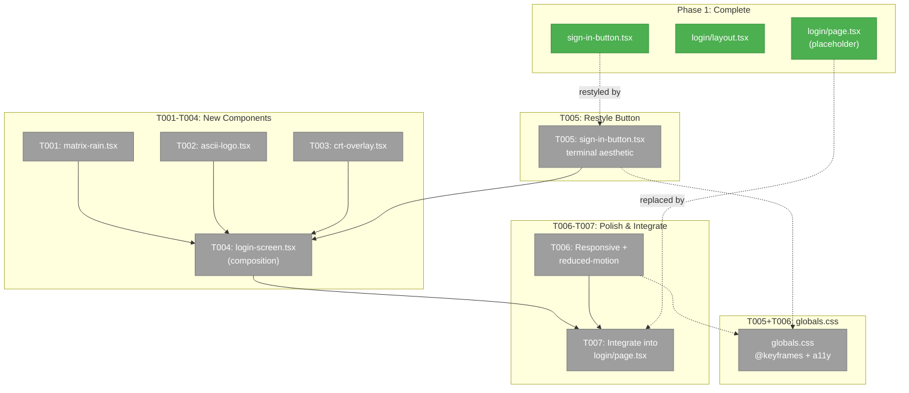
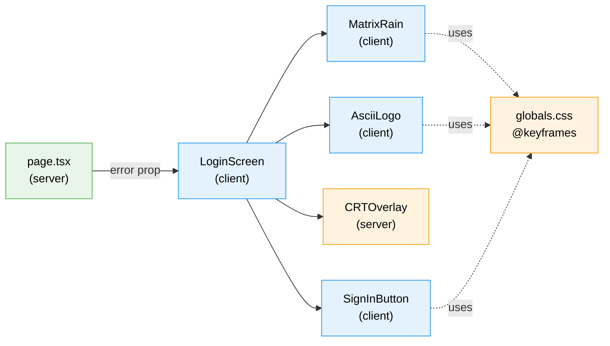
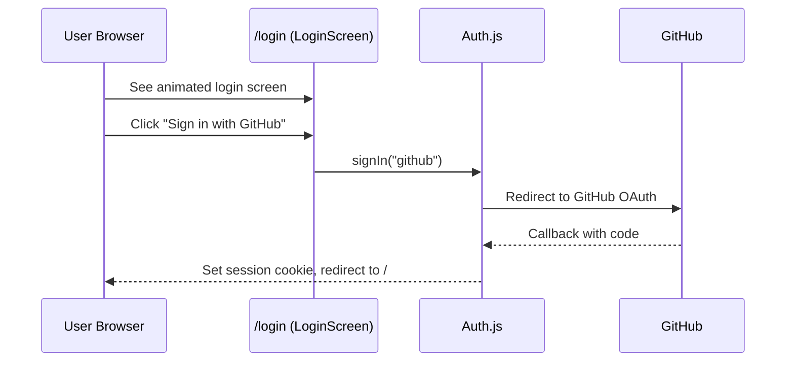

# Phase 2: ASCII Art Animated Login Screen — Tasks

**Plan**: [login-plan.md](../../login-plan.md)
**Phase**: Phase 2: ASCII Art Animated Login Screen
**Generated**: 2026-03-02
**Status**: Ready

---

## Executive Briefing

**Purpose**: Replace the plain Phase 1 login page with a visually striking hacker-console-styled experience. This is the first thing users see when accessing Chainglass — it sets the tone for the entire product.

**What We're Building**: A full-screen animated terminal login screen with matrix-style falling characters in the background, a large ASCII art "CHAINGLASS" logo with glitch effects, CRT scanline overlay, and a terminal-styled sign-in button with blinking cursor. All animations are CSS-driven (GPU-composited) for 60fps performance, with `prefers-reduced-motion` fallback.

**Goals**:
- ✅ Matrix rain background with falling katakana/latin/digit characters
- ✅ Large ASCII art "CHAINGLASS" logo with CSS glitch animation
- ✅ CRT scanline + vignette overlay for retro monitor feel
- ✅ Terminal-styled "Sign in with GitHub" button with blinking cursor
- ✅ Error states (AccessDenied, generic auth failure) styled to match aesthetic
- ✅ Responsive design: mobile fallback text, tablet scaled, desktop full
- ✅ `prefers-reduced-motion` support (static fallback)
- ✅ 60fps sustained, <5KB JS bundle addition

**Non-Goals**:
- ❌ Interactive terminal / command input (this is a login screen, not a terminal emulator)
- ❌ Dynamic ASCII text generation via figlet (hardcoded logo is sufficient)
- ❌ Canvas or WebGL rendering (CSS-only for performance and accessibility)
- ❌ Logout button or sidebar integration (Phase 3)
- ❌ Server action protection (Phase 3)

---

## Prior Phase Context

### Phase 1: Core Auth Infrastructure (Complete)

**A. Deliverables**:
- `apps/web/src/auth.ts` — Auth.js v5 config (GitHub provider, JWT 30-day, trustHost)
- `apps/web/app/api/auth/[...nextauth]/route.ts` — Catch-all auth route handler
- `apps/web/src/features/063-login/lib/allowed-users.ts` — YAML allowlist loader
- `apps/web/src/features/063-login/components/sign-in-button.tsx` — Basic sign-in button
- `apps/web/app/login/page.tsx` — Placeholder login page (to be replaced)
- `apps/web/app/login/layout.tsx` — Login layout (SessionProvider + ThemeProvider)
- `apps/web/proxy.ts` — Middleware for route protection
- `.chainglass/auth.yaml` — Default allowlist
- `apps/web/.env.example` — Environment variables

**B. Dependencies Exported**:
- `signIn("github")` from `next-auth/react` — initiates OAuth flow
- `SignInButton` component — client component wrapping `signIn()`
- Login layout with SessionProvider — required for `signIn()` to work
- `searchParams.error` handling — `AccessDenied` and generic error states
- Auth.js session cookie — set after successful OAuth

**C. Gotchas & Debt**:
- `proxy.ts` uses Node.js runtime (not edge) because `allowed-users.ts` imports `node:fs`
- next-auth v5 is still beta (`5.0.0-beta.30`)
- Pre-existing Zod type errors in `browser-client.tsx` block `pnpm build` (unrelated to auth)
- Middleware file renamed from `middleware.ts` to `proxy.ts` for Next.js 16

**D. Incomplete Items**:
- T009 build verification marked `[~]` — tests pass (4764/4764) but `pnpm build` has pre-existing Zod error

**E. Patterns to Follow**:
- Feature directory structure: `src/features/063-login/components/`, `lib/`, `hooks/`
- Client components: `'use client'` directive at top
- Login page is a server component that reads `searchParams` (async in Next.js 16)
- Login layout provides SessionProvider + ThemeProvider, no dashboard nav

---

## Pre-Implementation Check

| File | Exists? | Action | Domain Check | Notes |
|------|---------|--------|-------------|-------|
| `apps/web/src/features/063-login/components/matrix-rain.tsx` | N | create | ✅ _platform/auth | New client component |
| `apps/web/src/features/063-login/components/ascii-logo.tsx` | N | create | ✅ _platform/auth | New client component |
| `apps/web/src/features/063-login/components/crt-overlay.tsx` | N | create | ✅ _platform/auth | Pure CSS, could be server component |
| `apps/web/src/features/063-login/components/login-screen.tsx` | N | create | ✅ _platform/auth | Composition root, client component |
| `apps/web/src/features/063-login/components/sign-in-button.tsx` | Y | modify | ✅ _platform/auth | Restyle with terminal aesthetic |
| `apps/web/app/login/page.tsx` | Y | modify | ✅ _platform/auth | Replace placeholder with LoginScreen |
| `apps/web/app/globals.css` | Y | modify | cross-domain | Add @keyframes for matrix, glitch, blink + prefers-reduced-motion |

**Concept duplication check**: No existing matrix rain, ASCII art, CRT overlay, or terminal button components found. AsciiSpinner in `_platform/panel-layout` uses `setInterval` frame cycling — different pattern from our CSS-driven approach. No overlap.

---

## Architecture Map



---

## Tasks

| Status | ID | Task | Domain | Path(s) | Done When | Notes |
|--------|-----|------|--------|---------|-----------|-------|
| [ ] | T001 | Create `matrix-rain.tsx` — CSS-driven falling character columns. 30-50 `<span>` columns with random katakana/latin/digit characters, varying speeds (8-20s) and delays (0-10s). Characters in matrix green (#00ff41) with glow text-shadow. CSS `@keyframes matrix-fall` animates `translateY` from -100% to 100vh. Columns rendered in a full-screen absolutely-positioned container. **MUST use mount guard** (`useState(false)` + `useEffect(() => setMounted(true), [])`) — render nothing until mounted. Generate random characters inside the `useEffect` or guarded by `mounted` flag. Do NOT use `useMemo(() => Math.random()...)` — it runs during SSR and produces different values on client, causing React hydration mismatch errors. The workshop code snippet for MatrixColumn is illustrative only; follow this task description for the hydration-safe pattern. **Also check `prefers-reduced-motion` in JS** via `window.matchMedia("(prefers-reduced-motion: reduce)").matches` — if true, skip column generation entirely and render a simple static atmospheric background (faint fixed characters or grid). CSS media query alone only hides animations but still creates 30-40 DOM nodes for zero visual benefit. | _platform/auth | `apps/web/src/features/063-login/components/matrix-rain.tsx`, `apps/web/app/globals.css` | Component renders 30+ animated columns of falling characters. Animation loops smoothly. No layout jank. No hydration warnings in console. `@keyframes matrix-fall` added to globals.css. | Workshop Layer 1. CSS `transform` + `opacity` only — GPU composited. Mobile: reduce to 15-20 columns via responsive prop. ⚠️ Workshop code uses `useMemo(Math.random)` — DO NOT follow that pattern. |
| [ ] | T002 | Create `ascii-logo.tsx` — Hardcoded "CHAINGLASS" in ANSI Shadow figlet font. Render in `<pre>` with `aria-hidden="true"` + hidden `<h1>Chainglass</h1>` for screen readers. Apply CSS glitch effect using `::before`/`::after` pseudo-elements with `clip-path` + color channel offset (red #ff0040, cyan #00ffff). Glitch fires during ~5-8% of animation cycle (subtle, not constant). Logo has gentle glow pulse animation. **Responsive**: On mobile (<640px), hide ASCII art entirely and show plain text "CHAINGLASS" in large monospace. On tablet (640-1024px), wrap `<pre>` in a container with `overflow: hidden` and use `transform: scale(0.6-0.7)` + `transform-origin: center` — the wrapper clips the untransformed layout box so no horizontal overflow occurs. On desktop (>1024px), show full size. The ASCII art is 80+ chars wide — `transform: scale()` is visual-only and does NOT shrink layout, so the overflow-hidden wrapper is mandatory for tablet. | _platform/auth | `apps/web/src/features/063-login/components/ascii-logo.tsx`, `apps/web/app/globals.css` | ASCII logo renders centered with glitch animation. Glitch is subtle (5-8% of cycle). No horizontal scroll at any breakpoint (phone/iPad/desktop). Mobile shows text fallback. Screen readers get proper heading. `@keyframes glitch-1`, `glitch-2`, `logo-glow` added to globals.css. | Workshop Layer 2. Hardcoded art — zero runtime figlet dependency. `data-text` attribute for pseudo-element content. Pin `line-height: 1; letter-spacing: 0;` on `.ascii-logo` and its pseudo-elements to guarantee overlay alignment across OS monospace fonts. |
| [ ] | T003 | Create `crt-overlay.tsx` — Fixed overlay with CRT scanline effect via `repeating-linear-gradient` (2px transparent + 2px semi-black). Vignette effect via `box-shadow: inset`. `pointer-events: none`, `z-index: 50`. Can be a server component (pure CSS, no JS). | _platform/auth | `apps/web/src/features/063-login/components/crt-overlay.tsx` | Overlay visible with subtle horizontal lines. Does not block interaction. No JS required. | Workshop Layer 3. Lightest component — pure CSS div. |
| [ ] | T004 | Create `login-screen.tsx` — Client composition root. Composes: MatrixRain (background) + AsciiLogo (center) + CRTOverlay (top) + SignInButton + error messages. Full-screen `min-h-dvh` with terminal black (#0a0a0a) background. "SYSTEM ACCESS REQUIRED" header in amber (#ffb000), monospace, tracking-wide, uppercase. Error messages styled with terminal red (#ff3333). Props: `error?: string`, `deniedUser?: string`. | _platform/auth | `apps/web/src/features/063-login/components/login-screen.tsx` | All layers compose correctly. Content centered vertically and horizontally. Error states render in terminal style. Background animation visible behind content. | Workshop Layer 4. z-index ordering: rain(0) → content(10) → CRT(50). |
| [ ] | T005 | Restyle `sign-in-button.tsx` with terminal aesthetic: transparent background, 1px solid #00ff41 border, monospace font, uppercase, letter-spacing 2px. Blinking cursor `_` appended via `::after` pseudo-element. Hover: green glow + faint green background. Focus: visible outline for accessibility. Add `@keyframes blink` to globals.css. | _platform/auth | `apps/web/src/features/063-login/components/sign-in-button.tsx`, `apps/web/app/globals.css` | Button has terminal/hacker aesthetic. Cursor blinks. Hover shows glow effect. Focus ring visible for keyboard nav. Text reads "> Sign in with GitHub". | Workshop Layer 4 button styling. Keep `signIn('github')` onClick unchanged. |
| [ ] | T006 | Add responsive breakpoints and `prefers-reduced-motion` support. Matrix rain: 15 columns on mobile, 25 tablet, 40 desktop. ASCII logo: hidden on mobile (plain text fallback), scale(0.7) on tablet, full on desktop. Add `@media (prefers-reduced-motion: reduce)` block to globals.css: disable all matrix/glitch/blink animations, cursor visible but not blinking, no scanlines. **Also verify JS guard in MatrixRain** (T001) skips column DOM generation entirely when reduced motion is preferred — CSS alone hides animations but still creates 30-40 nodes. | _platform/auth | `apps/web/app/globals.css`, component files as needed | Login screen renders correctly at 320px, 768px, 1440px without horizontal scroll. With `prefers-reduced-motion`: no animation, static atmospheric fallback. | Workshop responsive + a11y sections. Test with browser dev tools device emulator. |
| [ ] | T007 | Integrate `LoginScreen` into `app/login/page.tsx` — replace the placeholder content. Import `LoginScreen`, pass `error` from `searchParams`. Keep page as server component (reads `searchParams`). `LoginScreen` is the client component boundary. Remove old placeholder markup. Verify OAuth flow still works end-to-end if env vars configured. | _platform/auth | `apps/web/app/login/page.tsx` | Login page renders the full animated experience. Error states still work. OAuth flow unaffected. Old placeholder markup removed. | Final integration. Page stays server component, LoginScreen is client boundary. |

---

## Context Brief

### Key findings from plan

- **Finding 02** (Critical): `output: 'standalone'` may not bundle everything — Auth.js already added to `serverExternalPackages` in Phase 1. No new packages in Phase 2.
- **Finding 06** (High): AsciiSpinner exists in `_platform/panel-layout` using `setInterval` frame cycling. Phase 2 uses CSS-driven animation instead — different pattern, no reuse needed. Reference for the general approach of monospace character animation.
- **Workshop 001** (Reference): Full design at `docs/plans/063-login/workshops/001-ascii-art-login-screen.md` — defines 4-layer stack, color palette, component architecture, responsive strategy, accessibility, performance budget.

### Domain dependencies

- `_platform/auth`: Login page ownership (Phase 1 deliverable) — we modify `page.tsx` and `sign-in-button.tsx`
- No other domain contracts consumed — Phase 2 is entirely within `_platform/auth`

### Domain constraints

- All new components go in `apps/web/src/features/063-login/components/`
- Client components need `'use client'` directive
- Login page (`app/login/page.tsx`) stays as server component — `LoginScreen` is the client boundary
- CSS keyframes go in `apps/web/app/globals.css` (existing pattern — 3 keyframes already there)
- No new npm dependencies — hardcoded ASCII art, CSS-only animations

### Reusable from Phase 1

- `sign-in-button.tsx` — keep `signIn('github', { callbackUrl: '/' })` onClick, restyle only
- `app/login/layout.tsx` — SessionProvider + ThemeProvider already set up, no changes needed
- Error handling pattern from `page.tsx` — `searchParams.error` reading, `AccessDenied` vs generic

### Color palette (from workshop)

| Name | Hex | Usage |
|------|-----|-------|
| Terminal Black | `#0a0a0a` | Background |
| Matrix Green | `#00ff41` | Primary text, logo, button border |
| Matrix Green (dim) | `rgba(0, 255, 65, 0.3)` | Rain characters, glow effects |
| Glitch Red | `#ff0040` | Glitch ::before layer |
| Glitch Cyan | `#00ffff` | Glitch ::after layer |
| Error Red | `#ff3333` | "Not authorized" message |
| Amber | `#ffb000` | "SYSTEM ACCESS REQUIRED" header |

### Component interaction flow



### OAuth flow sequence (unchanged from Phase 1)



### Performance budget (from workshop)

| Metric | Target | Approach |
|--------|--------|----------|
| FPS | 60fps sustained | CSS `transform` + `opacity` only (GPU-composited) |
| JS bundle | <5KB added | No libraries, hardcoded art, CSS animations |
| LCP | <1s | Static HTML + CSS, no data fetching |
| CLS | 0 | Fixed dimensions, no layout shift |

---

## Discoveries & Learnings

_Populated during implementation by plan-6._

| Date | Task | Type | Discovery | Resolution | References |
|------|------|------|-----------|------------|------------|

---

## Directory Layout

```
docs/plans/063-login/
  ├── login-plan.md
  ├── login-spec.md
  ├── workshops/001-ascii-art-login-screen.md
  └── tasks/
      ├── phase-1-core-auth-infrastructure/
      │   ├── tasks.md
      │   ├── tasks.fltplan.md
      │   └── execution.log.md
      └── phase-2-ascii-art-animated-login-screen/
          ├── tasks.md              ← this file
          ├── tasks.fltplan.md      ← generated next
          └── execution.log.md     # created by plan-6
```
