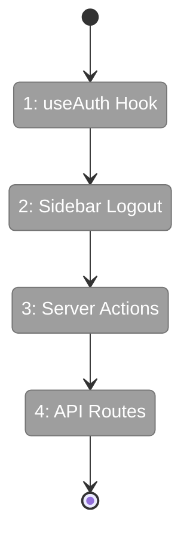
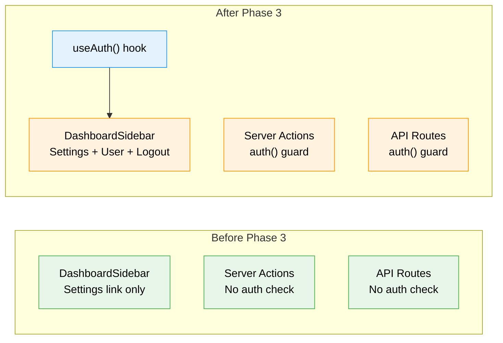

# Flight Plan: Phase 3 — Logout & Navigation Integration

**Plan**: [login-plan.md](../../login-plan.md)
**Phase**: Phase 3: Logout & Navigation Integration
**Generated**: 2026-03-02
**Status**: Ready for takeoff

---

## Departure → Destination

**Where we are**: Phases 1-2 delivered a working GitHub OAuth flow with a stunning animated login screen. The middleware redirects unauthenticated users to `/login`, and Auth.js handles the full OAuth lifecycle. However, once authenticated, there's no way to log out — no button, no UI indicator of who's signed in. Server actions and API routes have no session validation, meaning they'd work even without a valid session cookie (the middleware only protects page navigation, not direct API calls).

**Where we're going**: Every surface of the app is auth-aware. The sidebar footer shows the authenticated GitHub username and a logout button. All 53 server actions fail fast with an error if called without a session. All 10 API route handlers return 401 for unauthenticated requests. A `useAuth()` hook gives client components a clean API for auth state.

---

## Domain Context

### Domains We're Changing

| Domain | What Changes | Key Files |
|--------|-------------|-----------|
| _platform/auth | New `useAuth()` hook | `hooks/use-auth.ts` |
| cross-domain (sidebar) | Logout button + username in footer | `dashboard-sidebar.tsx` |
| cross-domain (actions) | Auth guard in 53 server actions | 5 action files |
| cross-domain (API) | Auth guard in 10 API route handlers | 10 route files |

### Domains We Depend On (no changes)

| Domain | What We Consume | Contract |
|--------|----------------|----------|
| _platform/auth (Phase 1) | `auth()` for server-side session check | `@/auth` |
| _platform/auth (Phase 1) | `useSession()`, `signOut()` for client-side | `next-auth/react` |

---

## Flight Status

<!-- Updated by /plan-6-v2: pending → active → done. Use blocked for problems/input needed. -->

**Legend**: grey = pending | yellow = active | red = blocked/needs input | green = done

---

## Stages

<!-- Updated by /plan-6-v2 during implementation: [ ] → [~] → [x] -->

- [ ] **Stage 1: useAuth Hook** — Create client-side auth hook wrapping `useSession()` (`use-auth.ts`)
- [ ] **Stage 2: Sidebar Logout** — Add username display + logout button to dashboard sidebar footer (`dashboard-sidebar.tsx`)
- [ ] **Stage 3: Server Actions** — Add `auth()` session guard to all 53 exported server actions across 5 files
- [ ] **Stage 4: API Routes** — Add `auth()` session guard to all handlers in 10 API route files

---

## Architecture: Before & After

**Legend**: existing (green, unchanged) | changed (orange, modified) | new (blue, created)

---

## Acceptance Criteria

- [ ] `useAuth()` hook returns `{ user, isLoading, isAuthenticated }` based on session state
- [ ] GitHub username visible in dashboard sidebar footer
- [ ] Logout button in sidebar footer destroys session and redirects to `/login`
- [ ] Sidebar footer works when sidebar is collapsed (icon-only mode)
- [ ] All server actions return `{ errors: ['Not authenticated'] }` when called without session
- [ ] All API route handlers return 401 JSON when called without session
- [ ] `/api/health` remains publicly accessible (no auth)
- [ ] `/api/auth/*` remains handled by Auth.js (no manual auth)

## Goals & Non-Goals

**Goals**: End-to-end auth gating, logout UI, useAuth hook, server action + API route protection
**Non-Goals**: User profiles, roles/permissions, per-action authorization, documentation

---

## Checklist

- [ ] T001: Create useAuth() hook wrapping useSession()
- [ ] T002: Add username + logout button to sidebar footer
- [ ] T003: Add auth() guard to 53 server actions in 5 files
- [ ] T004: Add auth() guard to 10 API route handler files
