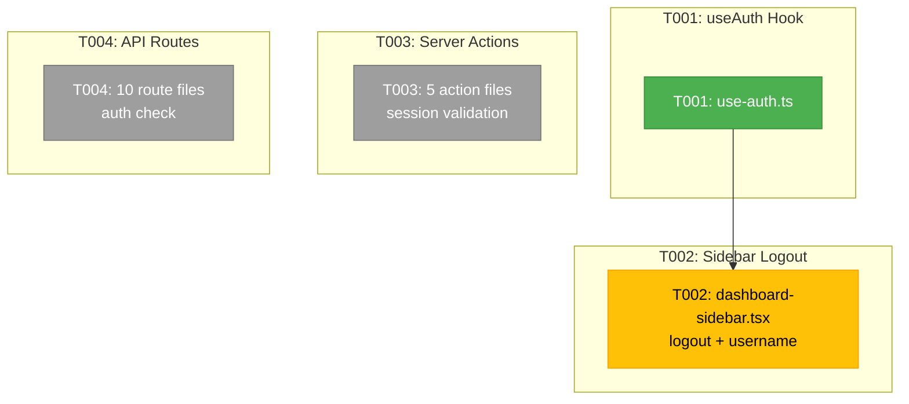
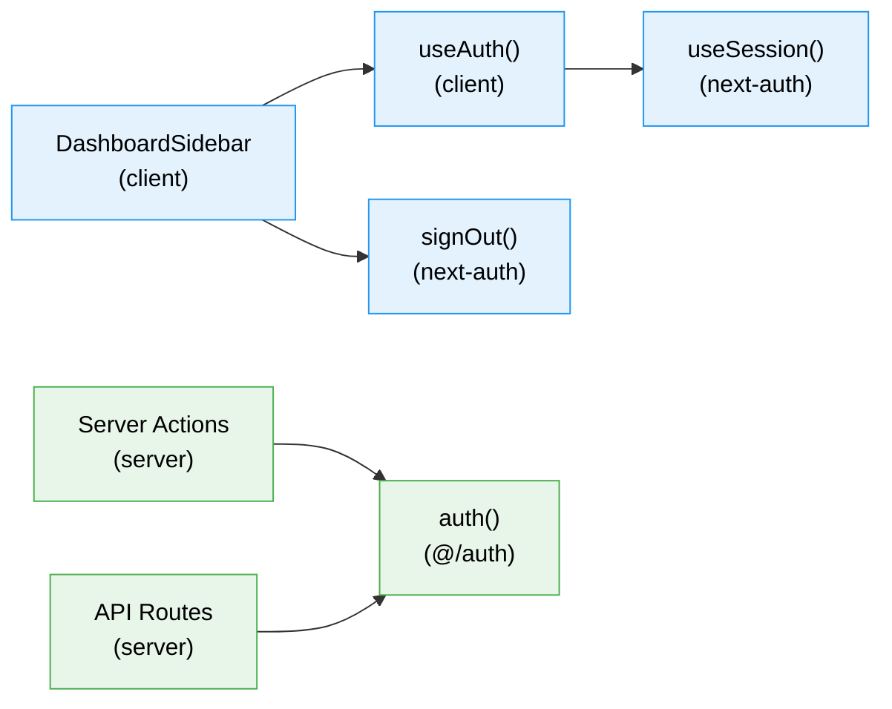

# Phase 3: Logout & Navigation Integration — Tasks

**Plan**: [login-plan.md](../../login-plan.md)
**Phase**: Phase 3: Logout & Navigation Integration
**Generated**: 2026-03-02
**Status**: Ready

---

## Executive Briefing

**Purpose**: Wire authentication into the dashboard experience — add a logout button to the sidebar, protect all server actions and API routes, and provide a client-side auth hook. After this phase, the entire app is auth-gated end-to-end.

**What We're Building**: A `useAuth()` hook that exposes user state via Auth.js `useSession()`. A logout button + username display in the dashboard sidebar footer. Session validation calls (`auth()`) at the top of every server action and API route handler. Unauthenticated server actions return error ActionState; unauthenticated API requests return 401.

**Goals**:
- ✅ `useAuth()` hook exposing `{ user, isLoading, isAuthenticated }`
- ✅ GitHub username + logout button in sidebar footer
- ✅ Session validation in all 5 server action files (53+ exported actions)
- ✅ Session validation in all API route handlers (except `/api/health` and `/api/auth/*`)
- ✅ Unauthenticated API requests → 401 JSON
- ✅ Unauthenticated server actions → error ActionState

**Non-Goals**:
- ❌ User profiles or avatars beyond GitHub username
- ❌ Role-based access control
- ❌ Per-action permission checks
- ❌ Documentation (Phase 4)
- ❌ Login screen changes (Phase 2 complete)

---

## Prior Phase Context

### Phase 1: Core Auth Infrastructure (Complete)

**A. Deliverables**:
- `apps/web/src/auth.ts` — Auth.js v5 config with `auth()`, `handlers`, `signIn`, `signOut`
- `apps/web/app/api/auth/[...nextauth]/route.ts` — Catch-all route handler
- `apps/web/src/features/063-login/lib/allowed-users.ts` — YAML allowlist loader
- `apps/web/proxy.ts` — Route protection middleware
- `apps/web/app/login/` — Login page + layout
- `.chainglass/auth.yaml` — Default allowlist

**B. Dependencies Exported**:
- `auth()` from `@/auth` — returns session or null (server-side)
- `signIn()`, `signOut()` from `next-auth/react` — client-side auth actions
- `useSession()` from `next-auth/react` — client-side session hook (via SessionProvider)
- `AuthProvider` from `@/features/063-login/components/auth-provider` — SessionProvider wrapper

**C. Gotchas & Debt**:
- `proxy.ts` no longer supports `export const runtime` (Next.js 16 proxy always Node.js)
- SessionProvider moved from root `providers.tsx` to dashboard layout + login layout
- `typescript.ignoreBuildErrors: true` in next.config (tsc OOMs in build worker)
- `api/auth/session` returns 500 without `.env.local` configured

**D. Patterns to Follow**:
- Server-side: `import { auth } from '@/auth'; const session = await auth();`
- Client-side: `import { useSession, signOut } from 'next-auth/react';`
- AuthProvider wraps dashboard layout at `app/(dashboard)/layout.tsx`

### Phase 2: ASCII Art Animated Login Screen (Complete)

**A. Deliverables**: Matrix rain, ASCII logo, CRT overlay, terminal button, login-screen composition
**B. Dependencies Exported**: `LoginScreen` component (not needed in Phase 3)
**C. Gotchas**: None relevant to Phase 3
**D. Patterns to Follow**: `'use client'` components with mount guards for SSR safety

---

## Pre-Implementation Check

| File | Exists? | Action | Domain Check | Notes |
|------|---------|--------|-------------|-------|
| `apps/web/src/features/063-login/hooks/use-auth.ts` | N | create | ✅ _platform/auth | New client hook |
| `apps/web/src/components/dashboard-sidebar.tsx` | Y | modify | cross-domain | Add logout to SidebarFooter (lines 247-272) |
| `apps/web/app/actions/workspace-actions.ts` | Y | modify | cross-domain | Add `auth()` to 8 actions |
| `apps/web/app/actions/file-actions.ts` | Y | modify | cross-domain | Add `auth()` to 12 actions |
| `apps/web/app/actions/workunit-actions.ts` | Y | modify | cross-domain | Add `auth()` to 8 actions |
| `apps/web/app/actions/workflow-actions.ts` | Y | modify | cross-domain | Add `auth()` to 23 actions |
| `apps/web/app/actions/sdk-settings-actions.ts` | Y | modify | cross-domain | Add `auth()` to 2 actions |
| `apps/web/app/api/agents/route.ts` | Y | modify | cross-domain | Add auth check |
| `apps/web/app/api/agents/[id]/route.ts` | Y | modify | cross-domain | Add auth check |
| `apps/web/app/api/agents/[id]/run/route.ts` | Y | modify | cross-domain | Add auth check |
| `apps/web/app/api/agents/events/route.ts` | Y | modify | cross-domain | Add auth check |
| `apps/web/app/api/workspaces/route.ts` | Y | modify | cross-domain | Add auth check |
| `apps/web/app/api/workspaces/[slug]/route.ts` | Y | modify | cross-domain | Add auth check |
| `apps/web/app/api/workspaces/[slug]/samples/route.ts` | Y | modify | cross-domain | Add auth check |
| `apps/web/app/api/workspaces/[slug]/files/route.ts` | Y | modify | cross-domain | Add auth check |
| `apps/web/app/api/workspaces/[slug]/files/raw/route.ts` | Y | modify | cross-domain | Add auth check |
| `apps/web/app/api/events/[channel]/route.ts` | Y | modify | cross-domain | Add auth check |
| `apps/web/app/api/health/route.ts` | Y | **no change** | — | Stays public |

**Concept duplication check**: No existing `useAuth` hook. `useSession` from next-auth/react exists but is lower-level — our hook wraps it with a simpler API.

---

## Architecture Map



---

## Tasks

| Status | ID | Task | Domain | Path(s) | Done When | Notes |
|--------|-----|------|--------|---------|-----------|-------|
| [x] | T001 | Create `use-auth.ts` hook — wrap Auth.js `useSession()` from `next-auth/react`. Return `{ user: { name, email, image } \| null, isLoading: boolean, isAuthenticated: boolean }`. Map `useSession` status values: `"loading"` → `isLoading=true`, `"authenticated"` → `isAuthenticated=true`, `"unauthenticated"` → both false. Export `useAuth` and re-export `signOut` from `next-auth/react` for convenience. | _platform/auth | `apps/web/src/features/063-login/hooks/use-auth.ts` | Hook compiles. Returns correct state for each session status. TypeScript types exported. | Simple wrapper — no tests needed per Hybrid approach (it delegates to next-auth). |
| [x] | T002 | Add user display + logout button to `DashboardSidebar` SidebarFooter. Import `useAuth` hook. Show GitHub username (or "User") when authenticated. Add logout button that calls `signOut({ callbackUrl: '/login' })`. Keep existing Settings link. Style: username in muted text, logout as a subtle button/icon. Must work when sidebar is collapsed (icon only). | cross-domain | `apps/web/src/components/dashboard-sidebar.tsx` | Username visible in sidebar footer. Logout button works. Settings link preserved. Collapsed sidebar shows logout icon only. | Per Finding 05. SidebarFooter is at lines 247-272. `useAuth` provides user state. **DYK #5**: `useSession()` fetches `/api/auth/session` on mount — returns 500 without `.env.local`. Handle gracefully: show nothing when `isLoading` or `!isAuthenticated`, never crash. |
| [x] | T003 | First, create `requireAuth()` helper in `src/features/063-login/lib/require-auth.ts` that calls `auth()` and calls `redirect('/login')` if no session (uses Next.js NEXT_REDIRECT — clean navigation, no error overlay) (returns session otherwise). Then add `import { requireAuth } from '@/features/063-login/lib/require-auth'` and `await requireAuth();` as first line of every exported async function in all 5 files. **DYK #1**: Return types are inconsistent across files (ActionState, MutationResult, ResultError[], raw data, boolean, void) — returning `{ errors: [...] }` would NOT type-check. Throwing an error is the only type-safe approach. Files: `workspace-actions.ts` (8 actions), `file-actions.ts` (12 actions), `workunit-actions.ts` (8 actions), `workflow-actions.ts` (23 actions), `sdk-settings-actions.ts` (2 actions). Total: 53 actions to protect. | cross-domain | `apps/web/app/actions/workspace-actions.ts`, `file-actions.ts`, `workunit-actions.ts`, `workflow-actions.ts`, `sdk-settings-actions.ts` | Every exported action checks `auth()` first. Unauthenticated calls return `{ errors: ['Not authenticated'] }`. Authenticated calls proceed as before. | Per Finding 03. Keep changes minimal — add auth import + 2-line guard at top of each function. Match existing `ActionState` pattern with `errors` array. |
| [x] | T004 | Add session validation to all API route handlers (10 files). Pattern: `import { auth } from '@/auth'` at top, then `const session = await auth(); if (!session) return NextResponse.json({ error: 'Unauthorized' }, { status: 401 });` at start of each handler (`GET`, `POST`, `PUT`, `DELETE`, `PATCH`). Excludes: `/api/health/route.ts` (public), `/api/auth/[...nextauth]/route.ts` (handled by Auth.js). | cross-domain | `apps/web/app/api/agents/route.ts`, `agents/[id]/route.ts`, `agents/[id]/run/route.ts`, `agents/events/route.ts`, `workspaces/route.ts`, `workspaces/[slug]/route.ts`, `workspaces/[slug]/samples/route.ts`, `workspaces/[slug]/files/route.ts`, `workspaces/[slug]/files/raw/route.ts`, `events/[channel]/route.ts` | Every API handler checks `auth()` first. Unauthenticated requests → 401 JSON. Health and auth routes unaffected. | **DYK #2**: proxy.ts already returns 401 for unauthenticated API requests (defense line 1). This task adds defense-in-depth at the handler level (defense line 2) — if proxy matcher changes, route-level guards still protect. 10 route files, each with 1-4 exported handlers. |

---

## Context Brief

### Key findings from plan

- **Finding 03** (High): Server actions call `getContainer()` without session check. Auth must be added before container init for fail-fast. → Add `auth()` as first line in each action.
- **Finding 05** (High): SidebarFooter exists but contains only a Settings link. Ideal location for logout button + user display.
- **Finding 06** (High): AsciiSpinner exists in panel-layout — not relevant to Phase 3.

### Domain dependencies

- `_platform/auth`: Session check (`auth()`) — verify user in server actions and API routes
- `_platform/auth`: Client auth state (`useSession()`) — sidebar username + logout
- `_platform/auth`: Sign out (`signOut()`) — destroy session from sidebar button

### Domain constraints

- Auth hook lives in `apps/web/src/features/063-login/hooks/`
- Cross-domain modifications (server actions, API routes, sidebar) must use auth's public contracts only: `auth()` from `@/auth`, `useSession`/`signOut` from `next-auth/react`
- Never import from auth internals (e.g., `allowed-users.ts`, `auth-provider.tsx`)
- Dependency direction: business domains → auth infrastructure (consumers call `auth()`)

### Reusable from prior phases

- `AuthProvider` in dashboard layout — SessionProvider already wrapped, so `useSession()` works in sidebar
- `auth()` from `@/auth` — server-side session check, returns `Session | null`
- `signOut()` from `next-auth/react` — client-side session destruction
- Server action pattern: `'use server'` + `ActionState` with `errors` array

### Server action auth pattern

```typescript
// src/features/063-login/lib/require-auth.ts
import { auth } from '@/auth';
import { redirect } from 'next/navigation';

export async function requireAuth() {
  const session = await auth();
  if (!session) redirect('/login');
  return session;
}
```

```typescript
// In every server action file
import { requireAuth } from '@/features/063-login/lib/require-auth';

export async function someAction(/* params */) {
  await requireAuth();
  // ... existing logic unchanged
}
```

### API route auth pattern

```typescript
// Add to every API route handler
import { auth } from '@/auth';
import { NextResponse } from 'next/server';

export async function GET() {
  const session = await auth();
  if (!session) {
    return NextResponse.json({ error: 'Unauthorized' }, { status: 401 });
  }

  // ... existing logic
}
```

### Component flow



---

## Discoveries & Learnings

_Populated during implementation by plan-6._

| Date | Task | Type | Discovery | Resolution | References |
|------|------|------|-----------|------------|------------|

---

## Directory Layout

```
docs/plans/063-login/
  ├── login-plan.md
  ├── login-spec.md
  ├── workshops/001-ascii-art-login-screen.md
  └── tasks/
      ├── phase-1-core-auth-infrastructure/
      ├── phase-2-ascii-art-animated-login-screen/
      └── phase-3-logout-navigation-integration/
          ├── tasks.md              ← this file
          ├── tasks.fltplan.md      ← generated next
          └── execution.log.md     # created by plan-6
```
