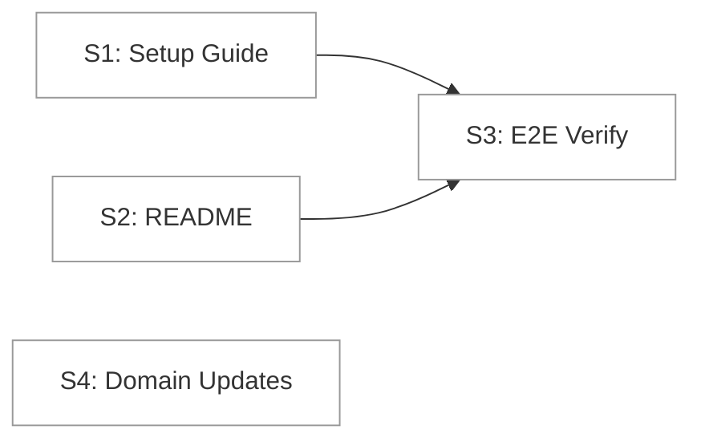

# Phase 4: Documentation & Polish — Flight Plan

**Status**: Ready for takeoff
**Phase**: Phase 4: Documentation & Polish
**Plan**: [login-plan.md](../../login-plan.md)
**Tasks**: [tasks.md](./tasks.md)

---

## Mission

Finalize the 063-login feature by completing documentation, performing end-to-end verification, and updating domain artifacts. No new code logic — this is a polish phase.

---

## Stages

- [ ] **S1**: Finalize setup guide (T001)
- [ ] **S2**: Add README auth section (T002)
- [ ] **S3**: End-to-end verification (T003)
- [ ] **S4**: Domain artifact updates (T004)

---

## Flight Status

---

## Before → After

### Before (Current State)
- Setup guide exists at `docs/how/auth/github-oauth-setup.md` — mostly accurate, created during Phase 1
- README.md has no mention of authentication
- Auth flow tested manually by user during Phase 1 (worked)
- domain.md missing Phase 3 history entry
- Plan shows Phase 3 without ✅ status marker

### After (Target State)
- Setup guide verified accurate with troubleshooting for all known gotchas
- README.md has concise "Authentication" section with 3-step setup + link to guide
- Full auth flow re-verified end-to-end (documented)
- domain.md has complete Phase 1-3 history
- Plan shows all 4 phases complete

---

## Checklist

- [ ] T001: Verify and finalize setup guide
- [ ] T002: Add README auth section
- [ ] T003: Manual end-to-end verification
- [ ] T004: Update domain artifacts (Phase 3 history, source locations, plan status)

---

## Risks

| Risk | Mitigation |
|------|------------|
| Setup guide has stale info | Cross-reference against actual file paths, env vars, callback URLs |
| E2E verification finds bugs | Fix in-place, document in execution log |
| next-auth patch fragility | Document clearly in setup guide troubleshooting |
