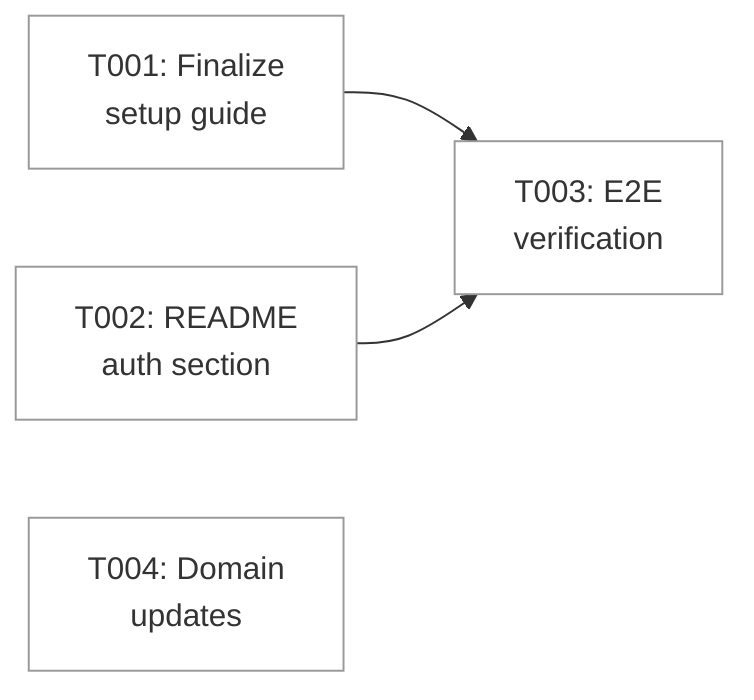

# Phase 4: Documentation & Polish — Tasks

**Phase**: Phase 4: Documentation & Polish
**Plan**: [login-plan.md](../../login-plan.md)
**Domain**: _platform/auth
**Depends on**: Phases 1-3 (all complete)
**Testing approach**: Manual — verify docs are accurate, links resolve, auth flow works end-to-end

---

## Context Brief

### What This Phase Does

Finalizes the 063-login feature by ensuring all documentation is complete and accurate, adding an auth section to the project README, performing end-to-end verification, and updating the domain artifacts with Phase 3 history. This is a polish/documentation phase — no new code logic.

### Key Findings from Prior Phases

| # | Finding | Relevance |
|---|---------|-----------|
| 1 | `docs/how/auth/github-oauth-setup.md` already exists and was validated by the user during Phase 1 setup | T001 is mostly verification — the guide is already accurate |
| 2 | Auth.js uses `AUTH_` prefixed env vars (auto-inferred) | Docs must reference `AUTH_GITHUB_ID`, `AUTH_GITHUB_SECRET`, `AUTH_SECRET` |
| 3 | Callback URL is `/api/auth/callback/github` (NOT `/github/callback`) | Must be correct in all docs |
| 4 | `process.cwd()` in Next.js resolves to `apps/web/` — allowlist loader walks up to find `.chainglass/auth.yaml` | Document this gotcha |
| 5 | `next-auth@5.0.0-beta.30` has an import bug (`next/server` without `.js`) needing node_modules patch | Document workaround |
| 6 | `SessionProvider` cannot be in root `providers.tsx` — breaks SSG prerendering | Document this constraint |
| 7 | `typescript.ignoreBuildErrors: true` needed due to OOM in build worker | Document why this exists |
| 8 | Domain.md needs Phase 3 history entry (logout, server action guards, API guards) | T004 |

### Hazards

- Stale docs: ensure env var names, callback URLs, and file paths match actual implementation
- README section must not duplicate the full setup guide — link to it
- The `next-auth` node_modules patch is fragile — document clearly

---

## Architecture Map

---

## Tasks

| # | Task | Status | Domain | Success Criteria |
|---|------|--------|--------|-----------------|
| T001 | Verify and finalize `docs/how/auth/github-oauth-setup.md` — ensure env var names use `AUTH_*` prefix, callback URL matches Auth.js convention, troubleshooting section covers known issues, add note about `next-auth` node_modules patch | [ ] | _platform/auth | Guide is accurate, covers create OAuth app → set callback URL → copy credentials → create .env.local → configure auth.yaml → verify. Troubleshooting covers: app not found, redirect loop, user not authorized, cookie not set, different port, node_modules patch |
| T002 | Add "Authentication" section to project README.md — brief overview (GitHub OAuth + allowlist), essential setup steps (create OAuth app, configure .env.local, configure auth.yaml), link to detailed guide | [ ] | _platform/auth | README has "Authentication" section between "Quick Start" and "Common Commands" with 3-step setup and link to `docs/how/auth/github-oauth-setup.md` |
| T003 | Manual end-to-end verification — confirm: unauthenticated redirect to /login, login screen renders with animations, GitHub OAuth flow works, dashboard loads after auth, sidebar shows username + logout button, logout returns to /login, denied user sees error message | [ ] | _platform/auth | Full flow verified working without errors. Document any issues found. |
| T004 | Update domain artifacts — add Phase 3 history entry to domain.md (logout button, requireAuth() for 52 server actions, auth() for 12 API routes), add require-auth.ts to Source Location, update plan status to mark Phase 3 complete | [ ] | _platform/auth | domain.md has Phase 3 history row, source location updated, plan shows Phase 3 ✅ |

---

## Discoveries & Learnings

| # | Discovery | Impact | Action |
|---|-----------|--------|--------|
| | *(to be filled during execution)* | | |
