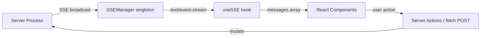
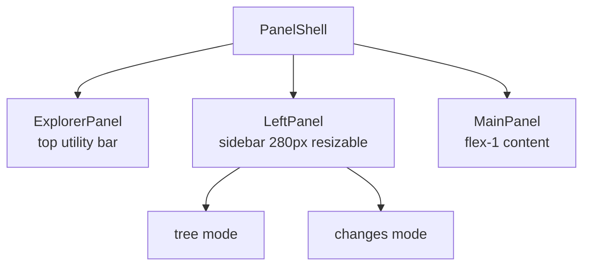
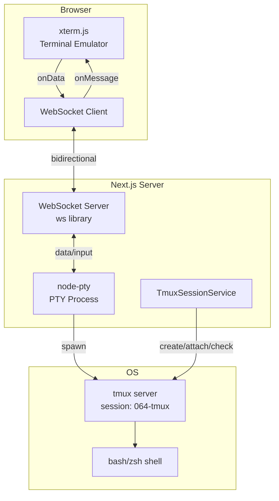
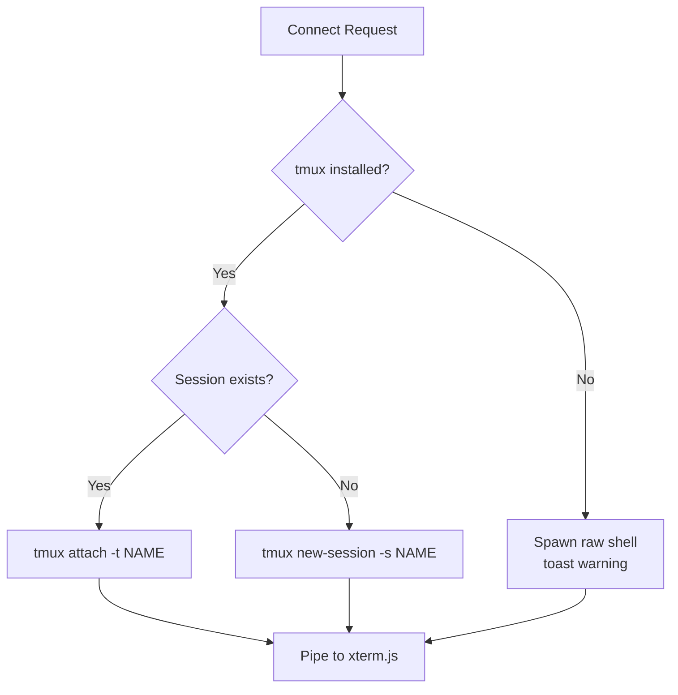
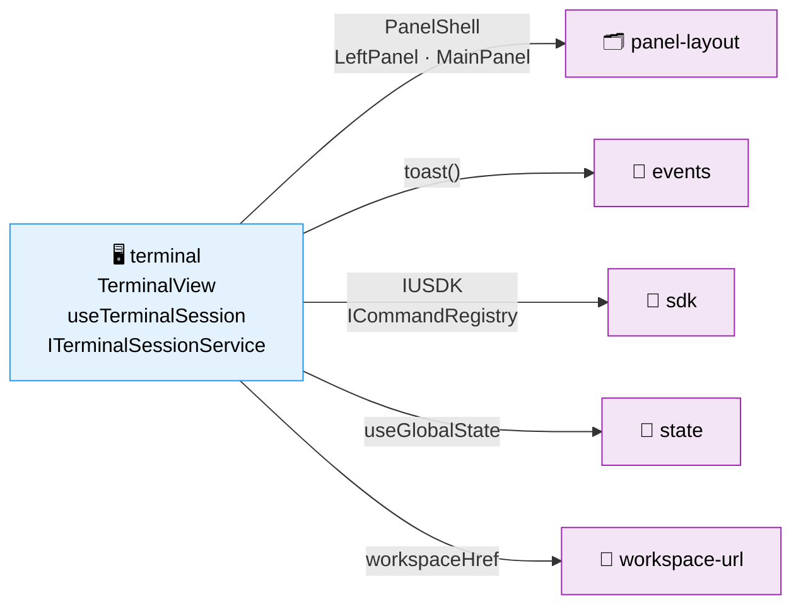

# Research Report: Terminal Integration via tmux

**Generated**: 2026-03-02T08:45:00Z
**Research Query**: "Enable terminal access in the web UI with tmux auto-attach/create, reconnection across browser sessions, and resizable panel integration"
**Mode**: Pre-Plan (Plan 064)
**Location**: `docs/plans/064-tmux/research-dossier.md`
**FlowSpace**: Available
**Findings**: 60+ findings across 8 subagents

## Executive Summary

### What It Does
Add a full-featured terminal emulator to the Chainglass web UI that automatically creates or re-attaches to tmux sessions named by worktree convention (e.g., `064-tmux`). The terminal appears as a sidebar item for worktrees and can optionally pop out as a resizable right-hand panel.

### Business Purpose
Developers need terminal access within the Chainglass UI to run commands, monitor builds, and interact with agents — all without leaving the browser. Since work trees already have tmux sessions (created by `new-Worktree.sh`), the terminal should seamlessly reconnect to these sessions across page refreshes, browser restarts, and even different machines.

### Key Insights
1. **tmux naming convention** is `$BRANCH_NAME` (e.g., `064-tmux`) — set by `new-Worktree.sh` line 80: `tmux new-session -s "$BRANCH_NAME" -c "$WORKTREE_PATH"`
2. **WebSocket required** — SSE infrastructure is unidirectional; terminal needs bidirectional I/O; Next.js route handlers don't support WebSocket upgrade, so a custom server or sidecar WS server is needed
3. **node-pty + xterm.js** is the industry standard stack (used by VS Code, JupyterLab, Theia, Azure Cloud Shell)
4. **Existing patterns** cover 80% of needs: panel-layout (resizable 3-panel), toast (tmux warnings), SSE (event model), DI (service registration), sidebar (navigation)

### Quick Stats
- **New Dependencies**: ~4 (xterm.js, node-pty, ws, xterm addons)
- **Existing Reusable**: ~8 domains (panel-layout, events, sdk, state, workspace-url, file-ops, viewer patterns, DI)
- **Prior Learnings**: 15 institutional discoveries applicable (Plans 042, 043, 045, 057)
- **Domain**: New business domain (`terminal`) alongside file-browser, workflow-ui

## How It Currently Works

### Entry Points — tmux Integration in Codebase

| Entry Point | Type | Location | Purpose |
|-------------|------|----------|---------|
| `new-Worktree.sh` | Shell Script | `../new-Worktree.sh:76-80` | Creates tmux session named `$BRANCH_NAME` in worktree dir |
| `CopilotCLIAdapter` | Adapter Class | `packages/shared/src/adapters/copilot-cli.adapter.ts` | Sends keystrokes to tmux via `tmux send-keys` |
| CLI Container | DI Registration | `apps/cli/src/lib/container.ts:354-361` | Registers tmux `sendKeys`/`sendEnter` functions |

### tmux Session Naming Convention
From `new-Worktree.sh`:
```bash
# Line 37-56: Branch name is either provided with ordinal or auto-generated
if [[ "$INPUT" =~ ^[0-9]{3}- ]]; then
    BRANCH_NAME="$INPUT"        # e.g., "064-tmux"
else
    BRANCH_NAME="${ORDINAL}-${INPUT}"  # e.g., "064-some-feature"
fi

# Line 80: tmux session created with branch name
tmux new-session -s "$BRANCH_NAME" -c "$WORKTREE_PATH"
```

**Convention**: tmux session name = git branch name = worktree directory name = `NNN-slug`

### Existing Real-Time Infrastructure



**Key limitation**: SSE is server→client only. Terminal needs bidirectional I/O.

### Panel Layout System



**Extension point**: Add `'terminal'` to `PanelMode` union, add terminal sessions list to LeftPanel children.

## Architecture & Design

### Proposed Architecture



### Terminal Connection Flow

1. **User navigates** to `/workspaces/[slug]/terminal` (or pops out terminal panel)
2. **Client** establishes WebSocket to `ws://host:PORT/terminal?session=064-tmux&cwd=/path/to/worktree`
3. **Server** checks: does tmux session `064-tmux` exist?
   - **Yes**: `node-pty` spawns `tmux attach-session -t 064-tmux`
   - **No**: `node-pty` spawns `tmux new-session -s 064-tmux -c /path/to/worktree`
4. **PTY I/O** piped bidirectionally over WebSocket
5. **On disconnect** (page refresh, browser close): PTY killed, tmux session persists in background
6. **On reconnect**: Step 3 re-attaches to the still-running tmux session

### tmux Fallback Flow



### Component Architecture

```
Terminal Feature (apps/web/src/features/064-terminal/)
├── components/
│   ├── terminal-view.tsx          # xterm.js wrapper ('use client')
│   ├── terminal-session-list.tsx  # Left panel session list
│   ├── terminal-toolbar.tsx       # Toolbar with pop-out, new session, kill
│   └── terminal-status-bar.tsx    # Connection status indicator
├── hooks/
│   ├── use-terminal-socket.ts     # WebSocket connection management
│   ├── use-terminal-session.ts    # Session lifecycle (create/attach/destroy)
│   └── use-terminal-resize.ts     # Fit addon + resize events
├── params/
│   └── terminal.params.ts         # nuqs URL params (session, view)
├── types.ts                       # TerminalSession, TerminalMessage, etc.
├── index.ts                       # Barrel exports
└── domain.md                      # Domain contract documentation
```

### WebSocket Server Approach

**Challenge**: Next.js App Router route handlers do NOT support WebSocket upgrade.

**Options**:
| Approach | Pros | Cons | Verdict |
|----------|------|------|---------|
| **Custom Next.js server** | Single process, full control | Replaces `next dev`, more complex | Heavyweight |
| **Sidecar WS server** | Clean separation, no Next.js changes | Two processes, port management | **Recommended** |
| **Standalone ws + HTTP upgrade** | Minimal, uses existing HTTP server | Needs hook into Node HTTP server | Good alternative |

**Recommended**: Sidecar WebSocket server started alongside `next dev` (via `concurrently` or justfile). The WS server handles PTY spawning and tmux management. The Next.js app connects to it client-side.

```
# justfile
dev:
    concurrently "next dev" "node apps/web/src/server/terminal-ws.ts"
```

## Dependencies & Integration

### New Dependencies Required

| Package | Purpose | Size | Native? |
|---------|---------|------|---------|
| `@xterm/xterm` | Terminal emulator UI | ~65KB gzip | No |
| `@xterm/addon-fit` | Auto-resize terminal to container | ~3KB | No |
| `@xterm/addon-web-links` | Clickable URLs in terminal output | ~3KB | No |
| `@xterm/addon-clipboard` | Better clipboard integration | ~2KB | No |
| `node-pty` | PTY spawning (tmux/bash) | ~50KB | **Yes (C++ native)** |
| `ws` | WebSocket server | ~25KB | No |

**Note**: `node-pty` requires native compilation (node-gyp, Python, C++ toolchain). This is a build-time dependency only for the server.

### Existing Domain Dependencies

| Domain | Contracts Consumed | Usage |
|--------|-------------------|-------|
| `_platform/panel-layout` | `PanelShell`, `LeftPanel`, `MainPanel`, `PanelMode` | Terminal page layout, resizable panels |
| `_platform/events` | `toast()` from sonner | tmux unavailable warning, connection status |
| `_platform/sdk` | `IUSDK`, `ICommandRegistry`, `IKeybindingService` | Command palette commands, keyboard shortcuts |
| `_platform/state` | `useGlobalState` | Terminal connection state across components |
| `_platform/workspace-url` | `workspaceHref()` | Pop-out terminal deep links |

### Sidebar Navigation Integration

Current `WORKSPACE_NAV_ITEMS` in `navigation-utils.ts`:
```typescript
// Add terminal item:
{ id: 'terminal', label: 'Terminal', href: '/terminal', icon: TerminalSquare }
```

## Quality & Testing

### Test Strategy
- **Component tests**: `terminal-view.test.tsx` — xterm.js rendering, resize handling (jsdom + mocked Terminal)
- **Hook tests**: `use-terminal-socket.test.ts` — WebSocket connection, reconnection, message handling (fake WebSocket)
- **Service tests**: `terminal-session.service.test.ts` — tmux command generation, session lifecycle (fake execSync)
- **Integration**: WebSocket server + client end-to-end (spawn real pty if available)
- **Contract**: Terminal message protocol schema validation

### Existing Test Patterns to Follow (QT-02, QT-04, QT-06)
- `@testing-library/react` for component rendering
- `userEvent.setup()` for input simulation
- Factory function `makeContext()` for test doubles
- Fake objects (FakeWebSocket, FakePty) over vi.mock()
- Parameter injection for testability

## Prior Learnings (From Previous Implementations)

### 📚 PL-01: Panel Resize Persistence
**Source**: Plan 043 Phase 1 (DYK-02)
**What**: `react-resizable-panels` loses sizes on navigation without `autoSaveId`.
**Action**: Use `autoSaveId="terminal-panels"` from day 1, or use CSS `resize: horizontal` (Plan 043 Phase 3 switched to this).

### 📚 PL-02: Async Handler Loading Indicator
**Source**: Plan 043 Phase 1 (DYK-03)
**What**: No loading indicator during server round-trips makes users think input didn't register.
**Action**: Show spinner/disabled state while terminal session connects.

### 📚 PL-03: Document-Level Keyboard Shortcuts
**Source**: Plan 043 Phase 1 & 3 (DYK-04)
**What**: Component-level keyboard handlers fire too late to beat browser shortcuts.
**Action**: Register terminal shortcuts at document level; check `activeElement` to suppress in CodeMirror.

### 📚 PL-05: Toast System — Zero Boilerplate
**Source**: Plan 042
**What**: `import { toast } from 'sonner'` works anywhere, already mounted in Providers.
**Action**: Use `toast.warning('tmux not available')` directly — no setup needed.

### 📚 PL-06: SSE Event Hub Pattern
**Source**: Plan 045 Phase 1 & 2
**What**: File changes stream via SSE with debounce, filtering, per-subscriber patterns.
**Action**: Follow `FileChangeHub` pattern if adding terminal event notifications alongside the WebSocket I/O.

### 📚 PL-08: Subscribe Before Action
**Source**: Plan 023 Critical Finding 08; Plan 045 Phase 1
**What**: Event listeners MUST be registered BEFORE triggering actions — otherwise events are lost.
**Action**: Connect WebSocket and register `onMessage` handler BEFORE sending initial tmux attach command.

### 📚 PL-10: Event Translation Adapter Pattern
**Source**: Plan 057 (EventsJsonlParser)
**What**: Convert low-level events to domain-specific types via adapters.
**Action**: Terminal can use same pattern: raw PTY output → structured terminal events if needed.

### 📚 PL-11: Malformed Input & Session Validation
**Source**: Plan 057 Finding 06
**What**: Validate session IDs strictly, skip malformed data silently.
**Action**: Validate tmux session names with regex `^[a-zA-Z0-9_-]+$` before any exec calls.

### 📚 PL-14: State Ring Buffer for Live History
**Source**: Plan 056
**What**: `StateChangeLog` with 500-entry ring buffer captures state changes from boot.
**Action**: Consider terminal scrollback buffer management with similar bounded approach.

## Domain Context

### New Business Domain: `terminal`

| Attribute | Value |
|-----------|-------|
| **Slug** | `terminal` |
| **Type** | business |
| **Plan** | 064-tmux |
| **Status** | proposed |

### Contracts to Expose

| Contract | Type | Description | Consumers |
|----------|------|-------------|-----------|
| `TerminalView` | Component | xterm.js wrapper with WebSocket | Terminal page, pop-out panel |
| `useTerminalSession()` | Hook | Create/attach/destroy tmux sessions | Terminal page, sidebar |
| `TerminalSessionProvider` | Component | React context for session identity | Terminal layout |
| `terminalParams` | nuqs defs | URL params: `session`, `view` | Deep-linking |
| `ITerminalSessionService` | Interface | Server-side session CRUD | API routes |

### Domain Dependencies (Consumers ← Provider)



### Code Location

```
apps/web/src/features/064-terminal/     # Feature code
app/(dashboard)/workspaces/[slug]/
  └── terminal/
      ├── layout.tsx                      # TerminalSessionProvider
      └── page.tsx                        # PanelShell composition
apps/web/src/server/
  └── terminal-ws.ts                      # WebSocket server (sidecar)
docs/domains/terminal/domain.md           # Domain documentation
```

## Critical Discoveries

### 🚨 Critical Finding 01: WebSocket Required — SSE Insufficient
**Impact**: Critical
**Source**: DC-02, DC-08
**What**: The existing SSE infrastructure is unidirectional (server→client). Terminal requires bidirectional I/O. Next.js route handlers cannot upgrade to WebSocket.
**Required Action**: Implement a sidecar WebSocket server or custom HTTP server for terminal connections. Keep SSE for existing features (agents, file changes, workflows).

### 🚨 Critical Finding 02: node-pty Native Dependency
**Impact**: High
**Source**: DC-01
**What**: `node-pty` requires C++ compilation (node-gyp). This adds build complexity and may not work in all deployment environments.
**Required Action**: Ensure CI has build tools. Consider `node-pty-prebuilt-multiarch` for pre-compiled binaries. Test on all target platforms.

### 🚨 Critical Finding 03: tmux Session Lifecycle vs Browser Lifecycle
**Impact**: High
**Source**: IA-03, new-Worktree.sh analysis
**What**: tmux sessions persist indefinitely. Browser connections are ephemeral. Each page load creates a new PTY→tmux-attach, but the tmux session continues when the PTY dies.
**Required Action**: Design for graceful disconnect/reconnect. PTY cleanup on WebSocket close. No session cleanup on disconnect (tmux continues). The `-A` flag on `tmux new-session` handles create-or-attach atomically.

### 🚨 Critical Finding 04: Panel Pop-Out Needs Two Terminal Instances
**Impact**: Medium
**Source**: User requirement
**What**: User wants (1) a main terminal area in the left sidebar and (2) a pop-out terminal on the right side of the page. Both should connect to the same or different tmux sessions with the same reconnection rules.
**Required Action**: `TerminalView` component must be instantiable multiple times. Each instance manages its own WebSocket connection. Session identity via URL params enables independent connections to different tmux sessions.

## Modification Considerations

### ✅ Safe to Modify
- **Add new feature folder**: `apps/web/src/features/064-terminal/` — isolated new code
- **Extend PanelMode**: Add `'terminal'` to union type — backward compatible
- **Add sidebar item**: Append to `WORKSPACE_NAV_ITEMS` — additive change
- **New WebSocket server**: Separate process — no impact on existing Next.js app

### ⚠️ Modify with Caution
- **`next dev` script**: If adding concurrently for WS server, test HMR still works
- **Panel layout types**: Extending `PanelMode` — ensure existing consumers handle unknown modes
- **Package.json**: `node-pty` native dep may affect install times and CI

### 🚫 Danger Zones
- **Custom Next.js server**: Would replace `next dev` / `next start` — avoid if possible
- **SSE infrastructure**: Don't modify existing SSE for terminal — use WebSocket separately
- **DashboardShell/Sidebar**: Heavily consumed — minimal changes only

## External Research Opportunities (✅ All Completed)

### Research Opportunity 1: xterm.js + React 19 Integration ✅

**Status**: Completed — see DR-01 above

### Research Opportunity 2: WebSocket Architecture for Next.js 16 ✅

**Status**: Completed — see DR-02 above

### Research Opportunity 3: tmux Programmatic Control Best Practices ✅

**Status**: Completed — see DR-03 above

## Deep Research Findings

### DR-01: xterm.js + React 19 Integration

**Research completed**: 2026-03-02 via Perplexity Deep Research

#### Key Findings

1. **Custom hook recommended over wrapper libraries**: Build a thin `useTerminal` hook wrapping `@xterm/xterm` directly. Wrapper libraries (@pablo-lion/xterm-react, react-xtermjs) add React abstraction overhead and lag behind xterm.js releases. A custom hook gives maximum control for WebSocket wiring, resize handling, and cleanup.

2. **Dynamic import pattern for Next.js 16 App Router**:
   ```typescript
   // terminal-view.tsx
   'use client';
   import dynamic from 'next/dynamic';
   
   const TerminalComponent = dynamic(() => import('./terminal-inner'), { ssr: false });
   
   export function TerminalView(props: TerminalViewProps) {
     return <Suspense fallback={<TerminalSkeleton />}><TerminalComponent {...props} /></Suspense>;
   }
   ```
   Use `next/dynamic` with `ssr: false` — this is still the correct pattern for Next.js 16. React.lazy does NOT support `ssr: false`.

3. **React 19 strict mode double-mount handling**: In development, React mounts→unmounts→remounts. The cleanup function must:
   - Call `terminal.dispose()` to free DOM + event listeners
   - Close WebSocket connection
   - Disconnect ResizeObserver
   - Set a disposed flag to prevent writes after dispose
   ```typescript
   useEffect(() => {
     const term = new Terminal(options);
     const fitAddon = new FitAddon();
     term.loadAddon(fitAddon);
     term.open(containerRef.current!);
     fitAddon.fit();
     
     return () => { term.dispose(); }; // Critical for strict mode
   }, []);
   ```

4. **Renderer strategy — Canvas first, WebGL only for single instances**:
   - Canvas renderer (`@xterm/addon-canvas`): Safe default, no context limits, good performance
   - WebGL renderer (`@xterm/addon-webgl`): ~2x faster but browsers limit WebGL contexts (8-16 max)
   - **For multiple terminals on same page**: Use Canvas renderer to avoid context exhaustion
   - Implement fallback: try WebGL → catch → fall back to Canvas

5. **Turbopack compatibility**: xterm.js v5 (`@xterm/xterm`) is pure browser code — no Node.js polyfills needed. Works with Turbopack out of the box. The CSS file (`@xterm/xterm/css/xterm.css`) must be imported in the client component.

6. **Fit addon + ResizeObserver integration**:
   ```typescript
   const observer = new ResizeObserver(() => {
     requestAnimationFrame(() => {
       fitAddon.fit();
       const dims = fitAddon.proposeDimensions();
       if (dims) onResize?.(dims.cols, dims.rows);
     });
   });
   observer.observe(containerRef.current!);
   ```
   Use `requestAnimationFrame` to batch resize calculations and avoid layout thrashing.

7. **Theme sync with next-themes**:
   ```typescript
   const theme = resolvedTheme === 'dark' 
     ? { background: '#1e1e1e', foreground: '#d4d4d4', cursor: '#d4d4d4' }
     : { background: '#ffffff', foreground: '#1e1e1e', cursor: '#1e1e1e' };
   terminal.options.theme = theme;
   ```
   Read `resolvedTheme` from `useTheme()` and update `terminal.options.theme` reactively.

8. **WebSocket wiring pattern**:
   ```typescript
   terminal.onData((data) => ws.send(data));        // user input → server
   ws.onmessage = (e) => terminal.write(e.data);    // server output → terminal
   terminal.onResize(({ cols, rows }) => {
     ws.send(JSON.stringify({ type: 'resize', cols, rows }));
   });
   ```

#### Dependencies Confirmed
- `@xterm/xterm` ^5.5.0 — core terminal emulator
- `@xterm/addon-fit` ^0.10.0 — auto-resize to container
- `@xterm/addon-web-links` ^0.11.0 — clickable URLs
- `@xterm/addon-canvas` ^0.7.0 — Canvas renderer (recommended for multi-instance)

---

### DR-02: WebSocket Architecture for Next.js 16

**Research completed**: 2026-03-02 via Perplexity Deep Research

#### Key Decision: Sidecar WebSocket Server (Recommended)

**Custom server breaks Turbopack HMR** — confirmed by multiple sources. The sidecar approach is the industry consensus for Next.js 16:

| Approach | Turbopack HMR | Next.js MCP | Complexity | Verdict |
|----------|---------------|-------------|------------|---------|
| Custom server.js | ⚠️ Unreliable | ⚠️ May break | High | Avoid |
| Sidecar WS server | ✅ Preserved | ✅ Preserved | Medium | **Recommended** |
| HTTP upgrade hook | ❌ Not available | — | — | Not possible |

#### Architecture

```
┌─────────────────┐     ┌──────────────────┐
│  next dev :3000  │     │  ws-server :3001  │
│  (Turbopack)     │     │  (node-pty+tmux)  │
│  App Router      │     │  WebSocket only   │
│  SSE, MCP        │     │  Terminal I/O     │
└─────────────────┘     └──────────────────┘
        ↕                        ↕
    Browser HTTP             Browser WS
```

#### Key Findings

1. **Sidecar server implementation**:
   ```typescript
   // apps/web/src/server/terminal-ws.ts
   import { WebSocketServer } from 'ws';
   import * as pty from 'node-pty';
   
   const wss = new WebSocketServer({ port: 3001, path: '/terminal' });
   const sessions = new Map<string, { pty: IPty, clients: Set<WebSocket> }>();
   
   wss.on('connection', (ws, req) => {
     const url = new URL(req.url!, `http://${req.headers.host}`);
     const sessionName = url.searchParams.get('session');
     const cwd = url.searchParams.get('cwd');
     // ... spawn PTY, pipe I/O
   });
   ```

2. **Dev workflow — justfile integration**:
   ```makefile
   dev:
     concurrently --names "next,ws" --prefix-colors "blue,green" \
       "next dev --turbopack" \
       "tsx watch apps/web/src/server/terminal-ws.ts"
   ```
   Use `tsx watch` for auto-restart on code changes. `concurrently` shows interleaved output.

3. **Client connection from Next.js app**:
   ```typescript
   const WS_URL = process.env.NEXT_PUBLIC_TERMINAL_WS_URL || 'ws://localhost:3001/terminal';
   const ws = new WebSocket(`${WS_URL}?session=${sessionName}&cwd=${encodeURIComponent(cwd)}`);
   ```
   Use environment variable for WS URL — different in dev (localhost:3001) vs production (same host via reverse proxy).

4. **Production — reverse proxy on same port**:
   ```nginx
   # nginx.conf
   location /terminal {
     proxy_pass http://ws-server:3001;
     proxy_http_version 1.1;
     proxy_set_header Upgrade $http_upgrade;
     proxy_set_header Connection "upgrade";
   }
   location / {
     proxy_pass http://nextjs:3000;
   }
   ```

5. **Session tracking with multi-client support**:
   - Each tmux session can have multiple browser clients attached
   - Track `Map<sessionName, { pty, clients: Set<WebSocket> }>`
   - First client spawns PTY; subsequent clients share the same PTY output
   - When last client disconnects, kill PTY (tmux session persists)

6. **Authentication**: Use short-lived token in query string. Next.js server action generates token, client passes it to WS server. WS server validates before spawning PTY.

7. **Flow control / backpressure**: When WebSocket is slow, PTY output buffers in Node.js memory. Implement backpressure:
   ```typescript
   pty.onData((data) => {
     if (ws.bufferedAmount > HIGH_WATER_MARK) {
       pty.pause();
       const check = setInterval(() => {
         if (ws.bufferedAmount < LOW_WATER_MARK) {
           clearInterval(check);
           pty.resume();
         }
       }, 50);
     }
     ws.send(data);
   });
   ```

---

### DR-03: tmux Programmatic Control from Node.js

**Research completed**: 2026-03-02 via Perplexity Deep Research

#### Key Findings

1. **Atomic create-or-attach — `tmux new-session -A -s NAME -c CWD`**:
   - `-A` flag: attach if session exists, create if not — **atomic, race-condition safe**
   - Do NOT use `-d` flag — we WANT the tmux client process to consume the PTY
   - `-c CWD` sets initial working directory (only for new sessions, ignored if exists)
   - When session exists and another client is attached, `-A` creates a **second client** to the same session — both see the same content

2. **node-pty spawn pattern (CORRECT approach)**:
   ```typescript
   const term = pty.spawn('tmux', [
     'new-session', '-A', '-s', sessionName, '-c', cwd
   ], {
     name: 'xterm-256color',
     cols: 80,
     rows: 24,
     env: { ...process.env, TERM: 'xterm-256color' }
   });
   ```
   Use argument array (NOT shell string) — prevents injection. When PTY is killed, the tmux *client* exits but the tmux *session* survives.

3. **Session listing and discovery**:
   ```typescript
   // Check if session exists
   const hasSession = (name: string): boolean => {
     try {
       execSync(`tmux has-session -t ${shellescape(name)}`, { stdio: 'ignore' });
       return true;
     } catch { return false; }
   };
   
   // List all sessions
   const listSessions = (): TmuxSession[] => {
     const output = execSync(
       "tmux list-sessions -F '#{session_name}\t#{session_created}\t#{session_attached}\t#{session_windows}'",
       { encoding: 'utf8' }
     );
     return output.trim().split('\n').map(line => {
       const [name, created, attached, windows] = line.split('\t');
       return { name, created: parseInt(created), attached: parseInt(attached), windows: parseInt(windows) };
     });
   };
   ```

4. **Resize handling — PTY resize propagates automatically**:
   - When `pty.resize(cols, rows)` is called, the kernel sends `SIGWINCH` to the tmux client
   - tmux client notifies the tmux server, which resizes the window/pane
   - **No explicit `tmux resize-window` needed** when using node-pty spawn approach
   - For multiple clients with different sizes: `tmux set-option -g window-size smallest` (or `largest`)

5. **Multiple simultaneous viewers**:
   - Each browser spawns a separate `tmux new-session -A -t NAME` PTY
   - tmux handles this natively — multiple clients can view same session
   - **Window size conflict**: tmux uses the **smallest** attached client size by default
   - `aggressive-resize` only helps when clients are on different windows, not the same window
   - Recommendation: Accept smallest-client-wins behavior, or use `tmux set-option -g window-size latest` (tmux 3.1+) to use the most recently active client's size

6. **tmux detection and fallback**:
   ```typescript
   const isTmuxAvailable = (): boolean => {
     try {
       execSync('tmux -V', { stdio: 'ignore' });
       return true;
     } catch { return false; }
   };
   
   // tmux server auto-starts — no need to check separately
   // `tmux new-session -A` will start the server if not running
   ```
   If tmux not installed: spawn user's `$SHELL` (or `/bin/bash`) directly via node-pty.

7. **Session name validation**:
   ```typescript
   const TMUX_SESSION_NAME_REGEX = /^[a-zA-Z0-9_-]+$/;
   const MAX_SESSION_NAME_LENGTH = 256;
   
   function validateSessionName(name: string): boolean {
     return name.length > 0 
       && name.length <= MAX_SESSION_NAME_LENGTH
       && TMUX_SESSION_NAME_REGEX.test(name)
       && !name.includes('..');  // prevent path-like traversal
   }
   ```
   tmux allows most characters except `.` and `:` (used as separators in target specs). Restrict to `[a-zA-Z0-9_-]` for safety.

8. **CWD validation**:
   ```typescript
   import { resolve, normalize } from 'path';
   
   function validateCwd(cwd: string, allowedBase: string): boolean {
     const resolved = resolve(normalize(cwd));
     return resolved.startsWith(allowedBase) && fs.existsSync(resolved);
   }
   ```

9. **macOS considerations (2025/2026)**:
   - `reattach-to-user-namespace` is **NOT needed** for basic terminal I/O on modern macOS (Sonoma+/Sequoia+)
   - Only needed for clipboard integration in older macOS versions
   - Homebrew tmux works fine: `brew install tmux`
   - No special sandboxing issues for PTY access when running as the same user

10. **Cleanup — kill PTY, preserve tmux**:
    ```typescript
    function cleanup(term: IPty) {
      // Kill the PTY process (the tmux CLIENT, not the session)
      term.kill();
      // tmux session continues running in background
      // Next browser connection will re-attach via new-session -A
    }
    ```
    The PTY wraps the `tmux attach` client process. Killing it is equivalent to detaching from tmux — the session survives.

---

## Appendix: File Inventory

### Core Files to Create

| File | Purpose |
|------|---------|
| `apps/web/src/features/064-terminal/` | Feature folder |
| `apps/web/src/features/064-terminal/components/terminal-view.tsx` | xterm.js wrapper |
| `apps/web/src/features/064-terminal/hooks/use-terminal-socket.ts` | WebSocket hook |
| `apps/web/src/features/064-terminal/types.ts` | TypeScript types |
| `apps/web/src/features/064-terminal/index.ts` | Barrel exports |
| `apps/web/src/server/terminal-ws.ts` | WebSocket server |
| `app/(dashboard)/workspaces/[slug]/terminal/page.tsx` | Terminal page |
| `docs/domains/terminal/domain.md` | Domain docs |

### Existing Files to Modify

| File | Change | Risk |
|------|--------|------|
| `apps/web/package.json` | Add xterm, node-pty, ws deps | Low |
| `apps/web/src/features/_platform/panel-layout/types.ts` | Extend PanelMode union | Low |
| `apps/web/src/lib/navigation-utils.ts` | Add terminal nav item | Low |
| `docs/domains/registry.md` | Register terminal domain | Low |
| `docs/domains/domain-map.md` | Add terminal to domain map | Low |
| `justfile` | Add terminal WS server to dev command | Medium |

### Test Files to Create

| File | Purpose |
|------|---------|
| `test/unit/web/features/064-terminal/terminal-view.test.tsx` | Component rendering |
| `test/unit/web/features/064-terminal/use-terminal-socket.test.ts` | WebSocket hook |
| `test/unit/web/features/064-terminal/terminal-session.test.ts` | Session management |

## Next Steps

**All external research complete.** Key decisions confirmed:
1. ✅ **xterm.js**: Custom `useTerminal` hook wrapping `@xterm/xterm` directly (not a wrapper library)
2. ✅ **WebSocket**: Sidecar WS server on separate port (preserves Turbopack HMR + Next.js MCP)
3. ✅ **tmux**: `tmux new-session -A -s NAME -c CWD` via node-pty spawn (atomic, race-safe)
4. ✅ **Renderer**: Canvas addon (not WebGL) for multi-instance support
5. ✅ **Fallback**: Raw `$SHELL` via node-pty when tmux unavailable, with toast warning

**Next command**: Run `/plan-1b-specify "terminal integration via tmux"` to create the feature specification

---

**Research Complete**: 2026-03-02T08:45:00Z
**Report Location**: `docs/plans/064-tmux/research-dossier.md`
