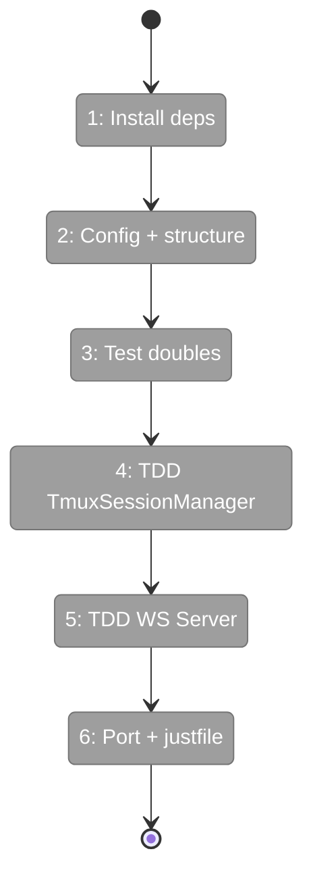
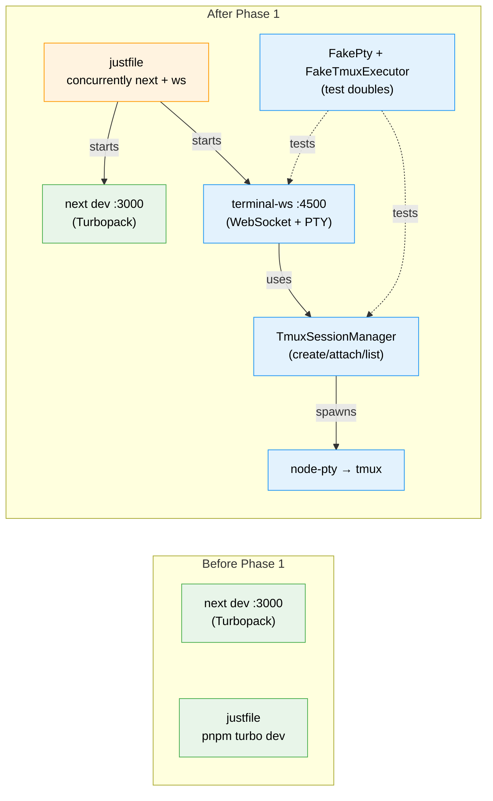

# Flight Plan: Phase 1 — Sidecar WebSocket Server + tmux Integration

**Plan**: [tmux-plan.md](../../tmux-plan.md)
**Phase**: Phase 1: Sidecar WebSocket Server + tmux Integration
**Generated**: 2026-03-02
**Status**: Ready for takeoff

---

## Departure → Destination

**Where we are**: No terminal infrastructure exists. The codebase has zero terminal, PTY, or WebSocket dependencies. tmux integration exists only in the CLI adapter (`CopilotCLIAdapter` with `sendKeys`). The justfile runs `pnpm turbo dev` which starts Next.js only.

**Where we're going**: A developer can run `just dev` and get both Next.js and a terminal WebSocket server started automatically. The WS server (port 4500) accepts WebSocket connections, spawns PTY processes attached to tmux sessions, and pipes I/O bidirectionally. If tmux isn't installed, it falls back to a raw shell. All backend logic is TDD-tested with fake objects (no mocks). Phase 2 can build the frontend against this server.

---

## Domain Context

### Domains We're Changing

| Domain | What Changes | Key Files |
|--------|-------------|-----------|
| terminal (NEW) | Create entire server-side infrastructure: TmuxSessionManager, WebSocket server, types, directory structure | `features/064-terminal/server/tmux-session-manager.ts`, `features/064-terminal/server/terminal-ws.ts`, `features/064-terminal/types.ts` |

### Domains We Depend On (no changes)

| Domain | What We Consume | Contract |
|--------|----------------|----------|
| _(none)_ | Phase 1 is standalone | — |

---

## Flight Status

<!-- Updated by /plan-6-v2: pending → active → done. Use blocked for problems/input needed. -->

**Legend**: grey = pending | yellow = active | red = blocked/needs input | green = done

---

## Stages

<!-- Updated by /plan-6-v2 during implementation: [ ] → [~] → [x] -->

- [ ] **Stage 1: Install dependencies** — Add xterm, node-pty, ws, concurrently to package.json files (`apps/web/package.json`, `package.json`)
- [ ] **Stage 2: Configure + scaffold** — Add node-pty to serverExternalPackages; create feature directory structure + types + barrel (`next.config.mjs`, `features/064-terminal/`)
- [ ] **Stage 3: Create test doubles** — FakeTmuxExecutor + FakePty with injectable interfaces (`test/fakes/` — new files)
- [ ] **Stage 4: TDD TmuxSessionManager** — RED: write tests for 6 scenarios, GREEN: implement manager (`tmux-session-manager.ts`, `tmux-session-manager.test.ts` — new files)
- [ ] **Stage 5: TDD WebSocket server** — RED: write tests for 7 scenarios, GREEN: implement server with session tracking + multi-client (`terminal-ws.ts`, `terminal-ws.test.ts` — new files)
- [ ] **Stage 6: Port derivation + justfile** — Wire port = NEXT_PORT + 1500, update justfile dev recipe (`terminal-ws.ts`, `justfile`)

---

## Architecture: Before & After

**Legend**: existing (green, unchanged) | changed (orange, modified) | new (blue, created)

---

## Acceptance Criteria

- [ ] `pnpm install` succeeds with all new dependencies including native `node-pty`
- [ ] `node -e "require('node-pty')"` succeeds in `apps/web/`
- [ ] TmuxSessionManager tests pass: tmux detection, session validation, list, create-or-attach, fallback
- [ ] WebSocket server tests pass: connect, I/O pipe, resize, disconnect cleanup, multi-client, tmux fallback
- [ ] `just dev` starts both Next.js and terminal WS server concurrently
- [ ] WS server listens on port 4500 (or TERMINAL_WS_PORT override)
- [ ] Next.js HMR still works with sidecar running alongside

## Goals & Non-Goals

**Goals**:
- ✅ TDD backend with 13+ test scenarios (6 for TmuxSessionManager, 7 for WS server)
- ✅ Injectable fakes (FakePty, FakeTmuxExecutor) — no mocks
- ✅ Sidecar WS server with session tracking + multi-client support
- ✅ Dev workflow: `just dev` starts everything

**Non-Goals**:
- ❌ Frontend UI components (Phase 2)
- ❌ Terminal page or overlay (Phases 3-4)
- ❌ Authentication on WebSocket
- ❌ Production deployment configuration

---

## Checklist

- [ ] T001: Install npm dependencies (xterm, node-pty, ws, concurrently)
- [ ] T002: Add node-pty to serverExternalPackages
- [ ] T003: Create feature directory structure + types + barrel
- [ ] T004: Create FakeTmuxExecutor + FakePty test doubles
- [ ] T005: TDD TmuxSessionManager (6 test scenarios)
- [ ] T006: TDD WebSocket server (7 test scenarios)
- [ ] T007: Wire port derivation (NEXT_PORT + 1500)
- [ ] T008: Update justfile dev recipe with concurrently
