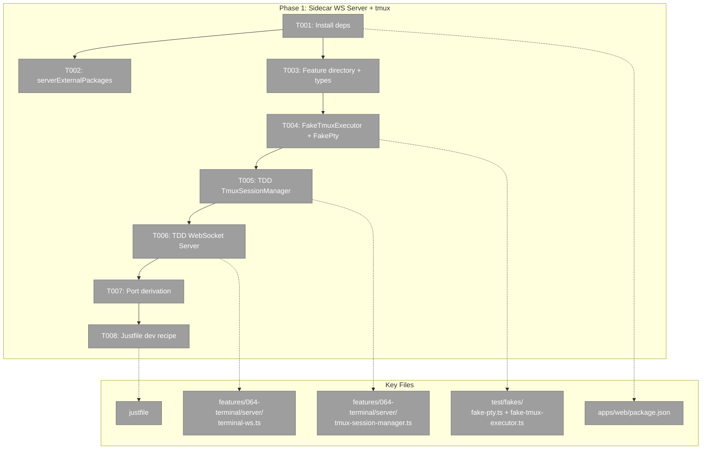
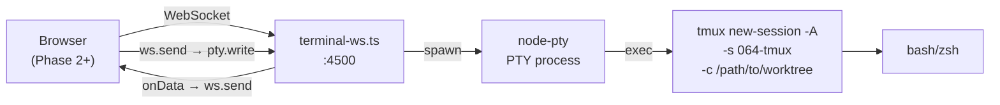
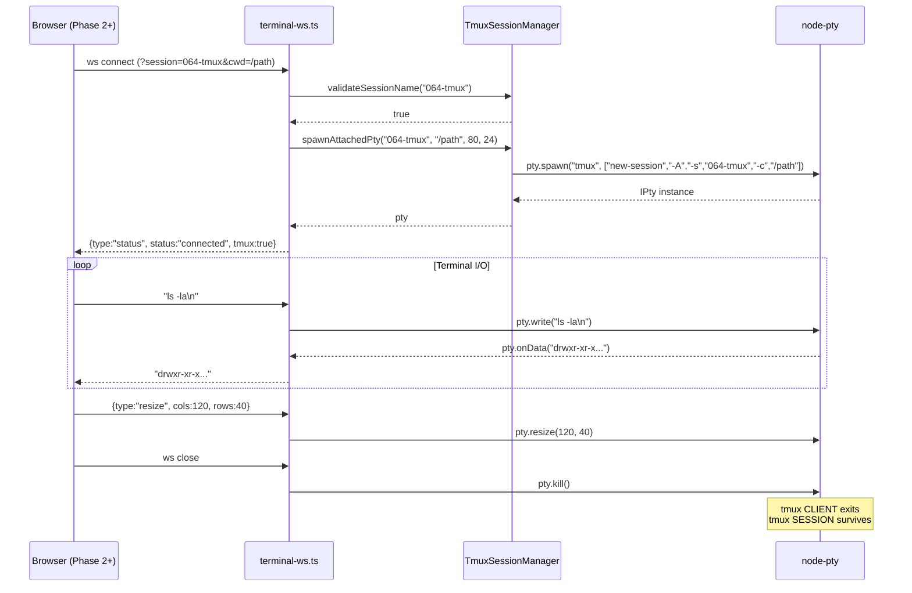

# Phase 1: Sidecar WebSocket Server + tmux Integration

## Executive Briefing

- **Purpose**: Build the backend terminal infrastructure — a standalone TypeScript WebSocket server that spawns PTY processes attached to tmux sessions, with session lifecycle management, multi-client support, and graceful cleanup. This is the foundation that all frontend phases depend on.
- **What We're Building**: A sidecar Node.js process (`terminal-ws.ts`) that runs alongside Next.js, listening on port `NEXT_PORT + 1500`. When a browser connects via WebSocket, the server spawns a PTY attached to a tmux session (create-or-attach atomically). PTY I/O is piped bidirectionally over WebSocket. On disconnect, the PTY is killed but the tmux session survives for later reconnection.
- **Goals**:
  - ✅ TmuxSessionManager with injectable executor functions (TDD)
  - ✅ WebSocket server with connection lifecycle, session tracking, multi-client (TDD)
  - ✅ FakePty + FakeTmuxExecutor test doubles
  - ✅ npm dependencies installed (node-pty, ws, xterm, concurrently)
  - ✅ Justfile `dev` recipe updated for sidecar startup
  - ✅ Feature directory structure + types + barrel export
- **Non-Goals**:
  - ❌ Frontend UI components (Phase 2)
  - ❌ Terminal page route or overlay panel (Phases 3-4)
  - ❌ Theme sync or keyboard shortcuts (Phase 5)
  - ❌ Authentication on WebSocket connections (non-goal per spec)

## Prior Phase Context

_(Phase 1 — no prior phases)_

## Pre-Implementation Check

| File | Exists? | Domain Check | Notes |
|------|---------|-------------|-------|
| `apps/web/package.json` | ✅ | Modify | Add terminal deps to dependencies + devDependencies |
| `package.json` (root) | ✅ | Modify | Add `concurrently` to devDependencies |
| `apps/web/next.config.mjs` | ✅ | Modify | Add `node-pty` to serverExternalPackages |
| `justfile` | ✅ | Modify | Update dev recipe |
| `apps/web/src/features/064-terminal/` | ❌ | Create | New feature directory |
| `apps/web/src/features/064-terminal/server/` | ❌ | Create | Sidecar server directory |
| `apps/web/src/features/064-terminal/types.ts` | ❌ | Create | Public types |
| `apps/web/src/features/064-terminal/index.ts` | ❌ | Create | Barrel export |
| `test/fakes/fake-pty.ts` | ❌ | Create | Fake node-pty |
| `test/fakes/fake-tmux-executor.ts` | ❌ | Create | Fake tmux CLI executor |
| `test/unit/web/features/064-terminal/` | ❌ | Create | Test directory |
| `test/fakes/` | ✅ | Existing | Contains 6 existing fakes — follow same patterns |

## Architecture Map



## Tasks

| Status | ID | Task | Domain | Path(s) | Done When | Notes |
|--------|-----|------|--------|---------|-----------|-------|
| [x] | T001 | **Install npm dependencies**: Add `@xterm/xterm`, `@xterm/addon-fit`, `@xterm/addon-canvas`, `@xterm/addon-web-links`, `node-pty`, `ws` to `apps/web/package.json`. Add `concurrently` + `tsx` to root `package.json` devDependencies. Run `pnpm install`. | terminal | `apps/web/package.json`, `package.json` (root) | `pnpm install` succeeds. `node -e "require('node-pty')"` succeeds in `apps/web/`. `pnpm ls @xterm/xterm` shows installed version. | Finding 02 (node-pty native). Finding 04 (concurrently missing). `node-pty` is a native C++ addon — requires Xcode CLT on macOS. If compilation fails, try `node-pty-prebuilt-multiarch`. |
| [x] | T002 | **Add node-pty to serverExternalPackages**: In `apps/web/next.config.mjs`, add `'node-pty'` to the existing `serverExternalPackages` array (alongside shiki packages). | terminal | `apps/web/next.config.mjs` | `pnpm build` succeeds (or at least doesn't fail due to node-pty bundling). `node-pty` appears in the array. | Finding 02. Defensive — node-pty only runs in sidecar, not Next.js process, but prevents future confusion if imported accidentally. |
| [x] | T003 | **Create feature directory structure + types + barrel**: Create `apps/web/src/features/064-terminal/` with subdirs `server/`, `components/`, `hooks/`, `params/`. Create `types.ts` with `TerminalSession`, `TerminalMessage`, `ConnectionStatus` types. Create `index.ts` barrel export. | terminal | `apps/web/src/features/064-terminal/types.ts`, `apps/web/src/features/064-terminal/index.ts` | Directory structure exists. `types.ts` exports: `TerminalSession { name, attached, windows, created, isCurrentWorktree }`, `TerminalMessage { type: 'data' \| 'resize' \| 'status', data?: string, cols?: number, rows?: number, status?: string, tmux?: boolean, message?: string }`, `ConnectionStatus = 'connecting' \| 'connected' \| 'disconnected'`. TypeScript compiles (`just typecheck`). | Types from workshop 001 + DR-03. |
| [x] | T004 | **Create FakeTmuxExecutor and FakePty test doubles**: `FakeTmuxExecutor` implements injectable `exec(command, args)` function — configurable responses for `tmux -V`, `tmux has-session`, `tmux list-sessions`. `FakePty` wraps an event-emitter implementing `onData`, `write`, `resize`, `kill` — tracks calls for assertions. Both in `test/fakes/`. Re-export from `test/fakes/index.ts`. | terminal | `test/fakes/fake-tmux-executor.ts`, `test/fakes/fake-pty.ts`, `test/fakes/index.ts` | Fakes instantiate without errors. `FakeTmuxExecutor` can be configured: `.whenCommand('tmux', ['-V']).returns('tmux 3.4')`, `.whenCommand('tmux', ['has-session', '-t', 'test']).throws(1)`. `FakePty` records `.writeCalls`, `.resizeCalls`, `.killed`. No `vi.mock()`. | Constitution P4 (Fakes Over Mocks). Follow existing `FakeEventSource` pattern in `test/fakes/`. |
| [x] | T005 | **TDD: TmuxSessionManager** — Create `tmux-session-manager.ts` with injectable executor function via constructor. Implement: `isTmuxAvailable(): boolean`, `validateSessionName(name): boolean`, `validateCwd(cwd, allowedBase): boolean`, `listSessions(): TmuxSession[]`, `hasSession(name): boolean`, `spawnAttachedPty(name, cwd, cols, rows): IPty` (create-or-attach), `getShellFallback(): string`. Write tests FIRST (RED), then implement (GREEN). | terminal | `apps/web/src/features/064-terminal/server/tmux-session-manager.ts`, `test/unit/web/features/064-terminal/tmux-session-manager.test.ts` | Tests pass for 6 scenarios: (1) tmux available returns true, (2) tmux unavailable returns false, (3) valid session names pass / invalid rejected, (4) CWD validated against base path / traversal blocked, (5) listSessions parses tmux output correctly, (6) spawnAttachedPty calls `pty.spawn('tmux', ['new-session', '-A', '-s', name, '-c', cwd])` with correct args. Session name regex: `/^[a-zA-Z0-9_-]+$/`. | DR-03 patterns. ADR-0004 (injectable constructor). Constitution P3 (TDD RED-GREEN-REFACTOR). |
| [x] | T006 | **TDD: Sidecar WebSocket server** — Create `terminal-ws.ts` with: WS server setup, connection handler (parse session/cwd from URL params), PTY spawn via TmuxSessionManager, bidirectional I/O piping (pty.onData → ws.send, ws.onmessage → pty.write), resize handling (JSON message `{type:'resize',cols,rows}` → pty.resize), session tracking (`Map<string, {pty, clients}>`), multi-client support (share PTY output), cleanup on WS close (kill PTY, remove from clients set, kill PTY only when last client disconnects), status messages (`{type:'status',status,tmux,message}`). Write tests FIRST. | terminal | `apps/web/src/features/064-terminal/server/terminal-ws.ts`, `test/unit/web/features/064-terminal/terminal-ws.test.ts` | Tests pass for 7 scenarios: (1) connect → spawns PTY with correct tmux args, (2) client sends data → pty.write called, (3) pty emits data → ws.send called, (4) resize message → pty.resize called, (5) disconnect → pty.kill called (tmux session survives), (6) second client same session → shares PTY output (multi-client), (7) tmux unavailable → spawns raw shell + sends status message `{tmux:false}`. Server exports a `createTerminalServer(options)` factory for testability. | DR-02 patterns. DR-03 finding 10 (cleanup). Constitution P3 (TDD). |
| [x] | T007 | **Wire port derivation**: Server reads `PORT` env var (defaults to 3000), derives WS port as `PORT + 1500`. Overridable via `TERMINAL_WS_PORT` env var. Log startup message: `Terminal WS server listening on ws://localhost:{port}/terminal`. Fail fast with clear error if port already in use (EADDRINUSE). | terminal | `apps/web/src/features/064-terminal/server/terminal-ws.ts` | Server starts on port 4500 when PORT=3000. Server starts on custom port when TERMINAL_WS_PORT set. Server logs port to stdout. Server exits with error message when port busy. | Clarification Q6. Finding 06 (port collision). |
| [x] | T008 | **Update justfile dev recipe**: Update the `dev` recipe to run Next.js and terminal WS server concurrently. Use `concurrently --names "next,terminal" --prefix-colors "blue,green"` with `next dev --turbopack` and `tsx watch apps/web/src/features/064-terminal/server/terminal-ws.ts`. Ensure existing `just dev` behavior preserved (Next.js still starts). Add `dev-terminal` recipe for WS server only. | terminal | `justfile` | `just dev` starts both processes. Next.js HMR works (test by editing a component). WS server auto-restarts on file change (test by editing terminal-ws.ts). `just dev-terminal` starts WS server only. | Finding 04 (concurrently). DR-02 finding 2 (justfile). |

## Context Brief

**Key findings from plan**:
- **Finding 02** (Critical): node-pty needs `serverExternalPackages` in next.config.mjs → T002 handles this
- **Finding 04** (High): `concurrently` not installed → T001 installs it + T008 wires it into justfile
- **Finding 06** (Medium): Port collision risk → T007 implements fail-fast + env var override

**Domain dependencies** (concepts and contracts this phase consumes):
- None — Phase 1 is standalone backend infrastructure with no domain imports

**Domain constraints**:
- `terminal` domain owns `features/064-terminal/server/` — all server code lives here
- Test fakes go in `test/fakes/` (project convention, not domain-specific)
- Tests go in `test/unit/web/features/064-terminal/` (mirrors source tree)
- No `vi.mock()` — injectable functions only (Constitution P4)
- TDD: write test FIRST, then implement (Constitution P3)

**Reusable from existing codebase**:
- `test/fakes/fake-event-source.ts` — pattern for FakePty (event emitter + assertion helpers)
- `test/fakes/fake-controller.ts` — pattern for configurable fake responses
- `packages/shared/src/adapters/copilot-cli.adapter.ts` — reference for tmux `send-keys` pattern (injectable executor)

**Deep research reference code**:
- DR-02: Sidecar WS server architecture, session tracking Map, concurrently justfile recipe
- DR-03: `tmux new-session -A -s NAME -c CWD` atomic pattern, `pty.spawn('tmux', [...args])` array pattern, session name validation regex, list-sessions format string, cleanup pattern (kill PTY, session survives)





## Discoveries & Learnings

_From DYK session 2026-03-02, pre-implementation._

| Date | Task | Type | Discovery | Resolution | References |
|------|------|------|-----------|------------|------------|
| 2026-03-02 | T006 | DYK-01 | **tmux window size war**: When overlay (480px, ~60 cols) and full-page terminal both attach to same tmux session, tmux uses smallest client dimensions — full page shrinks to 60 cols | Accept smallest-wins (standard tmux). When overlay closes, send `{type:'resync'}` to remaining clients → triggers `fitAddon.fit()` + `pty.resize()` → tmux snaps to surviving client's full dimensions. Same "jiggle" as resizing a desktop terminal window. | DR-03 finding 5 |
| 2026-03-02 | T006 | DYK-02 | **Sidecar isolation from Next.js**: terminal-ws.ts runs as standalone Node.js — no access to DI container, workspace service, logger, or any registered service. Cannot use IProcessManager from shared. | By design. Use plain child_process (injectable for tests). Client passes session name + CWD in WS query params; server validates directory exists. Console.log for logging. Keep sidecar dead simple. | Plan constitution P7 variance |
| 2026-03-02 | T006 | DYK-03 | **tsx watch kills connections on restart**: Every code change to terminal-ws.ts restarts sidecar, killing all WS connections + PTY processes. | Accept — tmux sessions survive, reconnection is instant. Add `process.on('SIGTERM', cleanup)` for graceful PTY cleanup. Reconnection flow is same as page refresh (double-duty testing). | T006 cleanup handler |
| 2026-03-02 | T006 | DYK-04 | **WS server must bind 0.0.0.0**: User accesses terminal from remote machines (laptop, phone). Do NOT restrict to 127.0.0.1. | Use `new WebSocketServer({ port, host: '0.0.0.0' })`. No auth for now (single-user dev tool, own network). | Spec non-goal: no auth |
| 2026-03-02 | T007 | DYK-05 | **Port formula `location.port + 1500` is sufficient**: Edge case where Next.js auto-increments port is unlikely since user sets PORT explicitly per worktree. No need for env var discovery or file-based port sharing. | Keep simple: sidecar reads PORT + 1500, client reads location.port + 1500. Same formula both sides. `TERMINAL_WS_PORT` env var available as safety valve but not primary mechanism. | Clarification Q6 |

---

```
docs/plans/064-tmux/
├── tmux-plan.md
├── tmux-spec.md
├── research-dossier.md
├── workshops/
│   └── 001-terminal-ui-main-and-popout.md
└── tasks/
    └── phase-1-sidecar-ws-server/
        ├── tasks.md              ← this file
        ├── tasks.fltplan.md      ← flight plan
        └── execution.log.md     # created by plan-6
```
