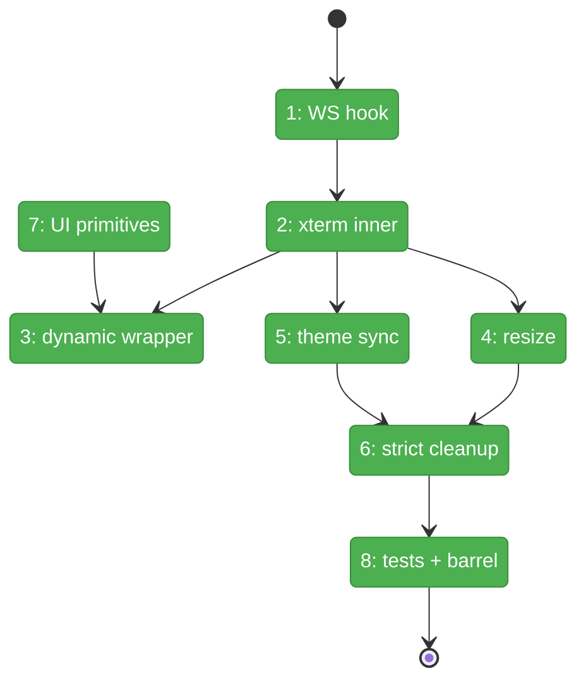
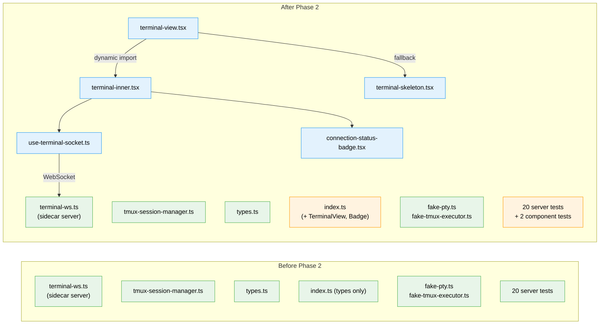

# Flight Plan: Phase 2 — TerminalView Component (xterm.js Frontend)

**Plan**: [tmux-plan.md](../../tmux-plan.md)
**Phase**: Phase 2: TerminalView Component (xterm.js Frontend)
**Generated**: 2026-03-02
**Status**: Landed

---

## Departure → Destination

**Where we are**: Phase 1 delivered a working sidecar WebSocket server that spawns PTY processes attached to tmux sessions, with 20 passing tests. The server listens on port NEXT_PORT + 1500, accepts WebSocket connections with session name and CWD params, and pipes bidirectional I/O. The `components/` and `hooks/` directories exist but are empty — no frontend terminal rendering yet.

**Where we're going**: A developer can import `<TerminalView sessionName="064-tmux" cwd="/path" />` and get a fully working terminal emulator in the browser — xterm.js with Canvas renderer, auto-connected to the sidecar WS server, auto-fitting to container, synced with app theme, and cleanly disposing on unmount. The component is ready for composition into the terminal page (Phase 3) and overlay panel (Phase 4).

---

## Domain Context

### Domains We're Changing

| Domain | What Changes | Key Files |
|--------|-------------|-----------|
| terminal | Add 5 new component files + 1 hook + update barrel export | `components/terminal-view.tsx`, `components/terminal-inner.tsx`, `components/terminal-skeleton.tsx`, `components/connection-status-badge.tsx`, `hooks/use-terminal-socket.ts`, `index.ts` |

### Domains We Depend On (no changes)

| Domain | What We Consume | Contract |
|--------|----------------|----------|
| terminal (self, Phase 1) | WS protocol types | `TerminalMessage`, `ConnectionStatus` from `types.ts` |
| _platform/events | UI primitives | `Skeleton` from `components/ui/skeleton.tsx` |
| next-themes (npm) | Theme detection | `useTheme()` → `resolvedTheme` |
| @xterm/* (npm) | Terminal emulator | `Terminal`, `FitAddon`, `CanvasAddon`, `WebLinksAddon` |

---

## Flight Status

<!-- Updated by /plan-6-v2: pending → active → done. Use blocked for problems/input needed. -->

**Legend**: grey = pending | yellow = active | red = blocked/needs input | green = done

---

## Stages

<!-- Updated by /plan-6-v2 during implementation: [ ] → [~] → [x] -->

- [x] **Stage 1: WebSocket hook** — Create `use-terminal-socket.ts` with connect/reconnect/status lifecycle (`use-terminal-socket.ts` — new file)
- [x] **Stage 2: xterm.js inner component** — Create `terminal-inner.tsx` with Terminal + FitAddon + CanvasAddon + WS wiring (`terminal-inner.tsx` — new file)
- [x] **Stage 3: Dynamic import wrapper** — Create `terminal-view.tsx` with `next/dynamic` ssr:false + Suspense (`terminal-view.tsx` — new file)
- [x] **Stage 4: Resize integration** — ResizeObserver + FitAddon.fit() + resize message (built into terminal-inner.tsx)
- [x] **Stage 5: Theme sync** — next-themes integration with dark/light terminal themes (built into terminal-inner.tsx)
- [x] **Stage 6: Strict mode cleanup** — Comprehensive cleanup with disposed flag (built into terminal-inner.tsx)
- [x] **Stage 7: UI primitives** — Create ConnectionStatusBadge + TerminalSkeleton (`connection-status-badge.tsx`, `terminal-skeleton.tsx` — new files)
- [x] **Stage 8: Tests + barrel** — Lightweight render tests + update index.ts exports (`terminal-view.test.tsx`, `connection-status-badge.test.tsx`, `index.ts`)

---

## Architecture: Before & After

**Legend**: existing (green, unchanged) | changed (orange, modified) | new (blue, created)

---

## Acceptance Criteria

- [ ] `TerminalView` renders in browser without SSR errors
- [ ] User types in terminal → appears as input → server output displays with ANSI colors
- [ ] Resizing container re-fits terminal; server receives resize message
- [ ] Terminal theme matches app dark/light mode; switches live on toggle
- [ ] No console warnings in React 19 strict mode dev; no memory leaks on mount/unmount
- [ ] ConnectionStatusBadge shows correct states (connecting/connected/disconnected)
- [ ] TerminalSkeleton renders as loading placeholder
- [ ] All existing 20 tests still pass; 2+ new tests pass

## Goals & Non-Goals

**Goals**:
- Reusable `TerminalView` component for Phase 3 (page) and Phase 4 (overlay)
- Clean WebSocket lifecycle with reconnection
- Theme-aware terminal rendering
- Strict mode safe (no leaks)

**Non-Goals**:
- Session list, session switching (Phase 3)
- Overlay panel, keybindings (Phase 4)
- Authentication (future)
- Multi-tab shared PTY coordination (tmux handles this natively)

---

## Checklist

- [x] T001: `use-terminal-socket.ts` — WS lifecycle hook with reconnect
- [x] T002: `terminal-inner.tsx` — xterm.js + FitAddon + Canvas + WS wiring
- [x] T003: `terminal-view.tsx` — dynamic import wrapper (ssr: false)
- [x] T004: ResizeObserver + FitAddon integration
- [x] T005: Theme sync with next-themes
- [x] T006: React 19 strict mode cleanup
- [x] T007: ConnectionStatusBadge + TerminalSkeleton
- [x] T008: Lightweight tests + barrel update
