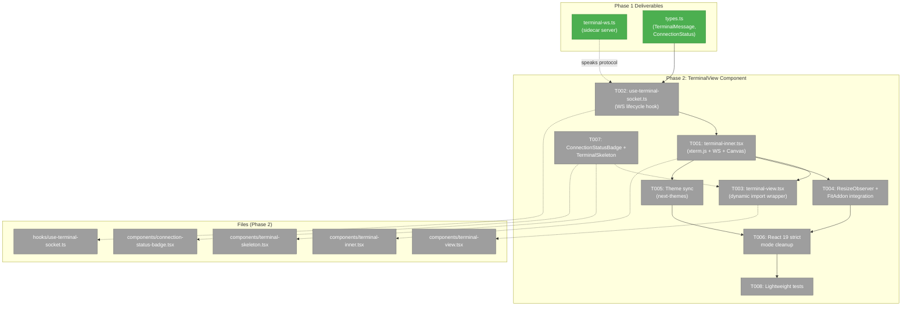
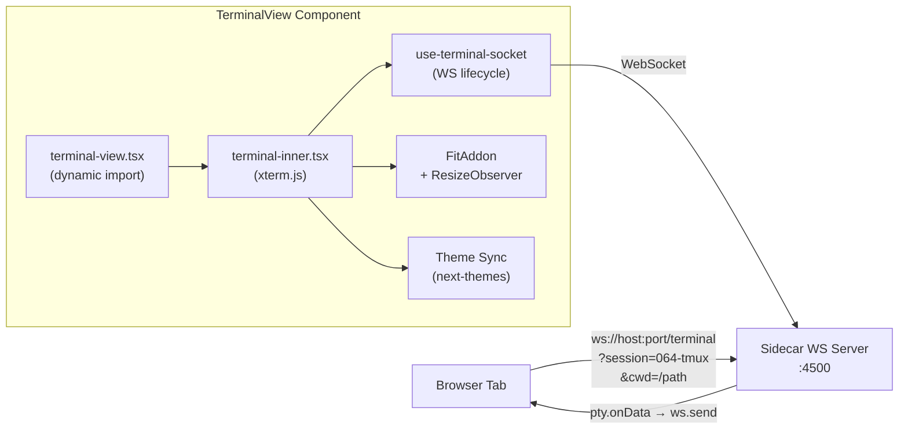
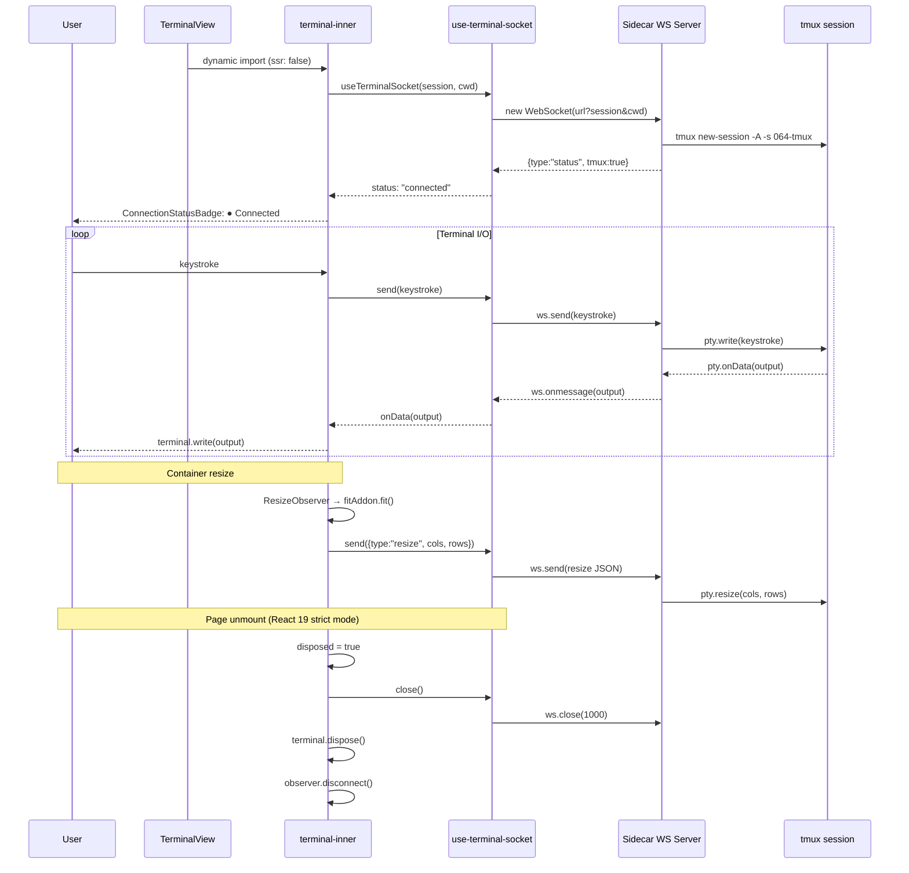

# Phase 2: TerminalView Component (xterm.js Frontend)

## Executive Briefing

- **Purpose**: Build the core terminal emulator React component — an xterm.js wrapper with WebSocket connection to the Phase 1 sidecar server, container-aware resize handling, dark/light theme sync, and proper React 19 strict mode cleanup. This is the reusable building block consumed by both the terminal page (Phase 3) and the overlay panel (Phase 4).
- **What We're Building**: A `TerminalView` component dynamically imported with `ssr: false` that renders an xterm.js terminal in a browser container, connects to the sidecar WS server via `use-terminal-socket` hook, auto-fits to container via ResizeObserver + FitAddon, syncs theme with `next-themes`, and cleanly disposes all resources on unmount (critical for React 19 strict mode double-mount).
- **Goals**:
  - ✅ `TerminalView` dynamic import wrapper (ssr: false) with Suspense fallback
  - ✅ `terminal-inner.tsx` with xterm.js Terminal + FitAddon + Canvas renderer + WebSocket I/O
  - ✅ `use-terminal-socket.ts` hook for WebSocket lifecycle (connect/disconnect/reconnect/status)
  - ✅ ResizeObserver + FitAddon integration sending resize messages to server
  - ✅ Theme sync with `next-themes` (dark/light xterm themes)
  - ✅ React 19 strict mode cleanup (dispose terminal, close WS, disconnect observer)
  - ✅ `ConnectionStatusBadge` and `TerminalSkeleton` UI primitives
  - ✅ Lightweight component render tests
- **Non-Goals**:
  - ❌ Terminal page route or PanelShell composition (Phase 3)
  - ❌ Session list or session switching (Phase 3)
  - ❌ Overlay panel or keybinding (Phase 4)
  - ❌ Authentication on WebSocket connections (future, Workshop 002)
  - ❌ tmux fallback toast (Phase 5)

## Prior Phase Context

### Phase 1: Sidecar WebSocket Server + tmux Integration

**A. Deliverables**:
- `/Users/jordanknight/substrate/064-tmux/apps/web/src/features/064-terminal/server/terminal-ws.ts` — Sidecar WS server factory (`createTerminalServer()`)
- `/Users/jordanknight/substrate/064-tmux/apps/web/src/features/064-terminal/server/tmux-session-manager.ts` — `TmuxSessionManager` class with 7 public methods
- `/Users/jordanknight/substrate/064-tmux/apps/web/src/features/064-terminal/types.ts` — `TerminalSession`, `TerminalMessage`, `ConnectionStatus`, `PtySpawner`, `PtyProcess`, `CommandExecutor`
- `/Users/jordanknight/substrate/064-tmux/apps/web/src/features/064-terminal/index.ts` — Barrel re-exporting all types
- `/Users/jordanknight/substrate/064-tmux/test/fakes/fake-pty.ts` — FakePty (records calls, simulates data/exit)
- `/Users/jordanknight/substrate/064-tmux/test/fakes/fake-tmux-executor.ts` — FakeTmuxExecutor (configurable responses)
- npm deps installed: `@xterm/xterm@6.0.0`, `@xterm/addon-fit`, `@xterm/addon-canvas`, `@xterm/addon-web-links`, `ws`, `node-pty`, `concurrently`, `tsx`
- `justfile` updated: `just dev` runs Next.js + sidecar concurrently

**B. Dependencies Exported**:
- `TerminalMessage` type — discriminated union for WS protocol: `data | resize | status | resync | sessions`
- `ConnectionStatus` type — `'connecting' | 'connected' | 'disconnected'`
- WS server protocol: connect via `ws://host:port/terminal?session=NAME&cwd=PATH`, raw strings for data, JSON for control messages (`resize`, `resync`)
- Port derivation: `WS_PORT = NEXT_PORT + 1500` (client uses `location.port + 1500`)

**C. Gotchas & Debt**:
- **tmux window size war (DYK-01)**: Multiple clients on same session → tmux uses smallest dimensions. Send `resync` message when overlay closes to trigger `fitAddon.fit()`.
- **tsx watch kills connections (DYK-03)**: Server restarts drop all WS connections. Reconnection logic must handle this gracefully.
- **WS binds 0.0.0.0 (DYK-04)**: Server accessible from remote machines — no auth yet.
- **@xterm/addon-canvas peer warning**: Wants `@xterm/xterm@^5.0.0` but we have 6.0.0. Works fine.

**D. Incomplete Items**: None — all 8 tasks complete. Review fixes applied (FT-001 CWD validation, FT-002 spawn failure guard).

**E. Patterns to Follow**:
- Injectable function interfaces for all dependencies (Constitution P4)
- FakePty/FakeTmuxExecutor pattern for test doubles
- `createTerminalServer(deps)` factory pattern
- WS protocol: raw strings for terminal I/O, JSON for control messages
- CWD validation via `path.relative()` + `path.isAbsolute()` (boundary-safe)

## Pre-Implementation Check

| File | Exists? | Domain Check | Notes |
|------|---------|-------------|-------|
| `apps/web/src/features/064-terminal/components/terminal-view.tsx` | ❌ | Create | Contract: dynamic import wrapper |
| `apps/web/src/features/064-terminal/components/terminal-inner.tsx` | ❌ | Create | Internal: xterm.js + WS + FitAddon |
| `apps/web/src/features/064-terminal/components/terminal-skeleton.tsx` | ❌ | Create | Internal: loading placeholder |
| `apps/web/src/features/064-terminal/components/connection-status-badge.tsx` | ❌ | Create | Internal: status indicator |
| `apps/web/src/features/064-terminal/hooks/use-terminal-socket.ts` | ❌ | Create | Internal: WS lifecycle hook |
| `apps/web/src/features/064-terminal/index.ts` | ✅ | Modify | Add TerminalView + ConnectionStatusBadge exports |
| `test/unit/web/features/064-terminal/terminal-view.test.tsx` | ❌ | Create | Lightweight render test |
| `test/unit/web/features/064-terminal/connection-status-badge.test.tsx` | ❌ | Create | Lightweight state tests |
| `apps/web/node_modules/@xterm/xterm/css/xterm.css` | ✅ | — | CSS file confirmed present |

**Concept search results**: No existing terminal emulator or WebSocket hook in codebase. `useSSE` hook (`apps/web/src/hooks/useSSE.ts`) provides structural patterns to follow (ref-based transport, reconnect timer, cleanup). No duplication risk.

## Architecture Map



## Tasks

| Status | ID | Task | Domain | Path(s) | Done When | Notes |
|--------|-----|------|--------|---------|-----------|-------|
| [x] | T001 | **Create `use-terminal-socket.ts` hook**: WebSocket lifecycle — connect to sidecar server, handle reconnection with backoff, track `ConnectionStatus`, expose `send()` / `close()` / `status`. Use ref-based transport pattern (from `useSSE`). Accept `sessionName`, `cwd`, `enabled` props. Reconnect on unexpected close (code !== 1000) with exponential backoff (1s, 2s, 4s, max 8s, 5 attempts). Parse incoming JSON control messages (`status`, `error`, `sessions`) vs raw terminal data. | terminal | `apps/web/src/features/064-terminal/hooks/use-terminal-socket.ts` | Hook connects to `ws://host:(location.port+1500)/terminal?session=NAME&cwd=CWD`. Status transitions: connecting → connected → disconnected. Reconnects on unexpected close. Cleans up on unmount (no stale timers). | Follow `useSSE` ref pattern + `useWorkspaceSSE` callback-ref pattern. DR-02 client patterns. DYK-03 (tsx restart → reconnect). |
| [x] | T002 | **Create `terminal-inner.tsx`**: xterm.js Terminal + FitAddon + CanvasAddon + WebLinksAddon. Wire to `use-terminal-socket`: `terminal.onData` → `send()`, incoming data → `terminal.write()`. Import `@xterm/xterm/css/xterm.css`. Mount terminal in container div ref. Accept props: `sessionName`, `cwd`, `className`, `onConnectionChange`. | terminal | `apps/web/src/features/064-terminal/components/terminal-inner.tsx` | Terminal renders in browser. User types → appears as input. Server output displays with ANSI colors. Canvas renderer active (not WebGL). | DR-01 patterns. `'use client'` directive. PL-08: register onMessage BEFORE connecting. |
| [x] | T003 | **Create `terminal-view.tsx`**: `next/dynamic` wrapper with `ssr: false`. Import `terminal-inner` dynamically. Wrap in `Suspense` with `TerminalSkeleton` fallback. Pass through all props. Export as the public contract component. | terminal | `apps/web/src/features/064-terminal/components/terminal-view.tsx` | `TerminalView` renders skeleton during load, terminal after. No SSR errors in `next build`. | DR-01 finding 2. Code-editor pattern (`ReactCodeMirror` dynamic import). |
| [x] | T004 | **Implement ResizeObserver + FitAddon integration**: Observe container div. On resize, `requestAnimationFrame` → `fitAddon.fit()` → read `fitAddon.proposeDimensions()` → send `{type:'resize', cols, rows}` to server via WS. Debounce to avoid resize storms. | terminal | `apps/web/src/features/064-terminal/components/terminal-inner.tsx` | Resizing container re-fits terminal. Server receives resize message. tmux session reflects new dimensions. No layout thrashing. | DR-01 finding 6. DYK-01 (size war — fitAddon.fit() after overlay closes). |
| [x] | T005 | **Implement theme sync with `next-themes`**: Read `resolvedTheme` from `useTheme()`. Map dark → dark terminal colors, light → light terminal colors. Update `terminal.options.theme` when theme changes. Handle `mounted` guard to prevent SSR flash. | terminal | `apps/web/src/features/064-terminal/components/terminal-inner.tsx` | Terminal background matches app theme. Switching theme toggle → terminal colors update live. | DR-01 finding 7. Follow `theme-toggle.tsx` pattern. |
| [x] | T006 | **Implement React 19 strict mode cleanup**: In `useEffect` cleanup: set `disposed` flag, call `terminal.dispose()`, close WS via hook, disconnect ResizeObserver, clear any pending `requestAnimationFrame` / timers. Prevent writes after dispose. | terminal | `apps/web/src/features/064-terminal/components/terminal-inner.tsx` | No console warnings in dev mode. No memory leaks on mount/unmount cycle. Strict mode double-mount works cleanly. | DR-01 finding 3. Critical for React 19 dev mode. |
| [x] | T007 | **Create `connection-status-badge.tsx` and `terminal-skeleton.tsx`**: Badge shows colored dot + text for connecting (yellow, pulsing) / connected (green) / disconnected (gray). Skeleton matches terminal dimensions with animated pulse. Use existing `Skeleton` component from `components/ui/skeleton.tsx`. | terminal | `apps/web/src/features/064-terminal/components/connection-status-badge.tsx`, `apps/web/src/features/064-terminal/components/terminal-skeleton.tsx` | Badge renders 3 states with correct colors. Skeleton fills container with pulse animation. | Existing `Skeleton` and `StatusBadge` patterns. |
| [x] | T008 | **Lightweight tests + barrel update**: (a) Test `TerminalView` renders without SSR crash (jsdom). (b) Test `ConnectionStatusBadge` renders 3 states correctly. (c) Update `index.ts` barrel to export `TerminalView`, `ConnectionStatusBadge`, and `ConnectionStatus` type. | terminal | `test/unit/web/features/064-terminal/terminal-view.test.tsx`, `test/unit/web/features/064-terminal/connection-status-badge.test.tsx`, `apps/web/src/features/064-terminal/index.ts` | Tests pass in jsdom. `import { TerminalView, ConnectionStatusBadge } from '@/features/064-terminal'` resolves. | Constitution P3 variance: lightweight tests for UI components (hybrid approach per spec Q2). |

## Context Brief

**Key findings from plan**:
- **DR-01** (xterm.js + React 19): Custom hook over wrapper libs. `next/dynamic` with `ssr: false`. Canvas renderer for multi-instance. React 19 strict mode requires comprehensive cleanup. `requestAnimationFrame` for resize batching. `resolvedTheme` for theme mapping.
- **DR-02** (WebSocket architecture): Client connects via `ws://host:port/terminal?session=NAME&cwd=PATH`. Raw strings for terminal I/O, JSON for control messages. Port = `location.port + 1500`.
- **Finding 05** (High): xterm.js strict mode double-mount leaks — comprehensive cleanup required with disposed flag pattern.

**Domain dependencies** (concepts and contracts this phase consumes):
- `terminal` (own domain): `TerminalMessage`, `ConnectionStatus` types from `types.ts` — WS message protocol
- `_platform/events` (consume): `Skeleton` component from `components/ui/skeleton.tsx` — loading state primitive
- `next-themes` (npm): `useTheme()` → `resolvedTheme` — theme detection for xterm.js colors
- `@xterm/xterm` (npm): `Terminal`, `ITheme` — core terminal emulator
- `@xterm/addon-fit` (npm): `FitAddon` — auto-resize to container
- `@xterm/addon-canvas` (npm): `CanvasAddon` — Canvas renderer (safe for multi-instance)
- `@xterm/addon-web-links` (npm): `WebLinksAddon` — clickable URLs in terminal output

**Domain constraints**:
- All new files go under `apps/web/src/features/064-terminal/` (components/ and hooks/)
- `TerminalView` and `ConnectionStatusBadge` are public contracts (exported via barrel)
- `terminal-inner.tsx` and `use-terminal-socket.ts` are internal (not exported)
- No `vi.mock()` — use injectable factories where testable behavior needed
- Lightweight testing for UI components (hybrid approach per spec clarification Q2)

**Reusable from Phase 1**:
- `TerminalMessage` type — WS protocol messages (already defined)
- `ConnectionStatus` type — connection state enum (already defined)
- WS server protocol knowledge — connect URL, message format, control messages
- FakePty / FakeTmuxExecutor patterns (for future test extensions)

**Reusable from existing codebase**:
- `useSSE` hook structure — ref-based transport, reconnect timer, cleanup discipline
- `useWorkspaceSSE` — callback-ref pattern for stable handler references
- `Skeleton` component — UI loading primitive
- `StatusBadge` / `AgentStatusIndicator` — status display patterns
- `ReactCodeMirror` dynamic import — `next/dynamic` with `ssr: false` + loading fallback
- `theme-toggle.tsx` — `useTheme()` + `resolvedTheme` pattern





## Discoveries & Learnings

_From DYK session 2026-03-02, pre-implementation._

| Date | Task | Type | Discovery | Resolution | References |
|------|------|------|-----------|------------|------------|
| 2026-03-02 | T001 | DYK-01 | **Reconnection limit vs long-running sessions**: 5 attempts with backoff (23s total) could leave user permanently disconnected if server down longer. | Accept 5-attempt limit — sidecar downtime is only tsx watch restarts (~2-3s). Add "Reconnect" button to badge for manual retry when all attempts exhaust. Show "Reconnecting…" during attempts. | User confirmed: sidecar down = host down (Next.js also gone). Only tsx watch restart is transient. |
| 2026-03-02 | T001 | DYK-02 | **WS protocol message ambiguity**: Server sends raw PTY output AND JSON control messages on same channel. Terminal output that happens to be valid JSON with a known `type` field could be misinterpreted as a control message. | Whitelist known control types (`status`, `error`, `sessions`) in the hook's message parser. Any message that parses as JSON but doesn't match a known control type → treat as raw terminal data. Simple 2-line guard. | Server sends: `ws.send(data)` for raw PTY, `ws.send(JSON.stringify({type:'status',...}))` for control. |
| 2026-03-02 | T006 | DYK-03 | **Strict mode cleanup order matters**: If `terminal.dispose()` runs before `observer.disconnect()`, ResizeObserver fires during DOM removal → fitAddon.fit() throws on disposed terminal. | Enforce cleanup order: (1) set disposed flag, (2) observer.disconnect(), (3) cancel rAF, (4) ws.close(), (5) terminal.dispose() last. | React 19 strict mode: mount → unmount → remount. DR-01 finding 3. |
| 2026-03-02 | T008 | DYK-04 | **jsdom can't render xterm.js**: Terminal constructor requires Canvas API. `next/dynamic` with `ssr: false` won't resolve in jsdom. Tests only verify Suspense fallback (TerminalSkeleton) renders, not actual terminal. | Accept — matches hybrid testing strategy (TDD backend, visual verification frontend). ConnectionStatusBadge tests are fully functional. Real terminal verification is manual via `just dev`. | Spec Q2: lightweight frontend tests. |
| 2026-03-02 | T005 | DYK-05 | **xterm.js v6 theme requires new object reference**: Setting `terminal.options.theme` with same object reference is a no-op. Must swap between two distinct const theme objects (DARK_THEME, LIGHT_THEME) for live theme switching to work. | Define two const `ITheme` objects. In useEffect watching `resolvedTheme`, assign the correct reference. Different references guarantee the theme re-renders. | xterm.js v6 uses reference comparison for theme updates. |

---

```
docs/plans/064-tmux/
├── tmux-plan.md
├── tmux-spec.md
├── research-dossier.md
├── workshops/
│   ├── 001-terminal-ui-main-and-popout.md
│   └── 002-terminal-ws-authentication.md
└── tasks/
    ├── phase-1-sidecar-ws-server/
    │   ├── tasks.md
    │   ├── tasks.fltplan.md
    │   └── execution.log.md
    └── phase-2-terminal-view-component/
        ├── tasks.md              ← this file
        ├── tasks.fltplan.md      ← flight plan
        └── execution.log.md     # created by plan-6
```
