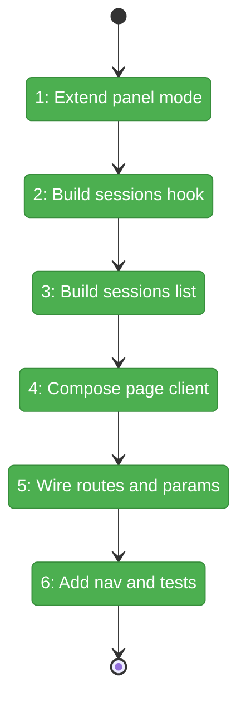

# Flight Plan: Phase 3 — Terminal Page (Surface 1)

**Plan**: [tmux-plan.md](../../tmux-plan.md)
**Phase**: Phase 3: Terminal Page (Surface 1)
**Generated**: 2026-03-02
**Status**: Landed

---

## Departure → Destination

**Where we are**: Phase 1 delivered the sidecar tmux/WS backend and Phase 2 delivered the reusable `TerminalView` frontend core, but there is not yet a dedicated terminal workspace page, session list surface, or sidebar entry for terminal access.

**Where we're going**: This phase delivers `/workspaces/[slug]/terminal` as a complete page surface with a sessions left panel, live terminal main panel, URL-backed session selection, and workspace navigation entry. A developer can open the Terminal page from workspace tools, see/select tmux sessions, and work inside the selected terminal session.

---

## Domain Context

### Domains We're Changing

| Domain | What Changes | Key Files |
|--------|-------------|-----------|
| terminal | Add Surface 1 page composition, session hook/list, route wiring, and session params contract | `apps/web/src/features/064-terminal/hooks/use-terminal-sessions.ts`, `apps/web/src/features/064-terminal/components/terminal-session-list.tsx`, `apps/web/src/features/064-terminal/components/terminal-page-client.tsx`, `apps/web/app/(dashboard)/workspaces/[slug]/terminal/page.tsx` |
| _platform/panel-layout | Extend mode contract for terminal sessions panel mode | `apps/web/src/features/_platform/panel-layout/types.ts` |
| shared navigation | Add terminal tool navigation entry in workspace context | `apps/web/src/lib/navigation-utils.ts` |

### Domains We Depend On (no changes)

| Domain | What We Consume | Contract |
|--------|----------------|----------|
| _platform/workspace-url | Workspace URL/search-param conventions for route state | `workspaceParams`, nuqs cache pattern |
| terminal (Phase 1/2 assets) | Sidecar session protocol + terminal renderer | `TerminalView`, `ConnectionStatusBadge`, WS session semantics |

---

## Flight Status

<!-- Updated by /plan-6 during implementation: pending → active → done. Use blocked for problems/input needed. -->



**Legend**: grey = pending | yellow = active | red = blocked/needs input | green = done

---

## Stages

<!-- Updated by /plan-6 during implementation: [ ] → [~] → [x] -->

- [x] **Stage 1: Extend panel mode contract** — Add `sessions` mode support to panel layout types so terminal page can register a sessions left-panel mode (`apps/web/src/features/_platform/panel-layout/types.ts`)
- [x] **Stage 2: Build terminal sessions data hook**
- [x] **Stage 3: Build sessions and header UI blocks**
- [x] **Stage 4: Compose Terminal page client**
- [~] **Stage 5: Wire routes and URL params** — Add route files and nuqs session param contract for `/workspaces/[slug]/terminal` (`apps/web/app/(dashboard)/workspaces/[slug]/terminal/page.tsx`, `apps/web/app/(dashboard)/workspaces/[slug]/terminal/layout.tsx`, `apps/web/src/features/064-terminal/params/terminal.params.ts` — new files)
- [ ] **Stage 6: Add navigation entry and lightweight validation** — Add Terminal to workspace nav and verify session list rendering in tests (`apps/web/src/lib/navigation-utils.ts`, `test/unit/web/features/064-terminal/terminal-session-list.test.tsx` — new test file)

---

## Architecture: Before & After

```mermaid
flowchart LR
    classDef existing fill:#E8F5E9,stroke:#4CAF50,color:#000
    classDef changed fill:#FFF3E0,stroke:#FF9800,color:#000
    classDef new fill:#E3F2FD,stroke:#2196F3,color:#000

    subgraph Before["Before Phase 3"]
        B1[Workspace tools nav<br/>no Terminal item]:::existing
        B2[PanelShell modes<br/>tree + changes]:::existing
        B3[TerminalView core<br/>ready]:::existing
        B4[Sidecar WS + tmux<br/>ready]:::existing
        B3 --> B4
    end

    subgraph After["After Phase 3"]
        A1[Workspace tools nav<br/>includes Terminal]:::changed
        A2[PanelShell modes<br/>tree + changes + sessions]:::changed
        A3[Terminal route<br/>/workspaces/[slug]/terminal]:::new
        A4[TerminalPageClient]:::new
        A5[use-terminal-sessions]:::new
        A6[TerminalSessionList]:::new
        A7[TerminalView core]:::existing
        A8[Sidecar WS + tmux]:::existing

        A1 --> A3
        A3 --> A4
        A4 --> A2
        A4 --> A6
        A6 --> A5
        A4 --> A7
        A7 --> A8
    end
```

**Legend**: existing (green, unchanged) | changed (orange, modified) | new (blue, created)

---

## Acceptance Criteria

- [ ] AC-01: Navigating to terminal page renders the terminal surface and reuses session attach behavior.
- [ ] AC-07: Left panel resize causes terminal re-fit flow through composed page surface.
- [ ] AC-08: Left panel can shrink to 150px without layout breakage.
- [ ] AC-09: Session list shows available tmux sessions with status indicators.
- [ ] AC-10: Selecting a session switches active terminal session.
- [ ] AC-12: Terminal appears in workspace Tools navigation context.

## Goals & Non-Goals

**Goals**:
- Deliver terminal workspace page composition using existing terminal core.
- Add session list management and URL-backed session selection.
- Make terminal discoverable from workspace navigation.

**Non-Goals**:
- Overlay terminal behavior and keyboard toggles (Phase 4).
- tmux fallback UX polish and docs completion (Phase 5).
- Sidecar transport/auth architecture changes.

---

## Checklist

- [x] T001: Extend panel layout mode contract to include `sessions` (CS-1)
- [x] T002: Create `use-terminal-sessions.ts` hook for list/select/create state (CS-3)
- [x] T003: Create `terminal-session-list.tsx` with status/highlight/select UX (CS-2)
- [x] T004: Create `terminal-page-header.tsx` using connection status indicators (CS-1)
- [x] T005: Create `terminal-page-client.tsx` with PanelShell composition (CS-3)
- [x] T006: Add terminal route layout/page files and connect props (CS-1)
- [x] T007: Create `terminal.params.ts` for `session` nuqs query state (CS-1)
- [x] T008: Add Terminal to `WORKSPACE_NAV_ITEMS` (CS-1)
- [x] T009: Add `terminal-session-list` lightweight unit tests (CS-2)

---

## PlanPak

Not active for this plan.
