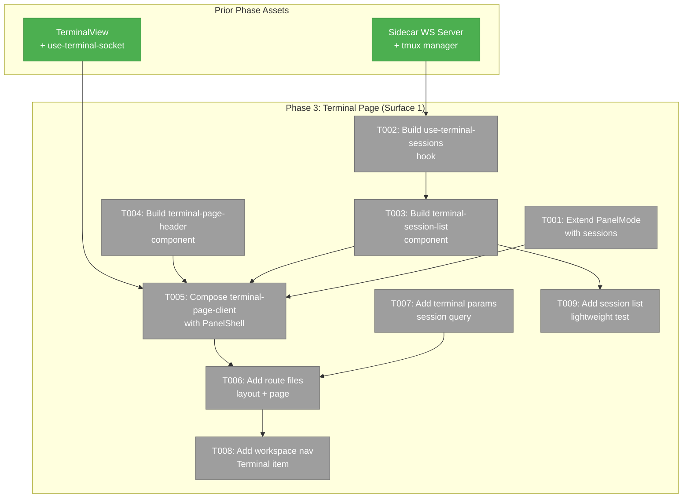
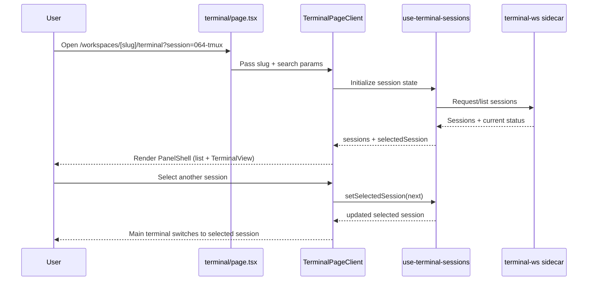

# Phase 3: Terminal Page (Surface 1)

## Executive Briefing

- **Purpose**: Build the first end-user terminal surface: a workspace terminal page that combines session navigation (left panel) and live terminal interaction (main panel). This phase turns the Phase 2 terminal core into a routable, daily-usable workspace tool.
- **What We're Building**: A `/workspaces/[slug]/terminal` page composed with `PanelShell`, a new sessions panel mode, session list + selection flow, and URL-backed `session` state via nuqs.
- **User Value**: A developer can open the Terminal page from workspace navigation, see available tmux sessions, switch between them, and keep terminal state linked to URL context.
- **Example**: A developer opens `/workspaces/my-ws/terminal?session=064-tmux`, sees `064-tmux` selected in the left panel, and the main terminal immediately attaches to that session.

### Goals

- ✅ Add `'sessions'` support to panel layout mode contracts.
- ✅ Introduce terminal session fetching + selection hook for Surface 1.
- ✅ Build terminal session list and page header components.
- ✅ Compose a dedicated terminal page client with `PanelShell`, `LeftPanel`, and `MainPanel`.
- ✅ Add terminal route files and URL param contract (`session`).
- ✅ Add Terminal nav item in workspace tools navigation.
- ✅ Add lightweight jsdom coverage for session list rendering.

### Non-Goals

- ❌ Terminal overlay panel and keyboard toggle (`Ctrl+\``) (Phase 4).
- ❌ tmux fallback toast/polish/docs closure work (Phase 5).
- ❌ WebSocket auth/multi-user access controls (future workshop scope).
- ❌ Changes to sidecar server protocol beyond page-consumer usage.

## Prior Phase Context

### Phase 1: Sidecar WebSocket Server + tmux Integration

**A. Deliverables**
- `/Users/jordanknight/substrate/064-tmux/apps/web/src/features/064-terminal/server/tmux-session-manager.ts` created with tmux detection/validation/create-or-attach/list behavior.
- `/Users/jordanknight/substrate/064-tmux/apps/web/src/features/064-terminal/server/terminal-ws.ts` created with WS lifecycle, PTY spawn, resize handling, and cleanup.
- `/Users/jordanknight/substrate/064-tmux/apps/web/src/features/064-terminal/types.ts` and `/Users/jordanknight/substrate/064-tmux/apps/web/src/features/064-terminal/index.ts` created as domain contracts.
- `/Users/jordanknight/substrate/064-tmux/test/fakes/fake-tmux-executor.ts` and `/Users/jordanknight/substrate/064-tmux/test/fakes/fake-pty.ts` created for no-mock testing.

**B. Dependencies Exported**
- `TerminalMessage`, `ConnectionStatus`, `PtySpawner`, `PtyProcess`, `CommandExecutor` contracts exported from terminal domain barrel.
- Sidecar runtime contract established: `WS_PORT = NEXT_PORT + 1500` (or `TERMINAL_WS_PORT` override).

**C. Gotchas & Debt**
- Multi-client tmux sizing is smallest-client-wins; UI must be resilient to resync behavior.
- `tsx watch` restarts sidecar and drops WS connections; clients must recover cleanly.
- `node-pty` native build + WS port collisions remain operational risks to monitor.

**D. Incomplete Items**
- No open Phase 1 implementation tasks; all Phase 1 tasks are complete.

**E. Patterns to Follow**
- Keep injectable dependencies and fake-first testing pattern (no `vi.mock()`).
- Preserve strict session/cwd validation and explicit error signaling in server interactions.

### Phase 2: TerminalView Component (xterm.js Frontend)

**A. Deliverables**
- `/Users/jordanknight/substrate/064-tmux/apps/web/src/features/064-terminal/hooks/use-terminal-socket.ts` created.
- `/Users/jordanknight/substrate/064-tmux/apps/web/src/features/064-terminal/components/terminal-inner.tsx` and `terminal-view.tsx` created.
- `/Users/jordanknight/substrate/064-tmux/apps/web/src/features/064-terminal/components/connection-status-badge.tsx` and `terminal-skeleton.tsx` created.
- `/Users/jordanknight/substrate/064-tmux/test/unit/web/features/064-terminal/terminal-view.test.tsx` and `connection-status-badge.test.tsx` added.

**B. Dependencies Exported**
- Public Phase 2 UI contracts from terminal domain: `TerminalView`, `TerminalViewProps`, `ConnectionStatusBadge`.
- xterm + resize + theme + cleanup patterns now established for all future terminal surfaces.

**C. Gotchas & Debt**
- DYK-02 mixed raw data/control-message parsing requires strict control whitelist.
- DYK-03 cleanup ordering is critical in strict mode to avoid disposed-instance callbacks.
- jsdom coverage is intentionally lightweight for xterm-heavy behavior; runtime evidence must supplement.

**D. Incomplete Items**
- `/Users/jordanknight/substrate/064-tmux/docs/plans/064-tmux/reviews/review.phase-2-terminal-view-component.md` returned **REQUEST_CHANGES**; fix tasks are tracked in `/Users/jordanknight/substrate/064-tmux/docs/plans/064-tmux/reviews/fix-tasks.phase-2-terminal-view-component.md`.

**E. Patterns to Follow**
- Reuse `TerminalView` as the only terminal renderer in page/overlay surfaces.
- Keep URL-driven session state and component composition thin; business/session logic in hooks.

## Pre-Implementation Check

| File | Exists? | Domain Check | Notes |
|------|---------|-------------|-------|
| /Users/jordanknight/substrate/064-tmux/apps/web/src/features/_platform/panel-layout/types.ts | ✅ | ✅ `_platform/panel-layout` | Modify `PanelMode` with `'sessions'`; validate existing consumers still render safely (Finding 03). |
| /Users/jordanknight/substrate/064-tmux/apps/web/src/features/064-terminal/hooks/use-terminal-sessions.ts | ❌ | ✅ `terminal` | New hook; concept search found reusable list/selection patterns in browser/agent hooks, no duplicate terminal hook exists. |
| /Users/jordanknight/substrate/064-tmux/apps/web/src/features/064-terminal/components/terminal-session-list.tsx | ❌ | ✅ `terminal` | New component; reuse `WorktreePicker` selection/highlight ergonomics, avoid reinventing list UX primitives. |
| /Users/jordanknight/substrate/064-tmux/apps/web/src/features/064-terminal/components/terminal-page-header.tsx | ❌ | ✅ `terminal` | New component; can reuse existing `ConnectionStatusBadge` and worktree/session label patterns. |
| /Users/jordanknight/substrate/064-tmux/apps/web/src/features/064-terminal/components/terminal-page-client.tsx | ❌ | ✅ `terminal` | New page client; compose via existing `PanelShell` slot API. |
| /Users/jordanknight/substrate/064-tmux/apps/web/app/(dashboard)/workspaces/[slug]/terminal/layout.tsx | ❌ | ✅ `terminal` route boundary | New route layout file (likely pass-through wrapper for terminal page subtree). |
| /Users/jordanknight/substrate/064-tmux/apps/web/app/(dashboard)/workspaces/[slug]/terminal/page.tsx | ❌ | ✅ `terminal` route boundary | New route entry point; parse workspace/search params and hand to terminal page client. |
| /Users/jordanknight/substrate/064-tmux/apps/web/src/features/064-terminal/params/terminal.params.ts | ❌ | ✅ `terminal` contract | New nuqs params file; reuse `file-browser.params.ts` and `workspace.params.ts` pattern. |
| /Users/jordanknight/substrate/064-tmux/apps/web/src/lib/navigation-utils.ts | ✅ | ✅ shared cross-domain | Add terminal nav item under workspace tools scope for AC-12. |
| /Users/jordanknight/substrate/064-tmux/test/unit/web/features/064-terminal/terminal-session-list.test.tsx | ❌ | ✅ `terminal` tests | New lightweight UI test file for Phase 3 acceptance slice. |

## Architecture Map



## Tasks

| Status | ID | Task | Domain | Path(s) | Done When | Notes |
|--------|-----|------|--------|---------|-----------|-------|
| [ ] | T001 | Extend panel layout mode contract to include `sessions` and verify existing mode consumers remain safe. | _platform/panel-layout | /Users/jordanknight/substrate/064-tmux/apps/web/src/features/_platform/panel-layout/types.ts | `PanelMode` includes `'sessions'`; existing browser/workflow pages compile and render with no mode-regression behavior. | Plan Finding 03: validate `Partial<Record<PanelMode,...>>` behavior. |
| [ ] | T002 | Create `use-terminal-sessions.ts` hook to fetch terminal session list, expose selected session state, and provide create/select actions for page usage. | terminal | /Users/jordanknight/substrate/064-tmux/apps/web/src/features/064-terminal/hooks/use-terminal-sessions.ts | Hook returns sessions (`name`, `attached`, `isCurrentWorktree`) and stable handlers for selection/create. | Reuse list-fetch patterns from existing workspace hooks; no duplicate concept found. |
| [ ] | T003 | Create `terminal-session-list.tsx` with status dots, current worktree highlight, and session selection/new-session triggers. | terminal | /Users/jordanknight/substrate/064-tmux/apps/web/src/features/064-terminal/components/terminal-session-list.tsx | Session list renders all sessions, highlights current worktree session, and emits selection/create actions. | Targets AC-09 and AC-10. |
| [ ] | T004 | Create `terminal-page-header.tsx` showing session identity and live connection status, with room for future overlay affordance. | terminal | /Users/jordanknight/substrate/064-tmux/apps/web/src/features/064-terminal/components/terminal-page-header.tsx | Header renders session label and `ConnectionStatusBadge` state coherently. | Align with Workshop 001 page-surface framing. |
| [ ] | T005 | Create `terminal-page-client.tsx` that composes `PanelShell` with `LeftPanel` sessions content and `MainPanel` TerminalView content. | terminal | /Users/jordanknight/substrate/064-tmux/apps/web/src/features/064-terminal/components/terminal-page-client.tsx | Terminal page client renders three panel sections with resizable left panel and active terminal session in main panel. | Targets AC-01, AC-07, AC-08 at surface composition level. |
| [ ] | T006 | Add route files for `/workspaces/[slug]/terminal` and wire server props/search params into `TerminalPageClient`. | terminal | /Users/jordanknight/substrate/064-tmux/apps/web/app/(dashboard)/workspaces/[slug]/terminal/layout.tsx<br/>/Users/jordanknight/substrate/064-tmux/apps/web/app/(dashboard)/workspaces/[slug]/terminal/page.tsx | Navigating to terminal route loads terminal surface and respects session query param pathing. | Route layer should remain thin; core logic stays in feature client/hook files. |
| [ ] | T007 | Create `terminal.params.ts` nuqs param contract for `session` and integrate with page client flow. | terminal | /Users/jordanknight/substrate/064-tmux/apps/web/src/features/064-terminal/params/terminal.params.ts | `session` query value parses and persists via nuqs pattern; invalid/missing values handled safely. | Reuse `file-browser.params.ts` structure. |
| [ ] | T008 | Add Terminal entry to workspace navigation tools list with correct workspace-only visibility. | shared | /Users/jordanknight/substrate/064-tmux/apps/web/src/lib/navigation-utils.ts | Terminal nav item appears in workspace tools and routes to terminal page in worktree context. | Targets AC-12. |
| [ ] | T009 | Add lightweight jsdom tests for session-list rendering and selection-state behavior. | terminal | /Users/jordanknight/substrate/064-tmux/test/unit/web/features/064-terminal/terminal-session-list.test.tsx | Tests validate session row rendering, status indicators, and active-session highlighting behavior. | Keep lightweight per Hybrid strategy; no `vi.mock()`. |

## Objectives & Scope

### Goals
- Deliver a complete Terminal page surface for workspace navigation and session switching.
- Preserve existing panel-layout and workspace navigation behavior while extending capabilities.
- Keep terminal rendering delegated to established Phase 2 `TerminalView` contract.

### Non-Goals
- Overlay/persistent cross-page terminal behavior (Phase 4).
- tmux fallback + docs/polish closure activities (Phase 5).
- Sidecar protocol redesign or authentication hardening.

## Context Brief

**Key findings from plan**:
- **Finding 03 (High)**: PanelMode extension risk is acceptable because `LeftPanel` children use `Partial<Record<PanelMode, ReactNode>>`; still verify existing consumers.
- **Clarification Q7**: Auto-create behavior is only for current worktree session; other sessions are listed, not auto-created.
- **Phase Objective Alignment**: This phase is the first full surface integrating Phase 2 terminal core into workspace routing + navigation.

**Domain dependencies** (concepts and contracts this phase consumes):
- `_platform/panel-layout`: `PanelShell`, `LeftPanel`, `MainPanel`, `PanelMode` — page shell composition and left-panel mode switching.
- `_platform/workspace-url`: `workspaceParams` and nuqs cache pattern — URL state conventions for workspace-scoped pages.
- `terminal`: `TerminalView`, `ConnectionStatusBadge`, `ConnectionStatus`, WS session protocol assumptions — terminal render/runtime behavior.
- `shared navigation`: `WORKSPACE_NAV_ITEMS` contract in `navigation-utils.ts` — workspace tool discoverability.

**Domain constraints**:
- New terminal page/hook/component files stay under `apps/web/src/features/064-terminal/` and terminal route subtree.
- Cross-domain usage must consume public contracts (`_platform/panel-layout` exports), not internal implementation files.
- Keep dependency direction valid: business page components may consume infrastructure contracts; infrastructure must not import terminal business internals.
- Preserve Hybrid testing strategy: focused lightweight UI tests here; deeper runtime/manual evidence captured during implementation.

**Reusable from prior phases**:
- `TerminalView` + `use-terminal-socket` from Phase 2 for all terminal rendering and connection concerns.
- Sidecar WS protocol/port derivation and session semantics from Phase 1 server contracts.
- Existing workspace list/highlight UX patterns from `WorktreePicker` and browser panel list views.

```mermaid
flowchart LR
    A[Workspace route<br/>/workspaces/[slug]/terminal] --> B[Terminal page server entry]
    B --> C[TerminalPageClient]
    C --> D[LeftPanel: TerminalSessionList]
    C --> E[MainPanel: TerminalView]
    D --> F[use-terminal-sessions hook]
    F --> G[Sidecar WS session API]
    D --> H[session query param]
    H --> C
```



## Discoveries & Learnings

_Populated during implementation by plan-6._

| Date | Task | Type | Discovery | Resolution | References |
|------|------|------|-----------|------------|------------|

---

```
docs/plans/064-tmux/
├── tmux-plan.md
└── tasks/phase-3-terminal-page-surface-1/
    ├── tasks.md
    ├── tasks.fltplan.md
    └── execution.log.md   # created by plan-6
```
