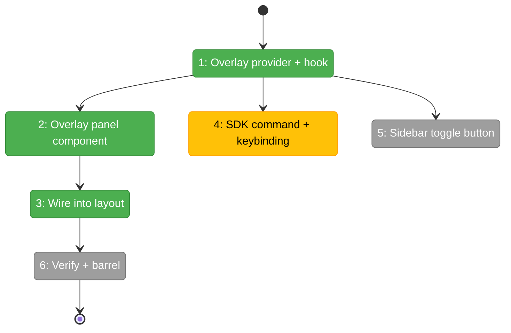
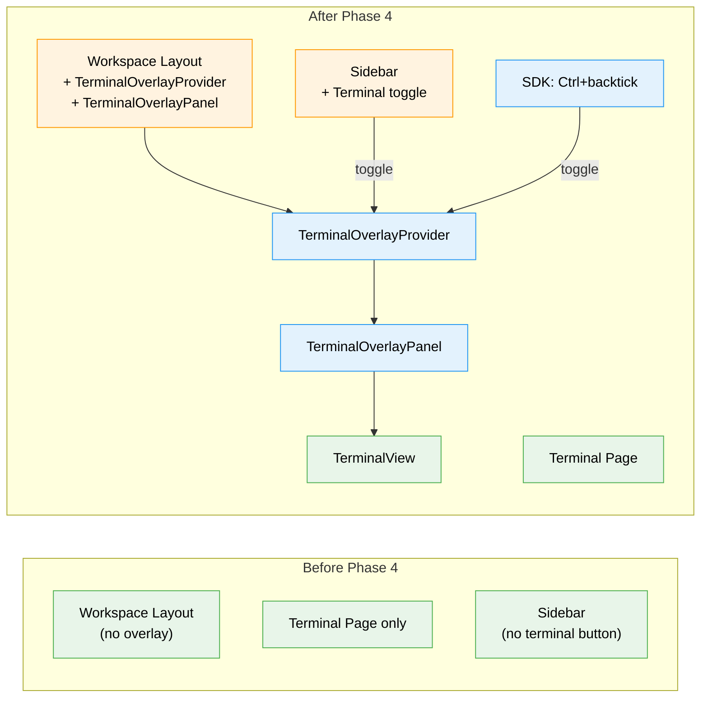

# Flight Plan: Phase 4 — Terminal Overlay Panel (Surface 2)

**Plan**: [tmux-plan.md](../../tmux-plan.md)
**Phase**: Phase 4: Terminal Overlay Panel (Surface 2)
**Generated**: 2026-03-03
**Status**: Ready for takeoff

---

## Departure → Destination

**Where we are**: Phases 1-3 delivered a working terminal page at `/workspaces/[slug]/terminal` with sidecar WS server, xterm.js rendering, session list, and sidebar navigation. The terminal works but only as a dedicated page — you have to navigate away from your current workspace page to use it.

**Where we're going**: A developer can press `Ctrl+\`` (or click a sidebar button) from ANY workspace page and a terminal overlay slides in from the right edge. The overlay persists across page navigation — browse files, check agents, come back — terminal stays open and connected. Close it with Escape or X, and the tmux session survives for later reattachment.

---

## Domain Context

### Domains We're Changing

| Domain | What Changes | Key Files |
|--------|-------------|-----------|
| terminal | Add overlay provider, hook, panel component, barrel exports | `hooks/use-terminal-overlay.tsx`, `components/terminal-overlay-panel.tsx`, `index.ts` |
| shared (workspace layout) | Wire provider + panel into layout | `app/(dashboard)/workspaces/[slug]/layout.tsx` |
| shared (sidebar) | Add toggle button to footer | `components/dashboard-sidebar.tsx` |
| shared (SDK) | Register command + keybinding | `lib/sdk/sdk-bootstrap.ts` |

### Domains We Depend On (no changes)

| Domain | What We Consume | Contract |
|--------|----------------|----------|
| terminal (Phase 2) | Terminal renderer | `TerminalView`, `ConnectionStatusBadge` |
| _platform/sdk | Command + keybinding registration | `ICommandRegistry`, keybinding service |

---

## Flight Status

**Legend**: grey = pending | yellow = active | red = blocked/needs input | green = done

---

## Stages

- [ ] **Stage 1: Overlay provider + hook** — Create context, provider, and useTerminalOverlay hook (`use-terminal-overlay.tsx` — new file)
- [ ] **Stage 2: Overlay panel component** — Fixed-position panel with slide-in, header, close on Escape (`terminal-overlay-panel.tsx` — new file)
- [ ] **Stage 3: Wire into workspace layout** — Add provider + panel to layout.tsx with error boundary (`layout.tsx`)
- [ ] **Stage 4: SDK command + keybinding** — Register terminal.toggleOverlay + Ctrl+backtick (`sdk-bootstrap.ts`)
- [ ] **Stage 5: Sidebar toggle button** — Add Terminal button to sidebar footer (`dashboard-sidebar.tsx`)
- [ ] **Stage 6: Verify persistence + barrel update** — Test navigation persistence, close/reconnect, update barrel exports

---

## Architecture: Before & After

---

## Acceptance Criteria

- [ ] AC-05: Ctrl+\` toggles overlay; sidebar button toggles overlay
- [ ] AC-06: Overlay persists across workspace page navigation
- [ ] AC-13: Close overlay → WS closed, PTY killed, tmux session survives; reopen → reconnects

## Goals & Non-Goals

**Goals**:
- Persistent terminal overlay accessible from any workspace page
- Keyboard shortcut and sidebar button for quick toggle
- Clean close/reconnect lifecycle

**Non-Goals**:
- Agent overlay coexistence (059 not merged)
- Multiple simultaneous overlay terminals
- tmux fallback toast (Phase 5)

---

## Checklist

- [ ] T001: TerminalOverlayProvider + useTerminalOverlay hook
- [ ] T002: TerminalOverlayPanel (fixed right, slide-in, Escape close)
- [ ] T003: Wire into workspace layout.tsx with error boundary
- [ ] T004: SDK command + Ctrl+backtick keybinding
- [ ] T005: Sidebar footer toggle button
- [ ] T006: Verify persistence + close behavior
- [ ] T007: Update barrel exports
