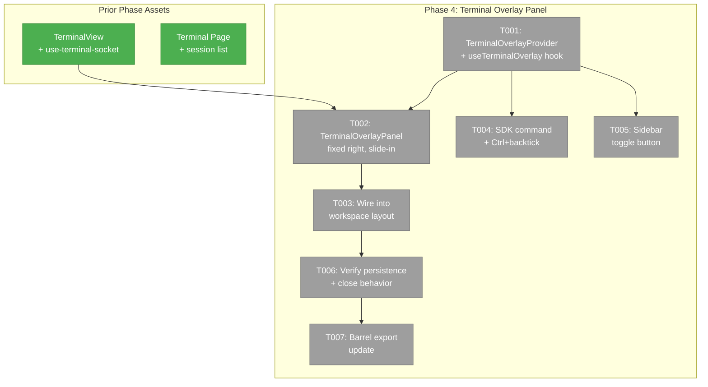
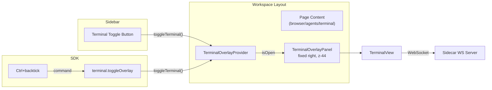
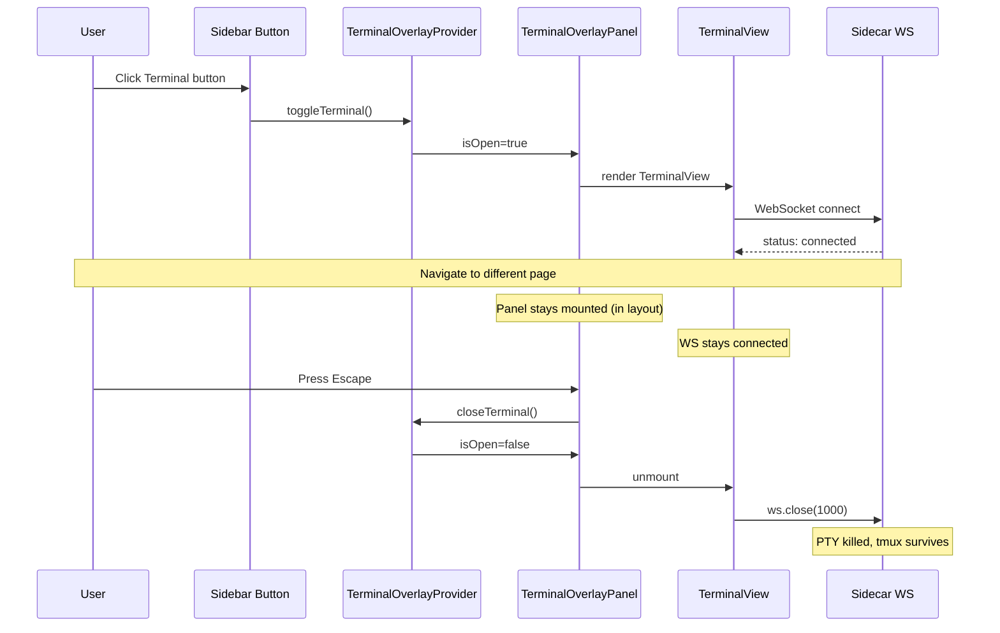

# Phase 4: Terminal Overlay Panel (Surface 2)

## Executive Briefing

- **Purpose**: Build the persistent right-edge terminal overlay that stays open across workspace page navigations, allowing developers to keep a terminal visible alongside any workspace page (browser, agents, workflows). Follows the Plan 059 AgentOverlayPanel concept but implemented independently since 059 isn't merged.
- **What We're Building**: A `TerminalOverlayProvider` context at the workspace layout level, a `TerminalOverlayPanel` component with fixed-position slide-in animation, a `Ctrl+\`` keyboard shortcut toggle via SDK command registry, and a sidebar footer button to toggle the overlay.
- **Goals**:
  - ✅ `TerminalOverlayProvider` + `useTerminalOverlay()` hook (context for overlay state)
  - ✅ `TerminalOverlayPanel` component (fixed right, slide-in, close on Escape/X)
  - ✅ Wire provider + panel into workspace layout.tsx
  - ✅ Register `terminal.toggleOverlay` SDK command + `Ctrl+\`` keybinding
  - ✅ Terminal toggle button in sidebar footer
  - ✅ Overlay persists across workspace page navigation
  - ✅ Close overlay → WS closed, PTY killed, tmux session survives
- **Non-Goals**:
  - ❌ Coexistence with Agent Overlay (059 not merged — will coordinate later)
  - ❌ tmux fallback toast (Phase 5)
  - ❌ Authentication (future)
  - ❌ Multiple simultaneous overlay terminals

## Prior Phase Context

### Phase 1: Sidecar WebSocket Server + tmux Integration
**A. Deliverables**: Sidecar WS server (`terminal-ws.ts`), `TmuxSessionManager`, types, fakes.
**B. Dependencies Exported**: `TerminalMessage`, `ConnectionStatus`, WS protocol (session+cwd query params, raw data + JSON control).
**C. Gotchas**: tmux size war (smallest client wins), tsx watch restarts drop connections, node-pty spawn-helper needs +x permission.
**D. Incomplete Items**: None.
**E. Patterns**: Injectable deps, fake-first testing, `createTerminalServer(deps)` factory.

### Phase 2: TerminalView Component (xterm.js Frontend)
**A. Deliverables**: `use-terminal-socket.ts`, `terminal-inner.tsx`, `terminal-view.tsx`, `ConnectionStatusBadge`, `TerminalSkeleton`.
**B. Dependencies Exported**: `TerminalView` (dynamic import, ssr:false), `ConnectionStatusBadge`, `TerminalViewProps`.
**C. Gotchas**: DYK-02 control message whitelist, DYK-03 cleanup ordering (addons before terminal), absolute inset-0 container for FitAddon, re-fit on WS status=connected, 100px iPad bottom padding.
**D. Incomplete Items**: None.
**E. Patterns**: Ref-based callbacks (useWorkspaceSSE pattern), stale-socket guard (`wsRef.current !== ws`).

### Phase 3: Terminal Page (Surface 1)
**A. Deliverables**: Terminal page route (`/workspaces/[slug]/terminal`), `TerminalPageClient` (PanelShell composition), `TerminalSessionList`, `TerminalPageHeader`, `use-terminal-sessions`, `/api/terminal` API route, `terminal.params.ts`, Terminal in `WORKSPACE_NAV_ITEMS`.
**B. Dependencies Exported**: Session list API, page composition patterns, nuqs params.
**C. Gotchas**: DYK-01 API route needed for session listing, DYK-02 slug ≠ branch name (derive from worktree path), PanelMode `'sessions'` extension safe via `Partial<Record>`, `TERMINAL_WS_HOST` env for remote binding.
**D. Incomplete Items**: None.
**E. Patterns**: Server component resolves workspace → passes to client component, `useTerminalSessions` with fetch-on-mount + window-focus refetch.

## Pre-Implementation Check

| File | Exists? | Domain Check | Notes |
|------|---------|-------------|-------|
| `apps/web/src/features/064-terminal/hooks/use-terminal-overlay.tsx` | ❌ | Create | terminal domain — context + provider + hook |
| `apps/web/src/features/064-terminal/components/terminal-overlay-panel.tsx` | ❌ | Create | terminal domain — fixed-position overlay component |
| `apps/web/app/(dashboard)/workspaces/[slug]/layout.tsx` | ✅ | Modify | shared — add TerminalOverlayProvider + TerminalOverlayPanel |
| `apps/web/src/lib/sdk/sdk-bootstrap.ts` | ✅ | Modify | shared — register terminal.toggleOverlay command + keybinding |
| `apps/web/src/components/dashboard-sidebar.tsx` | ✅ | Modify | shared — add terminal toggle button to sidebar footer |
| `apps/web/src/features/064-terminal/index.ts` | ✅ | Modify | terminal — export overlay provider + hook |

**Concept search**: No overlay provider/panel exists in this worktree. Plan 059's AgentOverlayPanel is not merged. Independent implementation required — simple context+hook pattern, no duplication risk.

## Architecture Map



## Tasks

| Status | ID | Task | Domain | Path(s) | Done When | Notes |
|--------|-----|------|--------|---------|-----------|-------|
| [x] | T001 | **Create `use-terminal-overlay.tsx`**: React context + provider + hook. Provider stores `isOpen`, `sessionName`, `cwd`. Hook exposes `openTerminal(session, cwd)`, `closeTerminal()`, `toggleTerminal()`, `isOpen`. Throw if used outside provider. | terminal | `apps/web/src/features/064-terminal/hooks/use-terminal-overlay.tsx` | Provider renders children; hook returns open/close/toggle; throws outside provider context. | Plan 059 useAgentOverlay concept — independent implementation since 059 not merged. |
| [x] | T002 | **Create `terminal-overlay-panel.tsx`**: Fixed-position panel (`position: fixed; top: 0; right: 0; height: 100%`), 480px wide, slide-in animation from right, header with session name + ConnectionStatusBadge + X close button. Renders `TerminalView` inside. Close on Escape keydown. z-index 44. Only renders when `isOpen`. | terminal | `apps/web/src/features/064-terminal/components/terminal-overlay-panel.tsx` | Panel slides in from right on open; closes on Escape and X button; terminal connects and renders; z-index 44. | Workshop 001 Surface 2 design. AC-05. |
| [x] | T003 | **Wire `TerminalOverlayProvider` + `TerminalOverlayPanel` into workspace layout**: Add provider wrapping children, render panel after children. Wrap in error boundary so overlay failures don't crash all workspace pages. | shared | `apps/web/app/(dashboard)/workspaces/[slug]/layout.tsx` | Overlay available on all workspace pages. No errors when provider present but overlay closed. Browser/agents pages still render correctly. | Finding 05 (high risk). Wrap in error boundary. |
| [x] | T004 | **Register `terminal.toggleOverlay` SDK command + `Ctrl+\`` keybinding**: Use existing command registry pattern in `sdk-bootstrap.ts`. Command calls `toggleTerminal()` from overlay hook. Keybinding uses `$mod+grave`. | terminal | `apps/web/src/lib/sdk/sdk-bootstrap.ts` | Pressing Ctrl+\` toggles overlay. Command appears in command palette. | Existing pattern: `$mod+Shift+KeyP` for palette, `$mod+KeyP` for go-to-file. AC-05. |
| [x] | T005 | **Add terminal toggle button to sidebar footer**: Add `SidebarMenuItem` with TerminalSquare icon in `SidebarFooter` section of `dashboard-sidebar.tsx`. Button calls `toggleTerminal()` from overlay hook. | shared | `apps/web/src/components/dashboard-sidebar.tsx` | Button visible in sidebar footer. Clicking toggles overlay. | AC-05. Existing footer has Settings button — add Terminal above it. |
| [ ] | T006 | **Verify overlay persistence + close behavior**: Open overlay on browser page → navigate to agents → overlay stays open and connected. Close overlay → WS disconnects → reopen → reconnects to same tmux session. | terminal | _(verification only)_ | AC-06: overlay persists across navigation. AC-13: close disconnects WS but tmux session survives. | Manual verification — document evidence in execution log. |
| [~] | T007 | **Update barrel exports**: Add `TerminalOverlayProvider`, `TerminalOverlayPanel`, `useTerminalOverlay` to `index.ts`. | terminal | `apps/web/src/features/064-terminal/index.ts` | Imports from `@/features/064-terminal` resolve overlay contracts. | Domain contract update. |

## Context Brief

**Key findings from plan**:
- **Finding 01** (Critical): Plan 059 agent overlay not merged — implement terminal overlay independently. Same pattern (context+hook+fixed panel), separate provider.
- **Finding 05** (High): Workspace layout.tsx modification affects ALL workspace pages. Wrap TerminalOverlayProvider in error boundary. Provider is pure context (no side effects until panel mounts).

**Domain dependencies**:
- `terminal` (own domain): `TerminalView`, `ConnectionStatusBadge`, `ConnectionStatus` — reuse Phase 2 rendering
- `_platform/sdk`: `ICommandRegistry`, keybinding registration — command + shortcut wiring
- `_platform/workspace-url`: workspace context — derive session name + cwd from workspace

**Domain constraints**:
- All terminal overlay files under `apps/web/src/features/064-terminal/`
- Workspace layout modification is cross-domain — minimal footprint (just provider + panel render)
- SDK command registration follows existing patterns in `sdk-bootstrap.ts`

**Reusable from prior phases**:
- `TerminalView` component — renders terminal in any container (Phase 2)
- `ConnectionStatusBadge` — status display (Phase 2)
- `useTerminalSessions` — session list for default session selection (Phase 3)
- Workspace layout context — `slug`, `worktreePath`, `branch` (Phase 3 pattern)





## Discoveries & Learnings

_From DYK session 2026-03-03, pre-implementation._

| Date | Task | Type | Discovery | Resolution | References |
|------|------|------|-----------|------------|------------|
| 2026-03-03 | T003 | DYK-01 | **Overlay + terminal page size war**: Both surfaces connecting to same tmux session → tmux shrinks to smallest client (overlay ~60 cols crushes full-page terminal). | Suppress overlay on terminal page. If current route is `/workspaces/[slug]/terminal`, auto-close overlay or disable toggle. User confirmed: "should not be able to open the terminal pop out on the terminal page". | Phase 1 DYK-01 (tmux smallest-wins). |
| 2026-03-03 | T004 | DYK-02 | **`Ctrl+\`` may not work on iPad**: iOS remaps backtick in some keyboard layouts. `$mod+grave` works on desktop browsers. | Accept — sidebar button is the fallback on iPad. No mitigation needed. | VS Code uses same shortcut for terminal toggle (good muscle memory). |
| 2026-03-03 | T001 | DYK-03 | **Overlay needs session/CWD from worktree context**: Unlike terminal page (server-resolved), overlay lives at layout level. Needs worktree path + branch from URL params. | Read `worktree` search param from URL (always present on worktree pages like browser). Derive branch from directory name. If no worktree param, don't connect. | User confirmed: "overlay should always be called from a page in a worktree". |
| 2026-03-03 | T003 | DYK-04 | **Error boundary placement**: Provider is pure context (safe). Panel renders TerminalView which dynamically imports xterm.js — if that fails, error bubbles through layout breaking all workspace pages. | Wrap `TerminalOverlayPanel` (not provider) in error boundary. Provider stays unwrapped. Fallback: "Terminal failed to load". | Plan Finding 05 (HIGH risk). |
| 2026-03-03 | T005 | DYK-05 | **Sidebar is outside overlay provider**: `dashboard-sidebar.tsx` renders outside workspace layout, so `useTerminalOverlay()` would throw. | Use SDK command pattern: sidebar button calls `terminal.toggleOverlay` via `useSDK()`. Provider listens via SDK command handler. Same mechanism as keybinding — both routes go through SDK. | Existing pattern: `sdk:navigate` custom event in sdk-bootstrap.ts. |

---

```
docs/plans/064-tmux/
├── tmux-plan.md
└── tasks/phase-4-terminal-overlay-panel/
    ├── tasks.md
    ├── tasks.fltplan.md
    └── execution.log.md   # created by plan-6
```
