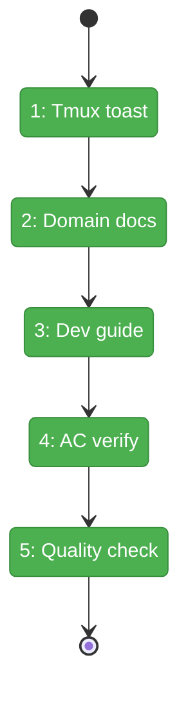
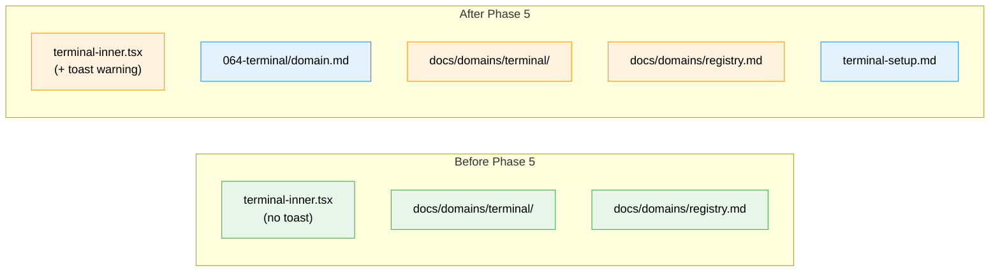

# Flight Plan: Phase 5 — Polish + Documentation

**Plan**: [tmux-plan.md](../../tmux-plan.md)
**Phase**: Phase 5: Polish + Documentation
**Generated**: 2026-03-03
**Status**: Landed ✅

---

## Departure → Destination

**Where we are**: Phases 1-4 complete — terminal page (Surface 1) and overlay panel (Surface 2) fully functional, tmux session management working, copy buffer with deferred clipboard pattern, HTTPS/WSS support, 33+ tests passing, all committed and pushed. The terminal feature is usable but missing the tmux fallback toast, developer documentation, and formal AC verification.

**Where we're going**: A developer can install tmux, run `just dev`, open the terminal page, and everything works. If tmux isn't available, they get a clear toast warning. `docs/how/dev/terminal-setup.md` covers prerequisites and troubleshooting. Domain docs accurately reflect the shipped implementation. All 13 acceptance criteria verified.

---

## Domain Context

### Domains We're Changing

| Domain | What Changes | Key Files |
|--------|-------------|-----------|
| terminal | Add toast in onStatus callback; create feature domain.md | `terminal-inner.tsx`, `064-terminal/domain.md` |
| (docs) | New dev setup guide; verify domain docs | `docs/how/dev/terminal-setup.md`, `docs/domains/terminal/domain.md`, `docs/domains/registry.md`, `docs/domains/domain-map.md` |

### Domains We Depend On (no changes)

| Domain | What We Consume | Contract |
|--------|----------------|----------|
| _platform/events | sonner toast library | `toast.warning()` |

---

## Flight Status

<!-- Updated by /plan-6-v2: pending → active → done. Use blocked for problems/input needed. -->

**Legend**: grey = pending | yellow = active | red = blocked/needs input | green = done

---

## Stages

<!-- Updated by /plan-6-v2 during implementation: [ ] → [~] → [x] -->

- [x] **Stage 1: Wire tmux fallback toast** — Add toast.warning in terminal-inner.tsx onStatus when tmux:false (`terminal-inner.tsx`)
- [x] **Stage 2: Create & verify domain docs** — Feature domain.md + verify docs/domains/ accuracy (`064-terminal/domain.md`, `docs/domains/` — new + modified)
- [x] **Stage 3: Create dev setup guide** — Prerequisites, workflow, troubleshooting (`docs/how/dev/terminal-setup.md` — new file)
- [x] **Stage 4: AC verification** — Manual walkthrough of AC-01 through AC-13
- [x] **Stage 5: Quality check** — Run `just fft`, verify all green

---

## Architecture: Before & After

**Legend**: existing (green, unchanged) | changed (orange, modified) | new (blue, created)

---

## Acceptance Criteria

- [x] AC-01: Navigate to terminal page → auto-creates or re-attaches tmux session
- [x] AC-02: Type command → output with ANSI colors in real-time
- [x] AC-03: Refresh page during long command → reconnects, output continues
- [x] AC-04: Same URL on different browser → same tmux session, both see input
- [x] AC-05: Ctrl+` → overlay slides in from right, connected to worktree tmux
- [x] AC-06: Navigate between workspace pages → overlay stays open and connected
- [x] AC-07: Resize left panel → terminal re-fits, tmux notified
- [x] AC-08: Drag panel to 150px → shrinks without breaking layout
- [x] AC-09: Session list shows all tmux sessions with status dots
- [x] AC-10: Select different session → terminal switches
- [x] AC-11: tmux not installed → raw shell + toast warning
- [x] AC-12: Terminal nav item in sidebar only when inside worktree
- [x] AC-13: Close overlay → WS closed, PTY killed, tmux session survives

## Goals & Non-Goals

**Goals**: tmux fallback toast (AC-11) · developer setup guide · domain docs verified · all ACs confirmed
**Non-Goals**: new features · auth · OSC 52 clipboard · adaptive bottom safe area

---

## Checklist

- [x] T001: Add tmux fallback toast in terminal-inner.tsx onStatus
- [x] T002: Create feature-level domain.md
- [x] T003: Verify and update docs/domains/ docs
- [x] T004: Create developer setup guide
- [x] T005: Manual AC-01 through AC-13 verification
- [x] T006: Run just fft — all green
