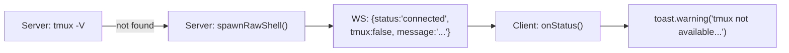
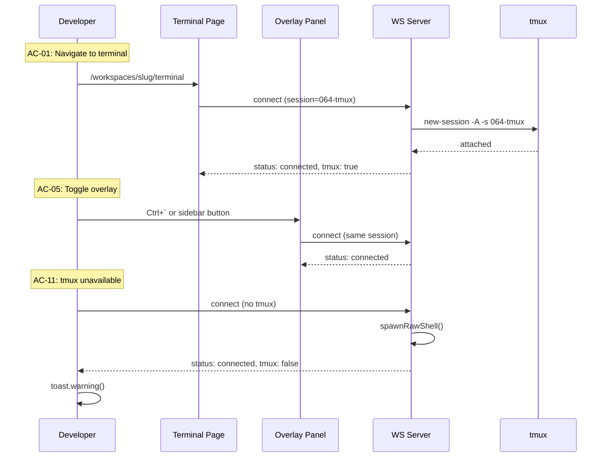

# Phase 5: Polish + Documentation — Tasks Dossier

**Plan**: [tmux-plan.md](../../tmux-plan.md)
**Phase**: Phase 5: Polish + Documentation
**Generated**: 2026-03-03
**Status**: Ready

---

## Executive Briefing

- **Purpose**: Close out the terminal feature with the tmux fallback toast, developer documentation, domain docs accuracy verification, and final AC walkthrough. This is the last phase — it delivers polish and posterity, not new functionality.
- **What We're Building**: A toast warning when tmux is unavailable, a developer setup guide, verified domain documentation, and confirmed acceptance criteria.
- **Goals**: ✅ Toast notification for tmux fallback (AC-11) · ✅ Developer setup guide · ✅ Domain docs verified · ✅ Feature-level domain.md · ✅ All 13 ACs confirmed
- **Non-Goals**: ❌ No new terminal features · ❌ No auth hardening (separate plan) · ❌ No OSC 52 clipboard (parked) · ❌ No adaptive bottom safe area (nice-to-have)

---

## Prior Phase Context

### Phase 1: Sidecar WS Server + tmux

**Deliverables**: `terminal-ws.ts` (sidecar WS server), `tmux-session-manager.ts` (session lifecycle), `types.ts` (contracts), `index.ts` (barrel), `fake-pty.ts`, `fake-tmux-executor.ts`. Dependencies installed: xterm, ws, node-pty, concurrently. Justfile dev recipe. 18 tests.

**Dependencies Exported**: `createTerminalServer()` factory, `TmuxSessionManager` (isTmuxAvailable, spawnAttachedPty, listSessions), `ConnectionStatus` type, `PtySpawner`/`CommandExecutor` interfaces, WS protocol (session/cwd URL params, JSON control messages).

**Gotchas**: No auth on WS/HTTP endpoints. tsx watch kills WS connections (tmux survives). node-pty needs Xcode CLT. Port collision fails fast.

**Patterns**: Injectable executor functions (no vi.mock), FakePty/FakeTmuxExecutor test doubles, atomic tmux create-or-attach (`new-session -A`).

### Phase 2: TerminalView Component

**Deliverables**: `terminal-inner.tsx`, `terminal-view.tsx`, `use-terminal-socket.ts`, `terminal-skeleton.tsx`, `connection-status-badge.tsx`. 8 tests (28 total).

**Dependencies Exported**: `TerminalView` (dynamic import wrapper), `ConnectionStatusBadge`, `TerminalSkeleton`, `useTerminalSocket` hook (send, status, reconnect, copyBuffer).

**Gotchas**: tmux size war with multiple clients. Cleanup order critical (ResizeObserver before terminal.dispose). xterm.js v6 requires reference swap for theme updates. jsdom can't render xterm.js.

**Patterns**: Ref-based WS transport, disposedRef cleanup flag, dynamic import + Suspense, const theme objects.

### Phase 3: Terminal Page (Surface 1)

**Deliverables**: Terminal page route, `terminal-page-client.tsx`, `terminal-session-list.tsx`, `use-terminal-sessions.ts`, `terminal-page-header.tsx`, `terminal.params.ts`, API route `/api/terminal`. PanelMode extended with `'sessions'`. Nav item added. 5 tests (33 total).

**Dependencies Exported**: Terminal page route (`/workspaces/[slug]/terminal`), session list hook, nuqs params contract, API endpoint.

**Gotchas**: Slug ≠ branch name (derive from workspace context). Session list stale (window-focus refetch). API unauthenticated.

**Patterns**: Fetch-on-mount + window-focus refetch, PanelShell 3-slot pattern, nuqs param composition.

### Phase 4: Terminal Overlay Panel

**Deliverables**: `use-terminal-overlay.tsx`, `terminal-overlay-panel.tsx`, `terminal-overlay-wrapper.tsx`, SDK command + keybinding, sidebar toggle button. Workspace layout wired.

**Dependencies Exported**: `useTerminalOverlay()` hook, `TerminalOverlayProvider`, `TerminalOverlayPanel`, `terminal.toggleOverlay` SDK command.

**Gotchas**: Size war auto-close (overlay closes on terminal page route). Custom event for cross-boundary communication (sidebar outside provider). Error boundary on panel only, not provider. URL params for worktree context.

**Patterns**: Context + Hook + Provider, custom events for cross-boundary, SDK command registration, dynamic import error boundary.

### Post-Phase 4: Copy Buffer + HTTPS/WSS

**Additional work done after Phase 4** (committed as `1d00aff`):
- Copy buffer button using deferred `ClipboardItem` Promise pattern (preserves user gesture for clipboard.write)
- HTTPS dev mode via mkcert + `just dev-https`
- WSS support in sidecar (TERMINAL_WS_CERT/KEY env vars)
- ESM module fix (replaced require with import in terminal-ws.ts)
- Modal fallback for HTTP origins

---

## Pre-Implementation Check

| File | Exists? | Domain Check | Notes |
|------|---------|-------------|-------|
| `apps/web/src/features/064-terminal/components/terminal-inner.tsx` | ✅ Yes | terminal | Modify: add toast in onStatus |
| `apps/web/src/features/064-terminal/domain.md` | ❌ No | terminal | Create: feature-level domain doc |
| `docs/domains/terminal/domain.md` | ✅ Yes | terminal | Verify: accuracy after implementation |
| `docs/domains/registry.md` | ✅ Yes | (shared) | Verify: terminal row accuracy |
| `docs/domains/domain-map.md` | ✅ Yes | (shared) | Verify: terminal edges accuracy |
| `docs/how/dev/terminal-setup.md` | ❌ No | (docs) | Create: developer setup guide |

---

## Architecture Map

```mermaid
flowchart TD
    classDef pending fill:#9E9E9E,stroke:#757575,color:#fff
    classDef completed fill:#4CAF50,stroke:#388E3C,color:#fff

    subgraph Phase["Phase 5: Polish + Documentation"]
        T001["T001: tmux fallback toast"]:::pending
        T002["T002: Feature domain.md"]:::pending
        T003["T003: Verify domain docs"]:::pending
        T004["T004: Dev setup guide"]:::pending
        T005["T005: AC verification"]:::pending
        T006["T006: just fft"]:::pending
    end

    subgraph Existing["Existing (Phases 1-4)"]
        TI["terminal-inner.tsx"]:::completed
        DD["docs/domains/terminal/"]:::completed
        DR["docs/domains/registry.md"]:::completed
        DM["docs/domains/domain-map.md"]:::completed
    end

    T001 -.-> TI
    T002 -.-> FD["064-terminal/domain.md"]:::pending
    T003 -.-> DD
    T003 -.-> DR
    T003 -.-> DM
    T004 -.-> TS["docs/how/dev/terminal-setup.md"]:::pending
    T005 --> T006
```



---

## Tasks

| Status | ID | Task | Domain | Path(s) | Done When | Notes |
|--------|-----|------|--------|---------|-----------|-------|
| [ ] | T001 | Add tmux fallback toast: when `onStatus` receives `tmux: false`, show sonner warning toast. **DYK-01**: Add `tmuxWarningShownRef` guard — show toast once per mount, not on every reconnect | terminal | `/apps/web/src/features/064-terminal/components/terminal-inner.tsx` | Toast appears once when tmux unavailable; raw shell still works; no spam on reconnect | Server already sends `{ tmux: false, message: "..." }` — wire the client toast with once-guard |
| [ ] | T002 | Create feature-level `domain.md` in 064-terminal feature directory. **DYK-05**: This is the single source of truth for contracts/composition | terminal | `/apps/web/src/features/064-terminal/domain.md` | Domain doc exists with contracts, composition, dependencies including post-Phase-4 work (copy buffer, HTTPS/WSS, lib/) | Mirror pattern from other feature domain.md files |
| [ ] | T003 | Verify and update `docs/domains/` docs. **DYK-02**: Docs are significantly stale — missing copy buffer, HTTPS/WSS, lib/ directory, new events. **DYK-05**: Make project-level domain.md a thin pointer to feature-level doc. Use GPT Codex 5.3 subagent for thorough review then remediate | terminal | `docs/domains/terminal/domain.md`, `docs/domains/registry.md`, `docs/domains/domain-map.md` | All docs reflect actual implementation; project-level domain.md points to feature-level for details | Compare actual file tree + barrel exports against docs |
| [ ] | T004 | Create developer setup guide. **DYK-04**: Must include dedicated "Remote Access (iPad/LAN)" section — this is a first-class use case | (docs) | `/docs/how/dev/terminal-setup.md` | Guide covers: tmux install, node-pty, just dev/dev-https, port config, **iPad/LAN setup** (mkcert + IP certs, TERMINAL_WS_HOST, clipboard behavior), troubleshooting | Reference justfile commands; cover the real-world iPad workflow |
| [ ] | T005 | Manual verification of all acceptance criteria AC-01 through AC-13 | terminal | (manual testing) | All 13 ACs verified and documented | Use running dev server; test both surfaces |
| [ ] | T006 | Run `just fft` — lint, format, typecheck, test | (shared) | (all) | All green, 0 lint errors, all tests pass | Already passing from last commit; re-verify after T001 changes |

---

## Context Brief

**Key findings from plan**:
- Finding 05 (HIGH): Workspace layout is critical path — already mitigated with error boundary (Phase 4)
- All critical/high findings resolved in Phases 1-4

**Domain dependencies** (concepts and contracts this phase consumes):
- `terminal`: All existing components and hooks — we modify `terminal-inner.tsx` for toast
- `_platform/events`: `sonner` toast library — for tmux unavailable warning

**Domain constraints**:
- Toast import via dynamic `import('sonner')` pattern (already used in terminal-inner.tsx)
- Domain docs must match actual barrel exports from `064-terminal/index.ts`

**Reusable from prior phases**:
- `onStatus(_status, _tmux, _message)` callback already receives tmux availability — just need to act on it
- Dynamic sonner import pattern already used in clipboard handlers
- Domain doc templates from existing `docs/domains/` entries

**System flow for T001 (tmux fallback toast)**:



**AC verification sequence**:



---

## Discoveries & Learnings

_Populated during implementation by plan-6._

| Date | Task | Type | Discovery | Resolution | References |
|------|------|------|-----------|------------|------------|

---

## Directory Layout

```
docs/plans/064-tmux/
  ├── tmux-plan.md
  └── tasks/phase-5-polish-documentation/
      ├── tasks.md
      ├── tasks.fltplan.md
      └── execution.log.md   # created by plan-6
```
