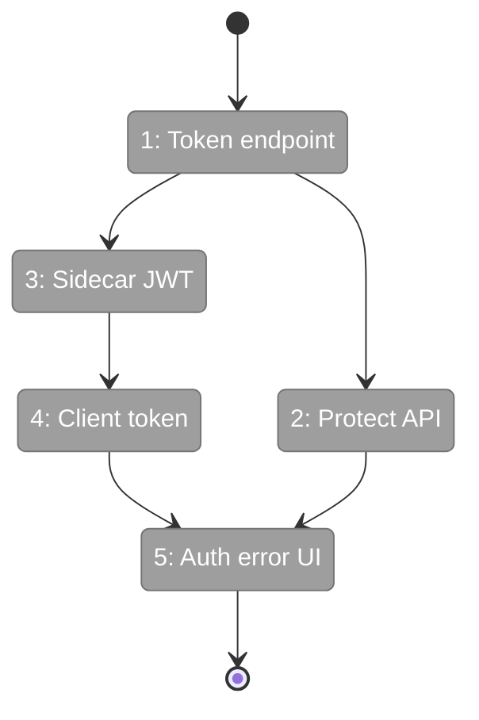
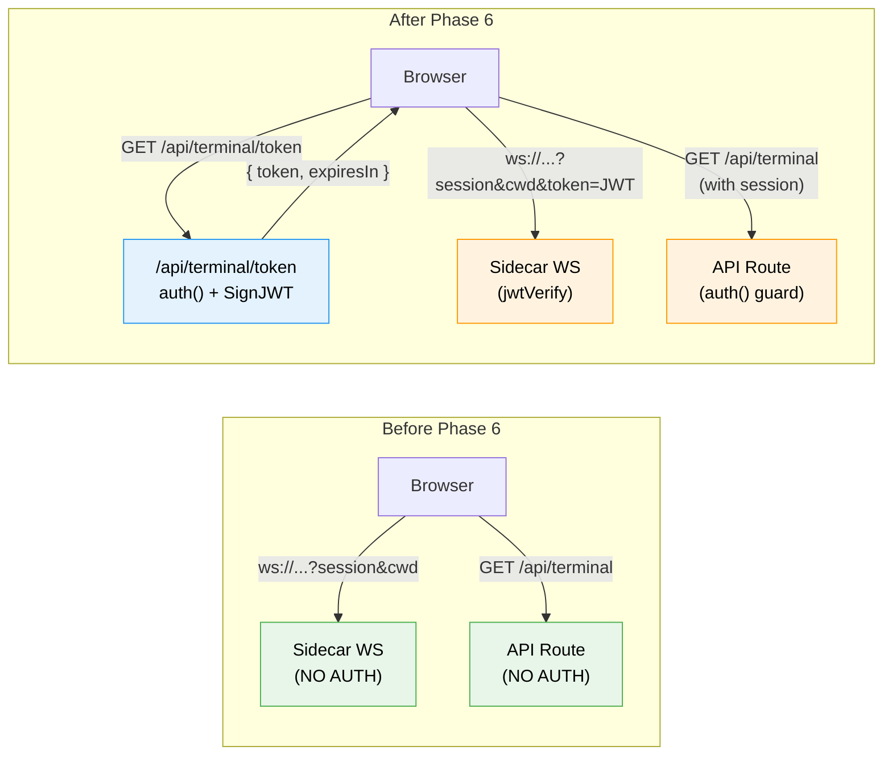

# Flight Plan: Phase 6 — Terminal Authentication

**Plan**: [tmux-plan.md](../../tmux-plan.md)
**Phase**: Phase 6: Terminal Authentication
**Generated**: 2026-03-04
**Status**: Ready for takeoff

---

## Departure → Destination

**Where we are**: Full terminal feature working (Phases 1-5) — sidecar WS server, xterm.js, terminal page, overlay panel, copy buffer, HTTPS/WSS, PWA. Plan 063 (auth) merged to main with GitHub OAuth + NextAuth.js. Terminal WS endpoint and `/api/terminal` are **completely unprotected** — anyone on the network can connect and get a shell.

**Where we're going**: Terminal connections require a valid JWT issued by Next.js after GitHub OAuth authentication. The sidecar validates tokens independently using a shared secret. Long sessions auto-refresh tokens. When auth isn't configured (CI/testing), the terminal still works with open access.

---

## Domain Context

### Domains We're Changing

| Domain | What Changes | Key Files |
|--------|-------------|-----------|
| terminal | Token endpoint, JWT validation on WS, token fetch in client, auth error UI | `api/terminal/token/route.ts`, `terminal-ws.ts`, `use-terminal-socket.ts`, `terminal-inner.tsx` |
| (shared) | Pass AUTH_SECRET to sidecar | `justfile` |

### Domains We Depend On (no changes)

| Domain | What We Consume | Contract |
|--------|----------------|----------|
| _platform/auth | `auth()` session getter | Returns `{ user: { name } }` or null |
| _platform/auth | `AUTH_SECRET` env var | Shared JWT signing secret |

---

## Flight Status

<!-- Updated by /plan-6-v2: pending → active → done. Use blocked for problems/input needed. -->

**Legend**: grey = pending | yellow = active | red = blocked/needs input | green = done

---

## Stages

<!-- Updated by /plan-6-v2 during implementation: [ ] → [~] → [x] -->

- [ ] **Stage 1: Create token endpoint** — `/api/terminal/token` issues 5-min JWT after `auth()` check (`app/api/terminal/token/route.ts` — new file)
- [ ] **Stage 2: Protect HTTP API** — Add `auth()` guard to `/api/terminal` session list (`app/api/terminal/route.ts`)
- [ ] **Stage 3: Sidecar JWT validation** — Verify `?token=` on WS connect, handle `{type:'auth'}` refresh (`server/terminal-ws.ts`)
- [ ] **Stage 4: Client token flow** — Fetch token before connect, auto-refresh every 4 min (`hooks/use-terminal-socket.ts`)
- [ ] **Stage 5: Auth error handling** — Show "Auth required" on 4401/4403 close codes, pass env vars (`terminal-inner.tsx`, `justfile`)

---

## Architecture: Before & After

**Legend**: existing (green, unchanged) | changed (orange, modified) | new (blue, created)

---

## Acceptance Criteria

- [ ] Unauthenticated WS connection is rejected with close code 4401/4403
- [ ] Authenticated WS connection succeeds and spawns terminal
- [ ] `/api/terminal` returns 401 without valid session
- [ ] `/api/terminal/token` returns 401 without valid session, JWT on success
- [ ] Token auto-refreshes — session stays alive beyond 5 minutes
- [ ] When `AUTH_SECRET` not set, sidecar accepts all connections (backward compat)
- [ ] Auth error in UI shows clear message, not just "Disconnected"

## Goals & Non-Goals

**Goals**: JWT auth on WS + HTTP endpoints, token refresh, graceful fallback, clear error UI
**Non-Goals**: Per-user isolation, command filtering, audit logging, rate limiting

---

## Checklist

- [ ] T001: Create /api/terminal/token endpoint
- [ ] T002: Add auth guard to /api/terminal
- [ ] T003: Add JWT validation to sidecar WS server
- [ ] T004: Add token fetch + refresh to client hook
- [ ] T005: Handle auth errors in terminal UI
- [ ] T006: Pass AUTH_SECRET to sidecar in justfile
