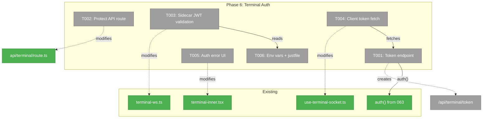
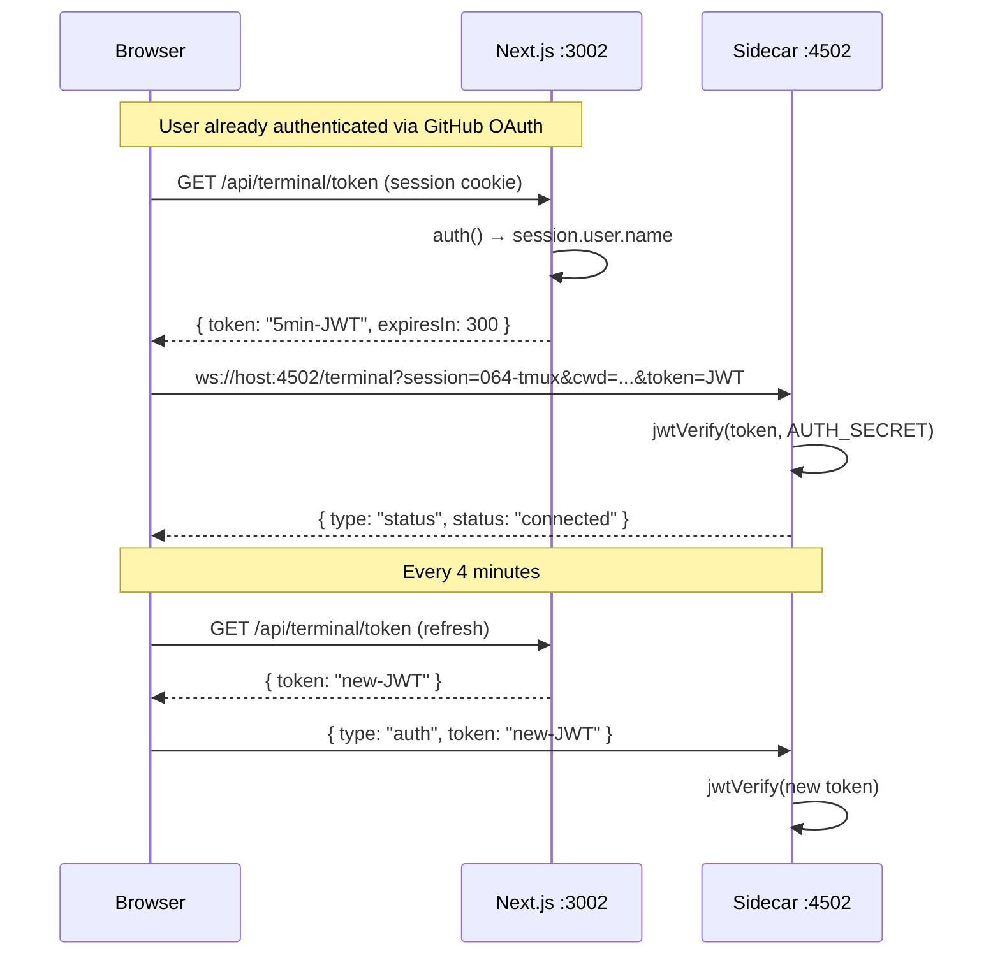
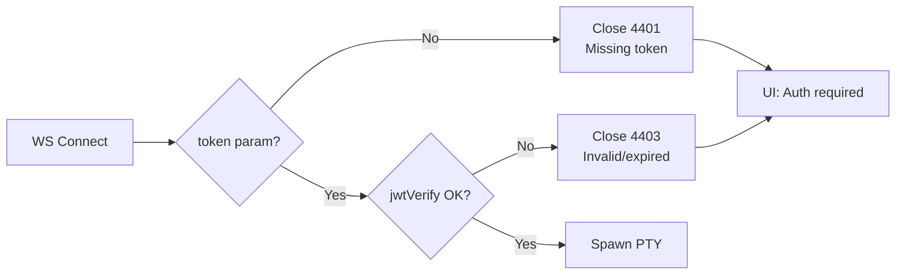

# Phase 6: Terminal Authentication — Tasks Dossier

**Plan**: [tmux-plan.md](../../tmux-plan.md)
**Phase**: Phase 6: Terminal Authentication
**Workshop**: [002-terminal-ws-authentication.md](../../workshops/002-terminal-ws-authentication.md)
**Generated**: 2026-03-04
**Status**: Ready

---

## Executive Briefing

- **Purpose**: Protect the terminal WebSocket server and HTTP API with authentication from Plan 063, preventing unauthorized shell access from the network.
- **What We're Building**: JWT-based auth flow — browser fetches short-lived token from authenticated Next.js endpoint, passes to WS sidecar on connect, sidecar validates independently via shared secret.
- **Goals**: ✅ WS connections require valid JWT · ✅ `/api/terminal` requires session · ✅ Token auto-refresh for long sessions · ✅ Graceful fallback when auth not configured
- **Non-Goals**: ❌ Per-user session isolation · ❌ Command whitelisting · ❌ Audit logging · ❌ Rate limiting

---

## Prior Phase Context

### Phases 1-5: Complete Terminal Feature

**Deliverables**: Full terminal feature — sidecar WS server, xterm.js component, terminal page (Surface 1), overlay panel (Surface 2), tmux fallback toast, copy buffer clipboard, HTTPS/WSS, PWA support, developer docs. 33+ terminal tests, 4788 total passing.

**Dependencies Exported**: `createTerminalServer()` factory, `useTerminalSocket` hook, `TerminalView`, `TerminalOverlayPanel`, WS protocol (`?session=NAME&cwd=PATH`).

**Gotchas**: WS sidecar is a separate process — no access to Next.js `auth()`, DI container, or session store. Browser WebSocket API doesn't support custom headers. jose 6.1.3 available as transitive dep.

**Patterns**: Injectable deps via `createTerminalServer({ execCommand, spawnPty })`, ref-based stable callbacks in hooks, custom events for cross-boundary communication.

### Plan 063: Auth (Merged to Main)

**Deliverables**: GitHub OAuth via NextAuth.js v5 with JWT strategy, `auth()` server function, `requireAuth()` server action guard, `useAuth()` client hook, `isUserAllowed()` allowlist, middleware protection, `AuthProvider` (SSR-safe).

**Key Contract**: `auth()` returns session with `user.name` (GitHub username) or `null`.

**Shared Secret**: `AUTH_SECRET` env var used by NextAuth for JWT signing.

---

## Pre-Implementation Check

| File | Exists? | Domain Check | Notes |
|------|---------|-------------|-------|
| `apps/web/app/api/terminal/token/route.ts` | ❌ No | terminal | Create: token endpoint |
| `apps/web/app/api/terminal/route.ts` | ✅ Yes | terminal | Modify: add auth guard |
| `apps/web/src/features/064-terminal/server/terminal-ws.ts` | ✅ Yes | terminal | Modify: add JWT validation |
| `apps/web/src/features/064-terminal/hooks/use-terminal-socket.ts` | ✅ Yes | terminal | Modify: add token fetch/refresh |
| `apps/web/src/features/064-terminal/components/terminal-inner.tsx` | ✅ Yes | terminal | Modify: handle auth errors |
| `justfile` | ✅ Yes | (shared) | Modify: pass AUTH_SECRET to sidecar |
| `node_modules/jose` | ✅ Yes (v6.1.3) | (npm) | Transitive dep — no install needed |

---

## Architecture Map



---

## Tasks

| Status | ID | Task | Domain | Path(s) | Done When | Notes |
|--------|-----|------|--------|---------|-----------|-------|
| [ ] | T001 | Create `/api/terminal/token` route: calls `auth()`, issues 5-min JWT via jose `SignJWT` with `sub` claim, returns `{ token, expiresIn: 300 }` | terminal | `apps/web/app/api/terminal/token/route.ts` | Authenticated requests get valid JWT; unauthenticated get 401 | Workshop 002 §Token Generation. Use `AUTH_SECRET` as signing key |
| [ ] | T002 | Add auth guard to `/api/terminal` route: call `auth()`, return 401 if no session | terminal | `apps/web/app/api/terminal/route.ts` | Unauthenticated requests get 401; session list only for logged-in users | Simple `auth()` check — same pattern as other API routes |
| [ ] | T003 | Add JWT validation to sidecar WS connection handler: verify `?token=` param via jose `jwtVerify`, reject with 4401/4403 close codes. Handle `{type:'auth'}` refresh messages. Skip when `AUTH_SECRET` not set (graceful fallback) | terminal | `apps/web/src/features/064-terminal/server/terminal-ws.ts` | With AUTH_SECRET: reject without valid JWT. Without: accept all (backward compat). Token refresh over existing WS works | Workshop 002 §Token Validation. Custom close codes: 4401 missing, 4403 invalid |
| [ ] | T004 | Add token fetch + auto-refresh to client: fetch from `/api/terminal/token` before WS connect, pass as `&token=` query param. Refresh every 4 min via `{type:'auth'}` message. Graceful fallback if token endpoint returns error | terminal | `apps/web/src/features/064-terminal/hooks/use-terminal-socket.ts` | Token fetched before connect, refreshed before expiry, WS URL includes `&token=JWT` | Workshop 002 §Token Refresh. 60s margin before expiry |
| [ ] | T005 | Handle auth errors in terminal UI: show "Authentication required" message on WS close 4401/4403, with link/button to sign in | terminal | `apps/web/src/features/064-terminal/components/terminal-inner.tsx` | Auth failure shows clear message (not just "Disconnected"). User can re-authenticate | Check `event.code` in WS onclose handler |
| [ ] | T006 | Pass `AUTH_SECRET` to sidecar in justfile: ensure `dev` and `dev-https` recipes pass the env var to the terminal process | (shared) | `justfile` | Sidecar reads `AUTH_SECRET` for JWT verification | May already be inherited — verify |

---

## Context Brief

**Key findings from plan**:
- Workshop 002 (Approved): Full design for JWT token flow — token endpoint, sidecar validation, client refresh, graceful degradation
- `jose` v6.1.3 already in node_modules as transitive dep of next-auth — no new install needed
- `AUTH_SECRET` is the env var NextAuth uses — same secret signs both NextAuth sessions and terminal tokens

**Domain dependencies**:
- `_platform/auth`: `auth()` function from `@/auth` — validates NextAuth session, returns `{ user: { name } }` or null
- `_platform/auth`: `AUTH_SECRET` env var — shared JWT signing secret between Next.js and sidecar

**Domain constraints**:
- Sidecar cannot import from `@/auth` (separate process) — must use jose directly
- Token passed as URL query param (WebSocket API limitation — no custom headers)
- Must remain backward compatible when `AUTH_SECRET` not set

**Reusable from prior phases**:
- `createTerminalServer(deps)` factory pattern — injectable, testable
- `FakeTmuxExecutor` + `FakePty` test doubles
- WS protocol `CONTROL_TYPES` set in use-terminal-socket.ts (add `'auth'` type)

**System flow**:



**Auth error flow**:



---

## Discoveries & Learnings

_Populated during implementation by plan-6._

| Date | Task | Type | Discovery | Resolution | References |
|------|------|------|-----------|------------|------------|

---

## Directory Layout

```
docs/plans/064-tmux/
  ├── tmux-plan.md
  ├── workshops/002-terminal-ws-authentication.md  (Approved)
  └── tasks/phase-6-terminal-auth/
      ├── tasks.md
      ├── tasks.fltplan.md
      └── execution.log.md   # created by plan-6
```
