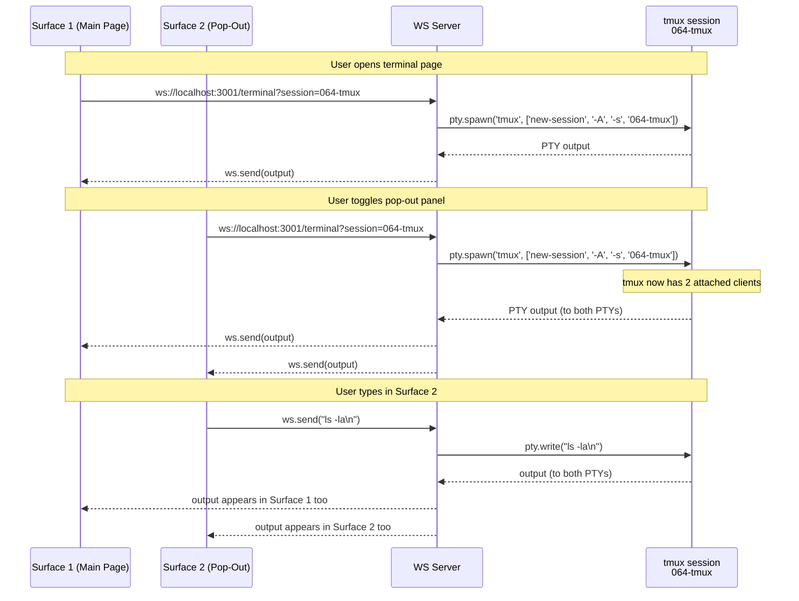
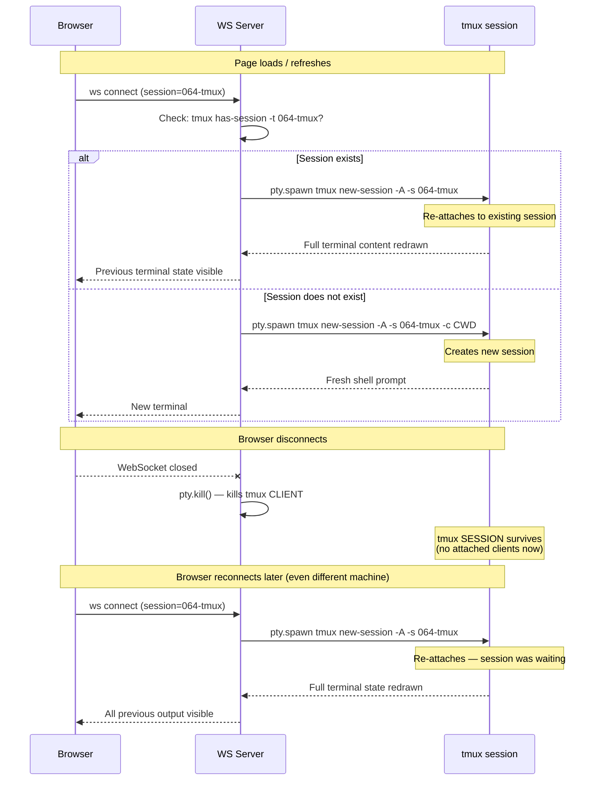

# Workshop: Terminal UI — Main View & Pop-Out Panel

**Type**: Integration Pattern
**Plan**: 064-tmux
**Research**: [research-dossier.md](../research-dossier.md)
**Created**: 2026-03-02
**Status**: Draft

**Related Documents**:
- [Research Dossier — DR-01: xterm.js + React 19](../research-dossier.md)
- [Panel Layout Domain](../../../domains/_platform/panel-layout/domain.md)

**Domain Context**:
- **Primary Domain**: `terminal` (new business domain, Plan 064)
- **Related Domains**: `_platform/panel-layout` (layout primitives), `_platform/events` (toast), `_platform/sdk` (commands/keybindings), `_platform/workspace-url` (deep links)

---

## Purpose

Design the two terminal UI surfaces — the **main terminal page** (full workspace page from left nav) and the **pop-out terminal panel** (collapsible right-edge panel visible alongside file browser or other content). Both share the same `TerminalView` component but differ in where they live in the layout hierarchy and how they manage their WebSocket connections.

## Key Questions Addressed

- Where does the terminal page fit in the existing page/layout hierarchy?
- How does the pop-out right panel coexist with PanelShell's 3-column layout?
- How are the two terminal surfaces independent but share the same tmux session?
- How does resize work for both surfaces?
- What happens on navigate away, refresh, and reconnect?

---

## Overview

Two terminal surfaces exist, both rendering the same `TerminalView` component wrapping xterm.js:

```
┌──────────────────────────────────────────────────────────────────────────┐
│  SURFACE 1: Main Terminal Page (from left nav "Terminal")               │
│                                                                          │
│  Full workspace page at /workspaces/[slug]/terminal                      │
│  Uses PanelShell — explorer bar + session list (left) + terminal (main)  │
│  Owns its own WebSocket connection to tmux                               │
└──────────────────────────────────────────────────────────────────────────┘

┌──────────────────────────────────────────────────────────────────────────┐
│  SURFACE 2: Pop-Out Terminal Panel (right edge of ANY workspace page)   │
│                                                                          │
│  Collapsible right panel, toggled via keybind (Ctrl+`) or button         │
│  Rendered OUTSIDE PanelShell, at the DashboardShell level                │
│  Owns its own independent WebSocket connection to tmux                   │
└──────────────────────────────────────────────────────────────────────────┘
```

**Why this format**: The two surfaces are architecturally different. Surface 1 is a regular workspace page (like browser, agents). Surface 2 is a persistent overlay that lives in the shell layout, independent of which workspace page is active.

---

## Component Hierarchy

### Full Layout with Both Surfaces

```
NavigationWrapper
└─ DashboardShell
   └─ SidebarProvider
      └─ div.flex (h-screen)
         ├─ DashboardSidebar                           ← collapsible left menu
         │  └─ SidebarGroup "Tools"
         │     ├─ Browser
         │     ├─ Agents
         │     ├─ Work Units
         │     ├─ Workflows
         │     └─ Terminal  ←── NEW nav item
         │
         └─ SidebarInset
            └─ div.flex (h-full)                       ← NEW: horizontal split
               ├─ main (flex-1)                        ← page content
               │  └─ [page.tsx]                        ← Surface 1 OR file-browser OR agents...
               │
               └─ TerminalPopOutPanel (conditional)    ← Surface 2 (right edge)
                  └─ CSS resize: horizontal (RTL)
                     └─ TerminalView (xterm.js)
```

### Surface 1: Main Terminal Page — Component Tree

```
/workspaces/[slug]/terminal/page.tsx
└─ TerminalPageClient
   └─ PanelShell
      ├─ explorer={<ExplorerPanel />}                  ← reuse panel-layout
      │  └─ session name display + status indicator
      │
      ├─ left={<LeftPanel mode={mode} modes={modes}>}  ← session list + controls
      │  └─ {
      │       sessions: <TerminalSessionList />,        ← list tmux sessions
      │     }
      │
      └─ main={<MainPanel>}                            ← terminal emulator
         └─ <TerminalView sessionName="064-tmux" />
            └─ xterm.js + WebSocket + FitAddon
```

### Surface 2: Pop-Out Panel — Component Tree

The pop-out follows the **exact same pattern as Plan 059 Phase 3's AgentOverlayPanel** — a `fixed` right-side panel rendered at the workspace layout level via a context provider. It persists across page navigations within the workspace.

```
apps/web/app/(dashboard)/workspaces/[slug]/layout.tsx (modified)
└─ WorkspaceProvider
   └─ WorkspaceAgentChrome              ← existing (Plan 059 Phase 3)
      └─ AgentOverlayProvider
         └─ div.flex.flex-col.h-full
            ├─ AgentChipBar              ← existing agent chips
            ├─ div.flex-1 (page content)
            │  └─ {children}             ← browser, agents, terminal page, etc.
            ├─ AgentOverlayPanel         ← existing agent overlay (right side)
            └─ TerminalOverlayPanel      ← NEW: terminal overlay (right side)
               └─ TerminalOverlayProvider
                  └─ TerminalView (xterm.js + WebSocket)
```

**Key pattern from Plan 059**: The `AgentOverlayPanel` uses `position: fixed; top: 0; right: 0; height: 100%` with `z-index: Z_INDEX.OVERLAY` and `animate-in slide-in-from-right-2`. The terminal overlay follows this identical approach — a fixed-position panel that slides in from the right, persists across navigation, and closes via X button or Escape.

**Coexistence with Agent Overlay**: Both overlays can be open simultaneously. Agent overlay is 480px wide, terminal overlay is 360px wide. If both are open, agent overlay is on the right, terminal overlay is to its left (both `fixed right-0` but terminal has `right: 480px` when agent overlay is open — or simpler: stack them left-to-right with the last-opened on top).
```

---

## Surface 1: Main Terminal Page (Detailed Design)

### Route Structure

```
app/(dashboard)/workspaces/[slug]/
├── terminal/
│   ├── layout.tsx          ← TerminalSessionProvider (context)
│   └── page.tsx            ← Server Component → TerminalPageClient
├── browser/...             ← existing
├── agents/...              ← existing
└── workflows/...           ← existing
```

### Page Layout Wireframe

```
┌─────────────────────────────────────────────────────────────────────────┐
│ ┌─[Terminal]──────────────────────────────────────────────────────────┐ │
│ │ 064-tmux                                              ● Connected  │ │  ← ExplorerPanel
│ └────────────────────────────────────────────────────────────────────┘ │
│ ┌──────────────┐ ┌──────────────────────────────────────────────────┐ │
│ │ SESSIONS     │ │                                                  │ │
│ │              │ │  $ npm run build                                  │ │
│ │ ● 064-tmux  │ │  > @chainglass/web build                         │ │
│ │   041-file…  │ │  > next build                                    │ │
│ │   058-work…  │ │                                                  │ │
│ │              │ │  ✓ Compiled successfully                         │ │
│ │ ┌──────────┐ │ │                                                  │ │
│ │ │ + New    │ │ │  $ █                                             │ │  ← xterm.js cursor
│ │ └──────────┘ │ │                                                  │ │
│ │              │ │                                                  │ │
│ │ ─── Info ─── │ │                                                  │ │
│ │ CWD: /sub…   │ │                                                  │ │
│ │ Windows: 1   │ │                                                  │ │
│ │ Attached: 2  │ │                                                  │ │
│ │◄─── 280px ──►│ │◄──────────── flex-1 ─────────────────────────►│ │
│ └──────────────┘ └──────────────────────────────────────────────────┘ │
└─────────────────────────────────────────────────────────────────────────┘
       ↕ CSS resize: horizontal
```

### ExplorerPanel Content

For the terminal page, ExplorerPanel shows:
- **Left**: Session name (e.g., `064-tmux`) — non-editable display
- **Right**: Connection status indicator (● green = connected, ○ gray = disconnected, ◌ yellow = connecting)

```tsx
<ExplorerPanel
  slug={slug}
  worktreePath={worktreePath}
  handlers={[]}  // No path/search handlers needed
  // Custom content via the children/overlay slot (if available)
  // Or simplify: just use ExplorerPanel as a status bar
/>
```

**Alternative**: Skip ExplorerPanel entirely and use a simple header bar. The terminal page doesn't need file search or command palette.

**Decision**: Use a simple custom header — ExplorerPanel's file-centric BarHandler chain doesn't fit terminal use cases. Keep it simple.

```tsx
// Terminal page header (NOT ExplorerPanel)
<div className="flex items-center justify-between border-b px-3 py-2 shrink-0 bg-background">
  <div className="flex items-center gap-2">
    <TerminalSquare className="h-4 w-4 text-muted-foreground" />
    <span className="text-sm font-medium">{sessionName}</span>
  </div>
  <div className="flex items-center gap-2">
    <ConnectionStatusBadge status={connectionStatus} />
    <Button variant="ghost" size="icon" onClick={onPopOut} title="Pop out">
      <PanelRight className="h-3.5 w-3.5" />
    </Button>
  </div>
</div>
```

### LeftPanel: Session List

Reuse `LeftPanel` with a single mode (`sessions`):

```tsx
const TERMINAL_MODES: LeftPanelMode[] = [
  { key: 'sessions' as PanelMode, icon: <List className="h-3.5 w-3.5" />, label: 'Sessions' },
];

<LeftPanel
  mode="sessions"
  onModeChange={() => {}}
  modes={TERMINAL_MODES}
  onRefresh={refreshSessionList}
  subtitle={<span className="text-xs text-muted-foreground">{sessions.length} sessions</span>}
>
  {{ sessions: <TerminalSessionList sessions={sessions} active={activeSession} onSelect={setActiveSession} /> }}
</LeftPanel>
```

**PanelMode extension**: Add `'sessions'` to the `PanelMode` union type:
```typescript
// panel-layout/types.ts
export type PanelMode = 'tree' | 'changes' | 'sessions';
```

### TerminalSessionList Component

```tsx
interface TerminalSession {
  name: string;          // "064-tmux"
  attached: number;      // number of attached clients
  windows: number;       // number of tmux windows
  created: number;       // unix timestamp
  isCurrentWorktree: boolean; // matches current workspace's branch name
}

function TerminalSessionList({ sessions, active, onSelect }: Props) {
  return (
    <div className="flex flex-col">
      {sessions.map(session => (
        <button
          key={session.name}
          onClick={() => onSelect(session.name)}
          className={cn(
            "flex items-center gap-2 px-3 py-1.5 text-sm hover:bg-accent",
            active === session.name && "bg-accent"
          )}
        >
          <span className={cn("w-1.5 h-1.5 rounded-full",
            session.attached > 0 ? "bg-green-500" : "bg-gray-400"
          )} />
          <span className="truncate flex-1">{session.name}</span>
          {session.isCurrentWorktree && (
            <span className="text-xs text-muted-foreground">current</span>
          )}
        </button>
      ))}

      {/* Create new session button */}
      <button
        onClick={onCreateNew}
        className="flex items-center gap-2 px-3 py-1.5 text-sm text-muted-foreground hover:text-foreground hover:bg-accent border-t mt-2 pt-2"
      >
        <Plus className="h-3.5 w-3.5" />
        <span>New Session</span>
      </button>
    </div>
  );
}
```

### MainPanel: TerminalView

The core terminal component — shared between Surface 1 and Surface 2:

```tsx
'use client';

import dynamic from 'next/dynamic';
import { Suspense } from 'react';

// Dynamic import prevents SSR — xterm.js needs DOM
const TerminalInner = dynamic(() => import('./terminal-inner'), { ssr: false });

interface TerminalViewProps {
  sessionName: string;       // tmux session name (e.g., "064-tmux")
  cwd: string;               // worktree path for new sessions
  className?: string;
  onConnectionChange?: (status: 'connecting' | 'connected' | 'disconnected') => void;
}

export function TerminalView(props: TerminalViewProps) {
  return (
    <Suspense fallback={<TerminalSkeleton />}>
      <TerminalInner {...props} />
    </Suspense>
  );
}

function TerminalSkeleton() {
  return (
    <div className="flex-1 bg-[#1e1e1e] flex items-center justify-center">
      <span className="text-gray-500 text-sm">Connecting to terminal...</span>
    </div>
  );
}
```

### URL State

```typescript
// features/064-terminal/params/terminal.params.ts
import { parseAsString, createSearchParamsCache } from 'nuqs/server';

export const terminalParams = {
  session: parseAsString.withDefault(''),  // active session name
};

export const terminalParamsCache = createSearchParamsCache(terminalParams);
```

URL example: `/workspaces/substrate/terminal?session=064-tmux`

---

## Surface 2: Pop-Out Terminal Panel (Detailed Design)

### Where It Lives

The pop-out panel lives **outside** the page routing — it's rendered at the `DashboardShell` level so it persists across page navigations within a workspace.

```
DashboardShell
├─ Sidebar (left)
├─ main (flex-1) ← page content (browser, agents, terminal page, etc.)
└─ TerminalPopOutPanel (right, conditional) ← NEW
```

### Layout Wireframe — Pop-Out Active (Fixed Position Overlay)

```
┌────┬──────────────────────────────────────────────┬────────────────────┐
│    │                                              │ TERMINAL (overlay) │
│ S  │                                              │                    │
│ I  │         FILE BROWSER                         │ $ npm test         │
│ D  │         (or any page)                        │ > vitest run       │
│ E  │                                              │                    │
│ B  │                                              │ ✓ 247 passed       │
│ A  │                                              │ ✗ 2 failed         │
│ R  │                                              │                    │
│    │                                              │ $ █                │
│    │                                              │                    │
│ 16 │◄──────────── flex-1 (full width) ───────────►│◄── 480px fixed ──►│
│ px │                  (page behind overlay)        │  position: fixed   │
└────┴──────────────────────────────────────────────┴────────────────────┘
```

**Note**: This is a `position: fixed` overlay (like the agent overlay), NOT a flex sibling. The page content stays full-width behind it — the overlay floats on top. This matches the Plan 059 Phase 3 agent overlay behavior exactly.

### Layout Wireframe — Pop-Out Collapsed

```
┌────┬──────────────────────────────────────────────────────────────────┐
│    │                                                                  │
│ S  │         FILE BROWSER                                             │
│ I  │         (or any page)                                            │
│ D  │                                                                  │
│ E  │         No right panel — full width                              │
│ B  │                                                                  │
│ A  │                                                                  │
│ R  │                                                                  │
│    │                                                                  │
│    │                                                                  │
│    │◄────────────────────── flex-1 ──────────────────────────────────►│
└────┴──────────────────────────────────────────────────────────────────┘
```

### Pop-Out Panel Implementation

Following the proven `AgentOverlayPanel` pattern from Plan 059 Phase 3:

```tsx
// apps/web/src/features/064-terminal/components/terminal-overlay-panel.tsx
'use client';

import { useTerminalOverlay } from '../hooks/use-terminal-overlay';
import { TerminalView } from './terminal-view';
import { cn } from '@/lib/utils';
import { X, Maximize2 } from 'lucide-react';
import { useCallback, useEffect } from 'react';

interface TerminalOverlayPanelProps {
  className?: string;
}

export function TerminalOverlayPanel({ className }: TerminalOverlayPanelProps) {
  const { sessionName, cwd, isOpen, closeTerminal } = useTerminalOverlay();

  // Close on Escape key
  const handleKeyDown = useCallback(
    (e: KeyboardEvent) => {
      if (e.key === 'Escape' && isOpen) {
        closeTerminal();
      }
    },
    [isOpen, closeTerminal]
  );

  useEffect(() => {
    document.addEventListener('keydown', handleKeyDown);
    return () => document.removeEventListener('keydown', handleKeyDown);
  }, [handleKeyDown]);

  if (!isOpen || !sessionName) return null;

  return (
    <div
      className={cn(
        'fixed top-0 right-0 h-full',
        'flex flex-col border-l bg-background shadow-2xl',
        'animate-in slide-in-from-right-2 fade-in-0 duration-200',
        className
      )}
      style={{ zIndex: 44, width: 'min(480px, 90vw)' }}
    >
      {/* Header */}
      <div className="flex items-center justify-between border-b px-4 py-2 shrink-0">
        <div className="flex items-center gap-2">
          <span className="text-sm font-medium truncate">Terminal</span>
          <span className="text-xs text-muted-foreground">({sessionName})</span>
        </div>
        <button
          type="button"
          onClick={closeTerminal}
          className="rounded-md p-1 hover:bg-accent transition-colors"
          aria-label="Close terminal"
        >
          <X className="h-4 w-4" />
        </button>
      </div>

      {/* Terminal */}
      <div className="flex-1 overflow-hidden min-h-0">
        <TerminalView sessionName={sessionName} cwd={cwd} />
      </div>
    </div>
  );
}
```

**Key differences from AgentOverlayPanel**:
- **z-index**: 44 (one below agent overlay's 45) so agent overlay renders on top when both open
- **Content**: TerminalView instead of AgentChatView
- **Width**: Same 480px (matching agent overlay for visual consistency)

### TerminalOverlayProvider (Context + Hook)

Following the exact `useAgentOverlay` pattern:

```tsx
// apps/web/src/features/064-terminal/hooks/use-terminal-overlay.tsx
'use client';

import { type ReactNode, createContext, useCallback, useContext, useState } from 'react';

interface TerminalOverlayState {
  sessionName: string | null;
  cwd: string | null;
  isOpen: boolean;
  openTerminal: (sessionName: string, cwd: string) => void;
  closeTerminal: () => void;
  toggleTerminal: (sessionName: string, cwd: string) => void;
}

const TerminalOverlayContext = createContext<TerminalOverlayState | null>(null);

export function TerminalOverlayProvider({ children }: { children: ReactNode }) {
  const [sessionName, setSessionName] = useState<string | null>(null);
  const [cwd, setCwd] = useState<string | null>(null);

  const openTerminal = useCallback((name: string, dir: string) => {
    setSessionName(name);
    setCwd(dir);
  }, []);

  const closeTerminal = useCallback(() => {
    setSessionName(null);
    setCwd(null);
  }, []);

  const toggleTerminal = useCallback((name: string, dir: string) => {
    setSessionName(current => current === name ? null : name);
    setCwd(current => current ? null : dir);
  }, []);

  return (
    <TerminalOverlayContext.Provider value={{
      sessionName, cwd, isOpen: sessionName !== null,
      openTerminal, closeTerminal, toggleTerminal,
    }}>
      {children}
    </TerminalOverlayContext.Provider>
  );
}

export function useTerminalOverlay(): TerminalOverlayState {
  const ctx = useContext(TerminalOverlayContext);
  if (!ctx) throw new Error('useTerminalOverlay must be used within TerminalOverlayProvider');
  return ctx;
}
```

### Workspace Layout Integration

Wire into the existing `WorkspaceAgentChrome` pattern in the workspace layout:

```tsx
// apps/web/app/(dashboard)/workspaces/[slug]/layout.tsx
// Add alongside WorkspaceAgentChrome:
import { TerminalOverlayProvider } from '../../../../src/features/064-terminal/hooks/use-terminal-overlay';
import { TerminalOverlayPanel } from '../../../../src/features/064-terminal/components/terminal-overlay-panel';

// Inside the layout:
<WorkspaceAgentChrome slug={slug} workspacePath={ws?.path}>
  <TerminalOverlayProvider>
    {children}
    <TerminalOverlayPanel />
  </TerminalOverlayProvider>
</WorkspaceAgentChrome>
```

This means the terminal overlay:
- **Persists across navigation** within the workspace (browser → agents → terminal → workflows)
- **Renders as fixed-position** on the right edge, just like the agent overlay
- **Does NOT unmount** on page changes — WebSocket stays connected
- **Closes** when navigating away from the workspace entirely

### Toggle Keybinding

Register via SDK keybinding service:

```typescript
// On bootstrap, register terminal toggle command
sdk.commands.register({
  id: 'terminal.togglePopOut',
  label: 'Toggle Terminal Panel',
  handler: () => {
    const current = stateSystem.get<boolean>('terminal:popout:open') ?? false;
    stateSystem.publish('terminal:popout:open', !current);
  },
});

sdk.keybindings.register({
  commandId: 'terminal.togglePopOut',
  key: 'Ctrl+`',     // VS Code convention
  when: 'always',
});
```

---

## Resize Behavior

### Making Everything "Real Small"

Both surfaces use CSS `resize: horizontal` — the user can drag to make panels extremely narrow:

| Panel | Default Width | Min Width | Max Width | Resize Method |
|-------|--------------|-----------|-----------|---------------|
| Sidebar (DashboardSidebar) | ~240px | 16px (icon-only) | ~240px | shadcn collapsible |
| Left Panel (sessions list) | 280px | 150px | 50% of PanelShell | CSS `resize: horizontal` |
| Main Panel (terminal) | flex-1 | ~100px (natural) | remaining space | Flex grow |
| Overlay Panel (right) | 480px | 480px | 90vw | Fixed-position (not resizable — matches agent overlay) |

**Overlay vs flex panel**: The terminal overlay uses `position: fixed` like the agent overlay from Plan 059 Phase 3. This means it floats OVER the page content rather than pushing it aside. The page stays full-width behind the overlay. This is simpler and consistent with the existing agent UX.

### xterm.js Fit on Resize

Both `TerminalView` instances use `@xterm/addon-fit` with a `ResizeObserver`:

```typescript
// Inside terminal-inner.tsx (the dynamic-imported component)
useEffect(() => {
  const observer = new ResizeObserver(() => {
    requestAnimationFrame(() => {
      fitAddon.fit();
      const dims = fitAddon.proposeDimensions();
      if (dims && ws.readyState === WebSocket.OPEN) {
        ws.send(JSON.stringify({ type: 'resize', cols: dims.cols, rows: dims.rows }));
      }
    });
  });
  observer.observe(containerRef.current!);
  return () => observer.disconnect();
}, []);
```

When the panel resizes → ResizeObserver fires → `fitAddon.fit()` recalculates cols/rows → sends resize to WS server → `pty.resize(cols, rows)` → SIGWINCH propagates to tmux → tmux redraws.

---

## Connection Lifecycle

### Both Surfaces Are Independent

Each `TerminalView` instance owns its own WebSocket connection and PTY:



**Key insight**: Both surfaces see the same tmux session content because tmux mirrors output to all attached clients. Input from either surface appears in both. This is by design — it's the same tmux session.

### Reconnection on Page Refresh



---

## Sidebar Navigation Item

### Addition to WORKSPACE_NAV_ITEMS

```typescript
// navigation-utils.ts
import { ..., TerminalSquare } from 'lucide-react';

export const WORKSPACE_NAV_ITEMS: readonly NavItem[] = [
  { id: 'browser', label: 'Browser', href: '/browser', icon: FolderOpen },
  { id: 'agents', label: 'Agents', href: '/agents', icon: Bot },
  { id: 'work-units', label: 'Work Units', href: '/work-units', icon: Puzzle },
  { id: 'workflows', label: 'Workflows', href: '/workflows', icon: ListChecks },
  { id: 'terminal', label: 'Terminal', href: '/terminal', icon: TerminalSquare },  // NEW
] as const;
```

### Visibility Rules

- **Terminal nav item**: Only visible when `currentWorktree` is set (same as all WORKSPACE_NAV_ITEMS — already handled by DashboardSidebar)
- **Terminal pop-out toggle**: Always visible in the bottom of the sidebar when in a workspace (small icon button)

### Pop-Out Toggle Button in Sidebar Footer

```tsx
// In DashboardSidebar, add to SidebarFooter:
<SidebarFooter>
  <SidebarMenu>
    <SidebarMenuItem>
      <SidebarMenuButton onClick={toggleTerminal} tooltip="Toggle Terminal (Ctrl+`)">
        <TerminalSquare />
        <span>Terminal</span>
      </SidebarMenuButton>
    </SidebarMenuItem>
    {/* ... existing settings link ... */}
  </SidebarMenu>
</SidebarFooter>
```

---

## tmux Fallback UI

When tmux is not available, the terminal should still work (raw shell) but warn the user:

```
┌──────────────────────────────────────────────────────────────────┐
│                                                                  │
│  $ echo "hello"                                                  │
│  hello                                                           │
│  $ █                                                             │
│                                                                  │
│  ┌──────────────────────────────────────────────────────────┐    │
│  │ ⚠ tmux not available — using raw shell.                  │    │  ← toast (sonner)
│  │   Sessions won't persist across page refreshes.          │    │
│  │   Install: brew install tmux                             │    │
│  └──────────────────────────────────────────────────────────┘    │
└──────────────────────────────────────────────────────────────────┘
```

The WebSocket server detects tmux availability at connection time and sends a status message:

```typescript
// WS server → client
{ type: 'status', status: 'connected', tmux: false, message: 'tmux not available' }
```

Client-side:
```typescript
if (msg.type === 'status' && msg.tmux === false) {
  toast.warning('tmux not available — using raw shell. Sessions won\'t persist across refreshes. Install: brew install tmux');
}
```

---

## State Management

### Global State Paths

| Path | Type | Purpose | Set By |
|------|------|---------|--------|
| `terminal:{sessionName}:status` | `'connecting' \| 'connected' \| 'disconnected'` | Connection status per session | TerminalView |

**Note**: Pop-out panel visibility is managed via React context (`TerminalOverlayProvider`) following the `AgentOverlayProvider` pattern from Plan 059 Phase 3 — NOT via GlobalStateSystem. This is consistent: agent overlay uses context too, not global state.

### URL State (Surface 1 only)

| Param | Type | Default | Purpose |
|-------|------|---------|---------|
| `session` | `string` | worktree branch name | Active terminal session |

---

## File Structure

```
apps/web/src/features/064-terminal/
├── components/
│   ├── terminal-view.tsx              # Public: dynamic wrapper (ssr: false)
│   ├── terminal-inner.tsx             # Private: xterm.js + WebSocket + FitAddon
│   ├── terminal-skeleton.tsx          # Loading state
│   ├── terminal-session-list.tsx      # Left panel session list
│   ├── terminal-overlay-panel.tsx     # Fixed-position overlay (Plan 059 pattern)
│   ├── terminal-page-client.tsx       # Surface 1 page client
│   ├── terminal-page-header.tsx       # Custom header for terminal page
│   └── connection-status-badge.tsx    # ● Connected / ○ Disconnected indicator
├── hooks/
│   ├── use-terminal-overlay.tsx       # Context + hook (follows useAgentOverlay pattern)
│   ├── use-terminal-socket.ts         # WebSocket connection lifecycle
│   ├── use-terminal-sessions.ts       # List/create/select sessions (fetches from WS server)
│   └── use-terminal-resize.ts         # ResizeObserver + FitAddon integration
├── params/
│   └── terminal.params.ts             # nuqs URL params
├── server/
│   └── terminal-ws.ts                 # Sidecar WebSocket server
├── types.ts                           # TerminalSession, TerminalMessage, ConnectionStatus
├── index.ts                           # Barrel exports
└── domain.md                          # Domain documentation

app/(dashboard)/workspaces/[slug]/terminal/
├── layout.tsx                         # TerminalSessionProvider
└── page.tsx                           # Server Component → TerminalPageClient
```

---

## Open Questions

### Q1: Should both surfaces share the same tmux session by default?

**RESOLVED**: Yes. Both surfaces connect to the worktree's tmux session (e.g., `064-tmux`) by default. The user sees the same terminal content in both. This matches tmux's native multi-client behavior. The pop-out is effectively a "mirror" of the main terminal.

### Q2: Should the pop-out panel persist its WebSocket connection across page navigations?

**RESOLVED**: Yes. The pop-out panel lives at the DashboardShell level, so it doesn't unmount during workspace-internal navigation (e.g., browser → agents → workflows). The WebSocket stays connected. If the user navigates to a different workspace, the pop-out closes.

### Q3: What happens when both surfaces are open and the user types?

**RESOLVED**: Input goes to whichever surface has focus. tmux receives it and mirrors the output to both attached clients. Both surfaces update in real-time. This is standard tmux multi-client behavior — no special handling needed.

### Q4: Should we use `react-resizable-panels` instead of CSS `resize`?

**RESOLVED**: For Surface 1 (main terminal page), use CSS `resize: horizontal` on the left panel — consistent with PanelShell. For Surface 2 (overlay), use `position: fixed` with a fixed 480px width — consistent with the `AgentOverlayPanel` from Plan 059 Phase 3. No CSS resize on the overlay.

### Q5: How to handle the terminal page vs pop-out when both are open?

**OPEN**: Options:
- **Option A** (Recommended): Let both be open. Both show the same tmux session. Typing in either works. This is native tmux behavior.
- **Option B**: Auto-close pop-out when navigating to terminal page (and vice versa). Simpler but more restrictive.

Current decision: **Option A** — let tmux handle it naturally.

---

## Quick Reference

### Component → Surface Mapping

| Component | Surface 1 (Page) | Surface 2 (Overlay) |
|-----------|:-:|:-:|
| `TerminalView` | ✅ | ✅ |
| `TerminalSessionList` | ✅ | ❌ |
| `TerminalOverlayPanel` | ❌ | ✅ |
| `TerminalOverlayProvider` | ❌ | ✅ |
| `TerminalPageClient` | ✅ | ❌ |
| `PanelShell` | ✅ | ❌ |
| `ConnectionStatusBadge` | ✅ | ✅ |

### State Flow

```
User toggles terminal overlay (Ctrl+` or sidebar button)
  → TerminalOverlayProvider.toggleTerminal(sessionName, cwd)
  → TerminalOverlayPanel renders (position: fixed, right: 0)
  → TerminalView mounts (dynamic import, ssr: false)
  → WebSocket connects to WS server (port = NEXT_PORT + 1500)
  → WS server: pty.spawn('tmux', ['new-session', '-A', '-s', sessionName, '-c', cwd])
  → tmux: session exists → re-attach / doesn't exist → create
  → PTY output → WebSocket → xterm.js renders
  → ResizeObserver → fitAddon.fit() → pty.resize()

User navigates to different workspace page (browser → agents)
  → Page content changes but TerminalOverlayPanel stays mounted
  → WebSocket connection uninterrupted
  → Terminal keeps showing output
```

### Key CSS Values

```css
/* Left panel (PanelShell, Surface 1 only) */
width: 280px; min-width: 150px; max-width: 50%; resize: horizontal;

/* Terminal overlay panel (Surface 2 — fixed position, Plan 059 pattern) */
position: fixed; top: 0; right: 0; height: 100%;
width: min(480px, 90vw); z-index: 44;
/* animate-in slide-in-from-right-2 fade-in-0 duration-200 */

/* Terminal background (dark theme) */
background: #1e1e1e;

/* Terminal background (light theme) */
background: #ffffff;
```
