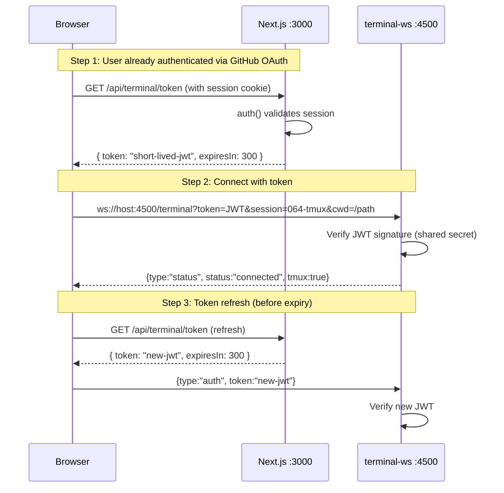

# Workshop: Terminal WebSocket Authentication

**Type**: Integration Pattern
**Plan**: 064-tmux
**Research**: [research-dossier.md](../research-dossier.md)
**Created**: 2026-03-02
**Status**: Approved

**Related Documents**:
- [Plan 063 Login](../../../plans/063-login/) — GitHub OAuth + Auth.js v5 (next-auth) — **MERGED TO MAIN**
- [Workshop 001: Terminal UI](./001-terminal-ui-main-and-popout.md) — Layout and overlay design
- [DYK-04: WS binds 0.0.0.0](../tasks/phase-1-sidecar-ws-server/tasks.md) — Remote access required

**Domain Context**:
- **Primary Domain**: `terminal` — owns the sidecar WS server that needs auth
- **Related Domains**: `_platform/auth` (Plan 063) — provides session validation, JWT tokens, allowed-user gating

---

## Purpose

Design how the terminal WebSocket server authenticates connections, given that:
1. The sidecar WS server is a **separate process** from Next.js — it cannot call `auth()` from next-auth directly
2. The WS server binds to `0.0.0.0` for **remote access** from other machines
3. The browser's WebSocket API does **not support custom headers** (no `Authorization: Bearer`)
4. Plan 063 uses **Auth.js v5 (next-auth) with JWT strategy** and 30-day sessions

## Key Questions Addressed

- How does the browser pass its auth session to the WebSocket server?
- How does the sidecar WS server validate the token without access to Next.js?
- What happens when the token expires mid-session?
- How do we prevent unauthorized shell access from the network?

---

## Overview



**Why this pattern**: The browser can't send custom HTTP headers on WebSocket connections. The standard approach is: (1) get a short-lived token from an authenticated HTTP endpoint, (2) pass it as a query param on WebSocket connect, (3) server validates the token independently.

---

## Token Generation (Next.js Side)

### API Route: `/api/terminal/token`

This route runs inside Next.js, where `auth()` from next-auth is available:

```typescript
// app/api/terminal/token/route.ts
import { auth } from '@/auth';
import { SignJWT } from 'jose';
import { NextResponse } from 'next/server';

const TERMINAL_SECRET = new TextEncoder().encode(
  process.env.TERMINAL_JWT_SECRET || process.env.AUTH_SECRET
);

export async function GET() {
  const session = await auth();
  if (!session?.user?.name) {
    return NextResponse.json({ error: 'Unauthorized' }, { status: 401 });
  }

  // Short-lived token (5 minutes)
  const token = await new SignJWT({ sub: session.user.name })
    .setProtectedHeader({ alg: 'HS256' })
    .setExpirationTime('5m')
    .setIssuedAt()
    .sign(TERMINAL_SECRET);

  return NextResponse.json({ token, expiresIn: 300 });
}
```

**Key decisions**:
- **5-minute expiry**: Short enough that a stolen token is useless quickly, long enough that refreshes aren't constant
- **Shared secret**: `TERMINAL_JWT_SECRET` env var (or falls back to `AUTH_SECRET` from next-auth). Both Next.js and the sidecar WS server read this same secret.
- **Payload is minimal**: Just `sub` (username). No sensitive data in the JWT.
- **`jose` library**: Already a transitive dependency of next-auth. Zero new deps.

---

## Token Validation (Sidecar Side)

### WebSocket Connection Handler

The sidecar validates the JWT on every new connection:

```typescript
// In terminal-ws.ts connection handler
import { jwtVerify } from 'jose';

const TERMINAL_SECRET = new TextEncoder().encode(
  process.env.TERMINAL_JWT_SECRET || process.env.AUTH_SECRET
);

async function validateToken(token: string): Promise<string | null> {
  try {
    const { payload } = await jwtVerify(token, TERMINAL_SECRET);
    return typeof payload.sub === 'string' ? payload.sub : null;
  } catch {
    return null;  // Expired, invalid signature, malformed
  }
}

wss.on('connection', async (ws, req) => {
  const url = new URL(req.url!, `http://${req.headers.host}`);
  const token = url.searchParams.get('token');

  if (!token) {
    ws.send(JSON.stringify({ type: 'error', message: 'Missing auth token' }));
    ws.close(4401, 'Missing auth token');
    return;
  }

  const username = await validateToken(token);
  if (!username) {
    ws.send(JSON.stringify({ type: 'error', message: 'Invalid or expired token' }));
    ws.close(4403, 'Invalid or expired token');
    return;
  }

  // Authenticated — proceed with PTY spawn
  const sessionName = url.searchParams.get('session');
  const cwd = url.searchParams.get('cwd');
  // ...
});
```

**Key decisions**:
- **`jose` library on sidecar**: The sidecar needs jose for JWT verification. This is a pure JS library (no native deps), ~45KB. Already a transitive dep of next-auth but we import it directly.
- **Close codes**: `4401` (custom: missing token), `4403` (custom: forbidden). Standard WS close codes 4000-4999 are application-defined.
- **No session database**: JWT is self-contained. The sidecar doesn't need to query Next.js or any database to validate.

---

## Token Refresh (Client Side)

The browser refreshes the token before it expires to prevent mid-session disconnection:

```typescript
// In use-terminal-socket.ts
const TOKEN_REFRESH_MARGIN = 60; // seconds before expiry to refresh

function useTerminalAuth() {
  const tokenRef = useRef<string | null>(null);
  const expiryRef = useRef<number>(0);

  const getToken = useCallback(async (): Promise<string> => {
    const now = Date.now() / 1000;
    if (tokenRef.current && expiryRef.current - now > TOKEN_REFRESH_MARGIN) {
      return tokenRef.current;  // Still valid
    }

    // Fetch new token from Next.js
    const res = await fetch('/api/terminal/token');
    if (!res.ok) throw new Error('Not authenticated');
    const { token, expiresIn } = await res.json();

    tokenRef.current = token;
    expiryRef.current = now + expiresIn;
    return token;
  }, []);

  return { getToken };
}
```

For long-running sessions, the client sends a refresh message over the existing WebSocket:

```typescript
// Periodic refresh (every 4 minutes for a 5-minute token)
useEffect(() => {
  if (!ws || ws.readyState !== WebSocket.OPEN) return;

  const interval = setInterval(async () => {
    const token = await getToken();
    ws.send(JSON.stringify({ type: 'auth', token }));
  }, 4 * 60 * 1000);

  return () => clearInterval(interval);
}, [ws, getToken]);
```

The WS server handles `{type: 'auth'}` messages by re-validating the JWT:

```typescript
// In terminal-ws.ts message handler
ws.on('message', async (raw) => {
  const msg = JSON.parse(raw.toString());

  if (msg.type === 'auth') {
    const username = await validateToken(msg.token);
    if (!username) {
      ws.close(4403, 'Token refresh failed');
    }
    return;  // Auth messages don't go to PTY
  }

  // Regular data → PTY
  if (msg.type === 'data') {
    pty.write(msg.data);
  }
  // ...
});
```

---

## Environment Setup

### Shared Secret

Both Next.js and the sidecar need the same JWT signing secret:

```bash
# .env (or .env.local)
AUTH_SECRET="your-next-auth-secret"        # Already set for Plan 063
TERMINAL_JWT_SECRET="your-terminal-secret" # Optional: separate secret for terminal
                                            # Falls back to AUTH_SECRET if not set
```

**Recommendation**: Use `AUTH_SECRET` for both (simplicity). Only use a separate `TERMINAL_JWT_SECRET` if you want to be able to revoke terminal tokens independently.

### Justfile

The sidecar reads the same `.env` file as Next.js:

```makefile
dev:
  concurrently --names "next,terminal" --prefix-colors "blue,green" \
    "next dev --turbopack" \
    "tsx watch --env-file=apps/web/.env.local apps/web/src/features/064-terminal/server/terminal-ws.ts"
```

---

## Current State (Post Plan 063 Merge)

Plan 063 (auth) is now merged to main and available in the 064-tmux branch. The implementation should:

1. **Always require auth** when `AUTH_SECRET` is set (which it is in production and dev)
2. **Fallback to open access** only when `AUTH_SECRET` is explicitly unset (testing/CI)

```typescript
// terminal-ws.ts
const AUTH_ENABLED = !!process.env.AUTH_SECRET;

wss.on('connection', async (ws, req) => {
  if (AUTH_ENABLED) {
    const token = url.searchParams.get('token');
    if (!token) { ws.close(4401, '...'); return; }
    const username = await validateToken(token);
    if (!username) { ws.close(4403, '...'); return; }
  }
  // Proceed with PTY spawn...
});
```

```typescript
// Client: use-terminal-socket.ts
async function connectTerminal(sessionName: string, cwd: string) {
  let tokenParam = '';
  try {
    const token = await getToken();
    tokenParam = `&token=${encodeURIComponent(token)}`;
  } catch {
    // Auth not available — connect without token
    console.warn('Terminal auth not available — connecting without authentication');
  }

  const wsUrl = `ws://${location.hostname}:${wsPort}/terminal?session=${sessionName}&cwd=${encodeURIComponent(cwd)}${tokenParam}`;
  return new WebSocket(wsUrl);
}
```

---

## Security Model Summary

| Threat | Mitigation | Residual Risk |
|--------|-----------|---------------|
| **Unauthenticated WS connection** | JWT validation on connect; reject without valid token | None (when auth enabled) |
| **Token theft from URL/logs** | 5-minute expiry; HTTPS in production; token in query param (not logged by default) | Low — short window even if leaked |
| **Token replay** | Short expiry (5min); `iat` claim prevents indefinite reuse | Low |
| **Man-in-the-middle** | HTTPS in production; dev is localhost/trusted network | Accepted for dev |
| **Expired token mid-session** | Client refreshes every 4 minutes; server closes if refresh fails | None |
| **Brute-force JWT** | HS256 with 256-bit secret; computationally infeasible | None |
| **Auth not configured** | Graceful degradation — works without auth | Same as today (open localhost) |

---

## Implementation Tasks

Now that Plan 063 is merged, these are the concrete tasks to add auth:

| # | Task | Files | Notes |
|---|------|-------|-------|
| 1 | Install `jose` in apps/web | `apps/web/package.json` | For JWT sign (Next.js) + verify (sidecar) |
| 2 | Create `/api/terminal/token` route | `app/api/terminal/token/route.ts` | Calls `auth()`, issues 5-min JWT with `sub` claim |
| 3 | Protect `/api/terminal` route | `app/api/terminal/route.ts` | Add `auth()` check (session list endpoint) |
| 4 | Add token validation to sidecar | `server/terminal-ws.ts` | `jwtVerify()` on connect, reject without valid token |
| 5 | Add token fetch + refresh to client | `hooks/use-terminal-socket.ts` | Fetch before connect, refresh every 4 min |
| 6 | Pass `AUTH_SECRET` to sidecar | `justfile` | Ensure sidecar process has the env var |
| 7 | Handle auth errors in UI | `components/terminal-inner.tsx` | Show "Authentication required" on 4401/4403 close |

### Dependency Order

```
Plan 063 (login) ✅ MERGED
  ↓
Install jose → Create /api/terminal/token → Protect /api/terminal
  ↓
Sidecar validates JWT → Client fetches token → UI handles auth errors
```

---

## Open Questions

### Q1: Should token be in query param or Sec-WebSocket-Protocol header?

**RESOLVED**: Query param. The `Sec-WebSocket-Protocol` header trick works but is semantically wrong (it's for subprotocol negotiation, not auth). Query param is simpler, universally supported, and the token is short-lived so URL exposure is acceptable.

### Q2: Should we validate the allowed-users list on the sidecar too?

**RESOLVED**: No. The Next.js `/api/terminal/token` endpoint already checks `auth()` which includes the allowed-user gate (Plan 063 AC-5). If you have a valid JWT, you've already passed the allowlist. The sidecar only needs to verify the JWT signature.

### Q3: Should the sidecar check JWT expiry on every message or only on connect?

**RESOLVED**: Only on connect and on explicit `{type:'auth'}` refresh messages. Checking every message would add latency to every keystroke. The 5-minute token + 4-minute refresh cycle is sufficient.
