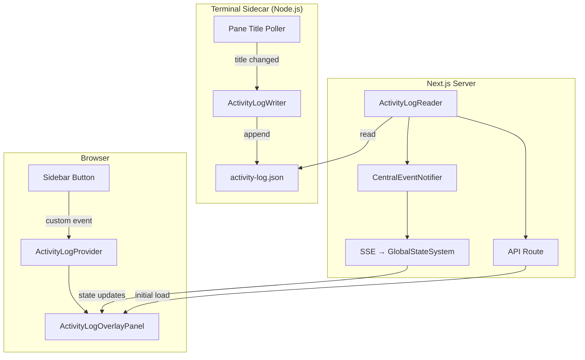

# Research Report: Worktree Activity Log

**Generated**: 2026-03-05T21:47:00Z
**Research Query**: "Activity log persisted per-worktree, displayed via new sidebar button + overlay panel (like terminal overlay), multi-source entries (tmux pane titles, agent intents, future sources)"
**Mode**: Pre-Plan (new plan folder)
**Location**: docs/plans/065-activity-log/research-dossier.md
**FlowSpace**: Available
**Findings**: 71 across 8 subagents

## Executive Summary

### What It Does
A per-worktree activity timeline that records what agents and terminal sessions have been doing, persisted to `.chainglass/data/activity-log.json` so you can come back the next day and see what happened. Displayed via a new sidebar button and overlay panel that pops over the editor area (identical to the terminal overlay pattern).

### Business Purpose
Solves the "what was I working on?" problem when returning to a workspace after time away. Multiple sources (tmux pane titles from Copilot CLI `report_intent`, agent intents, future sources) feed timestamped entries into a unified per-worktree log.

### Key Insights
1. **Terminal overlay is the reference architecture** — the overlay panel, sidebar button, custom event bridge, and context provider patterns from Plan 064 can be directly replicated
2. **Sidecar writes directly to filesystem** — terminal sidecar already polls pane titles; extend it to append to `activity-log.json` (no HTTP dependency, survives server restarts)
3. **New domain, not an extension** — activity log is distinct from work-unit-state (append-only timeline vs live status registry) and should be its own business domain

### Quick Stats
- **Reference Implementation**: Plan 064 (Terminal) — 10+ components, hooks, sidecar
- **Persistence**: `.chainglass/data/activity-log.json` per worktree (ADR-0008 Layer 2)
- **Prior Learnings**: 15 relevant discoveries from Plans 044, 061, 064, 043
- **Domains**: 1 new (activity-log), consumes 5 existing domains
- **Complexity**: Medium — mostly pattern replication from terminal overlay

## How It Currently Works (Reference: Terminal Overlay)

### Entry Points

| Entry Point | Type | Location | Purpose |
|------------|------|----------|---------|
| Sidebar button | UI | `dashboard-sidebar.tsx:271-279` | Dispatches `terminal:toggle` custom event |
| SDK command | Keybinding | `sdk-bootstrap.ts:89-101` | `Backquote` → `terminal.toggleOverlay` |
| Context provider | State | `use-terminal-overlay.tsx` | Listens for custom event, manages `isOpen` state |
| Overlay panel | UI | `terminal-overlay-panel.tsx` | Fixed-position panel anchored to `data-terminal-overlay-anchor` |

### Core Execution Flow — Terminal Overlay (to replicate)

1. **Sidebar button click** → `window.dispatchEvent(new CustomEvent('terminal:toggle'))`
2. **Provider listener** → `useTerminalOverlay()` hook catches event, toggles `isOpen`
3. **Overlay panel renders** → measures anchor element via `getBoundingClientRect()` + `ResizeObserver`
4. **Panel positions** → fixed position matching anchor rect, `z-index: 44`
5. **Escape closes** → global keydown listener, cleanup on unmount

### Pane Title Polling (current, to extend for activity log)

1. **Sidecar polls** every 10s: `tmux display-message -t <session> -p '#{pane_title}'`
2. **Dedup check** → only sends if title changed from last poll
3. **WS message** → `{ type: 'pane_title', title }` to connected client
4. **Client handler** → `onPaneTitle` callback updates React state → badge renders

## Architecture & Design

### Proposed Architecture



### Component Map

#### New Components (activity-log domain)
- **ActivityLogWriter** — Pure function: `(worktreePath, entry) → void` (filesystem append)
- **ActivityLogReader** — Pure function: `readActivityLog(worktreePath) → ActivityLogEntry[]`
- **ActivityLogEntry** — Type: `{ id, source, label, pane?, timestamp }`
- **ActivityLogOverlayProvider** — Context + hook for overlay state (mirror terminal overlay)
- **ActivityLogOverlayPanel** — Fixed-position panel (mirror terminal overlay)
- **ActivityLogButton** — Sidebar button dispatching `activity-log:toggle`

#### Existing Components to Consume
- **PanelShell** + `data-terminal-overlay-anchor` — overlay positioning anchor
- **CentralEventNotifier** — SSE broadcasting
- **GlobalStateSystem** — client-side reactive state
- **TmuxSessionManager.getPaneTitle()** — pane title source
- **useWorkspaceContext()** — worktree path resolution

### Design Patterns Identified

| Pattern | Source | Reuse |
|---------|--------|-------|
| Custom event bridge | `terminal:toggle` in Plan 064 | → `activity-log:toggle` |
| Context provider + hook | `useTerminalOverlay()` | → `useActivityLogOverlay()` |
| Fixed overlay with anchor measurement | `terminal-overlay-panel.tsx` | → `activity-log-overlay-panel.tsx` |
| Sidecar filesystem writes | `terminal-ws.ts` pane title poll | Extend to write activity entries |
| Lazy JSON hydration | `WorkUnitStateService` | → `ActivityLogReader` |
| `.chainglass/data/` persistence | ADR-0008 Layer 2 | → `activity-log.json` |

## Dependencies & Integration

### What Activity Log Depends On

#### Internal Dependencies
| Dependency | Type | Purpose |
|------------|------|---------|
| `_platform/events` | Required | CentralEventNotifier for SSE broadcasting |
| `_platform/state` | Required | GlobalStateSystem for client-side reactive state |
| `_platform/panel-layout` | Required | PanelShell anchor for overlay positioning |
| `terminal` | Required | Source: pane title polling in sidecar |
| `agents` | Optional | Source: agent intent events (future) |

#### External Dependencies
| Dependency | Purpose |
|------------|---------|
| `node:fs` | Direct filesystem read/write in sidecar |
| tmux | Pane title source via `display-message` |

### What Depends on Activity Log
Nothing initially — leaf domain. Future consumers: workspace-nav badges, workflow-ui timeline.

## Data Model

### ActivityLogEntry (proposed)

```typescript
interface ActivityLogEntry {
  /** Dedup key: e.g. "tmux:0.0", "agent:agent-1" */
  id: string;
  /** Source type: "tmux", "agent", future sources */
  source: string;
  /** Human-readable label: "Implementing Phase 1" */
  label: string;
  /** Source-specific metadata: tmux pane index */
  pane?: string;
  /** ISO timestamp when this status was first seen */
  timestamp: string;
}
```

### Ignore List
Titles matching these patterns are filtered before writing:
- Hostnames: `*.localdomain`, `*.local` (default tmux pane title)
- Empty strings

### Dedup Rules
- Skip write if last entry for same `id` has same `label`
- Each pane gets its own `id` (e.g., `tmux:0.0`, `tmux:1.0`)
- Poll ALL panes in session, not just active one

### File Format
JSONL (newline-delimited JSON) for append-only writes:
```
{"id":"tmux:0.0","source":"tmux","label":"Implementing Phase 1","pane":"0.0","timestamp":"2026-03-05T21:22:33Z"}
{"id":"tmux:0.0","source":"tmux","label":"Running tests","pane":"0.0","timestamp":"2026-03-05T21:25:01Z"}
{"id":"tmux:1.0","source":"tmux","label":"Editing auth.ts","pane":"1.0","timestamp":"2026-03-05T21:25:15Z"}
```

## Prior Learnings (From Previous Implementations)

### 📚 PL-03: Atomic Write with Tmp+Rename
**Source**: Plan 044-paste-upload
**Action**: For full rewrites (e.g., rotation), use tmp+rename. For JSONL appends, `fs.appendFileSync` is safe enough.

### 📚 PL-09: GlobalThis Pattern for HMR Survival
**Source**: Plan 061-workflow-events
**Action**: Activity log observer hooks should use `globalThis.__CG_ActivityLogObservers` to survive dev-server HMR.

### 📚 PL-12: JSONL for Append-Only Logs
**Source**: Plan 044 consensus
**Action**: Use `.jsonl` format (one JSON object per line) instead of single JSON array. Avoids rewriting entire file on each append.

### 📚 PL-01: Overlay Panel Resizing Coordination
**Source**: Plan 064-tmux
**Action**: When activity log overlay opens alongside terminal overlay, both measure same anchor. May need z-index negotiation or mutual exclusion.

### 📚 PL-10: Sidebar Button Integration Pattern
**Source**: Plan 043, 044
**Action**: Sidebar button visible only when worktree selected. Icon-only with Tooltip. Use lucide `Activity` or `History` icon.

## Domain Context

### New Domain: activity-log

| Field | Value |
|-------|-------|
| Name | Activity Log |
| Slug | `activity-log` |
| Type | business |
| Parent | — |
| Status | proposed |

### Domain Dependency Graph

```
activity-log DEPENDS ON:
  ├─ _platform/events (CentralEventNotifier)
  ├─ _platform/state (GlobalStateSystem)
  ├─ _platform/panel-layout (PanelShell anchor)
  ├─ terminal (source: pane titles)
  └─ agents (source: agent intents, future)
```

### Decision: New Domain, Not Extension
Activity log is **distinct** from work-unit-state:
- Work-unit-state = live status registry (register/unregister/update, single current state per unit)
- Activity log = append-only timeline (historical record, multiple entries per source over time)
Different lifecycle, different schema, different consumers. Clean separation.

## Critical Discoveries

### 🚨 Critical Finding 01: Multi-Pane Polling
**Impact**: Critical
**What**: Current pane title polling only queries ONE pane per session. Must poll ALL panes (`tmux list-panes -t <session>`) to capture multi-agent activity.
**Required Action**: Change `getPaneTitle(sessionName)` to `getPaneTitles(sessionName)` returning `Array<{pane, title}>`.

### 🚨 Critical Finding 02: Sidecar Needs Worktree Path
**Impact**: Critical
**What**: Terminal sidecar currently doesn't know the worktree path — it receives `cwd` per WebSocket connection but doesn't persist activity. Must resolve worktree path from CWD to know where to write `activity-log.json`.
**Required Action**: Pass worktree path to sidecar via environment or derive from CWD.

### 🚨 Critical Finding 03: Overlay Anchor Sharing
**Impact**: Medium
**What**: Both terminal overlay and activity log overlay use `data-terminal-overlay-anchor`. If both open simultaneously, they overlap.
**Required Action**: Either make them mutually exclusive (closing one opens the other) or stack them with z-index ordering. Simplest: mutual exclusion.

## Modification Considerations

### ✅ Safe to Modify
- Terminal sidecar (`terminal-ws.ts`) — well-tested, injectable deps
- Dashboard sidebar (`dashboard-sidebar.tsx`) — add button alongside terminal
- Types (`terminal/types.ts`) — add new message types

### ⚠️ Modify with Caution
- `PanelShell` anchor attribute — changing it breaks terminal overlay
- `WorkUnitStateService` — don't mix activity log entries into work-unit state

### Extension Points
- Terminal sidecar polling loop — add activity log writes alongside pane title polling
- Sidebar navigation items — declarative array in `navigation-utils.ts`
- SDK command registry — add `activity-log.toggleOverlay` command

## Recommendations

### Implementation Order
1. **Phase 1**: ActivityLogEntry type + writer/reader functions + ignore list + dedup
2. **Phase 2**: Extend terminal sidecar to write activity entries (multi-pane polling)
3. **Phase 3**: ActivityLogOverlayProvider + panel + sidebar button
4. **Phase 4**: SSE broadcasting via CentralEventNotifier + GlobalStateSystem integration
5. **Phase 5**: Domain registration + C4 diagram

## Next Steps

- Run `/plan-1b-specify` to create the feature specification
- Or `/plan-2c-workshop` if the multi-pane UI or overlay stacking needs deeper design exploration

---

**Research Complete**: 2026-03-05T22:00:00Z
**Report Location**: docs/plans/065-activity-log/research-dossier.md
