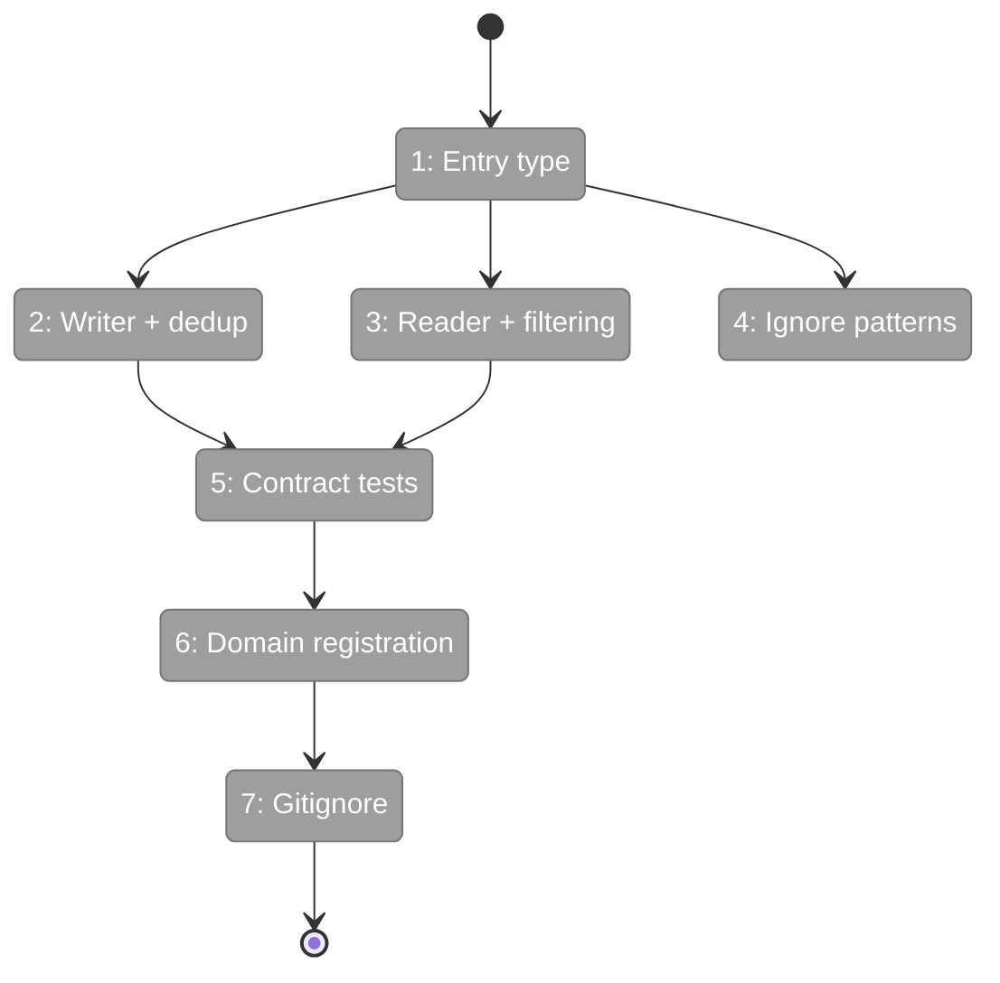
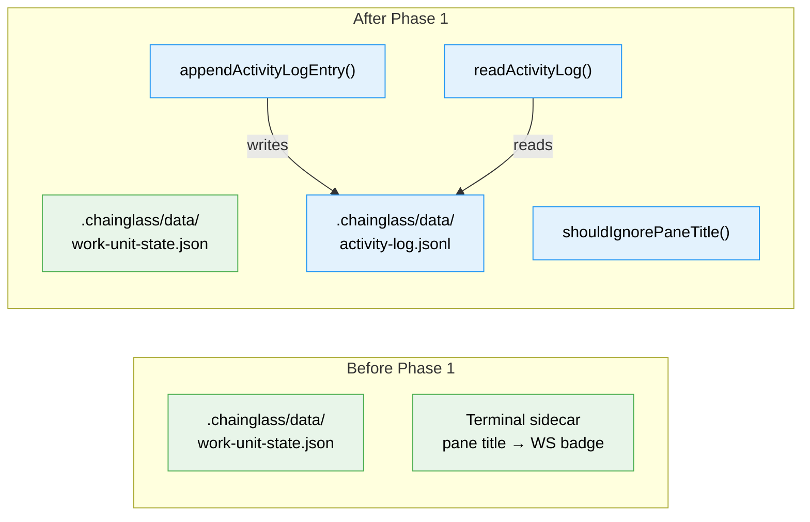

# Flight Plan: Phase 1 — Types, Writer, Reader

**Plan**: [activity-log-plan.md](../../activity-log-plan.md)
**Phase**: Phase 1: Activity Log Domain — Types, Writer, Reader
**Generated**: 2026-03-06
**Status**: Ready for takeoff

---

## Departure → Destination

**Where we are**: No activity-log domain exists. The terminal sidecar polls pane titles and sends them as WS messages for a badge display — there's no per-worktree persistence. The `.chainglass/data/` directory convention exists (used by work-unit-state) but nothing writes activity logs.

**Where we're going**: A developer can import `appendActivityLogEntry()` and `readActivityLog()` from the activity-log feature. The writer appends JSONL entries to `<worktree>/.chainglass/data/activity-log.jsonl` with automatic dedup. The reader loads and filters entries. The `shouldIgnorePaneTitle()` filter handles cross-OS tmux noise. Contract tests verify behavioral correctness. The activity-log domain is registered and documented.

---

## Domain Context

### Domains We're Changing

| Domain | What Changes | Key Files |
|--------|-------------|-----------|
| activity-log (NEW) | Create entire domain: types, writer, reader, ignore patterns | `apps/web/src/features/065-activity-log/` |

### Domains We Depend On (no changes)

| Domain | What We Consume | Contract |
|--------|----------------|----------|
| (none) | Phase 1 is greenfield | — |

---

## Flight Status

**Legend**: grey = pending | yellow = active | red = blocked/needs input | green = done

---

## Stages

- [ ] **Stage 1: Define entry type** — Create `ActivityLogEntry` with `id`, `source`, `label`, `timestamp`, `meta?` (`types.ts`)
- [ ] **Stage 2: Build writer with TDD** — `appendActivityLogEntry()` with JSONL append + 50-line dedup lookback (`activity-log-writer.ts` — new file)
- [ ] **Stage 3: Build reader with TDD** — `readActivityLog()` with limit/since/source filtering (`activity-log-reader.ts` — new file)
- [ ] **Stage 4: Build ignore list with TDD** — `shouldIgnorePaneTitle()` with cross-OS patterns (`ignore-patterns.ts` — new file)
- [ ] **Stage 5: Contract test factory** — Conformance tests for writer/reader with temp dirs (`activity-log.contract.ts` — new file)
- [ ] **Stage 6: Register domain** — domain.md, registry.md, domain-map.md updates
- [ ] **Stage 7: Gitignore** — Add `**/activity-log.jsonl` pattern

---

## Architecture: Before & After

**Legend**: existing (green, unchanged) | new (blue, created)

---

## Acceptance Criteria

- [ ] AC-04: Consecutive identical labels for the same id are deduplicated
- [ ] AC-05: Activity log survives server restarts (persisted to disk)
- [ ] AC-10: Writer is general-purpose (`{ source, label, id, timestamp, meta? }`)
- [ ] AC-11: Reader returns last 200 entries by default
- [ ] AC-12: Ignore list is configurable regex array per source
- [ ] AC-14: `activity-log.jsonl` is gitignored

## Goals & Non-Goals

**Goals**: Types, writer with dedup, reader with filtering, ignore patterns, contract tests, domain registration, gitignore
**Non-Goals**: No sidecar integration, no UI overlay, no SSE, no log rotation

---

## Checklist

- [ ] T001: Create `ActivityLogEntry` type
- [ ] T002: Implement `appendActivityLogEntry()` with dedup (TDD)
- [ ] T003: Implement `readActivityLog()` with filtering (TDD)
- [ ] T004: Implement `shouldIgnorePaneTitle()` (TDD)
- [ ] T005: Create contract test factory
- [ ] T006: Create domain.md + update registry + domain-map
- [ ] T007: Add `activity-log.jsonl` to `.gitignore`
