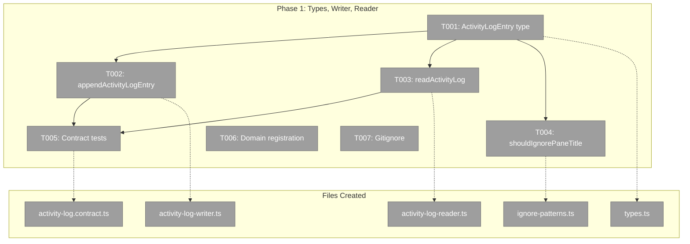
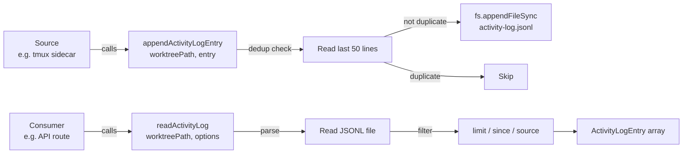
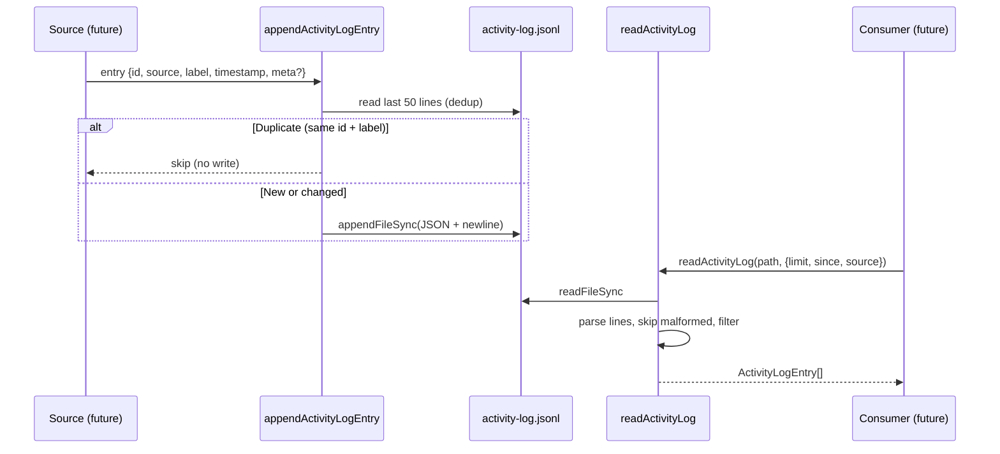

# Phase 1: Activity Log Domain — Types, Writer, Reader

## Executive Briefing

- **Purpose**: Create the activity-log domain with general-purpose persistence utilities. This is the foundation layer — types, writer, reader, ignore list — that all future phases and sources build on.
- **What We're Building**: A JSONL-based append-only activity log per worktree. Pure functions callable from any Node.js context (sidecar, Next.js server, CLI, tests). No DI, no classes.
- **Goals**:
  - ✅ `ActivityLogEntry` type with `meta` bag for source-specific metadata
  - ✅ `appendActivityLogEntry()` with dedup (skip same id+label)
  - ✅ `readActivityLog()` with limit/since/source filtering
  - ✅ `shouldIgnorePaneTitle()` with comprehensive cross-OS patterns
  - ✅ Contract test factory for writer/reader behavioral parity
  - ✅ Domain registration (domain.md, registry, domain-map)
  - ✅ Gitignore `activity-log.jsonl`
- **Non-Goals**:
  - ❌ No sidecar integration (Phase 2)
  - ❌ No UI overlay (Phase 3)
  - ❌ No SSE broadcasting (future)
  - ❌ No log rotation or archival

## Pre-Implementation Check

| File | Exists? | Domain Check | Notes |
|------|---------|-------------|-------|
| `apps/web/src/features/065-activity-log/` | CREATE | activity-log ✓ | New feature directory |
| `apps/web/src/features/065-activity-log/types.ts` | CREATE | activity-log ✓ | Entry type + meta |
| `apps/web/src/features/065-activity-log/lib/activity-log-writer.ts` | CREATE | activity-log ✓ | Pure function writer |
| `apps/web/src/features/065-activity-log/lib/activity-log-reader.ts` | CREATE | activity-log ✓ | Pure function reader |
| `apps/web/src/features/065-activity-log/lib/ignore-patterns.ts` | CREATE | activity-log ✓ | Tmux ignore list |
| `docs/domains/activity-log/domain.md` | CREATE | activity-log ✓ | Domain definition |
| `docs/domains/registry.md` | MODIFY | _platform ✓ | Add activity-log row |
| `docs/domains/domain-map.md` | MODIFY | _platform ✓ | Add activity-log node |
| `test/unit/web/features/065-activity-log/` | CREATE | activity-log ✓ | Test directory |
| `test/contracts/activity-log.contract.ts` | CREATE | activity-log ✓ | Contract test factory |
| `.gitignore` | MODIFY | root ✓ | Add activity-log.jsonl pattern |

**Concept dedup**: No existing activity-log, audit-log, or JSONL-append utilities. `events-jsonl-parser.ts` exists but is tightly coupled to `AgentEvent` — reference its error-handling pattern (skip malformed lines) but don't reuse. `native-file-watcher.adapter.ts` has a `compileIgnorePatterns()` pattern to reference for the ignore list.

## Architecture Map



## Tasks

| Status | ID | Task | Domain | Path(s) | Done When | Notes |
|--------|-----|------|--------|---------|-----------|-------|
| [ ] | T001 | Create `ActivityLogEntry` type | activity-log | `apps/web/src/features/065-activity-log/types.ts` | Type exports `ActivityLogEntry` with required fields (`id`, `source`, `label`, `timestamp`) and optional `meta?: Record<string, unknown>`. Exports `ACTIVITY_LOG_FILE` constant (`activity-log.jsonl`). | Per workshop schema. `meta` bag keeps writer source-agnostic. |
| [ ] | T002 | Implement `appendActivityLogEntry()` with dedup | activity-log | `apps/web/src/features/065-activity-log/lib/activity-log-writer.ts`, `test/unit/web/features/065-activity-log/activity-log-writer.test.ts` | TDD. Function appends JSONL line to `<worktree>/.chainglass/data/activity-log.jsonl`. Creates directory if missing. Dedup: reads last 50 lines, skips write if last entry for same `id` has same `label`. Tests: (1) appends valid entry, (2) creates directory, (3) dedup skips duplicate, (4) dedup allows different label, (5) handles empty/missing file, (6) skips malformed lines during dedup scan. | Per workshop §Writer Contract. Use `fs.appendFileSync`. `DEDUP_LOOKBACK = 50` constant. DYK-01: Dedup reads entire file — acceptable for now, optimize with caller-side cache if perf issues arise. |
| [ ] | T003 | Implement `readActivityLog()` with filtering | activity-log | `apps/web/src/features/065-activity-log/lib/activity-log-reader.ts`, `test/unit/web/features/065-activity-log/activity-log-reader.test.ts` | TDD. Function reads JSONL file, parses line-by-line, skips malformed. Options: `limit` (default 200, from end), `since` (ISO timestamp filter), `source` (string filter). Returns `ActivityLogEntry[]` chronological (oldest first — consumers reverse for display per DYK-03). Tests: (1) reads valid entries, (2) skips malformed lines, (3) respects limit, (4) filters by since, (5) filters by source, (6) returns empty for missing file, (7) handles empty file. | Per workshop §Reader Contract. DYK-03: Returns oldest-first; overlay must `.reverse()` for display. |
| [ ] | T004 | Implement `shouldIgnorePaneTitle()` | activity-log | `apps/web/src/features/065-activity-log/lib/ignore-patterns.ts`, `test/unit/web/features/065-activity-log/ignore-patterns.test.ts` | TDD. Exports `TMUX_PANE_TITLE_IGNORE` regex array and `shouldIgnorePaneTitle(title: string): boolean`. Patterns: `*.localdomain`, `*.local`, empty string, shell names (`bash`, `zsh`, `fish`, `-bash`, `-zsh`), bare paths (`~/...`, `/...`). Tests: (1) ignores Mac.localdomain, (2) ignores Jordans-MacBook-Pro.local, (3) ignores empty, (4) ignores `bash`/`zsh`/`fish`/`-bash`, (5) allows "Implementing Phase 1", (6) allows emoji prefixed titles like "🤖 Exploring codebase". | DYK-02: Tmux-specific but lives here for now. May move to terminal domain in Phase 2 when sidecar integrates. |
| [ ] | T005 | Create roundtrip integration test | activity-log | `test/contracts/activity-log.contract.ts` | Write-then-read roundtrip integration test with temp directories. Verifies: (1) write-then-read roundtrip, (2) dedup behavior, (3) limit filtering, (4) malformed line resilience. Tests pass. | DYK-04: Simplified from full contract factory — no fake implementation exists, so roundtrip test provides same confidence with less ceremony. |
| [ ] | T006 | Create domain.md + update registry + domain-map | activity-log | `docs/domains/activity-log/domain.md`, `docs/domains/registry.md`, `docs/domains/domain-map.md` | domain.md created with Purpose, Concepts (ActivityLogEntry, source, label, id, meta, dedup, ignore), Contracts table, Dependencies (terminal, _platform/panel-layout), History. registry.md has new row. domain-map.md has activity-log node with edges. | Per finding 03. |
| [ ] | T007 | Add `activity-log.jsonl` to `.gitignore` | activity-log | `.gitignore` | Pattern `**/activity-log.jsonl` added. Verified: `git check-ignore .chainglass/data/activity-log.jsonl` returns match. | Per clarification Q9. |

## Context Brief

**Key findings from plan**:
- Finding 03: No existing "activity log" concept in any domain — safe to create new domain
- Finding 07: Hostname ignore list incomplete for non-macOS — expand with shell names, login shells
- Finding 08: Constitution P2 (interface-first) deviation documented — pure functions are testable via parameter injection

**Domain dependencies** (this phase consumes nothing — greenfield):
- None. Phase 1 creates the activity-log domain from scratch.

**Domain constraints**:
- Writer/reader are pure functions, NOT class instances (workshop decision)
- Writer does NOT filter content — sources own their ignore logic (workshop §Ignore Lists)
- Dedup is the writer's responsibility, not the source's (workshop §Design Principles)
- JSONL format: one JSON object per line, `fs.appendFileSync` (workshop §File Format)
- File location: `<worktree>/.chainglass/data/activity-log.jsonl` (ADR-0008 Layer 2 path, but gitignored)

**Reusable patterns**:
- `events-jsonl-parser.ts`: line-parsing + graceful malformed-line skip pattern
- `native-file-watcher.adapter.ts`: `compileIgnorePatterns()` / `isIgnored()` regex array pattern
- `WorkUnitStateService`: `mkdirSync(dir, { recursive: true })` + best-effort persistence pattern
- `test/contracts/work-unit-state.contract.test.ts`: contract test factory structure

**Data flow**:



**Entry lifecycle**:



## Discoveries & Learnings

_Populated during implementation by plan-6._

| Date | Task | Type | Discovery | Resolution | References |
|------|------|------|-----------|------------|------------|

---

```
docs/plans/065-activity-log/
  ├── activity-log-spec.md
  ├── activity-log-plan.md
  ├── research-dossier.md
  ├── workshops/
  │   └── 001-activity-log-writer-general-utility.md
  ├── issues/
  │   └── feature-worktree-activity-log.md
  └── tasks/
      └── phase-1-types-writer-reader/
          ├── tasks.md              ← this file
          ├── tasks.fltplan.md      ← flight plan
          └── execution.log.md     # created by plan-6
```
