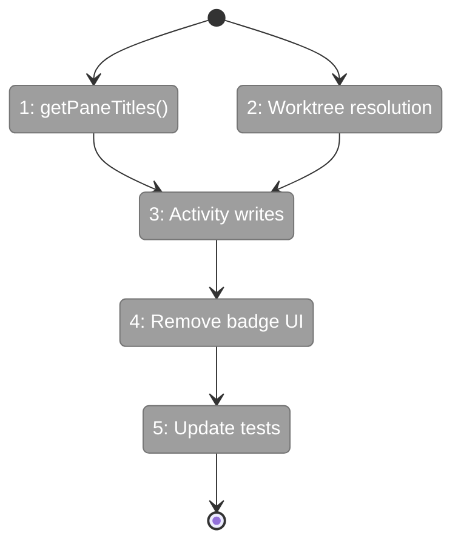
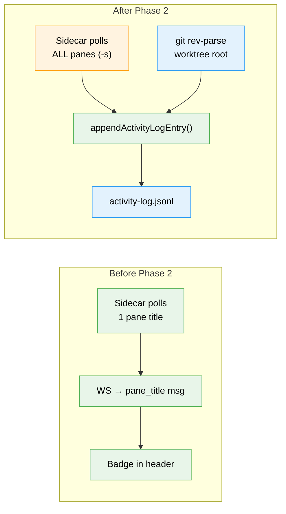

# Flight Plan: Phase 2 — Sidecar Multi-Pane Polling + Activity Writes

**Plan**: [activity-log-plan.md](../../activity-log-plan.md)
**Phase**: Phase 2: Terminal Sidecar — Multi-Pane Polling + Activity Writes
**Generated**: 2026-03-06
**Status**: Landed

---

## Departure → Destination

**Where we are**: Phase 1 delivered the activity-log domain with pure function writer/reader/ignore-patterns (32 tests passing). The terminal sidecar currently polls a single pane title and sends it as a WS message for a badge display in the terminal header (PR #37 stepping-stone code). No activity is written to disk.

**Where we're going**: The terminal sidecar polls ALL panes across ALL windows in the tmux session, filters noise via `shouldIgnorePaneTitle()`, and writes entries to `<worktree>/.chainglass/data/activity-log.jsonl` via `appendActivityLogEntry()`. The pane title badge UI is removed. After restarting the sidecar, `activity-log.jsonl` files appear and grow as agents work.

---

## Domain Context

### Domains We're Changing

| Domain | What Changes | Key Files |
|--------|-------------|-----------|
| terminal | Add `getPaneTitles()`, replace badge poll with activity writes, resolve worktree root, remove badge UI | `tmux-session-manager.ts`, `terminal-ws.ts`, 7 UI components |

### Domains We Depend On (no changes)

| Domain | What We Consume | Contract |
|--------|----------------|----------|
| activity-log | Write entries + filter noise | `appendActivityLogEntry()`, `shouldIgnorePaneTitle()` |

---

## Flight Status

**Legend**: grey = pending | yellow = active | red = blocked/needs input | green = done

---

## Stages

- [x] **Stage 1: Add getPaneTitles()** — multi-window pane listing with `-s` flag, TDD (`tmux-session-manager.ts`)
- [x] **Stage 2: Resolve worktree root** — `git rev-parse --show-toplevel` in handleConnection (`terminal-ws.ts`)
- [x] **Stage 3: Replace badge poll with activity writes** — import Phase 1 utilities, write entries (`terminal-ws.ts`)
- [x] **Stage 4: Remove badge UI** — strip paneTitle/onPaneTitle from 7 components + hook + types
- [x] **Stage 5: Update tests** — add getPaneTitles tests, keep getPaneTitle tests

---

## Architecture: Before & After

**Legend**: existing (green) | changed (orange) | new (blue) | removed (red, not shown — badge code deleted)

---

## Acceptance Criteria

- [ ] AC-01: Pane title changes append entries to `<worktree>/.chainglass/data/activity-log.jsonl`
- [ ] AC-02: All panes across all windows in the tmux session are polled
- [ ] AC-03: Hostname/default/shell pane titles are filtered out
- [ ] AC-04: Consecutive identical labels for the same id are deduplicated
- [ ] AC-05: Activity log survives server restarts (persisted to disk)

## Goals & Non-Goals

**Goals**: Multi-pane polling, worktree resolution, activity writes to disk, remove badge UI
**Non-Goals**: No overlay panel, no API route, no SSE broadcasting

---

## Checklist

- [x] T001: Add `getPaneTitles()` to TmuxSessionManager (TDD)
- [x] T002: Add worktree root resolution in sidecar
- [x] T003: Replace pane title polling with activity log writes
- [x] T004: Remove pane title badge from terminal UI (7 files)
- [x] T005: Update terminal tests
