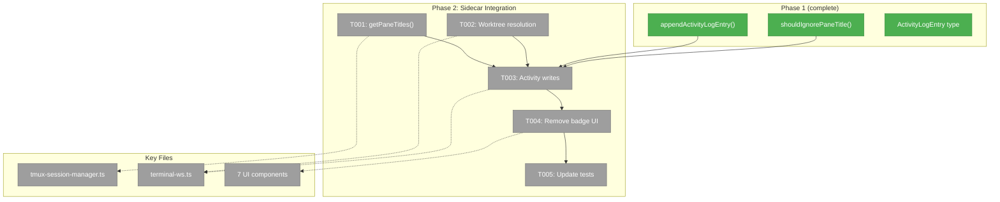
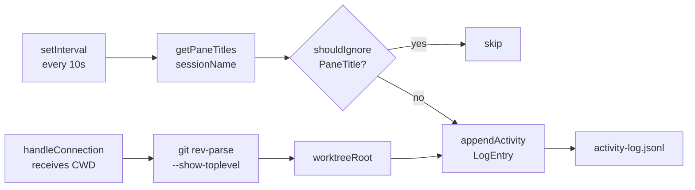
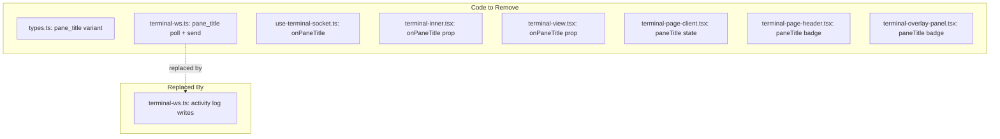

# Phase 2: Terminal Sidecar — Multi-Pane Polling + Activity Writes

## Executive Briefing

- **Purpose**: Extend the terminal sidecar to poll all tmux panes across all windows and write activity entries to disk using the Phase 1 persistence utilities. This replaces the single-pane badge approach from PR #37.
- **What We're Building**: The sidecar resolves the worktree root from CWD, polls all panes via `getPaneTitles()`, filters noise via `shouldIgnorePaneTitle()`, and appends entries via `appendActivityLogEntry()`. The pane title badge UI code is removed entirely.
- **Goals**:
  - ✅ `getPaneTitles()` method polling ALL panes across ALL windows in a session
  - ✅ Worktree root resolution via `git rev-parse --show-toplevel`
  - ✅ Sidecar writes activity entries using Phase 1 writer
  - ✅ Remove pane title badge from 7 terminal UI components
  - ✅ Remove `pane_title` WS message type
  - ✅ Tests for multi-pane polling and worktree resolution
- **Non-Goals**:
  - ❌ No overlay panel UI (Phase 3)
  - ❌ No API route for reading entries (Phase 3)
  - ❌ No SSE broadcasting (future)

## Prior Phase Context

### Phase 1: Types, Writer, Reader

**A. Deliverables**:
- `apps/web/src/features/065-activity-log/types.ts` — `ActivityLogEntry`, `ACTIVITY_LOG_FILE`, `ACTIVITY_LOG_DIR`
- `apps/web/src/features/065-activity-log/lib/activity-log-writer.ts` — `appendActivityLogEntry()`
- `apps/web/src/features/065-activity-log/lib/activity-log-reader.ts` — `readActivityLog()`
- `apps/web/src/features/065-activity-log/lib/ignore-patterns.ts` — `shouldIgnorePaneTitle()`, `TMUX_PANE_TITLE_IGNORE`

**B. Dependencies Exported**:
- `appendActivityLogEntry(worktreePath: string, entry: ActivityLogEntry): void`
- `shouldIgnorePaneTitle(title: string): boolean`
- `ActivityLogEntry` type: `{ id, source, label, timestamp, meta? }`

**C. Gotchas & Debt**:
- DYK-01: Dedup reads entire file (50-line lookback) — acceptable for now
- DYK-02: `shouldIgnorePaneTitle` lives in activity-log domain, may move to terminal in this phase
- Reader returns newest-first (consumers don't need to reverse)

**D. Incomplete Items**: None — all 7 tasks completed.

**E. Patterns to Follow**:
- Pure functions (no class/DI) — import and call directly
- Source-agnostic writer — pass `{ id: 'tmux:X.Y', source: 'tmux', label, timestamp, meta }`
- Regex array ignore patterns via `shouldIgnorePaneTitle()`

## Pre-Implementation Check

| File | Exists? | Action | Domain | Notes |
|------|---------|--------|--------|-------|
| `064-terminal/server/tmux-session-manager.ts` | ✅ | MODIFY | terminal | Add `getPaneTitles()`, keep `getPaneTitle()` |
| `064-terminal/server/terminal-ws.ts` | ✅ | MODIFY | terminal | Replace pane title poll with activity writes |
| `064-terminal/components/terminal-page-header.tsx` | ✅ | MODIFY | terminal | Remove `paneTitle` prop |
| `064-terminal/components/terminal-overlay-panel.tsx` | ✅ | MODIFY | terminal | Remove `paneTitle` state + badge |
| `064-terminal/components/terminal-inner.tsx` | ✅ | MODIFY | terminal | Remove `onPaneTitle` prop |
| `064-terminal/components/terminal-view.tsx` | ✅ | MODIFY | terminal | Remove `onPaneTitle` prop |
| `064-terminal/components/terminal-page-client.tsx` | ✅ | MODIFY | terminal | Remove `paneTitle` state |
| `064-terminal/hooks/use-terminal-socket.ts` | ✅ | MODIFY | terminal | Remove `pane_title` handling |
| `064-terminal/types.ts` | ✅ | MODIFY | terminal | Remove `pane_title` from union |
| `test/.../tmux-session-manager.test.ts` | ✅ | MODIFY | terminal | Add getPaneTitles tests |
| `065-activity-log/lib/activity-log-writer.ts` | ✅ | CONSUME | activity-log | Import for sidecar writes |
| `065-activity-log/lib/ignore-patterns.ts` | ✅ | CONSUME | activity-log | Import for filtering |

**Concept check**: `getPaneTitles` does NOT exist yet — must be created. `getPaneTitle` (singular) exists and will be kept for backward compatibility.

## Architecture Map



## Tasks

| Status | ID | Task | Domain | Path(s) | Done When | Notes |
|--------|-----|------|--------|---------|-----------|-------|
| [x] | T001 | Add `getPaneTitles()` to TmuxSessionManager | terminal | `apps/web/src/features/064-terminal/server/tmux-session-manager.ts`, `test/unit/web/features/064-terminal/tmux-session-manager.test.ts` | TDD. Method returns `Array<{pane: string, title: string}>` for all panes across all windows. Uses `tmux list-panes -t <session> -s -F '#{window_index}.#{pane_index}\t#{pane_title}'`. Tests: (1) parses multi-window output, (2) handles single pane, (3) returns empty on error. Keep existing `getPaneTitle()` for backward compat. | Per finding 02: `-s` flag lists across all windows |
| [x] | T002 | Add worktree root resolution in sidecar | terminal | `apps/web/src/features/064-terminal/server/terminal-ws.ts` | In `handleConnection()`, resolve CWD to worktree root via `deps.execCommand('git', ['rev-parse', '--show-toplevel'])` wrapped in try/catch. Falls back to CWD on any error (bare repo, non-git dir, git not installed). Store resolved path in connection scope. | DYK-P2-02: git rev-parse throws in bare repos and non-git dirs — must try/catch, not null-check |
| [x] | T003 | Replace pane title polling with activity log writes | terminal | `apps/web/src/features/064-terminal/server/terminal-ws.ts` | Polling loop calls `getPaneTitles()`, filters each with `shouldIgnorePaneTitle()`, writes via `appendActivityLogEntry()`. Remove `pane_title` WS message sending. Rename `PANE_TITLE_POLL_MS` → `ACTIVITY_LOG_POLL_MS`. Remove `paneTitleIntervals` tracking set. Accept per-connection polling — dedup handles multi-tab duplication. | DYK-P2-01: Polling is per-WS connection, not per-session. Dedup catches duplicates across tabs. DYK-P2-04: Rename env var to reflect new purpose. DYK-P2-05: Cross-feature import from 065-activity-log is documented in domain-map. |
| [x] | T004 | Remove pane title badge from terminal UI | terminal | `terminal-page-header.tsx`, `terminal-overlay-panel.tsx`, `terminal-inner.tsx`, `terminal-view.tsx`, `terminal-page-client.tsx`, `use-terminal-socket.ts`, `types.ts` | Remove: `paneTitle` prop/state from 5 components, `onPaneTitle` callback from 3 components, `pane_title` from `TerminalMessage` union, `pane_title` from WS control whitelist, `onPaneTitleRef` from hook. All 7 files compile without pane title references. | Clean removal of PR #37 stepping-stone code |
| [x] | T005 | Update terminal tests | terminal | `test/unit/web/features/064-terminal/tmux-session-manager.test.ts` | Add 3+ tests for `getPaneTitles()`. Keep existing `getPaneTitle()` tests (method still exported). All tests pass. | DYK-P2-03: Don't delete getPaneTitle tests — method still exists as public API |

## Context Brief

**Key findings from plan**:
- Finding 01 (Critical): CWD ≠ worktree path — sidecar must resolve via `git rev-parse --show-toplevel`
- Finding 02 (Critical): `tmux list-panes -t <session>` only lists active window panes — use `-s` flag for all windows
- Finding 08: Constitution P2 deviation documented — pure functions testable via parameter injection

**Domain dependencies (this phase consumes)**:
- `activity-log`: `appendActivityLogEntry()` (`065-activity-log/lib/activity-log-writer.ts`) — write entries to disk
- `activity-log`: `shouldIgnorePaneTitle()` (`065-activity-log/lib/ignore-patterns.ts`) — filter noise
- `activity-log`: `ActivityLogEntry` type (`065-activity-log/types.ts`) — entry shape

**Domain constraints**:
- Terminal sidecar is a standalone Node.js process — no Next.js, no DI container
- `execCommand` is injectable via `TerminalServerDeps` — use it for `git rev-parse`
- `getPaneTitles()` uses same injectable `exec` as all other tmux commands
- Activity log imports are direct (pure functions, no DI needed)

**Reusable from Phase 1**:
- `FakeTmuxExecutor` for testing `getPaneTitles()` — configure responses per command
- Temp directory pattern for activity log write verification
- `makeEntry()` test helper for creating `ActivityLogEntry` fixtures

**Data flow**:



**Removal scope (PR #37 badge code)**:



## Discoveries & Learnings

_Populated during implementation by plan-6._

| Date | Task | Type | Discovery | Resolution | References |
|------|------|------|-----------|------------|------------|

---

```
docs/plans/065-activity-log/
  ├── activity-log-plan.md
  └── tasks/
      ├── phase-1-types-writer-reader/
      │   ├── tasks.md
      │   ├── tasks.fltplan.md
      │   └── execution.log.md
      └── phase-2-sidecar-multi-pane/
          ├── tasks.md              ← this file
          ├── tasks.fltplan.md      ← flight plan
          └── execution.log.md     # created by plan-6
```
