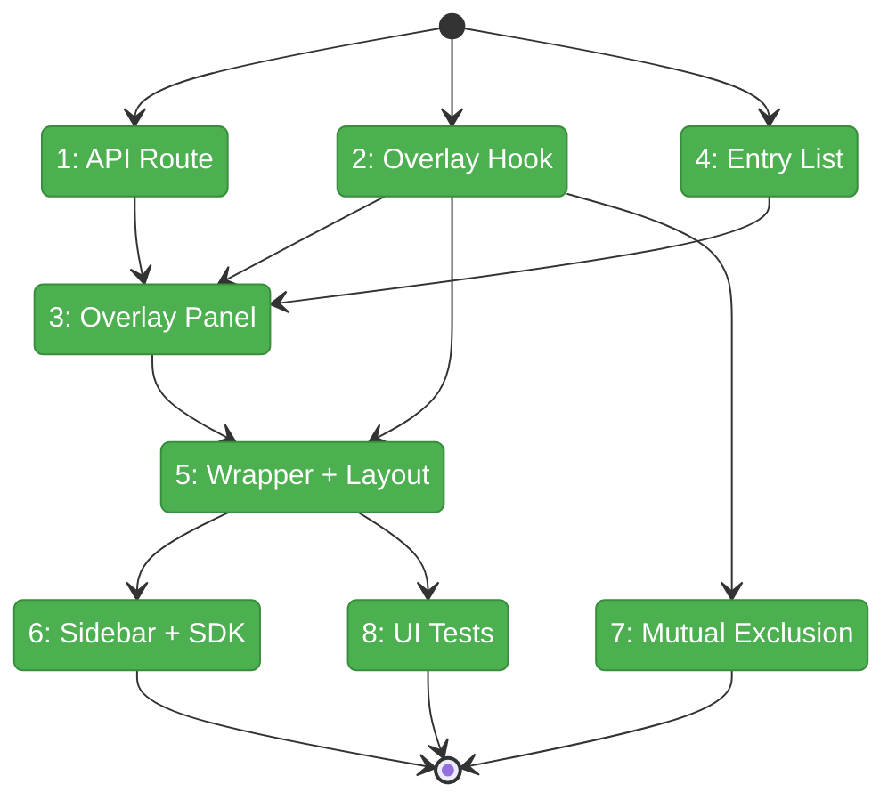
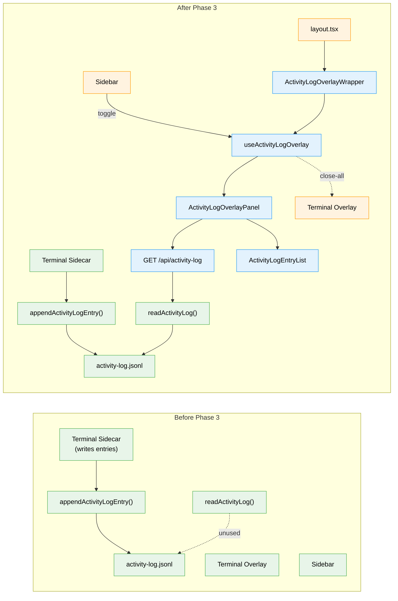

# Flight Plan: Phase 3 — Overlay Panel + Sidebar Button

**Plan**: [activity-log-plan.md](../../activity-log-plan.md)
**Phase**: Phase 3: Overlay Panel + Sidebar Button
**Generated**: 2026-03-06
**Status**: Landed

---

## Departure → Destination

**Where we are**: Phases 1–2 are complete. The activity-log domain has a working persistence layer (JSONL writer with dedup, reader with filtering) and the terminal sidecar writes entries to disk every 10 seconds. Entries accumulate in `<worktree>/.chainglass/data/activity-log.jsonl` but there is no way to view them — no API route, no UI, no sidebar button.

**Where we're going**: A developer can click an "Activity" button in the workspace sidebar (or press a keyboard shortcut) to see a reverse-chronological overlay showing what agents and terminal sessions have been doing. The overlay pops over the editor area, groups entries by work session (30-minute gaps), and closes on Escape. Opening it automatically closes the terminal overlay (and vice versa).

---

## Domain Context

### Domains We're Changing

| Domain | What Changes | Key Files |
|--------|-------------|-----------|
| activity-log | Add API route, overlay hook/provider, overlay panel, entry list, wrapper | `app/api/activity-log/route.ts`, `features/065-activity-log/hooks/`, `features/065-activity-log/components/` |
| terminal | Add `overlay:close-all` listener for mutual exclusion | `use-terminal-overlay.tsx` |
| _platform | Add nav item, SDK command, sidebar toggle button | `navigation-utils.ts`, `sdk-bootstrap.ts`, `dashboard-sidebar.tsx` |

### Domains We Depend On (no changes)

| Domain | What We Consume | Contract |
|--------|----------------|----------|
| activity-log (Phase 1) | Read entries from disk | `readActivityLog()`, `ActivityLogEntry` type |
| _platform/panel-layout | Overlay positioning | `data-terminal-overlay-anchor` attribute |

---

## Flight Status

<!-- Updated by /plan-6-v2: pending → active → done. Use blocked for problems/input needed. -->

**Legend**: grey = pending | yellow = active | red = blocked/needs input | green = done

---

## Stages

<!-- Updated by /plan-6-v2 during implementation: [ ] → [~] → [x] -->

- [x] **Stage 1: API Route** — Create `GET /api/activity-log` with auth, path validation, and `readActivityLog()` call (`route.ts` — new file)
- [x] **Stage 2: Overlay Hook + Provider** — Create `useActivityLogOverlay()` with toggle/open/close, `activity-log:toggle` listener, `overlay:close-all` dispatch/listen (`use-activity-log-overlay.tsx` — new file)
- [x] **Stage 3: Entry List** — Create `ActivityLogEntryList` with source icons, relative timestamps, 30min gap separators, empty state (`activity-log-entry-list.tsx` — new file)
- [x] **Stage 4: Overlay Panel** — Create `ActivityLogOverlayPanel` with anchor measurement, API fetch, Escape close, lazy load (`activity-log-overlay-panel.tsx` — new file)
- [x] **Stage 5: Wrapper + Layout Mount** — Create wrapper with provider + error boundary + dynamic import; mount in workspace layout (`activity-log-overlay-wrapper.tsx` — new file, `layout.tsx` — modify)
- [x] **Stage 6: Sidebar + SDK** — Add nav item, SDK command, sidebar toggle button (`navigation-utils.ts`, `sdk-bootstrap.ts`, `dashboard-sidebar.tsx` — modify)
- [x] **Stage 7: Mutual Exclusion** — Add `overlay:close-all` listener to terminal overlay; terminal dispatches before opening too (`use-terminal-overlay.tsx` — modify)
- [x] **Stage 8: UI Tests** — Entry list rendering, gap separators, empty state (`activity-log-overlay.test.ts` — new file)

---

## Architecture: Before & After

**Legend**: existing (green, unchanged) | changed (orange, modified) | new (blue, created)

---

## Acceptance Criteria

- [ ] AC-06: Sidebar button toggles overlay (visible only with worktree selected)
- [ ] AC-07: Overlay pops over editor area, reverse chronological order
- [ ] AC-08: Overlay closes on Escape key press
- [ ] AC-09: Terminal and activity log overlays are mutually exclusive
- [ ] AC-11: Reader returns last 200 entries by default (API passes through)
- [ ] AC-13: Gap separators render between entries >30min apart

## Goals & Non-Goals

**Goals**:
- ✅ API route to read activity log entries
- ✅ Overlay panel with entry list and gap separators
- ✅ Sidebar button + SDK command
- ✅ Mutual exclusion with terminal overlay

**Non-Goals**:
- ❌ Real-time streaming (SSE)
- ❌ Search/filtering UI
- ❌ Sidebar badge
- ❌ Log rotation

---

## Checklist

- [x] T001: Create API route `GET /api/activity-log`
- [x] T002: Create `useActivityLogOverlay()` hook + provider
- [ ] T003: Create `ActivityLogOverlayPanel` component
- [~] T004: Create `ActivityLogEntryList` with gap separators
- [ ] T005: Create `ActivityLogOverlayWrapper` + mount in layout
- [ ] T006: Add sidebar button + SDK command
- [ ] T007: Add mutual exclusion to terminal overlay
- [ ] T008: Lightweight UI tests
