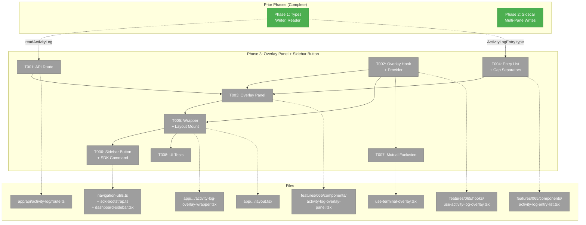
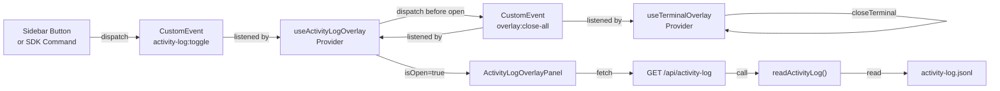
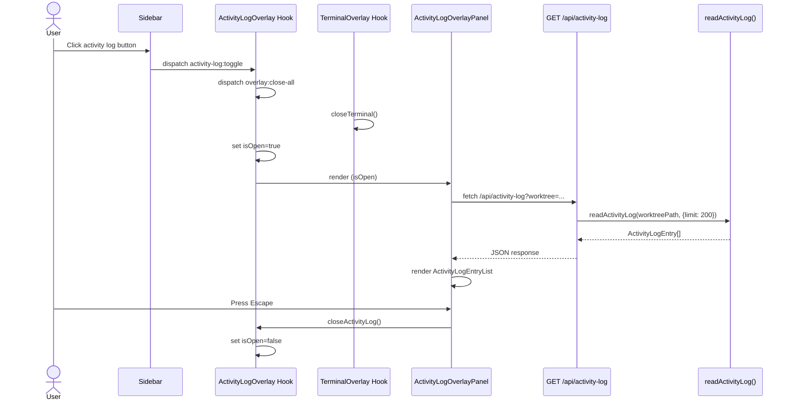

# Phase 3: Overlay Panel + Sidebar Button — Tasks Dossier

**Plan**: [activity-log-plan.md](../../activity-log-plan.md)
**Phase**: Phase 3: Overlay Panel + Sidebar Button
**Created**: 2026-03-06
**Testing Approach**: Hybrid — lightweight rendering tests, no mocks, fixtures only

---

## Executive Briefing

**Purpose**: Build the user-facing UI for the activity log — an overlay panel that displays the persisted activity timeline, a sidebar button to toggle it, and mutual exclusion with the existing terminal overlay. This phase connects the Phase 1 persistence layer to the Phase 2 sidecar writes via a read API route and overlay panel.

**What We're Building**: A `GET /api/activity-log` route that reads entries from disk, a React context provider + hook managing overlay state, a fixed-position overlay panel that anchors to the same element as the terminal overlay, an entry list with 30-minute gap separators and source icons, a sidebar button, an SDK command, and mutual exclusion between overlays via `overlay:close-all` custom events.

**Goals**:
- ✅ API route to read activity log entries for a worktree
- ✅ Overlay panel with reverse-chronological entry list and gap separators
- ✅ Sidebar button + SDK command for quick toggle
- ✅ Mutual exclusion: opening activity log closes terminal overlay (and vice versa)
- ✅ Escape key closes overlay

**Non-Goals**:
- ❌ Real-time streaming / SSE (future enhancement)
- ❌ Full-text search of activity history
- ❌ Sidebar badge showing unread count
- ❌ Entry filtering UI (source dropdown, date range)
- ❌ Log rotation or archival

---

## Prior Phase Context

### Phase 1: Activity Log Domain — Types, Writer, Reader

**A. Deliverables**:
- `apps/web/src/features/065-activity-log/types.ts` — `ActivityLogEntry` type, `ACTIVITY_LOG_FILE`, `ACTIVITY_LOG_DIR` constants
- `apps/web/src/features/065-activity-log/lib/activity-log-writer.ts` — `appendActivityLogEntry()` with 50-line dedup
- `apps/web/src/features/065-activity-log/lib/activity-log-reader.ts` — `readActivityLog()` with limit/since/source filtering
- `apps/web/src/features/065-activity-log/lib/ignore-patterns.ts` — `shouldIgnorePaneTitle()` with hostname detection
- `test/unit/web/features/065-activity-log/*.test.ts` — 27 unit tests
- `test/contracts/activity-log.contract.test.ts` — 5 roundtrip tests
- `docs/domains/activity-log/domain.md` — Domain definition

**B. Dependencies Exported**:
- `ActivityLogEntry` — `{id, source, label, timestamp, meta?: Record<string, unknown>}`
- `ACTIVITY_LOG_FILE` = `"activity-log.jsonl"`
- `ACTIVITY_LOG_DIR` = `.chainglass/data`
- `appendActivityLogEntry(worktreePath: string, entry: ActivityLogEntry): void`
- `readActivityLog(worktreePath: string, options?: {limit?, since?, source?}): ActivityLogEntry[]` — returns newest-first
- `shouldIgnorePaneTitle(title: string): boolean`

**C. Gotchas & Debt**:
- Dedup reads entire file for 50-line lookback — O(n) on file size, acceptable for now
- Reader returns newest-first (reversed from disk order)
- `since` filtering uses `Date.parse()` for proper ISO timestamp comparison

**D. Incomplete Items**: None — all tasks complete.

**E. Patterns to Follow**:
- Pure functions, no DI/classes — callable from sidecar, Next.js, tests
- JSONL format via `fs.appendFileSync`
- Graceful malformed-line handling (skip, don't crash)
- Contract test factory for writer/reader parity

### Phase 2: Terminal Sidecar — Multi-Pane Polling + Activity Writes

**A. Deliverables**:
- `apps/web/src/features/064-terminal/server/tmux-session-manager.ts` — `getPaneTitles()` method
- `apps/web/src/features/064-terminal/server/terminal-ws.ts` — Rewired polling to activity log writes
- 7 terminal UI files cleaned (badge code removed)
- `test/unit/web/features/064-terminal/tmux-session-manager.test.ts` — 4 new tests

**B. Dependencies Exported**:
- `getPaneTitles(sessionName: string): Array<{pane: string, title: string}>`
- Cross-feature import: terminal → activity-log (documented in domain-map)

**C. Gotchas & Debt**:
- `tmux list-panes -s` flag required for multi-window pane listing
- `git rev-parse --show-toplevel` must use `-C cwd` flag
- `appendActivityLogEntry()` must be wrapped in try/catch in sidecar (crash safety)
- Polling per WebSocket connection — dedup handles multi-tab duplication

**D. Incomplete Items**: None — all tasks complete.

**E. Patterns to Follow**:
- Safe command execution: try/catch external commands with sensible fallbacks
- Source-agnostic entry format: `{ id: 'tmux:X.Y', source: 'tmux', label, timestamp, meta? }`
- Tab-safe parsing with `indexOf()` for delimited fields

---

## Pre-Implementation Check

| File | Exists? | Domain Check | Notes |
|------|---------|-------------|-------|
| `apps/web/app/api/activity-log/route.ts` | ❌ Create | activity-log | New API route, follow `/api/workspaces/[slug]/files/route.ts` pattern |
| `apps/web/src/features/065-activity-log/hooks/use-activity-log-overlay.tsx` | ❌ Create | activity-log | Follow `use-terminal-overlay.tsx` pattern |
| `apps/web/src/features/065-activity-log/components/activity-log-overlay-panel.tsx` | ❌ Create | activity-log | Follow `terminal-overlay-panel.tsx` pattern |
| `apps/web/src/features/065-activity-log/components/activity-log-entry-list.tsx` | ❌ Create | activity-log | New component, no existing equivalent |
| `apps/web/app/(dashboard)/workspaces/[slug]/activity-log-overlay-wrapper.tsx` | ❌ Create | activity-log | Follow `terminal-overlay-wrapper.tsx` pattern |
| `apps/web/app/(dashboard)/workspaces/[slug]/layout.tsx` | ✅ Modify | cross-domain | Add wrapper alongside TerminalOverlayWrapper |
| `apps/web/src/lib/navigation-utils.ts` | ✅ Modify | _platform | Add nav item to WORKSPACE_NAV_ITEMS array |
| `apps/web/src/lib/sdk/sdk-bootstrap.ts` | ✅ Modify | _platform | Add `activity-log.toggleOverlay` command |
| `apps/web/src/components/dashboard-sidebar.tsx` | ✅ Modify | _platform | Add activity-log toggle button |
| `apps/web/src/features/064-terminal/hooks/use-terminal-overlay.tsx` | ✅ Modify | terminal | Add `overlay:close-all` listener |
| `test/unit/web/features/065-activity-log/activity-log-overlay.test.ts` | ❌ Create | activity-log | New test file |

**Concept search**: `overlay:close-all` — **does not exist in codebase**, safe to create. Terminal overlay has no cross-overlay awareness. Established CustomEvent pattern: `domain:action` naming via `window.dispatchEvent`.

---

## Architecture Map



---

## Tasks

| Status | ID | Task | Domain | Path(s) | Done When | Notes |
|--------|-----|------|--------|---------|-----------|-------|
| [x] | T001 | Create API route `GET /api/activity-log` | activity-log | `apps/web/app/api/activity-log/route.ts` | Route accepts `worktree` query param, validates path (starts with `/`, no `..`), calls `readActivityLog()`, returns JSON array of entries with 200 status. Auth check. Returns 400/401/404/500 for error cases. | Follow `/api/workspaces/[slug]/files/route.ts` pattern. Finding: validate worktree path against traversal. |
| [x] | T002 | Create `useActivityLogOverlay()` hook + provider | activity-log | `apps/web/src/features/065-activity-log/hooks/use-activity-log-overlay.tsx` | `ActivityLogOverlayProvider` wraps children. Context exposes `isOpen`, `worktreePath`, `openActivityLog(worktreePath)`, `closeActivityLog()`, `toggleActivityLog(worktreePath?)`. Listens for `activity-log:toggle` CustomEvent. Dispatches `overlay:close-all` before opening. Listens for `overlay:close-all` and self-closes. | Mirror `use-terminal-overlay.tsx`. Finding 06: mutual exclusion via custom events. `worktreePath` resolved from URL `worktree` query param when toggling without explicit path. **DYK-01**: Use `useRef` guard (`isOpening`) to prevent self-close when dispatching `overlay:close-all` — set ref `true` before dispatch, skip self-close in listener if ref is `true`, then open and reset. CustomEvent dispatch is synchronous so this is race-free. |
| [x] | T003 | Create `ActivityLogOverlayPanel` component | activity-log | `apps/web/src/features/065-activity-log/components/activity-log-overlay-panel.tsx` | Fixed-position panel anchored to `data-terminal-overlay-anchor`. Measures anchor rect with ResizeObserver. Fetches entries from `/api/activity-log?worktree=...` on open. Renders `ActivityLogEntryList`. Closes on Escape key. Uses `z-index: 44`. Shows loading state. | Mirror `terminal-overlay-panel.tsx`. Client component (`'use client'`). Lazy-load entry list only after first open (`hasOpened` pattern). **DYK-04**: Cache fetch response with 10s staleness window (`useRef` + timestamp). If overlay reopened within 10s, show cached data immediately — avoids redundant disk I/O and network requests on rapid toggle. **DYK-05**: Keep z-44 (matches terminal). Add comment documenting z-index map: 44 = terminal/activity-log, 45 = agent, 50 = CRT. |
| [x] | T004 | Create `ActivityLogEntryList` with gap separators | activity-log | `apps/web/src/features/065-activity-log/components/activity-log-entry-list.tsx` | Renders `ActivityLogEntry[]` as a scrollable list. Each entry shows: source icon (🖥 tmux, 🤖 agent, 📋 default), label, relative timestamp. Inserts visual gap separator when >30min between adjacent entries. Empty state when no entries. | AC-13: gap separators. Entries arrive newest-first from reader. Client component. |
| [x] | T005 | Create `ActivityLogOverlayWrapper` + mount in layout | activity-log | `apps/web/app/(dashboard)/workspaces/[slug]/activity-log-overlay-wrapper.tsx`, `apps/web/app/(dashboard)/workspaces/[slug]/layout.tsx` | Wrapper: `<ActivityLogOverlayProvider>{children}<ActivityLogOverlayPanel /></ActivityLogOverlayProvider>`. Dynamic import panel (SSR: false). Error boundary wraps panel only. Layout: mount alongside `TerminalOverlayWrapper` in wrapper chain. | Mirror `terminal-overlay-wrapper.tsx`. Finding 05: same layout location. Pass `defaultWorktreePath` prop from workspace context. |
| [x] | T006 | Add sidebar button + SDK command | _platform | `apps/web/src/lib/sdk/sdk-bootstrap.ts`, `apps/web/src/components/dashboard-sidebar.tsx` | SDK command `activity-log.toggleOverlay` dispatches `activity-log:toggle` event. Sidebar renders toggle button with `onClick` dispatch (not a Link) — follow terminal toggle pattern (lines 271-279). | **DYK-02**: Do NOT add to `WORKSPACE_NAV_ITEMS` — that array creates `<Link>` navigation items to pages. Activity log has no page (overlay-only). Only add a toggle button in `dashboard-sidebar.tsx` and SDK command. Lucide `ScrollText` icon. |
| [x] | T007 | Add mutual exclusion to terminal + agent overlays | terminal, agent | `apps/web/src/features/064-terminal/hooks/use-terminal-overlay.tsx`, `apps/web/src/hooks/use-agent-overlay.tsx` | Terminal overlay listens for `overlay:close-all` CustomEvent and calls `closeTerminal()`. Agent overlay listens for `overlay:close-all` and calls `closeAgent()`. Activity log overlay (T002) already dispatches `overlay:close-all` before opening. Terminal and agent overlays dispatch `overlay:close-all` before opening too. All three overlays are mutually exclusive. | AC-09. **DYK-03**: Agent overlay (`use-agent-overlay.tsx`) is a third overlay at z-45 with no cross-overlay awareness. Add `overlay:close-all` listener there too so all three are mutually exclusive. Also apply DYK-01 `isOpening` ref guard to terminal and agent hooks to prevent self-close. |
| [x] | T008 | Lightweight UI tests | activity-log | `test/unit/web/features/065-activity-log/activity-log-overlay.test.ts` | Tests: (1) `ActivityLogEntryList` renders entries from fixture, (2) gap separator renders between entries >30min apart, (3) gap separator absent for entries <30min apart, (4) empty state renders when no entries. Export/type verification for hook and panel. | Fixtures only, no mocks. Lightweight per testing strategy. |

---

## Context Brief

### Key Findings from Plan

- **Finding 04 (High)**: Sidebar buttons are declarative — add to `WORKSPACE_NAV_ITEMS` array in `navigation-utils.ts`. No JSX modifications needed for the nav link itself, but the toggle button (non-navigation action) requires a custom `onClick` handler in `dashboard-sidebar.tsx`.
- **Finding 05 (High)**: Terminal overlay wrapper mounts in workspace layout via `<TerminalOverlayWrapper>`. Activity log follows the same pattern — add `<ActivityLogOverlayWrapper>` at the same level.
- **Finding 06 (High)**: Anchor `data-terminal-overlay-anchor` is shared. DO NOT RENAME. Implement mutual exclusion via `overlay:close-all` custom event. Dispatch before opening; listen and self-close.
- **Finding 08 (High)**: Pure functions (no DI). The `readActivityLog()` function is called directly from the API route — no service class needed.

### Domain Dependencies

- `activity-log`: `readActivityLog()` — API route calls to fetch entries from disk
- `activity-log`: `ActivityLogEntry` type — used by entry list component for rendering
- `_platform/panel-layout`: `data-terminal-overlay-anchor` attribute — overlay positioning anchor (DO NOT RENAME)
- `terminal`: `use-terminal-overlay.tsx` — modified to participate in mutual exclusion

### Domain Constraints

- Activity log overlay files go under `apps/web/src/features/065-activity-log/` (hooks/, components/)
- Cross-domain wrapper goes in `apps/web/app/(dashboard)/workspaces/[slug]/` (co-located with terminal wrapper)
- API route goes in `apps/web/app/api/activity-log/` (follows Next.js App Router convention)
- Terminal overlay modification is a contract-level change (adds new event listener) — higher risk
- `_platform` files (navigation-utils, sdk-bootstrap, dashboard-sidebar) are cross-domain touchpoints

### Reusable from Prior Phases

- `readActivityLog(worktreePath, {limit?, since?, source?})` — fully tested, returns newest-first
- `ActivityLogEntry` type — stable contract from Phase 1
- `ACTIVITY_LOG_FILE` / `ACTIVITY_LOG_DIR` constants
- Terminal overlay pattern (provider, panel, wrapper, error boundary) — exact replication target
- CustomEvent dispatch/listen pattern — established in `terminal:toggle`, `terminal:copy-buffer`, `sdk:navigate`
- Auth check pattern — `await auth()` from `apps/web/src/lib/auth.ts`
- Path validation pattern — `worktree.startsWith('/')`, `!worktree.includes('..')`

### System Flow



### Actor Interaction



---

## Discoveries & Learnings

_Populated during implementation by plan-6._

| Date | Task | Type | Discovery | Resolution | References |
|------|------|------|-----------|------------|------------|

---

## Directory Layout

```
docs/plans/065-activity-log/
  ├── activity-log-plan.md
  ├── activity-log-spec.md
  ├── research-dossier.md
  ├── workshops/
  │   └── 001-activity-log-writer-general-utility.md
  └── tasks/
      ├── phase-1-types-writer-reader/
      │   ├── tasks.md
      │   ├── tasks.fltplan.md
      │   └── execution.log.md
      ├── phase-2-sidecar-multi-pane/
      │   ├── tasks.md
      │   ├── tasks.fltplan.md
      │   └── execution.log.md
      └── phase-3-overlay-panel-sidebar-button/
          ├── tasks.md              ← this file
          ├── tasks.fltplan.md      ← generated next
          └── execution.log.md     ← created by plan-6
```
