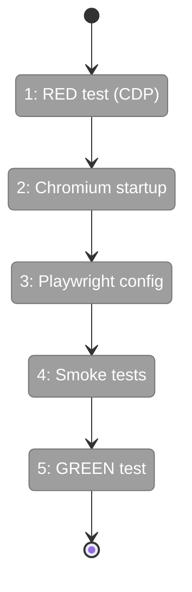
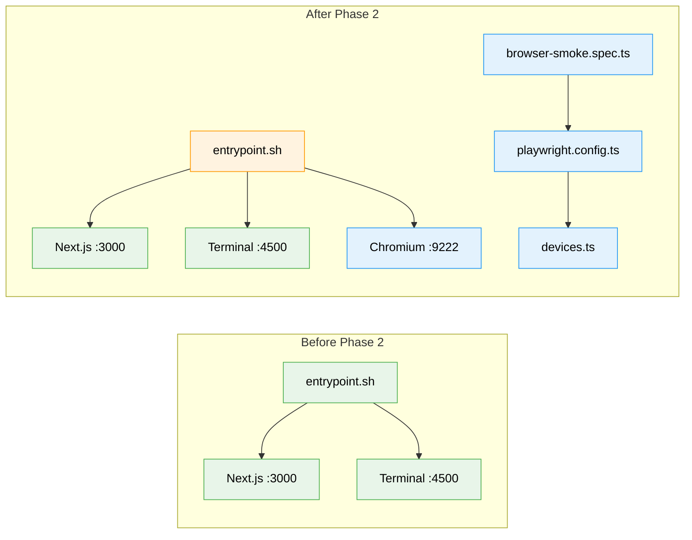

# Flight Plan: Phase 2 — Playwright & CDP Integration

**Plan**: [harness-plan.md](../../harness-plan.md)
**Phase**: Phase 2: Playwright & CDP Integration
**Generated**: 2026-03-07
**Status**: Ready for takeoff

---

## Departure → Destination

**Where we are**: Docker container boots with Next.js dev server (:3000) and terminal sidecar (:4500). Chromium is installed in the image but not launched. CDP port 9222 is mapped but nothing listens on it. The agent can `curl` the site but cannot see or interact with it visually.

**Where we're going**: The agent can connect to `http://localhost:9222` via CDP, open pages at desktop/tablet/mobile viewports, capture screenshots, read browser console logs, and run Playwright tests against the live app. This is the **minimum viable harness** — the agent can see the site.

---

## Domain Context

### Domains We're Changing

| Domain | What Changes | Key Files |
|--------|-------------|-----------|
| external (harness) | Add Chromium startup, Playwright config, viewport defs, smoke tests | `entrypoint.sh`, `playwright.config.ts`, `devices.ts`, `browser-smoke.spec.ts` |

### Domains We Depend On (no changes)

| Domain | What We Consume | Contract |
|--------|----------------|----------|
| _platform/auth | DISABLE_AUTH bypass | `auth()` returns fake session |
| (all domains) | Browser-observable UI | HTTP on :3000 |

---

## Flight Status

**Legend**: grey = pending | yellow = active | red = blocked/needs input | green = done

---

## Stages

- [ ] **Stage 1: Write RED integration test** — CDP connection + screenshot assertion (`cdp-integration.test.ts` — new file)
- [ ] **Stage 2: Launch Chromium in container** — Startup script + entrypoint update (`start-chromium.sh` — new, `entrypoint.sh` — modified)
- [ ] **Stage 3: Playwright config + viewports** — Config with 3 viewport projects (`playwright.config.ts`, `devices.ts` — new files)
- [ ] **Stage 4: Smoke Playwright tests** — Page load, multi-context, console capture (`browser-smoke.spec.ts` — new file)
- [ ] **Stage 5: GREEN integration test** — Unskip and verify CDP works end-to-end

---

## Architecture: Before & After

**Legend**: existing (green, unchanged) | changed (orange, modified) | new (blue, created)

---

## Acceptance Criteria

- [ ] AC-04: `harness health` returns JSON with CDP status on :9222
- [ ] AC-05: Agent connects to `http://localhost:9222` via CDP and opens pages
- [ ] AC-06: Screenshots captured at desktop (1440x900), tablet (768x1024), mobile (375x812)
- [ ] AC-07: Multiple browser contexts browse simultaneously
- [ ] AC-10: Browser console output accessible via `page.on('console')`

## Goals & Non-Goals

**Goals**: CDP exposed, Playwright configured, smoke test passes, responsive viewports defined
**Non-Goals**: Full test suites, CLI commands, seed scripts, visual regression

---

## Checklist

- [ ] T001: Write CDP integration test (RED)
- [ ] T002: Create Chromium startup script
- [ ] T003: Update entrypoint.sh to launch Chromium
- [ ] T004: Create playwright.config.ts
- [ ] T005: Create viewport definitions
- [ ] T006: Write smoke Playwright test
- [ ] T007: Verify multi-context browsing
- [ ] T008: Verify browser console access
- [ ] T009: Run integration test (GREEN)
