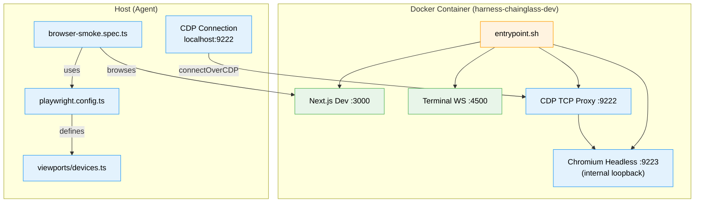
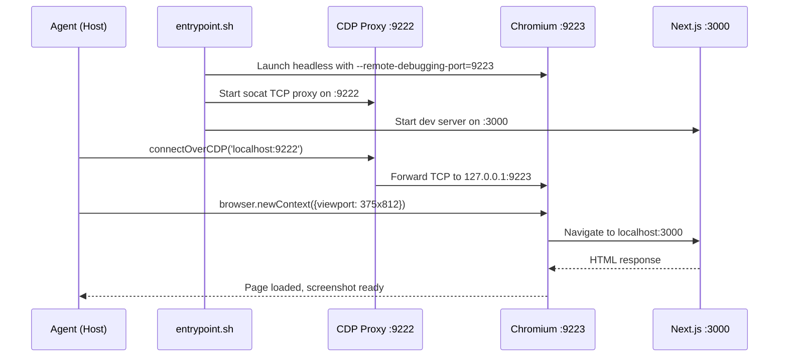

# Phase 2: Playwright & CDP Integration — Tasks Dossier

**Plan**: [harness-plan.md](../../harness-plan.md)
**Phase**: Phase 2: Playwright & CDP Integration
**Depends on**: Phase 1 (complete)
**Generated**: 2026-03-07

---

## Executive Briefing

**Purpose**: Enable the agent to see and interact with the running Chainglass site through a real browser. After this phase, the agent can connect via CDP from the host, open pages at any viewport (desktop/tablet/mobile), capture screenshots, and read browser console output.

**What We're Building**: Playwright browser automation inside the Docker container with CDP port 9222 exposed to the host. A startup script launches headless Chromium alongside the dev server. Viewport definitions for responsive testing. A smoke Playwright test that proves the browser can load the app.

**Goals**:
- ✅ Agent can connect to `http://localhost:9222` via CDP and browse the site
- ✅ Screenshots capturable at desktop (1440x900), tablet (768x1024), mobile (375x812)
- ✅ Multiple browser contexts can run simultaneously
- ✅ Browser console output accessible via CDP
- ✅ Smoke Playwright test passes: page loads, title correct

**Non-Goals**:
- ❌ Full test suite (Phase 4)
- ❌ CLI commands for screenshot/test (Phase 3)
- ❌ Visual regression baselines (future)
- ❌ Seed scripts or test data (Phase 4)

---

## Prior Phase Context

### Phase 1: Docker Container & Dev Server (Complete)

**A. Deliverables**:
- `harness/Dockerfile` — Multi-stage, Debian bookworm-slim, **Chromium already installed** (FT-002 fix)
- `harness/docker-compose.yml` — Ports 3000/4500/9222, shm_size 1gb, bind mounts
- `harness/entrypoint.sh` — Cold-start detection, concurrent dev server + terminal sidecar
- `harness/package.json` — **`@playwright/test` already a devDependency** (FT-002 fix)
- `apps/web/src/auth.ts` — DISABLE_AUTH works for all call signatures
- Root justfile: `harness-dev`, `harness-stop`, `harness-health`, `test-harness`

**B. Dependencies Exported**:
- Container image `harness-chainglass-dev` with Node 20.19, pnpm, git, Chromium
- App on :3000 (~30ms responses), terminal on :4500, CDP port :9222 mapped
- `DISABLE_AUTH=true` bypasses all auth
- OrbStack 2-way bind mounts — HMR works without polling

**C. Gotchas**:
- Chromium already in image but NOT launched — entrypoint.sh only starts Next.js + terminal sidecar
- CDP port 9222 is mapped in compose but nothing listens on it yet
- harness/package.json is standalone (not in pnpm-workspace)

**D. Incomplete**: None — all 9 Phase 1 tasks done.

**E. Patterns**: Sentinel-based cold start, concurrent process launch via `exec`, OrbStack native mounts, standalone harness package.

---

## Pre-Implementation Check

| File | Exists? | Domain | Action | Notes |
|------|---------|--------|--------|-------|
| `harness/Dockerfile` | ✅ yes | external | modify | Add Chromium launch to entrypoint or separate script |
| `harness/docker-compose.yml` | ✅ yes | external | no change | CDP :9222 already exposed, shm_size 1gb set |
| `harness/entrypoint.sh` | ✅ yes | external | modify | Add Chromium startup alongside dev server |
| `harness/playwright.config.ts` | ❌ no | external | create | New file — Playwright project config |
| `harness/src/viewports/devices.ts` | ❌ no | external | create | New file — viewport definitions |
| `harness/tests/smoke/browser-smoke.spec.ts` | ❌ no | external | create | New file — first real Playwright test |
| `harness/tests/smoke/cdp-integration.test.ts` | ❌ no | external | create | New file — CDP connection test |
| `harness/package.json` | ✅ yes | external | no change | @playwright/test already present |

**Harness context**: Harness at L1 (boot works, no browser yet). After this phase: L2 (boot + browser interaction).

---

## Architecture Map



---

## Tasks

| Status | ID | Task | Domain | Path(s) | Done When | Notes |
|--------|-----|------|--------|---------|-----------|-------|
| [x] | T001 | Write CDP integration test (RED) | external | `harness/tests/smoke/cdp-integration.test.ts` | `describe.skip` test: CDP connects on 9222, page loads, screenshot file produced | TDD first; Finding 06 |
| [x] | T002 | Create Chromium startup script | external | `harness/start-chromium.sh` | Script launches Chromium headless on internal CDP `:9223` | Separate from entrypoint for restartability |
| [x] | T003 | Update entrypoint.sh to launch Chromium | external | `harness/entrypoint.sh` | Chromium + CDP proxy start alongside Next.js + terminal sidecar | Add concurrent processes |
| [x] | T004 | Create playwright.config.ts | external | `harness/playwright.config.ts` | Config with baseURL :3000, 3 viewport projects (desktop/tablet/mobile), 30s timeout | Per Workshop 002 |
| [x] | T005 | Create viewport definitions | external | `harness/src/viewports/devices.ts` | Exports `HARNESS_VIEWPORTS` with desktop-lg, desktop-md, tablet, mobile | Per Workshop 002 spec |
| [x] | T006 | Write smoke Playwright test | external | `harness/tests/smoke/browser-smoke.spec.ts` | `npx playwright test` passes: page loads at :3000, title contains expected text, no console errors | First real browser test; AC-05/06 |
| [x] | T007 | Verify multi-context browsing | external | `harness/tests/smoke/browser-smoke.spec.ts` | Test opens 2+ contexts at different viewports simultaneously | AC-07 — proves parallel capability |
| [x] | T008 | Verify browser console access | external | `harness/tests/smoke/browser-smoke.spec.ts` | Test captures console.log output via `page.on('console')` | AC-10 |
| [x] | T009 | Run integration test (GREEN) | external | `harness/tests/smoke/cdp-integration.test.ts` | Unskip T001 test — CDP connects, screenshot captured, file exists | Validates full Phase 2 |

---

## Context Brief

**Key findings from plan**:
- Finding 03: Playwright not in any package.json → **RESOLVED in Phase 1 (FT-002)**
- Finding 06: CDP port 9222 not configured → Chromium must launch with `--remote-debugging-port=9222`; startup script in T002

**Domain dependencies** (consumed, no changes):
- `_platform/auth`: DISABLE_AUTH=true bypass — already working from Phase 1
- All other domains: consumed via browser-observable behavior at localhost:3000

**Domain constraints**:
- Harness is external tooling — no imports into domain code
- All interaction via HTTP (port 3000) and CDP (port 9222)

**Harness context**:
- **Boot**: `just harness-dev` → container starts, health at localhost:3000
- **Interact**: CDP at `http://localhost:9222` (after this phase)
- **Observe**: Screenshots to `harness/results/`, console logs via CDP
- **Maturity**: L1 → L2 after this phase (boot + browser interaction)

**Reusable from Phase 1**:
- Docker container with Chromium pre-installed
- docker-compose.yml with CDP port 9222 already mapped
- shm_size 1gb already configured for Chromium
- harness/package.json with @playwright/test already present

**Key technical detail**: Chromium 136 keeps remote debugging loopback-only inside Docker even when `--remote-debugging-address=0.0.0.0` is passed. The harness launches Chromium on internal port `:9223` and exposes host-facing CDP `:9222` through a `socat` TCP proxy. Playwright on the host connects via `chromium.connectOverCDP()` to the proxy, which forwards to Chromium. This is NOT the same as Playwright launching its own browser — we use a shared browser instance that persists across test runs.



---

## Discoveries & Learnings

_Populated during implementation by plan-6._

| Date | Task | Type | Discovery | Resolution | References |
|------|------|------|-----------|------------|------------|
| 2026-03-07 | T004 | Architecture | `playwright.config.ts` `connectOptions` is for Playwright Server, not CDP. | Added custom fixture at `harness/tests/fixtures/base-test.ts` that fetches `/json/version` and uses `chromium.connectOverCDP()`. | `harness/playwright.config.ts`, `harness/tests/fixtures/base-test.ts` |
| 2026-03-07 | T009 | Infrastructure | Chromium 136 binds remote debugging to loopback inside Docker, so host access to published `:9222` failed even though in-container CDP was healthy. | Moved Chromium to internal `:9223` and added `socat` proxy on `0.0.0.0:9222` for host access. | `harness/start-chromium.sh`, `harness/entrypoint.sh`, `harness/Dockerfile` |
| 2026-03-07 | T009 | Quality Gate | Excluding `harness/` from root `tsconfig.json` needs an explicit replacement gate so standalone harness code is still type-checked. | Added `just install` + `just typecheck` to `harness/justfile`, mirrored with root `harness-install` + `harness-typecheck`, and verified `pnpm --dir harness exec tsc --noEmit` passes. | `harness/justfile`, `justfile`, `tsconfig.json` |

---

## Directory Layout

```
docs/plans/067-harness/
  ├── harness-spec.md
  ├── harness-plan.md
  ├── exploration.md
  ├── workshops/
  │   ├── 001-docker-container-setup.md
  │   └── 002-harness-folder-and-agentic-prompts.md
  ├── reviews/
  │   ├── review.phase-1-docker-container-dev-server.md
  │   └── fix-tasks.phase-1-docker-container-dev-server.md
  └── tasks/
      ├── phase-1-docker-container-dev-server/
      │   └── execution.log.md
      └── phase-2-playwright-cdp-integration/
          ├── tasks.md              ← this file
          ├── tasks.fltplan.md      ← generated next
          └── execution.log.md      ← created by plan-6
```
