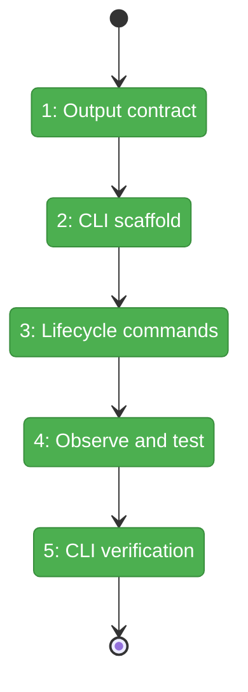
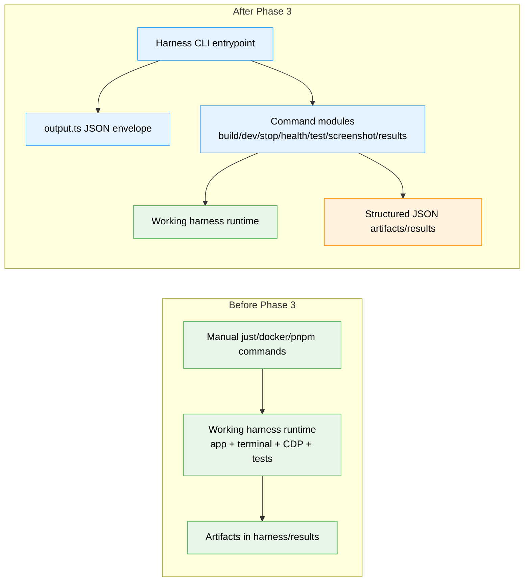

# Flight Plan: Phase 3 — Harness CLI SDK

**Plan**: [harness-plan.md](../../harness-plan.md)
**Phase**: Phase 3: Harness CLI SDK
**Generated**: 2026-03-07
**Status**: Landed

---

## Departure → Destination

**Where we are**: The harness already boots the app, exposes CDP, captures screenshots, and runs smoke tests through a mix of `just`, `docker compose`, and raw `pnpm exec` commands. Agents can use the harness today, but only by manually composing shell commands and parsing outputs ad hoc.

**Where we're going**: A developer or agent can run `harness build`, `harness dev`, `harness health`, `harness test`, `harness screenshot`, and `harness results` and receive stable structured JSON responses. The system will promote the working Phase 1/2 runtime into a first-class, scriptable SDK surface for agentic workflows.

---

## Domain Context

### Domains We're Changing

| Domain | What Changes | Key Files |
|--------|-------------|-----------|
| external | Add the harness-local CLI entry point, output envelope helpers, and command modules for lifecycle/health/test/screenshot/results operations | `/Users/jordanknight/substrate/066-wf-real-agents/harness/src/cli/index.ts`, `/Users/jordanknight/substrate/066-wf-real-agents/harness/src/cli/output.ts`, `/Users/jordanknight/substrate/066-wf-real-agents/harness/src/cli/commands/*.ts` |
| external | Add harness-local unit/integration tests for the CLI surface | `/Users/jordanknight/substrate/066-wf-real-agents/harness/tests/unit/cli/*.test.ts`, `/Users/jordanknight/substrate/066-wf-real-agents/harness/tests/integration/cli/*.test.ts` |

### Domains We Depend On (no changes)

| Domain | What We Consume | Contract |
|--------|----------------|----------|
| external | Existing harness runtime (`docker compose`, `just health`, Playwright smoke suites, results dir) | Stable app/CDP/terminal endpoints from Phases 1 and 2 |
| _platform/auth | Auth bypass that keeps the harnessed app usable without login | `apps/web/src/auth.ts` wrapper honoring `DISABLE_AUTH=true` |

---

## Flight Status

**Legend**: grey = pending | yellow = active | red = blocked/needs input | green = done

---

## Stages

- [x] **Stage 1: Lock the output contract** — Define RED tests and the JSON envelope helpers (`output.ts`, `tests/unit/cli/*.test.ts`)
- [x] **Stage 2: Scaffold the command surface** — Register Commander.js entry point and shared command wiring (`src/cli/index.ts`, `src/cli/commands/*.ts`)
- [x] **Stage 3: Wrap lifecycle operations** — Add `build`, `dev`, `stop`, and `health` commands over the proven harness runtime (`build.ts`, `dev.ts`, `stop.ts`, `health.ts`)
- [x] **Stage 4: Wrap browser-facing operations** — Add `test`, `screenshot`, and `results` commands over Playwright/CDP artifacts (`test.ts`, `screenshot.ts`, `results.ts`)
- [x] **Stage 5: Verify the CLI end-to-end** — Run harness-local unit/integration checks and prove the JSON command surface works (`tests/integration/cli/*.test.ts`)

---

## Architecture: Before & After

**Legend**: existing (green, unchanged) | changed (orange, modified) | new (blue, created)

---

## Acceptance Criteria

- [x] AC-04: `harness health` returns structured JSON with app, MCP, CDP, and terminal status
- [x] AC-11: All harness CLI commands return structured JSON to stdout with a consistent schema
- [x] AC-12: Error conditions return JSON with error codes in the E100-E110 range
- [x] AC-13: `harness test --suite smoke` runs the smoke suite and returns JSON results
- [x] AC-14: `harness screenshot <name>` captures and saves a screenshot to `harness/results/`

## Goals & Non-Goals

**Goals**:
- Stable JSON command surface for the live harness
- Thin command wrappers over proven runtime behavior
- Repeatable agent workflows without ad hoc shell parsing

**Non-Goals**:
- Seed/test-data flows
- Runtime redesign for Docker/CDP
- HTML reports or optional workshop ideas that are not needed for Phase 3 acceptance

---

## Checklist

- [x] T001: Write RED tests for CLI output schema, error codes, and command parsing
- [x] T002: Implement harness-local JSON output helpers and schemas
- [x] T003: Scaffold Commander.js entry point and register harness commands
- [x] T004: Implement `harness build` command wrapper
- [x] T005: Implement `harness dev` command wrapper
- [x] T006: Implement `harness stop` command wrapper
- [x] T007: Implement `harness health` command with rich checks JSON
- [x] T008: Implement `harness test` command for suite + viewport execution
- [x] T009: Implement `harness screenshot` command using the live CDP browser
- [x] T010: Implement `harness results` command to surface the latest artifact JSON
