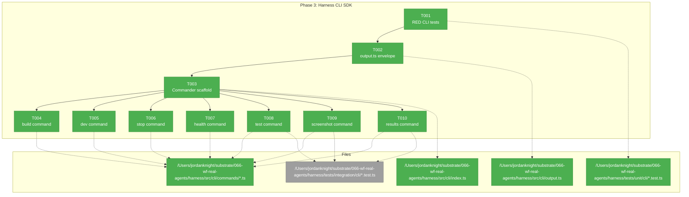
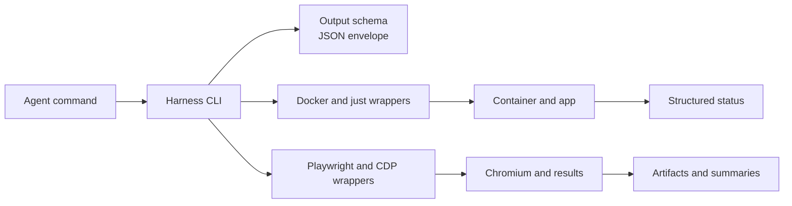
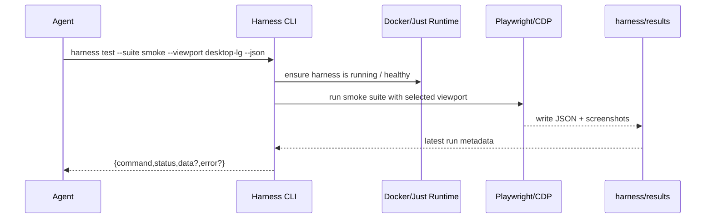

# Phase 3: Harness CLI SDK — Tasks Dossier

**Plan**: [harness-plan.md](../../harness-plan.md)
**Phase**: Phase 3: Harness CLI SDK
**Depends on**: Phase 2 (complete)
**Generated**: 2026-03-07

---

## Executive Briefing

**Purpose**: Turn the working Docker + CDP harness into a stable command surface agents can call without re-encoding shell logic every time. This phase wraps the proven Phase 1/2 runtime in a typed Commander.js CLI with structured JSON output, explicit error codes, and repeatable command semantics.

**What We're Building**: A standalone CLI under `harness/src/cli/` that exposes `build`, `dev`, `stop`, `health`, `test`, `screenshot`, and `results` commands. Each command returns a machine-readable envelope to stdout and uses the live harness runtime established in Phases 1 and 2.

**Goals**:
- ✅ Create a typed JSON output layer for all harness commands
- ✅ Wrap existing Docker/just/Playwright flows behind stable CLI commands
- ✅ Return consistent `{command, status, data?, error?}` JSON to stdout
- ✅ Preserve real harness observability: app, MCP, terminal, CDP, test results, screenshots
- ✅ Keep the harness package standalone and independently type-checked

**Non-Goals**:
- ❌ Implement seed/workspace creation flows (Phase 4)
- ❌ Redesign the Phase 1/2 runtime or browser topology
- ❌ Move harness into the monorepo workspace or apps/cli DI container
- ❌ Add HTML reporting or `harness init` if it is not needed to satisfy Phase 3 acceptance criteria

---

## Prior Phase Context

### Phase 1: Docker Container & Dev Server

**A. Deliverables**
- `/Users/jordanknight/substrate/066-wf-real-agents/harness/Dockerfile` — Debian-based dev image with pnpm and Playwright Chromium
- `/Users/jordanknight/substrate/066-wf-real-agents/harness/docker-compose.yml` — app/terminal/CDP ports, bind mount, named volumes, healthcheck
- `/Users/jordanknight/substrate/066-wf-real-agents/harness/entrypoint.sh` — sentinel-based install/build/start flow
- `/Users/jordanknight/substrate/066-wf-real-agents/harness/package.json`, `/Users/jordanknight/substrate/066-wf-real-agents/harness/tsconfig.json`, `/Users/jordanknight/substrate/066-wf-real-agents/harness/justfile`
- `/Users/jordanknight/substrate/066-wf-real-agents/apps/web/src/auth.ts` — `DISABLE_AUTH=true` works for all call signatures

**B. Dependencies Exported**
- Running app on `http://localhost:3000`
- Terminal WebSocket sidecar on `ws://localhost:4500/terminal`
- Standalone harness package with `commander`, `zod`, `tsx`, `vitest`, `@playwright/test`
- Root recipes `harness-dev`, `harness-stop`, `harness-health`, `harness-install`, `harness-typecheck`

**C. Gotchas & Debt**
- Harness is intentionally standalone; root `pnpm install` does not populate `harness/node_modules`
- `DISABLE_AUTH` must keep routing through `/Users/jordanknight/substrate/066-wf-real-agents/apps/web/src/auth.ts`
- First boot is slow; subsequent boots rely on sentinel-based reuse of container state

**D. Incomplete Items**
- None carrying forward from Phase 1

**E. Patterns to Follow**
- Bind-mount source; keep Linux-only `node_modules` and `.next` in named volumes
- Reuse `justfile` recipes rather than duplicating Docker incantations across docs and scripts
- Keep harness logic inside `harness/` instead of coupling it to app/runtime domains

### Phase 2: Playwright & CDP Integration

**A. Deliverables**
- `/Users/jordanknight/substrate/066-wf-real-agents/harness/start-chromium.sh`
- `/Users/jordanknight/substrate/066-wf-real-agents/harness/playwright.config.ts`
- `/Users/jordanknight/substrate/066-wf-real-agents/harness/src/viewports/devices.ts`
- `/Users/jordanknight/substrate/066-wf-real-agents/harness/tests/fixtures/base-test.ts`
- `/Users/jordanknight/substrate/066-wf-real-agents/harness/tests/smoke/cdp-integration.test.ts`
- `/Users/jordanknight/substrate/066-wf-real-agents/harness/tests/smoke/browser-smoke.spec.ts`

**B. Dependencies Exported**
- Host-facing CDP endpoint on `http://127.0.0.1:9222`
- Shared CDP connection pattern: fetch `/json/version`, then `chromium.connectOverCDP()`
- Viewport constants: `desktop-lg`, `desktop-md`, `tablet`, `mobile`
- Durable evidence paths in `/Users/jordanknight/substrate/066-wf-real-agents/harness/results/`

**C. Gotchas & Debt**
- Chromium 136 keeps remote debugging loopback-only inside Docker; host access works only through the `socat` proxy (`9222 -> 127.0.0.1:9223`)
- `playwright.config.ts` cannot use `connectOptions` for CDP; tests must use the custom fixture
- The live harness is operational, but `docs/project-rules/harness.md` still does not exist

**D. Incomplete Items**
- No typed CLI surface yet; current operations still rely on `just`, `docker compose`, and raw `pnpm exec ...`

**E. Patterns to Follow**
- Reuse the Phase 2 JSON health probe behavior instead of inventing a second shape for service checks
- Reuse `HARNESS_VIEWPORTS` for test/screenshot command arguments
- Prefer event-driven browser assertions and explicit Test Doc blocks in all durable tests

---

## Pre-Implementation Check

| File | Exists? | Domain Check | Notes |
|------|---------|-------------|-------|
| `/Users/jordanknight/substrate/066-wf-real-agents/harness/src/cli/index.ts` | ❌ no | ✅ external | New entry point; `harness/package.json` already points `pnpm run harness` here |
| `/Users/jordanknight/substrate/066-wf-real-agents/harness/src/cli/output.ts` | ❌ no | ✅ external | Concept search found existing JSON adapter pattern in `/Users/jordanknight/substrate/066-wf-real-agents/packages/shared/src/adapters/json-output.adapter.ts`; mirror locally, do not import shared CLI container code |
| `/Users/jordanknight/substrate/066-wf-real-agents/harness/src/cli/commands/` | ✅ dir | ✅ external | Empty command tree ready for `build`, `dev`, `stop`, `health`, `test`, `screenshot`, `results` modules |
| `/Users/jordanknight/substrate/066-wf-real-agents/harness/tests/unit/cli/output.test.ts` | ❌ no | ✅ external | New pure unit tests should stay in `*.test.ts` so they run in the harness-local Vitest gate |
| `/Users/jordanknight/substrate/066-wf-real-agents/harness/tests/unit/cli/index.test.ts` | ❌ no | ✅ external | Use for command registration / parsing assertions without Docker dependencies |
| `/Users/jordanknight/substrate/066-wf-real-agents/harness/tests/integration/cli/health.test.ts` | ❌ no | ✅ external | Real CLI integration test should wrap the live harness from Phases 1/2 |
| `/Users/jordanknight/substrate/066-wf-real-agents/harness/tests/integration/cli/test-command.test.ts` | ❌ no | ✅ external | Candidate real-command verification for `harness test` and/or `results` |
| `/Users/jordanknight/substrate/066-wf-real-agents/harness/package.json` | ✅ yes | ✅ external | May need script/bin updates for repeatable CLI invocation |
| `/Users/jordanknight/substrate/066-wf-real-agents/harness/justfile` | ✅ yes | ✅ external | Reuse existing `build`, `dev`, `stop`, `health`, `typecheck`, and `playwright` recipes under CLI wrappers |
| `/Users/jordanknight/substrate/066-wf-real-agents/docs/project-rules/harness.md` | ❌ no | n/a | No harness doc yet; plan-6 should validate the live harness manually via `cd /Users/jordanknight/substrate/066-wf-real-agents/harness && just health` before implementation |

---

## Architecture Map



---

## Tasks

| Status | ID | Task | Domain | Path(s) | Done When | Notes |
|--------|-----|------|--------|---------|-----------|-------|
| [x] | T001 | Write RED tests for CLI output schema, error codes, and command parsing | external | `/Users/jordanknight/substrate/066-wf-real-agents/harness/tests/unit/cli/output.test.ts`, `/Users/jordanknight/substrate/066-wf-real-agents/harness/tests/unit/cli/index.test.ts` | Unit tests define the `{command,status,data?,error?}` contract, E100-E110 behavior, and command registration before implementation begins | Plan 3.1; keep pure logic in `*.test.ts` so harness-local Vitest gate catches regressions |
| [x] | T002 | Implement harness-local JSON output helpers and schemas | external | `/Users/jordanknight/substrate/066-wf-real-agents/harness/src/cli/output.ts` | Output helpers produce validated success/error envelopes and reusable error constructors for later commands | Plan 3.2; mirror `/Users/jordanknight/substrate/066-wf-real-agents/packages/shared/src/adapters/json-output.adapter.ts` and `/Users/jordanknight/substrate/066-wf-real-agents/apps/cli/src/commands/command-helpers.ts` without importing apps/cli DI |
| [x] | T003 | Scaffold Commander.js entry point and register harness commands | external | `/Users/jordanknight/substrate/066-wf-real-agents/harness/src/cli/index.ts`, `/Users/jordanknight/substrate/066-wf-real-agents/harness/src/cli/commands/*.ts`, `/Users/jordanknight/substrate/066-wf-real-agents/harness/package.json` | `cd /Users/jordanknight/substrate/066-wf-real-agents/harness && pnpm exec tsx src/cli/index.ts --help` shows the planned command surface and a `--json` path | Plan 3.3; keep handlers thin and route formatting through T002 helpers |
| [x] | T004 | Implement `harness build` command wrapper | external | `/Users/jordanknight/substrate/066-wf-real-agents/harness/src/cli/commands/build.ts`, `/Users/jordanknight/substrate/066-wf-real-agents/harness/tests/integration/cli/build.test.ts` | Command wraps `docker compose build`, returns JSON status to stdout, and exits non-zero on build failure | Plan 3.4; reuse existing `/Users/jordanknight/substrate/066-wf-real-agents/harness/justfile` build behavior rather than duplicating Docker flags |
| [x] | T005 | Implement `harness dev` command wrapper | external | `/Users/jordanknight/substrate/066-wf-real-agents/harness/src/cli/commands/dev.ts`, `/Users/jordanknight/substrate/066-wf-real-agents/harness/tests/integration/cli/dev.test.ts` | Command starts the container, waits for health, and returns structured JSON including the ready endpoints | Plan 3.5; surface rebuild guidance for stale standalone deps instead of hiding failures |
| [x] | T006 | Implement `harness stop` command wrapper | external | `/Users/jordanknight/substrate/066-wf-real-agents/harness/src/cli/commands/stop.ts`, `/Users/jordanknight/substrate/066-wf-real-agents/harness/tests/integration/cli/stop.test.ts` | Command stops/removes the container and returns JSON confirmation that agents can parse | Plan 3.6; keep idempotent behavior for already-stopped containers explicit in the status envelope |
| [x] | T007 | Implement `harness health` command with rich checks JSON | external | `/Users/jordanknight/substrate/066-wf-real-agents/harness/src/cli/commands/health.ts`, `/Users/jordanknight/substrate/066-wf-real-agents/harness/tests/integration/cli/health.test.ts`, `/Users/jordanknight/substrate/066-wf-real-agents/harness/justfile` | CLI returns `{command:"health",status,...}` with app/MCP/terminal/CDP checks and degraded exit semantics | Plan 3.7; Phase 2 already proved the probe shape in `just health` — wrap or share that behavior, do not invent a second health contract |
| [x] | T008 | Implement `harness test` command for suite + viewport execution | external | `/Users/jordanknight/substrate/066-wf-real-agents/harness/src/cli/commands/test.ts`, `/Users/jordanknight/substrate/066-wf-real-agents/harness/tests/integration/cli/test-command.test.ts`, `/Users/jordanknight/substrate/066-wf-real-agents/harness/results/test-results.json` | `harness test --suite smoke --viewport desktop-lg` runs Playwright and returns parsed JSON summary/results metadata | Plan 3.8; reuse `HARNESS_VIEWPORTS` and existing Playwright result artifacts |
| [x] | T009 | Implement `harness screenshot` command using the live CDP browser | external | `/Users/jordanknight/substrate/066-wf-real-agents/harness/src/cli/commands/screenshot.ts`, `/Users/jordanknight/substrate/066-wf-real-agents/harness/tests/integration/cli/screenshot.test.ts`, `/Users/jordanknight/substrate/066-wf-real-agents/harness/results/` | Command captures a named screenshot via CDP, writes it under `harness/results/`, and returns the saved path in JSON | Plan 3.9; connect through published `:9222` and honor viewport names from T008 |
| [x] | T010 | Implement `harness results` command to surface the latest artifact JSON | external | `/Users/jordanknight/substrate/066-wf-real-agents/harness/src/cli/commands/results.ts`, `/Users/jordanknight/substrate/066-wf-real-agents/harness/tests/integration/cli/results.test.ts`, `/Users/jordanknight/substrate/066-wf-real-agents/harness/results/test-results.json` | Command reads the latest test/result artifact and returns it in the standard envelope without re-running tests | Plan 3.10; keep file discovery deterministic so agents know which run they are reading |

---

## Context Brief

**Key findings from plan**:
- Finding 04: Existing CLI JSON output conventions already exist in the repo — mirror the output-adapter architecture locally in `harness/src/cli/output.ts`
- Finding 05: Named-volume/node_modules drift is real — `harness dev` should surface rebuild/install guidance instead of silently masking dependency issues
- Finding 06: CDP is reachable only through the published host port — health/test/screenshot commands must target `http://127.0.0.1:9222`, not Chromium's internal loopback port
- Finding 07: Terminal health is still port-based — the CLI health command must include terminal state explicitly rather than assuming app health covers it

**Domain dependencies**:
- No registered domain contracts are imported directly in this phase; the CLI wraps external harness runtime behavior and previously-delivered harness artifacts
- `_platform/auth`: `apps/web/src/auth.ts` DISABLE_AUTH wrapper keeps the harness bootable for browser/test commands without interactive login

**Domain constraints**:
- Harness remains external tooling rooted in `/Users/jordanknight/substrate/066-wf-real-agents/harness/`
- Do not couple the harness CLI to `/Users/jordanknight/substrate/066-wf-real-agents/apps/cli/` DI containers or command implementations; mirror patterns locally
- Prefer subprocess boundaries (`docker compose`, `just`, `pnpm exec playwright`) over importing app internals
- Keep stdout machine-readable; if human summaries are needed, send them to stderr

**Harness context**:
- No `docs/project-rules/harness.md` yet. Live harness is still available and proven via:
  - **Boot**: `cd /Users/jordanknight/substrate/066-wf-real-agents/harness && docker compose up -d`
  - **Interact**: `http://127.0.0.1:9222/json/version` for CDP and `http://127.0.0.1:3000` for the app
  - **Observe**: `cd /Users/jordanknight/substrate/066-wf-real-agents/harness && just health` plus `/Users/jordanknight/substrate/066-wf-real-agents/harness/results/`
  - **Maturity**: L2 — boot + browser interaction + durable artifacts are working, but agents still lack a first-class CLI
  - **Pre-phase validation**: Agent should manually validate Boot → Interact → Observe with the current `harness/justfile` before implementing Phase 3

**Reusable from prior phases**:
- `/Users/jordanknight/substrate/066-wf-real-agents/harness/src/viewports/devices.ts` for allowed viewport names and sizes
- `/Users/jordanknight/substrate/066-wf-real-agents/harness/tests/fixtures/base-test.ts` for CDP wsEndpoint discovery and connection lifecycle
- `/Users/jordanknight/substrate/066-wf-real-agents/harness/justfile` for stable build/dev/stop/health/typecheck wrappers
- `/Users/jordanknight/substrate/066-wf-real-agents/apps/cli/src/commands/command-helpers.ts` and `/Users/jordanknight/substrate/066-wf-real-agents/packages/shared/src/adapters/json-output.adapter.ts` as mirror-pattern references for output selection and JSON envelopes





### Discoveries & Learnings

| Date | Task | Type | Discovery | Resolution | References |
|------|------|------|-----------|------------|------------|
| 2026-03-07 | T007 | gotcha | CDP `/json/version` uses capital `Browser` key, not lowercase `browser` | Fixed `CdpVersionInfo` type to match actual API response | `harness/src/cdp/connect.ts` |
| 2026-03-07 | T009 | gotcha | `import.meta.dirname` resolves to source file's directory, not project root; commands at `src/cli/commands/` need `../../..` to reach harness root | Fixed `HARNESS_ROOT` path in test.ts, screenshot.ts, results.ts | `harness/src/cli/commands/*.ts` |
| 2026-03-07 | T007 | insight | `curl` fails with connection reset on CDP port 9222 from macOS host, but Node.js `fetch` works fine — likely a curl/HTTP version quirk | No fix needed; CLI uses Node.js fetch, not curl | n/a |

---

## Critical Insights (2026-03-07)

| # | Insight | Decision |
|---|---------|----------|
| 1 | Exit code semantics undefined — agents don't know if degraded = exit 0 or 1 | Exit 0 for success + degraded (JSON status carries nuance), exit 1 only for command-level failures (container missing, network error) |
| 2 | Two JSON shapes in play — Phase 2 flat health vs Phase 3 envelope `{command,status,data?,error?}` | CLI envelope is the canonical contract. Phase 2 `just health` shape is not sacred — back-patch to match if needed. Do things properly. |
| 3 | T008 (`harness test`) underestimated — needs Playwright JSON reporter config, file parsing, envelope mapping | Use Playwright JSON reporter writing to file (`harness/results/test-results.json`), not stdout capture. T008 reads/transforms the file; T010 gets it free. |
| 4 | No `bin` entry or script alias — agents would need `pnpm --dir harness exec tsx ...` | Add `bin` entry to `harness/package.json` + root justfile `just harness <cmd>` aliases for clean invocation both ways. |
| 5 | CDP connect logic duplicated between `base-test.ts` fixture and screenshot command | Extract shared helpers for everything — `harness/src/cdp/connect.ts` for CDP, plus SDK-like helpers for health probes, Docker lifecycle. Design for composability: simple to consume AND to work on. |

Action items: Incorporate all 5 decisions into T001-T010 implementation. SDK-like helper design is a cross-cutting principle.

---

## Directory Layout

```text
docs/plans/067-harness/
  ├── harness-spec.md
  ├── harness-plan.md
  ├── exploration.md
  ├── workshops/
  ├── reviews/
  └── tasks/
      ├── phase-1-docker-container-dev-server/
      │   └── execution.log.md
      ├── phase-2-playwright-cdp-integration/
      │   ├── tasks.md
      │   ├── tasks.fltplan.md
      │   └── execution.log.md
      └── phase-3-harness-cli-sdk/
          ├── tasks.md
          ├── tasks.fltplan.md
          └── execution.log.md   # created by plan-6
```
