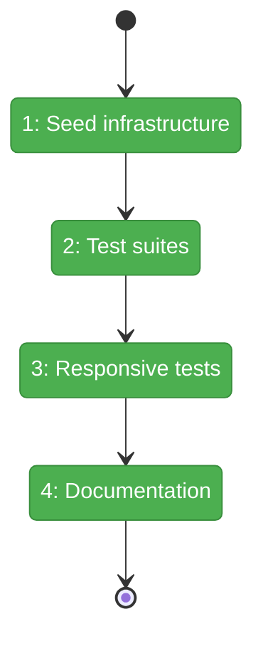
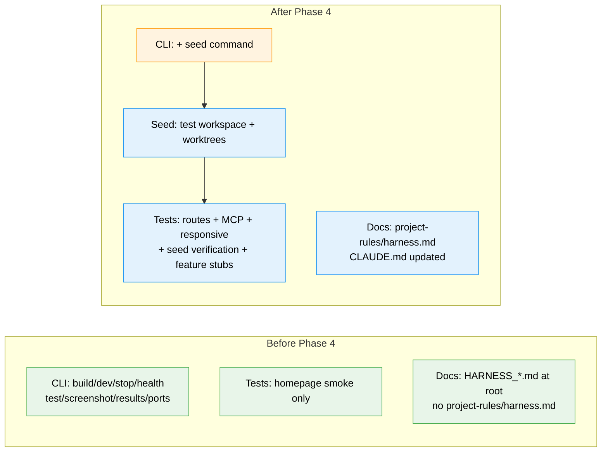

# Flight Plan: Phase 4 — Seed Scripts, Feature Tests & Responsive Viewports

**Plan**: [harness-plan.md](../../harness-plan.md)
**Phase**: Phase 4: Seed Scripts, Feature Tests & Responsive Viewports
**Generated**: 2026-03-07
**Status**: Landed

---

## Departure → Destination

**Where we are**: The harness boots, connects to the browser via CDP, runs smoke tests, and returns structured JSON through a typed CLI. But it has no test data — every test only verifies "does the homepage load?". There are no route-level tests, no MCP verification, no responsive layout assertions, and no governance documentation.

**Where we're going**: A developer or agent can run `harness seed` to populate a test workspace, then `harness test --suite smoke` to verify real app behavior: routes return 200, seeded data appears in the sidebar, responsive layouts change between viewports, and MCP responds. The harness is documented at L3 maturity in `docs/project-rules/harness.md`.

---

## Domain Context

### Domains We're Changing

| Domain | What Changes | Key Files |
|--------|-------------|-----------|
| external | Add seed helper, seed CLI command, expanded test suites, feature stubs | `harness/src/seed/seed-workspace.ts`, `harness/src/cli/commands/seed.ts`, `harness/tests/smoke/*.spec.ts`, `harness/tests/responsive/*.spec.ts`, `harness/tests/features/*.spec.ts` |
| cross-domain | Add governance doc and update CLAUDE.md | `docs/project-rules/harness.md`, `CLAUDE.md` |

### Domains We Depend On (no changes)

| Domain | What We Consume | Contract |
|--------|----------------|----------|
| _platform/auth | Auth bypass via `DISABLE_AUTH=true` | `apps/web/src/auth.ts` |
| _platform/workspaces | `GET /api/workspaces?include=worktrees` | Workspace list with enrichment |
| sidebar | `WorkspaceNav` renders worktrees from API | Visual presence in browser |
| MCP | `POST /_next/mcp` JSON-RPC 2.0 | `tools/list` returns available tools |

---

## Flight Status

**Legend**: grey = pending | yellow = active | red = blocked/needs input | green = done

---

## Stages

- [x] **Stage 1: Seed infrastructure** — Build the seed helper and CLI command (`seed-workspace.ts`, `seed.ts`)
- [x] **Stage 2: Test suites** — Expanded smoke tests for routes, MCP, console errors; feature stubs (`routes-smoke.spec.ts`, `mcp-smoke.spec.ts`, `features/*.spec.ts`)
- [x] **Stage 3: Responsive and verification** — Sidebar responsive tests and seeded-data browser verification (`sidebar-responsive.spec.ts`, `seed-verification.spec.ts`)
- [x] **Stage 4: Documentation** — Governance doc and CLAUDE.md updates (`harness.md`, `CLAUDE.md`)

---

## Architecture: Before & After

**Legend**: existing (green, unchanged) | changed (orange, modified) | new (blue, created)

---

## Acceptance Criteria

- [x] AC-15: `harness seed` creates a test workspace with at least one worktree, accessible in the running app
- [x] AC-16: Seeded data is visible when browsing the app (workspace appears in sidebar, worktrees listed)
- [x] AC-17: `harness test --viewport mobile` runs tests at 375x812 viewport
- [x] AC-18: `harness test --viewport tablet` runs tests at 768x1024 viewport
- [x] AC-19: Responsive tests verify sidebar behavior changes between desktop and mobile viewports

## Goals & Non-Goals

**Goals**:
- Real test data via seed command
- Route-level and MCP smoke coverage
- Responsive sidebar verification across 3 viewports
- L3 governance documentation

**Non-Goals**:
- Full feature test implementations (stubs only)
- Visual regression baselines
- Parallel container support
- CI/CD pipeline integration

---

## Checklist

- [x] T001: Implement seed-workspace helper
- [x] T002: Implement `harness seed` CLI command
- [x] T003: Expand smoke test suite with route verification
- [x] T004: Add MCP endpoint smoke tests
- [x] T005: Write responsive sidebar tests
- [x] T006: Create feature test stubs
- [x] T007: Verify seeded data visible in browser
- [x] T008: Generate `docs/project-rules/harness.md` governance doc
- [x] T009: Update CLAUDE.md with harness commands
