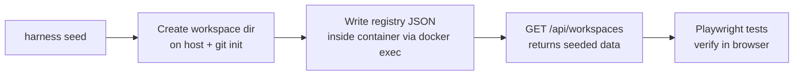
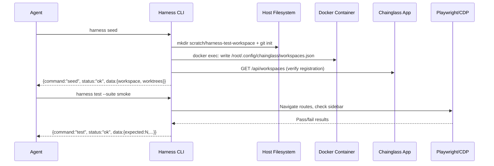

# Phase 4: Seed Scripts, Feature Tests & Responsive Viewports — Tasks Dossier

**Plan**: [harness-plan.md](../../harness-plan.md)
**Phase**: Phase 4: Seed Scripts, Feature Tests & Responsive Viewports
**Depends on**: Phase 3 (complete)
**Generated**: 2026-03-07

---

## Executive Briefing

**Purpose**: Give the harness real test data and real test suites that exercise observable app behavior. Without seeded data the harness can only verify "does the homepage load?". After this phase, agents can verify workspaces appear in the sidebar, worktrees are listed, routes return 200, responsive layouts change across viewports, and the MCP endpoint responds. The phase also closes the documentation gap by delivering `docs/project-rules/harness.md`.

**What We're Building**:
- An HTTP-based seed command that creates a test workspace visible in the running app
- An expanded smoke suite testing routes, MCP, and console cleanliness
- A responsive test suite verifying sidebar behavior at phone/tablet/desktop viewports
- Feature test stubs for future plans to fill in
- The governance doc (`docs/project-rules/harness.md`) documenting the full Boot → Interact → Observe surface

**Goals**:
- ✅ `harness seed` creates a test workspace with worktrees visible in the sidebar
- ✅ Smoke tests verify all main routes return 200 and MCP responds
- ✅ Responsive tests verify sidebar visibility/collapse across viewports
- ✅ Feature test stubs exist for agents, browser, terminal, workflows
- ✅ `docs/project-rules/harness.md` documents L3 maturity harness

**Non-Goals**:
- ❌ Full feature-level Playwright test coverage (stubs only)
- ❌ Visual regression baselines or pixel-diff screenshot comparison
- ❌ Parallel container instances (future plan)
- ❌ CI/CD integration or GitHub Actions harness pipeline
- ❌ Seed data for agents, work units, or workflows (workspace + worktrees only)

---

## Prior Phase Context

### Phase 1: Docker Container & Dev Server

**A. Deliverables**
- `harness/Dockerfile`, `docker-compose.yml`, `entrypoint.sh`, `package.json`, `justfile`
- Sentinel-based cold start, concurrent process launcher (Next.js + terminal sidecar)
- Auth bypass (`DISABLE_AUTH=true`) working for all call signatures

**B. Dependencies Exported**
- Running app on dynamic port (from `computePorts().app`)
- Terminal WebSocket sidecar on dynamic port
- Standalone harness package with `commander`, `zod`, `tsx`, `vitest`, `@playwright/test`

**C. Gotchas & Debt**
- Cold start ~3-5 min on first boot; sentinel prevents repeats
- Harness intentionally standalone; root `pnpm install` does not populate `harness/node_modules`

**D. Incomplete Items**
- None carrying forward

**E. Patterns to Follow**
- Sentinel-based cold start detection
- Just recipes over raw shell; concurrent process launch via `concurrently`
- Standalone harness package; no imports from app domains; use HTTP/CDP for interaction

### Phase 2: Playwright & CDP Integration

**A. Deliverables**
- `start-chromium.sh`, `playwright.config.ts`, `src/viewports/devices.ts`
- Custom CDP fixture (`tests/fixtures/base-test.ts`)
- 24 browser smoke tests + 4 CDP integration tests
- socat proxy topology (9222 → 127.0.0.1:9223)

**B. Dependencies Exported**
- CDP endpoint on dynamic port (from `computePorts().cdp`)
- Shared CDP connection pattern: `getWsEndpoint()` → `connectOverCDP()`
- Viewport constants: `HARNESS_VIEWPORTS` (`desktop-lg`, `desktop-md`, `tablet`, `mobile`)
- Evidence paths in `harness/results/`

**C. Gotchas & Debt**
- Chromium 136 loopback-only binding; host access only through socat proxy
- `playwright.config.ts` cannot use `connectOptions` for CDP; custom fixture required
- No `docs/project-rules/harness.md` yet

**D. Incomplete Items**
- None carrying forward

**E. Patterns to Follow**
- Event-driven assertions (no fixed sleeps)
- Test Doc blocks on all durable tests
- Deterministic screenshot naming: `{name}-{viewport}.png`

### Phase 3: Harness CLI SDK

**A. Deliverables**
- Commander.js CLI with 8 commands: `build`, `dev`, `stop`, `health`, `test`, `screenshot`, `results`, `ports`
- Canonical JSON envelope `{command, status, data?, error?}` with Zod schema
- SDK helpers: `cdp/connect.ts`, `health/probe.ts`, `docker/lifecycle.ts`, `ports/allocator.ts`
- Error codes E100-E110
- 19 unit tests + 4 integration tests
- `bin/harness` shell wrapper + root justfile `just harness <cmd>` alias

**B. Dependencies Exported**
- `formatSuccess()`, `formatError()`, `parseEnvelope()`, `HarnessEnvelopeSchema` — output contract
- `computePorts()` → `HarnessPorts` — deterministic port allocation per worktree
- `probeAll(ports)` → `HealthResult` — per-service health probes
- `getWsEndpoint(cdpUrl)`, `getCdpVersion(cdpUrl)` — CDP helpers
- `SUITE_GLOBS` and `VIEWPORT_TO_PROJECT` maps in test command

**C. Gotchas & Debt**
- CDP `/json/version` uses capital `Browser` key (not lowercase)
- `import.meta.dirname` resolves to source file's directory; commands need `../../..` to reach harness root
- `curl` fails on CDP port from macOS host but Node.js `fetch` works fine
- Workspace creation uses Server Actions (`addWorkspace`), NOT POST to API endpoint

**D. Incomplete Items**
- `harness seed` command not yet implemented (this phase)
- `docs/project-rules/harness.md` not yet created (this phase)

**E. Patterns to Follow**
- All commands return `HarnessEnvelope` to stdout; human text to stderr
- Exit 0 for ok/degraded, exit 1 for command failures
- SDK-like helpers: composable building blocks, not monolithic functions
- Path sanitization for user-controlled file paths (FT-003 pattern)
- Delete stale results before running tests (FT-004 pattern)

---

## Pre-Implementation Check

| File | Exists? | Domain Check | Notes |
|------|---------|-------------|-------|
| `harness/src/cli/commands/seed.ts` | ❌ no | ✅ external | New command module |
| `harness/src/seed/seed-workspace.ts` | ❌ no | ✅ external | New seed helper; uses HTTP API, not app internals |
| `harness/tests/smoke/routes-smoke.spec.ts` | ❌ no | ✅ external | New: expanded route-level smoke tests |
| `harness/tests/smoke/mcp-smoke.spec.ts` | ❌ no | ✅ external | New: MCP endpoint verification |
| `harness/tests/responsive/sidebar-responsive.spec.ts` | ❌ no | ✅ external | New: sidebar behavior at 3 viewports |
| `harness/tests/features/*.spec.ts` | ❌ no | ✅ external | New: placeholder stubs |
| `docs/project-rules/harness.md` | ❌ no | ✅ cross-domain | New governance doc |
| `CLAUDE.md` | ✅ exists | ✅ cross-domain | Needs harness command additions |
| `apps/web/app/api/workspaces/route.ts` | ✅ exists | _platform | READ ONLY — seed uses GET to verify, Server Action to create |
| `apps/web/app/actions/workspace-actions.ts` | ✅ exists | _platform | READ ONLY — `addWorkspace(prevState, formData)` for creation |

**Harness context**: Harness is operational at L2 (boot + browser + CLI). No `docs/project-rules/harness.md` yet — this phase creates it, promoting to L3.

---

## Architecture Map

```mermaid
flowchart TD
    classDef pending fill:#9E9E9E,stroke:#757575,color:#fff
    classDef completed fill:#4CAF50,stroke:#388E3C,color:#fff

    subgraph Phase["Phase 4: Seed, Tests & Docs"]
        T001["T001<br/>Seed workspace helper"]:::pending
        T002["T002<br/>harness seed command"]:::pending
        T003["T003<br/>Expanded smoke suite"]:::pending
        T004["T004<br/>MCP smoke tests"]:::pending
        T005["T005<br/>Responsive sidebar tests"]:::pending
        T006["T006<br/>Feature test stubs"]:::pending
        T007["T007<br/>Verify seeded data visible"]:::pending
        T008["T008<br/>harness.md governance doc"]:::pending
        T009["T009<br/>Update CLAUDE.md"]:::pending

        T001 --> T002
        T002 --> T007
        T003 --> T007
        T004 --> T007
        T005 --> T007
        T006 --> T007
    end

    subgraph Files["Files"]
        F1["harness/src/seed/seed-workspace.ts"]:::pending
        F2["harness/src/cli/commands/seed.ts"]:::pending
        F3["harness/tests/smoke/routes-smoke.spec.ts"]:::pending
        F4["harness/tests/smoke/mcp-smoke.spec.ts"]:::pending
        F5["harness/tests/responsive/sidebar-responsive.spec.ts"]:::pending
        F6["harness/tests/features/*.spec.ts"]:::pending
        F7["docs/project-rules/harness.md"]:::pending
    end

    T001 -.-> F1
    T002 -.-> F2
    T003 -.-> F3
    T004 -.-> F4
    T005 -.-> F5
    T006 -.-> F6
    T008 -.-> F7
```



---

## Tasks

| Status | ID | Task | Domain | Path(s) | Done When | Notes |
|--------|-----|------|--------|---------|-----------|-------|
| [x] | T001 | Implement seed-workspace helper that creates a test workspace via HTTP | external | `harness/src/seed/seed-workspace.ts` | Helper calls GET `/api/workspaces` to check if test workspace exists, creates directory on host filesystem if needed, returns workspace metadata | Workspace creation uses Server Actions not POST API; for harness we create the directory directly and let the app discover it. Auth bypassed via DISABLE_AUTH. Per spec OQ-02. |
| [x] | T002 | Implement `harness seed` CLI command | external | `harness/src/cli/commands/seed.ts` | `harness seed` returns JSON envelope with created workspace/worktree info; idempotent (safe to run twice) | Wraps T001 helper; registers in CLI index; adds to SUITE_GLOBS if needed |
| [ ] | T003 | Expand smoke test suite with route verification | external | `harness/tests/smoke/routes-smoke.spec.ts` | Tests navigate to `/`, `/workspaces`, `/settings/workspaces`, `/agents` and assert 200-level responses with expected page content | Use base-test.ts CDP fixture; event-driven waits; Test Doc blocks |
| [ ] | T004 | Add MCP endpoint smoke tests | external | `harness/tests/smoke/mcp-smoke.spec.ts` | Tests POST to `/_next/mcp` with `tools/list` JSON-RPC request and verify valid response with tool names | MCP uses JSON-RPC 2.0; Content-Type: application/json; expected tools: get_routes, get_errors |
| [ ] | T005 | Write responsive sidebar tests | external | `harness/tests/responsive/sidebar-responsive.spec.ts` | Desktop: sidebar visible; Mobile: sidebar hidden/collapsed; Tablet: sidebar may be collapsed. Tests run at each viewport via fixture. | Use `HARNESS_VIEWPORTS` for dimensions; sidebar uses `md:` breakpoint (768px); check for `data-sidebar` or role attributes; per AC-17, AC-18, AC-19 |
| [ ] | T006 | Create feature test stubs | external | `harness/tests/features/agents.spec.ts`, `harness/tests/features/browser.spec.ts`, `harness/tests/features/terminal.spec.ts`, `harness/tests/features/workflows.spec.ts` | Each file has a describe block with `it.skip` placeholder tests and TODO comments for future plans | Empty scaffolds; per plan 4.5 |
| [ ] | T007 | Verify seeded data visible in browser | external | `harness/tests/smoke/seed-verification.spec.ts` | Playwright navigates to `/workspaces`, sees test workspace name; navigates to workspace detail, sees worktrees listed | Depends on T001/T002 seed + T003 route smoke; per AC-15, AC-16 |
| [ ] | T008 | Generate `docs/project-rules/harness.md` governance doc | cross-domain | `docs/project-rules/harness.md` | Documents L3 maturity: Boot (commands), Interact (endpoints + CLI), Observe (evidence paths + results), port allocation, testing conventions | Per plan 4.9; links to harness-spec.md and harness-plan.md |
| [ ] | T009 | Update CLAUDE.md with harness commands | cross-domain | `CLAUDE.md` | Harness CLI commands (`just harness health`, `just harness test`, `just harness seed`, etc.) documented in custom instructions; port allocation explained | Per plan 4.7; add after existing Quick Reference section |

---

## Context Brief

**Key findings from plan**:
- Finding 02: Auth bypass via `DISABLE_AUTH=true` is the foundation; seed helper must work with auth bypassed
- Finding 04: Existing CLI JSON output conventions must be followed; seed command uses same envelope
- Finding 08: Workspace creation uses Server Actions (`addWorkspace`), NOT POST API; harness seed should create the workspace directory directly on the host filesystem and let the app discover it via its workspace scanning
- Finding 09: Sidebar fetches from `/api/workspaces?include=worktrees`; seeded data must be discoverable through this endpoint

**Domain dependencies**:
- `_platform/auth`: `DISABLE_AUTH=true` env var in container keeps all API routes and Server Actions accessible
- `_platform/workspaces`: `GET /api/workspaces?include=worktrees` — read seeded workspaces; `addWorkspace()` Server Action — creation path
- Sidebar: `WorkspaceNav` component fetches `/api/workspaces?include=worktrees` and renders worktree lists

**Domain constraints**:
- Harness remains external tooling; do NOT import app domain code
- Seed helper uses HTTP + filesystem only; no DI container access
- Test suites use the custom CDP fixture (`base-test.ts`), not raw `@playwright/test`
- All new tests need Test Doc blocks

**Harness context**:
- **Boot**: `just harness dev` or `harness dev` — dynamic ports from `computePorts()`
- **Interact**: `http://127.0.0.1:{ports.app}` for app, `http://127.0.0.1:{ports.cdp}` for CDP
- **Observe**: `harness health`, `harness results`, evidence in `harness/results/`
- **Maturity**: L2 → L3 after this phase (governance doc adds the missing documentation layer)
- **Pre-phase validation**: Agent MUST validate harness Boot → Interact → Observe before implementation

**Reusable from prior phases**:
- `harness/tests/fixtures/base-test.ts` — CDP connection fixture for all Playwright tests
- `harness/src/viewports/devices.ts` — viewport dimensions for responsive tests
- `harness/src/ports/allocator.ts` — `computePorts()` for dynamic endpoints
- `harness/src/cli/output.ts` — `formatSuccess`/`formatError` for seed command
- `harness/src/cdp/connect.ts` — shared CDP helpers
- `harness/src/health/probe.ts` — `probeAll()` for pre-test health checks





### Discoveries & Learnings

_Populated during implementation by plan-6._

| Date | Task | Type | Discovery | Resolution | References |
|------|------|------|-----------|------------|------------|

---

## Critical Insights (2026-03-07)

| # | Insight | Decision |
|---|---------|----------|
| 1 | App does NOT auto-discover workspace directories — workspaces are stored in an explicit registry at `~/.config/chainglass/workspaces.json` (inside container: `/root/.config/chainglass/workspaces.json`). Dossier's original T001 approach was wrong. | Seed via direct registry JSON write (`docker exec`), not filesystem-only creation. Verify appearance via Playwright separately. |
| 2 | Named Docker volumes (`chainglass_node_modules`, `chainglass_dot_next`) are global — parallel worktrees would share and corrupt each other's deps/build cache. | Namespace volumes by worktree name: `chainglass_node_modules_{worktree}`, `chainglass_dot_next_{worktree}`. |
| 3 | Mobile sidebar is a Radix UI `<Sheet>` overlay (controlled by `openMobile` state), NOT CSS-hidden. Tests can't use simple visibility checks. **NOTE for future mobile UI refactor**: The sidebar uses `useSidebar()` hook with `openMobile`/`setOpenMobile` state, `data-sidebar="sidebar"` attribute, `SIDEBAR_WIDTH_MOBILE = '18rem'`, and sidebar state persisted in `sidebar_state` cookie. Desktop uses `hidden md:block` with smooth transitions. The Sheet renders children inside `<SheetContent>` with `data-state` attribute (`open`/`closed`). | On mobile, assert Sheet `data-state="closed"` by default. On desktop, assert sidebar is visible in layout flow. Document all sidebar mechanics for the coming mobile UI refactor. |
| 4 | MCP endpoint (`/_next/mcp`) is JSON-RPC 2.0 POST — not a navigable page. Using Playwright `page.goto()` would get 405 or garbage. | T004 should be a Vitest `.test.ts` using `fetch()`, not a Playwright `.spec.ts`. POST with `{"jsonrpc":"2.0","id":1,"method":"tools/list"}`. |
| 5 | Workspace path must exist inside the container AND be a git repo for worktree data to populate. Monorepo bind-mounted at `/app`. | Seed creates `scratch/harness-test-workspace/` on host, `git init` with a commit, registry uses `/app/scratch/harness-test-workspace`. Add `scratch/` to `.gitignore`. **NOTE**: This is our starting approach — expect to experiment. The exact seed mechanism (direct registry write vs API route vs Playwright UI) may change based on what works best in practice. We're not married to this decision; we'll do what's right at the time. |

Action items: Update T001/T002 implementation to use registry write + docker exec pattern. Namespace Docker volumes in docker-compose.yml. Use fetch-based Vitest for MCP tests. Document sidebar Sheet mechanics for mobile UI refactor planning.

---

## Directory Layout

```text
docs/plans/067-harness/
  ├── harness-spec.md
  ├── harness-plan.md
  ├── exploration.md
  ├── workshops/
  ├── reviews/
  └── tasks/
      ├── phase-1-docker-container-dev-server/
      │   └── execution.log.md
      ├── phase-2-playwright-cdp-integration/
      │   ├── tasks.md
      │   ├── tasks.fltplan.md
      │   └── execution.log.md
      ├── phase-3-harness-cli-sdk/
      │   ├── tasks.md
      │   ├── tasks.fltplan.md
      │   └── execution.log.md
      └── phase-4-seed-tests-responsive/
          ├── tasks.md
          ├── tasks.fltplan.md
          └── execution.log.md   # created by plan-6
```
