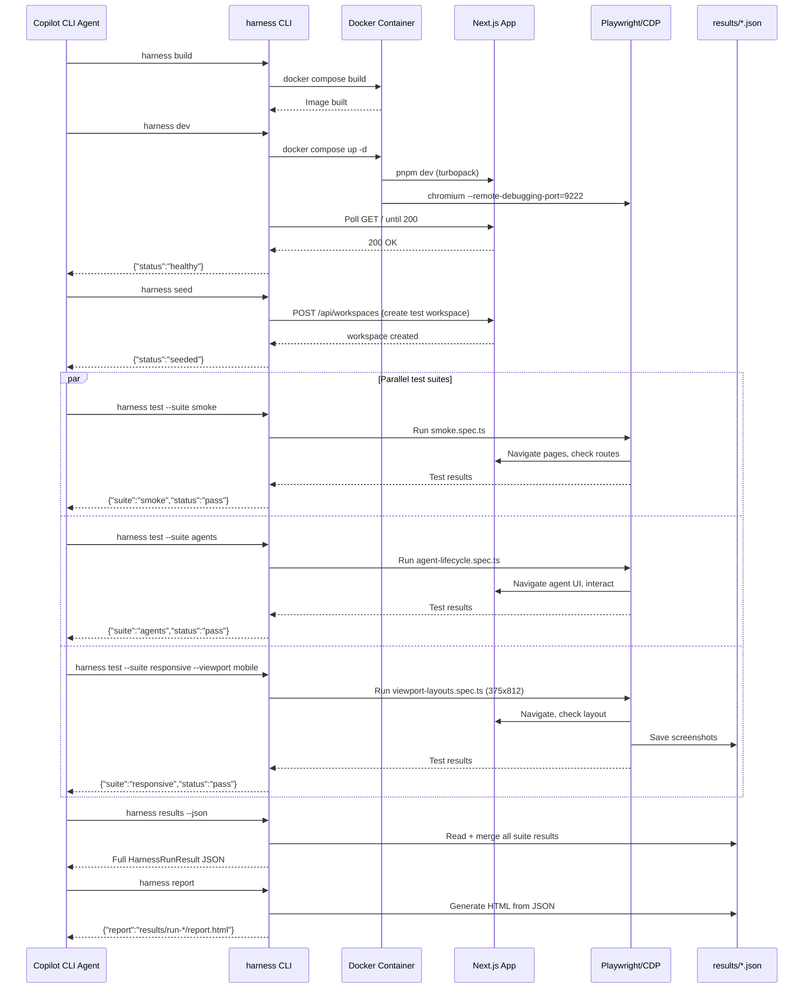

# Workshop: Harness Folder Structure & Agentic Prompts

**Type**: Storage Design + CLI Flow
**Plan**: 067-harness
**Spec**: [exploration.md](../exploration.md)
**Created**: 2026-03-06
**Status**: Draft

**Related Documents**:
- [exploration.md](../exploration.md)
- [001-docker-container-setup.md](001-docker-container-setup.md)

**Domain Context**:
- **Primary Domain**: External tooling (not a domain)
- **Related Domains**: All domains are test targets; workflow-ui and positional-graph for test orchestration

---

## Purpose

Define the complete harness folder structure, CLI tool design, agentic prompt system, test result format, and workflow integration — everything needed for an AI agent to orchestrate end-to-end testing of Chainglass.

## Key Questions Addressed

- What is the folder structure for `harness/`?
- What CLI commands does the harness provide?
- What structured JSON format do test results use?
- How does an agent (us, in Copilot CLI) start, browse, and test the site?
- How do viewports and responsive testing work?

> **Out of scope for now**: Sub-agent orchestration, workflow template integration,
> parallel test dispatch, report consolidation prompts. We'll discover those patterns
> by using the harness. Focus is: get the infra working for us first.

---

## 1. Folder Structure

```
harness/
├── justfile                          # Harness commands (build, dev, test, seed, etc.)
├── Dockerfile                        # Multi-stage (from Workshop 001)
├── docker-compose.yml                # Dev mode compose (from Workshop 001)
├── playwright.config.ts              # Playwright: base URL, viewports, timeouts
├── package.json                      # Deps: @playwright/test, zod (result validation)
├── tsconfig.json                     # Strict TS for harness code
│
├── src/
│   ├── cli/                          # Harness CLI (structured JSON output)
│   │   ├── index.ts                  # Entry point (Commander.js)
│   │   ├── commands/
│   │   │   ├── init.ts               # Check Docker, Playwright, write .env
│   │   │   ├── build.ts              # docker compose build
│   │   │   ├── dev.ts                # docker compose up -d + health wait
│   │   │   ├── stop.ts               # docker compose down
│   │   │   ├── health.ts             # Probe app + MCP + CDP endpoints
│   │   │   ├── seed.ts               # Seed workspace, worktrees, workflows
│   │   │   ├── test.ts               # Run Playwright suites
│   │   │   ├── screenshot.ts         # Capture named screenshot via CDP
│   │   │   ├── results.ts            # Show/query latest run results
│   │   │   └── report.ts             # Generate HTML report from JSON
│   │   └── output.ts                 # Structured JSON output helpers
│   │
│   ├── reporters/
│   │   ├── json-reporter.ts          # Playwright custom reporter → JSON
│   │   └── html-reporter.ts          # Optional: HTML summary page
│   │
│   ├── seed/
│   │   ├── seed-workspace.ts         # Create test workspace + git init + worktrees
│   │   ├── seed-workflows.ts         # Instantiate harness workflow templates
│   │   └── seed-fixtures.ts          # Sample files, agent sessions, etc.
│   │
│   └── viewports/
│       └── devices.ts                # Named viewport definitions
│
├── tests/                            # Playwright test suites
│   ├── smoke/
│   │   └── health.spec.ts            # App loads, routes exist, MCP responds
│   ├── features/
│   │   ├── agents/
│   │   │   └── agent-lifecycle.spec.ts
│   │   ├── browser/
│   │   │   └── file-browser.spec.ts
│   │   ├── terminal/
│   │   │   └── terminal-session.spec.ts
│   │   ├── workflows/
│   │   │   └── workflow-execution.spec.ts
│   │   └── responsive/
│   │       └── viewport-layouts.spec.ts
│   └── fixtures/
│       ├── test-workspace/           # Git repo template for seeding
│       └── sample-files/             # Files for browser testing
│
├── results/                          # Test output (gitignored)
```

---

## 2. Harness CLI Commands

All commands output structured JSON to stdout. Human-readable summaries go to stderr so agents can `JSON.parse(stdout)` cleanly.

| Command | Description | Exit Code |
|---------|-------------|-----------|
| `harness init` | Verify Docker, Playwright, write `.env.harness` | 0=ready, 1=missing deps |
| `harness build` | Build Docker image | 0=success, 1=build fail |
| `harness dev` | Start container, wait for health | 0=healthy, 1=timeout |
| `harness stop` | Stop and remove container | 0=stopped |
| `harness health` | Probe app (3000), MCP, CDP (9222) | 0=all healthy, 1=degraded |
| `harness seed` | Seed test workspace + workflows | 0=seeded, 1=seed fail |
| `harness test` | Run all Playwright suites | 0=all pass, 1=failures |
| `harness test --suite <name>` | Run specific suite | 0=pass, 1=fail |
| `harness test --viewport <name>` | Run at specific viewport | 0=pass, 1=fail |
| `harness screenshot <name>` | Capture screenshot via CDP | 0=saved, 1=error |
| `harness results` | Show latest run JSON | 0=found, 1=no results |
| `harness report` | Generate HTML from latest JSON | 0=generated |

### Example: `harness health` output

```json
{
  "command": "health",
  "status": "ok",
  "checks": {
    "container": { "status": "running", "uptime": "2m 15s" },
    "app": { "status": "ok", "url": "http://localhost:3000", "responseMs": 42 },
    "mcp": { "status": "ok", "url": "http://localhost:3000/_next/mcp", "tools": 6 },
    "cdp": { "status": "ok", "url": "http://localhost:9222", "browsers": 1 },
    "terminal": { "status": "ok", "url": "ws://localhost:4500" }
  }
}
```

### Example: `harness test --suite smoke` output

```json
{
  "command": "test",
  "runId": "run-2026-03-07-001",
  "suite": "smoke",
  "status": "pass",
  "duration": 3200,
  "tests": [
    { "id": "smoke-health", "name": "App loads and responds", "status": "pass", "duration": 450 },
    { "id": "smoke-routes", "name": "All routes accessible", "status": "pass", "duration": 1200 },
    { "id": "smoke-mcp", "name": "MCP endpoint responds", "status": "pass", "duration": 320 }
  ],
  "summary": { "total": 3, "pass": 3, "fail": 0, "skip": 0 }
}
```

### Error Codes

| Code | Meaning |
|------|---------|
| E100 | Docker not running or not installed |
| E101 | Container failed to start |
| E102 | Health check timeout (app not responding within 60s) |
| E103 | Playwright browser launch failed |
| E104 | Seed script failed (workspace creation error) |
| E105 | Test suite not found |
| E106 | Screenshot capture failed |
| E107 | Results file not found or corrupt |
| E108 | CDP connection refused |
| E109 | MCP endpoint not responding |

---

## 3. Test Result JSON Format

### TypeScript Interfaces

```typescript
interface HarnessRunResult {
  runId: string;                    // "run-2026-03-07-001"
  timestamp: string;                // ISO-8601
  duration: number;                 // Total ms
  container: {
    image: string;                  // "chainglass-harness:dev"
    ports: { app: number; cdp: number; terminal: number };
  };
  suites: HarnessSuiteResult[];
  summary: {
    total: number;
    pass: number;
    fail: number;
    skip: number;
    error: number;
  };
}

interface HarnessSuiteResult {
  name: string;                     // "smoke", "agents", "responsive"
  viewport: ViewportConfig;
  tests: HarnessTestResult[];
  duration: number;
}

interface HarnessTestResult {
  id: string;                       // "agents-create-session"
  name: string;                     // "Can create agent session"
  status: 'pass' | 'fail' | 'skip' | 'error';
  duration: number;
  viewport: ViewportConfig;
  screenshots?: string[];           // Relative paths in run folder
  error?: {
    message: string;
    stack?: string;
    screenshot?: string;            // Auto-captured on failure
  };
  assertions: Array<{
    name: string;
    passed: boolean;
    expected?: string;
    actual?: string;
  }>;
}

interface ViewportConfig {
  name: string;                     // "desktop-lg"
  width: number;
  height: number;
  deviceScaleFactor?: number;
  isMobile?: boolean;
  hasTouch?: boolean;
}
```

### Example Full Result

```json
{
  "runId": "run-2026-03-07-001",
  "timestamp": "2026-03-07T00:15:00.000Z",
  "duration": 45200,
  "container": {
    "image": "chainglass-harness:dev",
    "ports": { "app": 3000, "cdp": 9222, "terminal": 4500 }
  },
  "suites": [
    {
      "name": "smoke",
      "viewport": { "name": "desktop-lg", "width": 1440, "height": 900 },
      "duration": 3200,
      "tests": [
        {
          "id": "smoke-health",
          "name": "App loads and responds",
          "status": "pass",
          "duration": 450,
          "viewport": { "name": "desktop-lg", "width": 1440, "height": 900 },
          "assertions": [
            { "name": "HTTP 200", "passed": true },
            { "name": "Page title contains Chainglass", "passed": true }
          ]
        }
      ]
    },
    {
      "name": "responsive",
      "viewport": { "name": "mobile", "width": 375, "height": 812, "isMobile": true, "hasTouch": true },
      "duration": 5100,
      "tests": [
        {
          "id": "responsive-sidebar-collapsed",
          "name": "Sidebar collapses on mobile",
          "status": "pass",
          "duration": 1200,
          "viewport": { "name": "mobile", "width": 375, "height": 812, "isMobile": true, "hasTouch": true },
          "screenshots": ["screenshots/responsive-sidebar-mobile.png"],
          "assertions": [
            { "name": "Sidebar not visible", "passed": true },
            { "name": "Hamburger menu visible", "passed": true }
          ]
        }
      ]
    }
  ],
  "summary": { "total": 2, "pass": 2, "fail": 0, "skip": 0, "error": 0 }
}
```

---

## 4. Agentic Usage Notes

> **Sub-agent prompts, orchestrator prompts, and test dispatch patterns are OUT OF SCOPE
> for this plan.** In the final system, these will be Chainglass work units / workflow
> nodes — not static prompt files. This workshop focuses on the **infrastructure** the
> agents will use, not the agents themselves.

### What agents need from the harness

The harness CLI provides the **tool surface** agents interact with:

1. **Boot**: `harness dev` → starts app, returns health JSON
2. **Seed**: `harness seed` → creates test data, returns confirmation JSON
3. **Test**: `harness test --suite X --viewport Y` → runs Playwright, returns result JSON
4. **Observe**: `harness screenshot <name>` → captures current state via CDP
5. **Report**: `harness results --json` → returns consolidated run results

All commands return structured JSON to stdout. Agents parse it. The CLI validates output format so agents cannot produce malformed results.

### CDP for ad-hoc browsing

Agents connect to `http://localhost:9222` (CDP) from outside the container to:
- Open pages at specific viewports
- Capture screenshots
- Read console logs
- Interact with UI elements

This enables the "full on agentic dev mode" iteration loop without running the full test suite.

---

## 5. Parallel Browser Strategy

One Playwright browser instance per container. Multiple **contexts** for parallel sessions.

```
Docker Container
└── Chromium (single instance, headless, CDP on :9222)
    ├── Context A → Desktop 1440x900  → smoke suite
    ├── Context B → Desktop 1440x900  → agents suite
    ├── Context C → Desktop 1440x900  → workflows suite
    ├── Context D → iPad 768x1024     → responsive suite
    ├── Context E → iPhone 375x812    → responsive suite
    └── Context F → Desktop 1440x900  → browser suite
```

Each context has **isolated cookies, localStorage, and session state**. They share the same Chromium process (efficient memory) but cannot see each other's data.

**Playwright config** (`playwright.config.ts`):
```typescript
import { defineConfig, devices } from '@playwright/test';

export default defineConfig({
  testDir: './tests',
  timeout: 30_000,
  retries: 1,
  workers: 4,                         // 4 parallel workers
  use: {
    baseURL: 'http://localhost:3000',
    screenshot: 'only-on-failure',
    trace: 'on-first-retry',
  },
  projects: [
    { name: 'desktop', use: { viewport: { width: 1440, height: 900 } } },
    { name: 'tablet', use: { ...devices['iPad Pro 11'] } },
    { name: 'mobile', use: { ...devices['iPhone 14'] } },
  ],
});
```

**From outside the container** (agent on host):
```typescript
import { chromium } from 'playwright';
const browser = await chromium.connectOverCDP('http://localhost:9222');
const context = await browser.newContext({ viewport: { width: 375, height: 812 } });
const page = await context.newPage();
await page.goto('http://localhost:3000');
await page.screenshot({ path: 'mobile-home.png' });
```

---

## 6. Viewport Definitions

**File**: `harness/src/viewports/devices.ts`

```typescript
export const HARNESS_VIEWPORTS = {
  'desktop-lg': { width: 1440, height: 900 },
  'desktop-md': { width: 1280, height: 800 },
  'tablet':     { width: 768,  height: 1024, isMobile: true, hasTouch: true },
  'mobile':     { width: 375,  height: 812,  isMobile: true, hasTouch: true, deviceScaleFactor: 3 },
} as const;

export type ViewportName = keyof typeof HARNESS_VIEWPORTS;
```

| Name | Width | Height | Mobile | Touch | Use Case |
|------|-------|--------|--------|-------|----------|
| desktop-lg | 1440 | 900 | no | no | Primary development view |
| desktop-md | 1280 | 800 | no | no | Smaller desktop / laptop |
| tablet | 768 | 1024 | yes | yes | iPad-class tablet |
| mobile | 375 | 812 | yes | yes | iPhone 14 class phone |

---

## 7. Seed Scripts

The harness seeds a reproducible test environment before each run.

**`harness seed` creates**:

| What | How | Purpose |
|------|-----|---------|
| Test workspace | `IWorkspaceService.add('harness-test', '/tmp/harness-workspace')` | Target for all tests |
| Git repo + worktrees | `git init` + `git worktree add` (2 worktrees) | Test worktree switching |
| Sample files | Copy fixture files into workspace | Test file browser |
| Workflow instance | `ITemplateService.instantiate('smoke')` | Test workflow UI |
| Sample agent session | Create via API `POST /api/agents` | Test agent panel |

**Idempotent**: Seed checks if data exists before creating. Safe to run multiple times.

**Teardown**: `harness stop` removes the container (ephemeral). Seeded data lives only in the container's filesystem. Fresh seed on every `harness dev + harness seed` cycle.

---

## 8. Test Lifecycle



---

## 9. Open Questions

| # | Question | Status | Notes |
|---|----------|--------|-------|
| Q1 | Should harness CLI be a standalone package or part of `apps/cli`? | **OPEN** | Standalone keeps it decoupled; part of `apps/cli` reuses DI infrastructure |
| Q2 | How to handle auth in seeded test environment? | **RESOLVED** | `DISABLE_AUTH=true` env var bypasses middleware + API session checks |
| Q3 | Should screenshots use visual regression (pixel diff) or just capture? | **OPEN** | Start with capture-only; add `expect(page).toHaveScreenshot()` baselines later |
| Q4 | How to make seed scripts work both inside Docker and locally? | **OPEN** | Use API calls (HTTP) not DI imports, so they work from any context |
| Q5 | Max number of parallel Playwright contexts per browser? | **RESOLVED** | Chromium handles 8-16 contexts comfortably; beyond that, memory pressure. Plan 2 uses multiple containers. |
