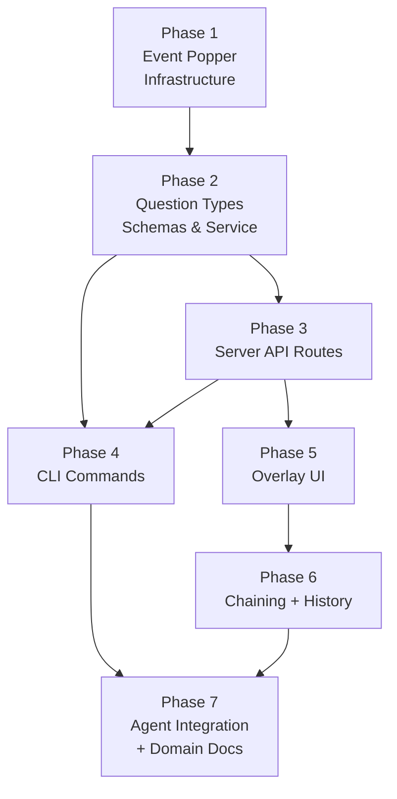

# Plan: Event Popper

> **Event Popper** is the generic external event in/out system. **Question Popper** is the first concept built on it.

**Spec**: [question-popper-spec.md](question-popper-spec.md)
**Research**: [research-dossier.md](research-dossier.md)
**Workshop**: [001-external-event-schema.md](workshops/001-external-event-schema.md)
**Complexity**: CS-4 (large) — P=8
**Testing**: Hybrid — TDD for core logic, lightweight for UI wiring
**Mocks**: Fakes only (Constitution Principle 4)
**Documentation**: Hybrid — README section + docs/how/ guide

---

## Research Summary

**73 findings across 8 subagents** confirmed: all infrastructure exists. Key patterns to reuse: `ICentralEventNotifier` for SSE from API routes, `IStateService` for reactive state publishing, activity-log overlay pattern for UI, `wrapAction()` + `resolveOrOverrideContext()` for CLI commands. 16 prior learnings incorporated (globalThis guards, notification-fetch, strict Zod). No external dependencies needed.

**Workshop 001** resolved the schema design: two-layer system with generic event envelopes and typed first-class concept wrappers. Tmux context is a shared utility in `packages/shared`.

**Architecture change (v2)**: Switched from file-based protocol (in.json/out.json + file watchers) to HTTP API protocol. Server writes port to `.chainglass/`, CLI calls localhost API endpoints, polls for answers. Reuses existing `ICentralEventNotifier` and `IStateService` for real-time UI updates. Eliminates need for watcher adapters and domain event adapters entirely.

---

## Target Domains

| Domain | Status | Relationship | Role |
|--------|--------|-------------|------|
| `_platform/external-events` | **NEW** | **create** | Generic event envelope schemas, GUID generation, port discovery, localhost-only API guard |
| `question-popper` | **NEW** | **create** | First-class question concept: payload schemas, CLI commands, server API routes, overlay UI |
| `_platform/events` | existing | **consume** | `ICentralEventNotifier` to emit SSE events from API route handlers, `toast()` |
| `_platform/state` | existing | **consume** | `IStateService` to publish question state from API routes, `useGlobalState` in UI |
| `_platform/panel-layout` | existing | **consume** | Overlay panel positioning anchor |
| `_platform/sdk` | existing | **consume** | `ICommandRegistry` for keyboard shortcut |

## Key Findings

| # | Finding | Source | Impact |
|---|---------|--------|--------|
| 1 | All infrastructure exists — `ICentralEventNotifier`, `IStateService`, overlay pattern, toast, SSE | IA, DC, PS | No new event infrastructure needed; emit from API routes directly |
| 2 | Activity-log (Plan 065) is closest structural template | DB-01, DE-01 | Follow its domain structure and overlay pattern |
| 3 | Workflow-events Q&A is completely separate — zero shared code | DB-03 | Independent domain, no imports from workflow-events |
| 4 | Can call `notifier.emit()` and `stateService.publish()` from API route handlers | API research | Server-side real-time updates without file watchers |
| 5 | Auth middleware bypass via `proxy.ts` config.matcher exclusion | API research | Localhost-only routes excluded from auth check |
| 6 | Server port not currently written to disk — need to add port file on boot | API research | CLI port discovery requires new instrumentation hook |
| 7 | Tmux context auto-detectable from `$TMUX` env var | Verified live | Shared utility in packages/shared, agents don't need to know |

## Acceptance Criteria Summary

35 ACs organized by area — full definitions in [spec](question-popper-spec.md#acceptance-criteria).

| ACs | Area | Phase | Summary |
|-----|------|-------|---------|
| AC-01–02 | API Protocol | 2, 3 | Server stores questions, CLI retrieves via API, SSE + state updates |
| AC-03–04 | Schema | 2 | Two event types (question, alert), four question variants, answer statuses |
| AC-05–10 | CLI Questions | 4 | `cg question ask/get/answer/list` with blocking, timeout, GUID return |
| AC-11–12 | CLI Alerts | 4 | `cg alert send` fire-and-forget, alerts in list output |
| AC-13–14 | CLI Tmux | 4 | Auto-detect tmux session/window/pane, optional fields |
| AC-15–17 | Notification | 5 | Toast, desktop notification, green indicator, badge count |
| AC-18–23 | Overlay Panel | 5 | Panel rendering, answer form per type, alerts, dismiss, mark read |
| AC-24–25 | Chaining | 6 | Conversation threading via previousQuestionId, independent lifecycle |
| AC-26–27 | History | 6 | Historical list, expandable detail with chain |
| AC-28–30 | Real-Time | 3, 5 | SSE updates from service, indicator/overlay sync, desktop notifications |
| AC-31–32 | Dismiss/Skip | 5 | Dismiss via API, persists in history |
| AC-33–35 | Agent Integration | 4, 7 | Minimal CLAUDE.md, comprehensive `--help` text, self-documenting CLI |

## Domain Manifest

| File | Domain | Classification |
|------|--------|---------------|
| `packages/shared/src/event-popper/schemas.ts` | `_platform/external-events` | contract |
| `packages/shared/src/event-popper/guid.ts` | `_platform/external-events` | internal |
| `packages/shared/src/event-popper/port-discovery.ts` | `_platform/external-events` | contract |
| `packages/shared/src/event-popper/index.ts` | `_platform/external-events` | contract |
| `packages/shared/src/utils/tmux-context.ts` | `_platform/external-events` | contract |
| `apps/web/src/lib/localhost-guard.ts` | `_platform/external-events` | internal |
| `apps/web/instrumentation.ts` | `_platform/external-events` | internal |
| `apps/web/proxy.ts` | `_platform/external-events` | internal |
| `packages/shared/src/features/027-central-notify-events/workspace-domain.ts` | `_platform/events` | contract |
| `test/unit/event-popper/infrastructure.test.ts` | `_platform/external-events` | verification |
| `packages/shared/package.json` | `_platform/external-events` | internal |
| `packages/shared/src/question-popper/schemas.ts` | `question-popper` | contract |
| `packages/shared/src/question-popper/types.ts` | `question-popper` | contract |
| `packages/shared/src/question-popper/index.ts` | `question-popper` | contract |
| `packages/shared/src/interfaces/question-popper.interface.ts` | `question-popper` | contract |
| `packages/shared/src/fakes/fake-question-popper.ts` | `question-popper` | contract |
| `apps/cli/src/commands/question.command.ts` | `question-popper` | internal |
| `apps/cli/src/commands/alert.command.ts` | `question-popper` | internal |
| `apps/cli/src/commands/event-popper-client.ts` | `question-popper` | internal |
| `apps/web/app/api/event-popper/*/route.ts` | `question-popper` | internal |
| `apps/web/src/features/067-question-popper/lib/question-popper.service.ts` | `question-popper` | internal |
| `apps/web/src/features/067-question-popper/hooks/*.tsx` | `question-popper` | internal |
| `apps/web/src/features/067-question-popper/components/*.tsx` | `question-popper` | internal |
| `apps/web/app/(dashboard)/workspaces/[slug]/question-popper-overlay-wrapper.tsx` | `question-popper` | internal |
| `apps/web/app/(dashboard)/workspaces/[slug]/layout.tsx` | `question-popper` | internal |
| `apps/web/src/features/067-question-popper/lib/desktop-notifications.ts` | `question-popper` | internal |
| `test/unit/question-popper/ui-components.test.tsx` | `question-popper` | verification |
| `apps/web/src/features/067-question-popper/lib/chain-resolver.ts` | `question-popper` | internal |
| `test/unit/question-popper/chain-resolver.test.tsx` | `question-popper` | verification |
| `docs/domains/_platform/external-events/domain.md` | `_platform/external-events` | contract |
| `docs/domains/question-popper/domain.md` | `question-popper` | contract |
| `test/contracts/question-popper.contract.ts` | `question-popper` | verification |
| `test/contracts/question-popper.contract.test.ts` | `question-popper` | verification |
| `apps/web/src/lib/di-container.ts` | `question-popper` | internal |
| `packages/shared/src/di-tokens.ts` | `question-popper` | contract |

---

## Phases

### Phase 1: Event Popper Infrastructure (`_platform/external-events`)

Generic event envelope schemas, GUID generation, port discovery, localhost guard, and tmux detection. The shared infrastructure that Question Popper and future event poppers build on.

**Domain**: `_platform/external-events` (NEW infrastructure)
**Testing**: TDD — schemas and utilities are pure functions
**ACs**: AC-01, AC-02

| # | Task | Domain | Key Files |
|---|------|--------|-----------|
| 1.1 | Define generic event envelope Zod schemas (`EventPopperRequest`, `EventPopperResponse`) with `.strict()` and `version: 1`. Request has `type`, `source`, `payload`, `meta`; response has `status`, `payload` | `_platform/external-events` | `packages/shared/src/event-popper/schemas.ts` |
| 1.2 | Implement GUID generation (timestamp + random suffix) | `_platform/external-events` | `packages/shared/src/event-popper/guid.ts` |
| 1.3 | Port discovery: utility to read server port from `.chainglass/server.json` (CLI reads this to find the server). Type: `{ port: number, pid: number, startedAt: string }`. Validates PID is alive AND cross-checks `startedAt` against process start time to detect PID recycling | `_platform/external-events` | `packages/shared/src/event-popper/port-discovery.ts` |
| 1.4 | Server-side: write `.chainglass/server.json` on Next.js boot via `instrumentation.ts`. Remove on graceful shutdown | `_platform/external-events` | `apps/web/instrumentation.ts` (modify) |
| 1.5 | Localhost-only guard: middleware helper that rejects non-localhost requests to `/api/event-popper/*` routes. Checks `request.ip` for `127.0.0.1`/`::1` AND rejects any request with `X-Forwarded-For` header (proxy bypass prevention). Add route exclusion to `proxy.ts` auth matcher so these routes bypass authentication | `_platform/external-events` | `apps/web/src/lib/localhost-guard.ts`, `apps/web/proxy.ts` (modify) |
| 1.6 | Shared tmux detection utility: `detectTmuxContext()` and `getTmuxMeta()` | `_platform/external-events` | `packages/shared/src/utils/tmux-context.ts` |
| 1.7 | Add `WorkspaceDomain.EventPopper` channel constant for SSE | `_platform/events` (additive) | `packages/shared/src/features/027-central-notify-events/workspace-domain.ts` |
| 1.8 | Unit tests: schema validation, GUID uniqueness, port discovery read/write (including PID recycling), localhost guard (including X-Forwarded-For rejection), tmux detection | `_platform/external-events` | `test/unit/event-popper/infrastructure.test.ts` |
| 1.9 | Barrel exports and domain documentation | `_platform/external-events` | `packages/shared/src/event-popper/index.ts`, `docs/domains/_platform/external-events/domain.md` |

---

### Phase 2: Question Concept — Types, Schemas, Service

First-class question-and-answer types and the server-side question store. Also alert types.

**Domain**: `question-popper` (NEW business)
**Testing**: TDD — interface first, fake second, tests third, implementation fourth
**ACs**: AC-03, AC-04

| # | Task | Domain | Key Files |
|---|------|--------|-----------|
| 2.1 | Define `QuestionPayloadSchema` (questionType, text, description, options, default, timeout, previousQuestionId) with Zod `.strict()` | `question-popper` | `packages/shared/src/question-popper/schemas.ts` |
| 2.2 | Define `AnswerPayloadSchema` (answer, text) and `ClarificationPayloadSchema` (text) | `question-popper` | `packages/shared/src/question-popper/schemas.ts` |
| 2.3 | Define `AlertPayloadSchema` (text, description) | `question-popper` | `packages/shared/src/question-popper/schemas.ts` |
| 2.4 | Composed types: `QuestionIn`, `QuestionOut`, `AlertIn` — typed views for callers | `question-popper` | `packages/shared/src/question-popper/types.ts` |
| 2.5 | `IQuestionPopperService` interface: `askQuestion()`, `getQuestion()`, `answerQuestion()`, `dismissQuestion()`, `listQuestions()`, `sendAlert()`, `acknowledgeAlert()` | `question-popper` | `packages/shared/src/interfaces/question-popper.interface.ts` |
| 2.6 | `FakeQuestionPopperService` with inspection helpers (`getPendingQuestions()`, `getAnsweredCount()`, `simulateAnswer()`) | `question-popper` | `packages/shared/src/fakes/fake-question-popper.ts` |
| 2.7 | Contract tests for question lifecycle: ask → answer, ask → dismiss, ask → needs-clarification → follow-up, alert → acknowledge | `question-popper` | `test/contracts/question-popper.contract.ts` |
| 2.8 | `QuestionPopperService` — real implementation backed by worktree data (`.chainglass/data/questions/`). Emits SSE via `ICentralEventNotifier` and publishes state via `IStateService` on ALL lifecycle events: ask, answer, dismiss (questions) AND send, acknowledge (alerts). Outstanding count includes both unanswered questions and unread alerts. **Rehydrates on construction**: scans disk for unanswered questions/unread alerts and publishes initial outstanding count to `IStateService` (prevents phantom-zero after server restart) | `question-popper` | `apps/web/src/features/067-question-popper/lib/question-popper.service.ts` |
| 2.9 | DI registration: `IQuestionPopperService` in web container, wired with `ICentralEventNotifier` and `IStateService` | `question-popper` | `apps/web/src/lib/di-container.ts` (modify) |
| 2.10 | State domain registration: `question-popper:*:outstanding-count` published by service on every ask/answer/dismiss | `question-popper` | `apps/web/src/lib/state/state-connector.tsx` (modify) |
| 2.11 | Barrel exports | `question-popper` | `packages/shared/src/question-popper/index.ts` |

---

### Phase 3: Server API Routes

Localhost-only API endpoints that the CLI calls. First-class, non-generic URLs like `/api/event-popper/ask-question`.

**Domain**: `question-popper` (server layer)
**Testing**: TDD for route handlers using FakeQuestionPopperService
**ACs**: AC-15, AC-28, AC-29

| # | Task | Domain | Key Files |
|---|------|--------|-----------|
| 3.1 | `POST /api/event-popper/ask-question` — validate request, call `service.askQuestion()`, return `{ questionId }`. Localhost guard applied | `question-popper` | `apps/web/app/api/event-popper/ask-question/route.ts` |
| 3.2 | `GET /api/event-popper/question/[id]` — return full question data + answer status. CLI polls this; UI also uses it | `question-popper` | `apps/web/app/api/event-popper/question/[id]/route.ts` |
| 3.3 | `POST /api/event-popper/answer-question/[id]` — validate question exists and is unanswered, call `service.answerQuestion()` | `question-popper` | `apps/web/app/api/event-popper/answer-question/[id]/route.ts` |
| 3.4 | `POST /api/event-popper/send-alert` — validate request, call `service.sendAlert()`, return `{ alertId }`. Localhost guard | `question-popper` | `apps/web/app/api/event-popper/send-alert/route.ts` |
| 3.5 | `GET /api/event-popper/list` — list all questions/alerts with status for current worktree | `question-popper` | `apps/web/app/api/event-popper/list/route.ts` |
| 3.6 | `POST /api/event-popper/dismiss/[id]` — dismiss a question | `question-popper` | `apps/web/app/api/event-popper/dismiss/[id]/route.ts` |
| 3.7 | `POST /api/event-popper/acknowledge/[id]` — acknowledge an alert | `question-popper` | `apps/web/app/api/event-popper/acknowledge/[id]/route.ts` |
| 3.8 | Unit tests: all route handlers with FakeQuestionPopperService, test localhost guard rejection | `question-popper` | `test/unit/question-popper/api-routes.test.ts` |

---

### Phase 4: CLI Commands

CLI commands for `cg question` and `cg alert`. CLI discovers server port from `.chainglass/server.json`, calls localhost API, polls for answers.

**Domain**: `question-popper` (CLI layer)
**Testing**: TDD for handlers; integration tests for blocking/timeout with subprocess spawning
**ACs**: AC-05, AC-06, AC-07, AC-08, AC-09, AC-10, AC-11, AC-12, AC-13, AC-14, AC-33, AC-34, AC-35

| # | Task | Domain | Key Files |
|---|------|--------|-----------|
| 4.1 | Register `cg question` command group — comprehensive agent-oriented `--help` text | `question-popper` | `apps/cli/src/commands/question.command.ts` |
| 4.2 | CLI HTTP client helper: read port from `.chainglass/server.json`, call `http://localhost:{port}/api/event-popper/*`. Error handling for server not running | `question-popper` | `apps/cli/src/commands/event-popper-client.ts` |
| 4.3 | `cg question ask` handler: resolve workspace, auto-detect tmux, POST to API, get `{ questionId }` | `question-popper` | `apps/cli/src/commands/question.command.ts` |
| 4.4 | Blocking/poll loop: polls `GET /api/event-popper/question/{id}` every 2s, default 600s timeout, `Promise.race` | `question-popper` | `apps/cli/src/commands/question.command.ts` |
| 4.5 | `cg question get {id}`: GET from API, return answer or pending | `question-popper` | `apps/cli/src/commands/question.command.ts` |
| 4.6 | `cg question answer {id}`: POST to API (scripting/testing) | `question-popper` | `apps/cli/src/commands/question.command.ts` |
| 4.7 | `cg question list`: GET from API, display summary | `question-popper` | `apps/cli/src/commands/question.command.ts` |
| 4.8 | Register `cg alert` with comprehensive `--help` | `question-popper` | `apps/cli/src/commands/alert.command.ts` |
| 4.9 | `cg alert send`: POST to API, return immediately, auto-detect tmux | `question-popper` | `apps/cli/src/commands/alert.command.ts` |
| 4.10 | Register both command groups in CLI index | `question-popper` | `apps/cli/src/commands/index.ts` |
| 4.11 | Unit tests: all handlers with fake HTTP responses | `question-popper` | `test/unit/question-popper/cli-commands.test.ts` |
| 4.12 | Integration tests: blocking + timeout via subprocess spawning (describe.skip) | `question-popper` | `test/integration/question-popper/cli-blocking.test.ts` |

---

### Phase 5: Overlay UI — Indicator, Panel, Answer Form

Question mark indicator, overlay panel, question/alert rendering, answer form, toast/desktop notifications.

**Domain**: `question-popper` (UI layer)
**Testing**: Lightweight — component tests, not full TDD. Business logic is in service (Phase 2) and API routes (Phase 3).
**Constitution Deviation**: Lightweight testing for React components. Rationale: UI is thin over fully-TDD'd domain logic.
**ACs**: AC-16, AC-17, AC-18, AC-19, AC-20, AC-21, AC-22, AC-23, AC-30, AC-31, AC-32

| # | Task | Domain | Key Files |
|---|------|--------|-----------|
| 5.1 | `useQuestionPopper` hook: subscribe to SSE `EventPopper` channel, fetch question list via API, track outstanding count from global state, expose overlay toggles | `question-popper` | `apps/web/src/features/067-question-popper/hooks/use-question-popper.tsx` |
| 5.2 | `QuestionPopperIndicator`: question mark icon, green glow, badge count, click toggles overlay | `question-popper` | `apps/web/src/features/067-question-popper/components/question-popper-indicator.tsx` |
| 5.3 | `QuestionPopperOverlayPanel`: fixed-position overlay, mutual exclusion via `overlay:close-all` | `question-popper` | `apps/web/src/features/067-question-popper/components/question-popper-overlay-panel.tsx` |
| 5.4 | `QuestionCard`: question text, markdown description, tmux badge, time ago | `question-popper` | `apps/web/src/features/067-question-popper/components/question-card.tsx` |
| 5.5 | `AlertCard`: alert text, markdown description, "Mark Read" button | `question-popper` | `apps/web/src/features/067-question-popper/components/alert-card.tsx` |
| 5.6 | `AnswerForm`: type-appropriate input + freeform text + Submit / Needs More Info / Dismiss | `question-popper` | `apps/web/src/features/067-question-popper/components/answer-form.tsx` |
| 5.7 | Toast + desktop notifications on new events | `question-popper` | `apps/web/src/features/067-question-popper/lib/desktop-notifications.ts` |
| 5.8 | `QuestionPopperOverlayWrapper`: provider + error boundary + dynamic import | `question-popper` | `apps/web/app/(dashboard)/workspaces/[slug]/question-popper-overlay-wrapper.tsx` |
| 5.9 | Mount wrapper in workspace layout | `question-popper` | `apps/web/app/(dashboard)/workspaces/[slug]/layout.tsx` (modify) |
| 5.10 | Mount indicator in dashboard shell (top-right) | `question-popper` | `apps/web/src/components/dashboard-shell.tsx` (modify) |
| 5.11 | Component tests: hook behavior, answer form, dismiss flow | `question-popper` | `test/unit/question-popper/ui-components.test.tsx` |

---

### Phase 6: Question Chaining + History

Conversation threading via `previousQuestionId` and historical browsing.

**Domain**: `question-popper` (UI layer)
**Testing**: Lightweight — verify chain resolution and rendering
**ACs**: AC-24, AC-25, AC-26, AC-27

| # | Task | Domain | Key Files |
|---|------|--------|-----------|
| 6.1 | `resolveChain(questionId)`: walk `previousQuestionId` via API, return ordered chain | `question-popper` | `apps/web/src/features/067-question-popper/lib/chain-resolver.ts` |
| 6.2 | `QuestionChainView`: render conversation thread | `question-popper` | `apps/web/src/features/067-question-popper/components/question-chain-view.tsx` |
| 6.3 | `QuestionHistoryList`: all past items, expandable detail | `question-popper` | `apps/web/src/features/067-question-popper/components/question-history-list.tsx` |
| 6.4 | Unit test for chain resolution | `question-popper` | `test/unit/question-popper/chain-resolver.test.ts` |

---

### Phase 7: Agent Integration + Domain Documentation

CLAUDE.md prompt, domain documentation, domain registry, polish.

**Domain**: `question-popper`, `_platform/external-events`
**Testing**: N/A (documentation)
**ACs**: AC-33

| # | Task | Domain | Key Files |
|---|------|--------|-----------|
| 7.1 | Minimal CLAUDE.md prompt fragment: directs agents to `cg question --help` and `cg alert --help` | `question-popper` | `CLAUDE.md` (modify) |
| 7.2 | `docs/how/question-popper.md` integration guide | `question-popper` | `docs/how/question-popper.md` |
| 7.3 | Finalize `docs/domains/_platform/external-events/domain.md` | `_platform/external-events` | (created in Phase 1) |
| 7.4 | Create `docs/domains/question-popper/domain.md` | `question-popper` | `docs/domains/question-popper/domain.md` |
| 7.5 | Update domain registry and domain map diagram | both | `docs/domains/registry.md`, `docs/domains/domain-map.md` |
| 7.6 | SDK command: `question-popper.toggleOverlay` keyboard shortcut | `question-popper` | `apps/web/src/features/067-question-popper/sdk-contribution.ts` |

---

## Phase Dependency Graph

Phases 1→2→3 strict sequence (infrastructure → types/service → API routes). Phase 4 (CLI) needs Phase 3 (API to call). Phase 5 (UI) needs Phase 3 (API to consume). Phase 6 (chaining) needs Phase 5. Phase 7 (docs) is last.

---

## Files Changed Summary

### New Files (~25)

| Location | Count | Description |
|----------|-------|-------------|
| `packages/shared/src/event-popper/` | 4 | Schemas, GUID, port-discovery, index |
| `packages/shared/src/question-popper/` | 4 | Schemas, types, constructors, index |
| `packages/shared/src/interfaces/` | 1 | IQuestionPopperService |
| `packages/shared/src/fakes/` | 1 | FakeQuestionPopperService |
| `packages/shared/src/utils/` | 1 | tmux-context.ts |
| `apps/cli/src/commands/` | 3 | question.command.ts, alert.command.ts, event-popper-client.ts |
| `apps/web/app/api/event-popper/` | 7 | API route handlers |
| `apps/web/src/features/067-question-popper/` | 9 | Service, hooks, components, lib |
| `apps/web/src/lib/` | 1 | localhost-guard.ts |
| `apps/web/app/(dashboard)/` | 1 | Overlay wrapper |
| `test/` | 6 | Contract, unit, integration, component tests |
| `docs/` | 3 | Domain definitions, integration guide |

### Modified Files (~9)

| File | Change |
|------|--------|
| `packages/shared/src/features/027-central-notify-events/workspace-domain.ts` | Add `EventPopper` channel |
| `apps/web/instrumentation.ts` | Write `.chainglass/server.json` on boot |
| `apps/web/proxy.ts` | Add `/api/event-popper` to auth bypass matcher |
| `apps/web/src/lib/di-container.ts` | Register IQuestionPopperService |
| `apps/web/src/lib/state/state-connector.tsx` | Add question-popper state domain |
| `apps/web/app/(dashboard)/workspaces/[slug]/layout.tsx` | Mount overlay wrapper |
| `apps/web/src/components/dashboard-shell.tsx` | Mount indicator |
| `apps/cli/src/commands/index.ts` | Register question + alert commands |
| `CLAUDE.md` | Add minimal agent prompt fragment |
| `docs/domains/registry.md` | Add both new domains |
| `docs/domains/domain-map.md` | Add both new domains to diagram |
