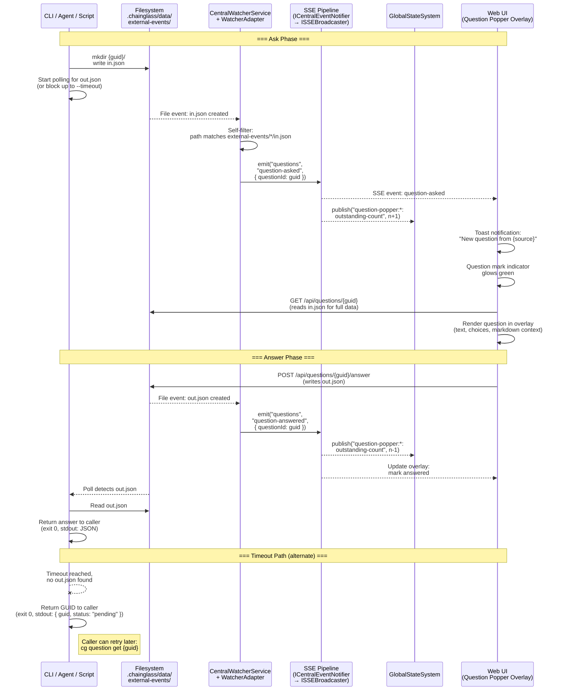
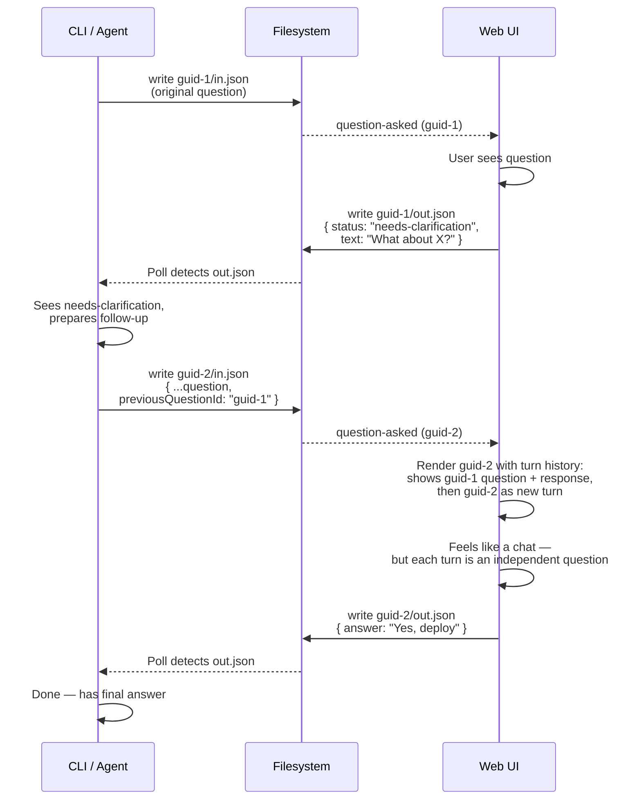

# Research Report: Question Popper

> ⚠️ **PARTIALLY SUPERSEDED**: This research was conducted for a file-based architecture (in.json/out.json + file watchers). The plan has since been rewritten to use an HTTP API architecture (localhost API endpoints + CLI polling). The codebase patterns, domain analysis, testing patterns, and prior learnings remain valid. The file-based transport design (watcher adapters, domain event adapters, atomic file writes) is no longer the implementation approach — use the [plan](plan.md) as the authoritative source.

**Generated**: 2026-03-07T01:35:00Z
**Research Query**: "Question Popper — general-purpose external event in/out system for CLI-to-UI question and answer"
**Mode**: Pre-Plan (branch `067-question-popper`)
**Location**: `docs/plans/067-question-popper/research-dossier.md`
**FlowSpace**: Available
**Findings**: 73 findings across 8 subagents (IA×10, DC×10, PS×10, QT×10, IC×11, DE×10, PL×16, DB×8)

---

## Executive Summary

### What It Does

Question Popper is a **general-purpose external event in/out system** that allows any CLI tool, agent, or script to ask questions of a human via the Chainglass web UI. Unlike the existing workflow-events Q&A (which is tied to graph nodes), Question Popper is graph-independent — it uses simple JSON files in the `.chainglass/data/` directory as the communication channel.

### Business Purpose

When AI agents or CLI scripts need human input, there's currently no way to ask outside of a running workflow graph. Question Popper fills this gap: any process can write a question file, the UI monitors for it, the human answers, and the process gets the response — all through a simple in.json/out.json file pair.

### Key Insights

1. **Rich prior art exists but is not reused directly**: The workflow-events domain (Plan 061) implements Q&A tied to graph nodes — a completely different system. Question Popper is independent. We study its patterns (question types, observer hooks) but share zero code. The activity-log domain (Plan 065) is a much closer template for the overlay UI + file-based data pattern.
2. **The architecture is file-first, not API-first**: CLI writes `in.json` → file watcher detects → SSE broadcasts → UI renders → user answers → `out.json` written → CLI reads. This keeps the system dead simple and testable.
3. **This is a NEW business domain** with zero coupling to workflow-events. The two are independent siblings: workflow-events requires `(graphId, nodeId)` tuples and a running workflow; Question Popper requires only a GUID and a filesystem.

### Quick Stats

- **Relevant domains**: 8 existing domains to integrate with
- **Existing patterns to reuse**: DomainEventAdapter, watcher adapter, overlay panel, JSONL audit, toast notifications, SSE broadcasting
- **Prior learnings surfaced**: 16 from previous implementations
- **External infrastructure needed**: None — all building blocks exist
- **Estimated new files**: ~15-20 (types, services, watcher adapter, SSE route, CLI command, UI overlay, tests, fakes)

---

## ⚠️ This Is NOT the Workflow Q&A System

Question Popper and the existing Workflow Events Q&A (Plan 061) are **completely separate systems** that solve different problems. They share zero code, zero infrastructure coupling, and zero state. The only similarity is that both involve asking humans questions.

| | Workflow Events Q&A (Plan 061) | Question Popper (Plan 067) |
|---|---|---|
| **Purpose** | Ask questions within a running workflow graph node | Ask questions from **anywhere** — any CLI tool, agent, or script |
| **Identity** | `(graphSlug, nodeId, questionId)` — tightly coupled to a graph | `(guid)` — no graph, no node, no workflow |
| **Transport** | Service calls → graph state.json → event handshake | **File-based**: write `in.json`, read `out.json` |
| **State machine** | `waiting-question → answered → node:restart` (3-event handshake) | `pending → answered` (or `expired`) — two files, that's it |
| **Persistence** | Embedded in workflow graph execution state | Standalone files in `.chainglass/data/external-events/{guid}/` |
| **Blocking** | Agent polls via `getAnswer()` in orchestration loop | CLI blocks natively (file poll with configurable timeout) |
| **UI surface** | QAModal inside workflow canvas page | Global overlay accessible from **any** page |
| **Coupling** | Requires `IPositionalGraphService`, `IWorkflowEvents` | Requires only filesystem + SSE |

> **Rule**: Question Popper must **never** import from `workflow-events`, `positional-graph`, or any graph-related module. They are independent sibling domains.

---

## Question Popper: How It Works

### The Core Flow

Question Popper is a **file-based in/out system**. The entire protocol is two JSON files in a GUID-named directory:

```
.chainglass/data/external-events/{guid}/
  in.json     ← Written by CLI/agent (the question)
  out.json    ← Written by UI/API (the answer)
```

That's it. Everything else (SSE, overlays, state, toasts) is reactive infrastructure built on top of detecting those two files.

### Sequence Diagram



### Question Chaining (Follow-up Questions)

When a user responds "needs more information", the agent creates a **new** question with `previousQuestionId` linking back. Each follow-up is a first-class question with its own GUID, own notification, and own lifecycle.



### Existing QuestionInput Type (for reference only)

The workflow Q&A system uses this type. Question Popper will define its **own** question schema, likely similar but independent:

```typescript
// Workflow Events (Plan 061) — DO NOT import from this
interface QuestionInput {
  type: 'text' | 'single' | 'multi' | 'confirm';
  text: string;
  options?: string[];
  default?: string | boolean;
}

// Question Popper (Plan 067) — new, independent type
interface QuestionPopperInput {
  type: 'text' | 'single' | 'multi' | 'confirm';
  text: string;                        // The question itself
  description?: string;                // Detailed markdown context (can be pages)
  options?: string[];                  // For single/multi choice
  default?: string | boolean;          // Default answer
  source: string;                      // Who asked (agent name, script, etc.)
  timeout?: number;                    // CLI block duration in seconds (for UI countdown)
  previousQuestionId?: string;         // Soft link to prior question in chain
}

---

## Architecture & Design

### Component Map

#### Data Layer (`.chainglass/data/external-events/`)
```
.chainglass/data/external-events/
  {guid}/
    in.json     ← Written by CLI (the question)
    out.json    ← Written by UI (the answer)
```

#### Server Layer
- **ExternalEventsWatcherAdapter** — watches `.chainglass/data/external-events/` for new files
- **ExternalEventsDomainEventAdapter** — transforms file events → SSE events
- **SSE channel** — new `WorkspaceDomain.ExternalEvents` or `WorkspaceDomain.Questions`
- **API routes** — `GET /api/questions` (list), `POST /api/questions/:id/answer` (answer)

#### Client Layer
- **Question mark indicator** — Top-right corner, green/glowing when questions waiting
- **QuestionPopperOverlay** — Fixed overlay panel (like activity-log, agent overlays)
- **State paths** — `question-popper:*:outstanding-count`, `question-popper:*:active-question`
- **Toast notifications** — Toast when new question arrives

#### CLI Layer
- **`cg question ask`** — Write in.json, optionally block for answer
- **`cg question answer`** — Write out.json (for testing/scripting)
- **`cg question get`** — Read out.json if present
- **`cg question list`** — List pending questions

### Design Patterns Identified

| Pattern | Source | Application |
|---------|--------|-------------|
| **DomainEventAdapter** (PS-01) | `_platform/events` | Transform file events → minimal SSE payloads |
| **IWatcherAdapter** (PS-02) | `_platform/events` | Self-filtering adapter for `.chainglass/data/external-events/` |
| **SSE Manager** (PS-03) | `_platform/events` | Broadcast question events via existing infrastructure |
| **Overlay Panel** (PS-06) | `activity-log`, `agents` | Fixed-position overlay with mutual exclusion |
| **JSONL Audit** (PS-05) | `activity-log` | Append-only question log for history |
| **Result Types** (PS-07) | `packages/shared` | Structured errors for CLI JSON output |
| **CLI Command** (PS-08) | `apps/cli` | Commander.js with `wrapAction()` + `resolveOrOverrideContext()` |
| **Top Bar Status** (PS-09) | `agents` (AgentChipBar) | Glowing question mark indicator |
| **Bootstrap Wiring** (PS-10) | `_platform/events` | HMR-safe initialization with globalThis guard |

### System Boundaries

- **Internal boundary**: Question Popper owns `in.json`/`out.json` format, GUID generation, timeout logic, and question lifecycle
- **External interfaces**: CLI writes files; UI reads/writes files; SSE broadcasts events
- **Integration points**: File watcher pipeline, SSE infrastructure, global state system, overlay system

---

## Dependencies & Integration

### What Question Popper Depends On

#### Internal Dependencies

| Dependency | Domain | Contract | Why |
|------------|--------|----------|-----|
| File watching | `_platform/events` | `ICentralWatcherService`, `IWatcherAdapter` | Detect new `in.json`/`out.json` files |
| SSE broadcasting | `_platform/events` | `ICentralEventNotifier`, `ISSEBroadcaster` | Broadcast question events to UI |
| Toast notifications | `_platform/events` | `toast()` | Notify user of new questions |
| Global state | `_platform/state` | `IStateService`, `useGlobalState` | Track outstanding question count |
| Overlay UI | `_platform/panel-layout` | `PanelShell` anchor | Position question overlay panel |
| SDK commands | `_platform/sdk` | `ICommandRegistry` | Register keyboard shortcuts |
| Workspace resolution | CLI infrastructure | `resolveOrOverrideContext()` | Find worktree path from CWD |
| File I/O | `_platform/file-ops` | `IFileSystem` | Read/write JSON files |

#### External Dependencies

None — all building blocks are internal to the monorepo.

### What Depends on Question Popper

| Consumer | Contract Consumed | Why |
|----------|------------------|-----|
| CLI tools | `cg question ask/answer/get/list` | Any script can ask questions |
| AI agents | CLI commands + CLAUDE.md prompt | Agents ask during execution |
| Workspace overlay | `useQuestionPopperOverlay` hook | Render question UI |
| Activity log | `appendActivityLogEntry()` (optional) | Audit trail of Q&A |

### Integration Architecture

```
CLI Process                           Web UI
━━━━━━━━━━━━                         ━━━━━━
  │                                     │
  │ write in.json                       │
  ├──────────────────►.chainglass/data/ │
  │                    external-events/  │
  │                    {guid}/in.json    │
  │                         │            │
  │                         ▼            │
  │                  CentralWatcherSvc   │
  │                         │            │
  │                         ▼            │
  │              ExternalEventsAdapter   │
  │                         │            │
  │                         ▼            │
  │              ICentralEventNotifier   │
  │                         │            │
  │                         ▼            │
  │                   SSEManager ────────►useSSE hook
  │                                      │
  │                                      ▼
  │                              QuestionPopper overlay
  │                              (toast + indicator)
  │                                      │
  │                                      │ user answers
  │                                      ▼
  │                              POST /api/questions/:id/answer
  │                                      │
  │  read out.json ◄─────────── write out.json
  │       │
  │       ▼
  │  return answer (or timeout → return GUID)
```

---

## Quality & Testing

### Recommended Test Strategy

Based on codebase conventions (QT-01 through QT-10):

1. **Contract tests** (`test/contracts/question-popper.contract.ts`)
   - `questionPopperContractTests(name, factory)` — runs against both Fake and Real implementations
   - Covers: ask → answer → getAnswer lifecycle, timeout behavior, question chaining

2. **Fake service** (`packages/shared/src/fakes/fake-question-popper.ts`)
   - `FakeQuestionPopperService` with inspection helpers: `getPendingQuestions()`, `getAnsweredCount()`, `simulateAnswer()`
   - Self-contained, no external dependencies (following FakeWorkflowEventsService pattern)

3. **Unit tests**
   - Question types and Zod schemas
   - in.json/out.json serialization/deserialization
   - Timeout logic
   - Question chaining (previousQuestionId linking)
   - CLI command handlers (with FakeFileSystem)

4. **Integration tests** (`test/integration/question-popper/`)
   - Full lifecycle: write in.json → watcher detects → SSE broadcasts → answer → write out.json
   - Uses FakeFileSystem + real service logic (pattern from QT-10)

5. **E2E tests** (`test/e2e/question-popper-cli-e2e.test.ts`)
   - CLI subprocess spawning with `execSync` (pattern from QT-05)
   - Default `describe.skip` (expensive)
   - Tests blocking behavior with timeout

### Critical Testing Conventions

- **ZERO `vi.mock()`** — use only fakes (Constitution Principle 4, ADR-0011)
- **`fileParallelism: false`** — already set in vitest.config.ts for CLI process tests
- **Fakes over mocks**: 54 existing fakes provide templates
- **FakeFileSystem** for file I/O tests (no real disk)
- **FakeCentralEventNotifier** to verify SSE emissions

---

## Prior Learnings (From Previous Implementations)

### 📚 PL-01: Use Native fs.watch, Not Chokidar
**Source**: Plan 060 (native-file-watcher)
**Type**: gotcha
**Why It Matters**: Chokidar exhausts 25,341 file descriptors for 5,000 files; native `fs.watch()` uses only 38 (667× better). Question Popper's watcher adapter will be registered with CentralWatcherService which already uses native watchers.
**Action**: Use the existing watcher infrastructure. Do NOT add chokidar or any other file watcher library.

### 📚 PL-02: 300ms Stabilization Threshold
**Source**: Plan 060
**Type**: workaround
**Why It Matters**: Editors do write-rename-rename sequences. A 300ms stabilization window (not 200ms) prevents false triggers when in.json is being written.
**Action**: The CentralWatcherService already handles this. Leverage it.

### 📚 PL-03: Debounce Batching (300ms)
**Source**: Plan 060
**Type**: decision
**Why It Matters**: Reduces event storms 10-100×. Total perceived latency ~600-700ms which is fine for human Q&A.
**Action**: Built into existing watcher infrastructure.

### 📚 PL-04: Deduplicate Double-Broadcast Races
**Source**: Plan 060
**Type**: gotcha
**Why It Matters**: When the API writes out.json AND the file watcher detects it, both emit events for the same change.
**Action**: Use idempotent event handling. The out.json answer should be written via the API route only; the watcher detects it for CLI polling. Add dedup guards.

### 📚 PL-05: Flat JSON Format
**Source**: Plans 061, 032
**Type**: decision
**Why It Matters**: `{ key: value }` not `{ outputs: { key: value } }`. Downstream readers expect flat structure.
**Action**: Keep in.json and out.json as flat JSON objects with clear top-level fields.

### 📚 PL-06: Strict Zod Validation with `.strict()`
**Source**: Plan 061
**Type**: decision
**Why It Matters**: No extra fields allowed. Exact field names enforced. Catches CLI/UI contract drift early.
**Action**: Define Zod schemas for in.json and out.json with `.strict()`.

### 📚 PL-07: Malformed Lines Silently Skipped
**Source**: Plan 059 (agents NDJSON)
**Type**: decision
**Why It Matters**: If in.json is partially written or corrupt, the reader should skip gracefully rather than crash.
**Action**: Wrap JSON.parse in try/catch. If in.json fails validation, mark as invalid rather than crash.

### 📚 PL-08: SSE Unidirectional
**Source**: Plan 060
**Type**: decision
**Why It Matters**: CLI writes files → file watcher detects → SSE broadcasts to UI. No bidirectional SSE.
**Action**: Keep architecture simple. SSE is notification-only. Answers flow via file writes, not SSE.

### 📚 PL-09: Guard Startup with globalThis Flag
**Source**: Plan 060, Plan 059
**Type**: gotcha
**Why It Matters**: Next.js HMR causes double-initialization. The watcher adapter registration and SSE setup must be idempotent.
**Action**: Use `globalThis.__questionPopperInitialized` flag pattern (same as agent services).

### 📚 PL-10: Notification-Fetch Pattern
**Source**: Plan 059 (agents)
**Type**: decision
**Why It Matters**: SSE sends minimal notification ("question asked with ID X"), UI fetches full question data via REST. Keeps SSE payloads small per ADR-0007.
**Action**: SSE event contains only `{ questionId, source }`. UI calls `GET /api/questions/:id` for full question data.

### 📚 PL-11: Enforce Timeout at Handler Level
**Source**: Plans 054, 061
**Type**: decision
**Why It Matters**: CLI blocking uses `Promise.race()` with configurable timeout (default 10 minutes). Timeout at the handler level, not the transport level.
**Action**: `cg question ask --timeout 600` uses `Promise.race([pollForAnswer(), sleep(timeout)])`.

### 📚 PL-12: Validate Node State Before Events
**Source**: Plan 061
**Type**: gotcha
**Why It Matters**: Can't answer a question that hasn't been asked. Must validate question exists and is unanswered before accepting answer.
**Action**: `POST /api/questions/:id/answer` validates: question exists, not already answered, not expired.

### 📚 PL-13: Store-Before-Notify Pattern
**Source**: Plan 059
**Type**: decision
**Why It Matters**: Agent storage happens BEFORE SSE broadcast. If SSE fails, data is still persisted.
**Action**: Write out.json BEFORE broadcasting "question answered" SSE event.

### 📚 PL-14: Answer Requires Full Handshake
**Source**: Plan 061
**Type**: gotcha
**Why It Matters**: In workflow Q&A, answering requires both `question:answer` AND `node:restart` events. For Question Popper, the handshake is simpler (just write out.json) but the pattern of "complete the full sequence" applies.
**Action**: Answering must: (1) validate question, (2) write out.json, (3) broadcast SSE event — all atomically.

### 📚 PL-15: Scope Watcher to Specific Directory
**Source**: Plan 060
**Type**: decision
**Why It Matters**: Watching all of `.chainglass/data/` is wasteful. Scope to `.chainglass/data/external-events/` only.
**Action**: Watcher adapter self-filters for `external-events/` path prefix.

### 📚 PL-16: HMR-Safe Observer Registry
**Source**: Plan 061
**Type**: workaround
**Why It Matters**: `WorkflowEventObserverRegistry` uses `globalThis` to survive Next.js HMR. Same pattern needed for question event observers.
**Action**: Use `globalThis` for any singleton registries.

### Prior Learnings Summary

| ID | Type | Source Plan | Key Insight | Action |
|----|------|-------------|-------------|--------|
| PL-01 | gotcha | 060 | Native fs.watch, not chokidar | Use existing watcher infra |
| PL-02 | workaround | 060 | 300ms stabilization | Built into CentralWatcher |
| PL-03 | decision | 060 | 300ms debounce batching | Built into CentralWatcher |
| PL-04 | gotcha | 060 | Dedup double-broadcast | Idempotent event handling |
| PL-05 | decision | 061 | Flat JSON format | Keep in/out.json flat |
| PL-06 | decision | 061 | Strict Zod schemas | `.strict()` on all schemas |
| PL-07 | decision | 059 | Skip malformed gracefully | try/catch JSON.parse |
| PL-08 | decision | 060 | SSE unidirectional | Notifications only via SSE |
| PL-09 | gotcha | 060/059 | globalThis for HMR | Idempotent init |
| PL-10 | decision | 059 | Notification-fetch pattern | Minimal SSE, REST for data |
| PL-11 | decision | 054/061 | Timeout at handler level | Promise.race in CLI |
| PL-12 | gotcha | 061 | Validate before accepting | Check question state |
| PL-13 | decision | 059 | Store-before-notify | Write file before SSE |
| PL-14 | gotcha | 061 | Full handshake required | Atomic answer sequence |
| PL-15 | decision | 060 | Scope watcher narrowly | Filter for external-events/ |
| PL-16 | workaround | 061 | HMR-safe singletons | globalThis registries |

---

## Domain Context

### Existing Domains Relevant to This Research

| Domain | Slug | Relationship | Key Contracts |
|--------|------|-------------|---------------|
| Events | `_platform/events` | Provider | `ICentralEventNotifier`, `ISSEBroadcaster`, `ICentralWatcherService`, `IWatcherAdapter`, `toast()`, `useSSE` |
| State | `_platform/state` | Provider | `IStateService`, `useGlobalState`, `ServerEventRouteDescriptor` |
| Panel Layout | `_platform/panel-layout` | Provider | `PanelShell` overlay anchor |
| SDK | `_platform/sdk` | Provider | `ICommandRegistry`, `IKeybindingService` |
| File Ops | `_platform/file-ops` | Provider | `IFileSystem` |
| Agents | `agents` | Peer/Consumer | `AgentChipBar` (UI pattern reference), agent overlay pattern |
| Workflow Events | `workflow-events` | Sibling | `QuestionInput` type (reference), Q&A lifecycle pattern |
| Activity Log | `activity-log` | Template | JSONL append pattern, overlay pattern, toast pattern |

### Domain Map Position

Question Popper is a **new business domain** at the same level as `activity-log` and `agents`. It:
- **Consumes**: `_platform/events` (watcher + SSE), `_platform/state` (reactive counts), `_platform/panel-layout` (overlay), `_platform/file-ops` (JSON I/O)
- **Is consumed by**: CLI tools, AI agents (via CLAUDE.md prompt injection), workspace overlay

### Recommended Domain Entry

| Field | Value |
|-------|-------|
| **Domain** | Question Popper |
| **Slug** | `question-popper` |
| **Type** | business |
| **Parent** | — |
| **Created By** | Plan 067 |
| **Status** | active |

### Boundary: Question Popper vs Workflow Events — COMPLETELY SEPARATE SYSTEMS

> **These are independent systems. Question Popper must never import from workflow-events or positional-graph.**

| Aspect | workflow-events (Plan 061) | question-popper (Plan 067) |
|--------|---------------------------|---------------------------|
| **Scope** | Workflow graph node Q&A | **Any** agent/script asking **any** question |
| **Identity** | `(graphId, nodeId, questionId)` | `(guid)` — no graph coupling |
| **Transport** | Service calls → graph state.json → 3-event handshake | **Filesystem**: `in.json` / `out.json` — two files |
| **State machine** | waiting-question → answered → node:restart | pending → answered (or expired) |
| **Persistence** | Graph state.json (embedded in workflow execution) | `external-events/{guid}/` (standalone, filesystem) |
| **Consumer** | workflow-ui, agents bridge | CLI, any agent, any script, any process |
| **Code coupling** | Tight to positional-graph, IWorkflowEvents | **Zero** coupling to any other domain |
| **Shared code** | N/A | **None** — independent type definitions |

### Potential Domain Actions

- **Extract new domain**: `question-popper` — general-purpose external Q&A
- **No changes to workflow-events** — they remain fully independent
- **No shared types**: Question Popper defines its own `QuestionPopperInput` type (similar shape but independent, with extra fields like `description`, `previousQuestionId`, `source`, `timeout`)

---

## Critical Discoveries

### 🚨 Critical Finding 01: No Blocking Wait Mechanism Exists
**Impact**: Critical
**Source**: IA-10, DC-09
**What**: The current system has NO built-in blocking/waiting for CLI agents. `askQuestion()` returns immediately with a questionId. Agents must implement their own polling loop.
**Why It Matters**: Question Popper's core CLI UX requires blocking by default (up to 10 minutes configurable). This is net-new functionality.
**Required Action**: Implement `waitForAnswer(questionId, timeoutMs)` using `Promise.race([pollForOutFile(), sleep(timeout)])`. Poll interval should be ~500ms (checking for `out.json` existence).

### 🚨 Critical Finding 02: Plan 054 (Unified Human Input) Already Built Modal
**Impact**: High
**Source**: DE-01
**What**: Plan 054 already implemented a `HumanInputModal` component for in-workflow questions. It handles all 4 question types (text, single, multi, confirm).
**Why It Matters**: We can study and potentially reuse UI components, but Question Popper's UI is fundamentally different — it's a persistent overlay/indicator, not a modal in a workflow canvas.
**Required Action**: Study `HumanInputModal` for question rendering patterns, but build new overlay UI following the activity-log overlay pattern instead.

### 🚨 Critical Finding 03: Watcher Adapter Is Self-Filtering
**Impact**: High
**Source**: IC-04, DC-03
**What**: The `IWatcherAdapter` contract receives ALL filesystem events from ALL worktrees. The adapter must self-filter for relevant events (path matching, event type checking).
**Why It Matters**: The ExternalEventsWatcherAdapter must filter for `external-events/*/in.json` and `external-events/*/out.json` patterns only.
**Required Action**: Implement path-based filtering: `event.path.includes('/external-events/') && (event.path.endsWith('/in.json') || event.path.endsWith('/out.json'))`.

### 🚨 Critical Finding 04: ADR-0007 Minimal SSE Payloads
**Impact**: High
**Source**: IC-06, PL-10
**What**: SSE events must contain only identifiers, not full data. Clients fetch full state via REST.
**Why It Matters**: Question SSE events should be `{ questionId, source, type: 'question-asked' }` — NOT the full question text/options/context.
**Required Action**: Follow notification-fetch pattern. SSE notifies; UI fetches via `GET /api/questions/:id`.

### 🚨 Critical Finding 05: Question Chaining Is UI-Only
**Impact**: Medium
**Source**: User requirements
**What**: Follow-up questions pass `previousQuestionId` for soft linking. Each follow-up is a brand new question with its own GUID, own notification, own lifecycle.
**Why It Matters**: The "chain" is purely a UI concern (showing conversation turns). The data layer treats each question independently.
**Required Action**: `in.json` includes optional `previousQuestionId`. UI queries for previous questions when rendering to show the conversation chain.

---

## Modification Considerations

### ✅ Safe to Modify

1. **`.chainglass/data/` directory**: Adding `external-events/` subdirectory. No existing code reads this path.
2. **`WorkspaceDomain` constants**: Adding new channel name. Additive change, no breaking impact.
3. **CLI commands**: Adding `cg question` subcommand group. New command, no conflicts.
4. **Workspace layout**: Adding overlay wrapper. Follows established pattern from activity-log.

### ⚠️ Modify with Caution

1. **CentralWatcherService adapter registration**: Must register new adapter without disrupting existing ones. Risk: startup order matters.
   - Mitigation: Register in `startCentralNotificationSystem()` alongside existing adapters.
2. **SSE event schemas**: Adding new event types to discriminated union. Risk: schema validation may reject unknown types.
   - Mitigation: Add to `sseEventSchema` union in `sse-events.schema.ts`.
3. **Global state connector**: Adding new `ServerEventRouteDescriptor`. Risk: wrong path format causes silent failures.
   - Mitigation: Follow exact pattern from work-unit-state domain.

### 🚫 Danger Zones

1. **IWorkflowEvents interface**: Do NOT extend this. Question Popper is independent.
2. **Positional graph state**: Do NOT store external questions in graph state.json.
3. **Existing watcher adapters**: Do NOT modify them. Only add new ones.

### Extension Points

1. **DomainEventAdapter pattern**: Designed for exactly this use case — add a new adapter for a new domain.
2. **ServerEventRouteDescriptor**: Designed for SSE→state bridging — add a new descriptor.
3. **Overlay mutual exclusion**: `overlay:close-all` event already wired — new overlays participate automatically.
4. **SDK command registry**: Can register `question-popper.toggleOverlay` command.

---

## Supporting Documentation

### Related Documentation

| Document | Path | Relevance |
|----------|------|-----------|
| Workflow Events Integration | `docs/how/workflow-events-integration.md` | Q&A patterns, event types |
| Central Events Testing | `docs/how/dev/central-events/4-testing.md` | Testing SSE + watcher adapters |
| Constitution | `docs/project-rules/constitution.md` | Principle 4: fakes over mocks |
| ADR-0007 | `docs/adr/adr-0007-single-channel-sse.md` | Minimal SSE payloads |
| ADR-0010 | `docs/adr/adr-0010-central-domain-events.md` | Three-layer event architecture |
| ADR-0011 | `docs/adr/adr-0011-first-class-domain-concepts.md` | Testability via fakes |

### Key Existing Code to Reference

| Component | Path | Why |
|-----------|------|-----|
| FakeWorkflowEventsService | `packages/shared/src/fakes/fake-workflow-events.ts` | Template for FakeQuestionPopperService |
| Activity Log types | `apps/web/src/features/065-activity-log/types.ts` | Template for QuestionEntry type |
| Activity Log writer | `apps/web/src/features/065-activity-log/lib/activity-log-writer.ts` | Template for question writer |
| Activity Log overlay | `apps/web/src/features/065-activity-log/components/activity-log-overlay-panel.tsx` | Template for question overlay |
| Agent overlay hook | `apps/web/src/hooks/use-agent-overlay.tsx` | Overlay mutual exclusion pattern |
| AgentChipBar | `apps/web/src/features/059-fix-agents/` | Top bar indicator pattern |
| CLI command helpers | `apps/cli/src/commands/command-helpers.ts` | `wrapAction()`, `resolveOrOverrideContext()` |
| DomainEventAdapter | `packages/shared/src/features/027-central-notify-events/` | Base class for event adapters |
| CentralWatcherService | `packages/workflow/src/features/023-central-watcher-notifications/` | Watcher registration |
| SSE schemas | `apps/web/src/lib/schemas/sse-events.schema.ts` | Event type definitions |
| WorkspaceDomain | `packages/shared/src/features/027-central-notify-events/workspace-domain.ts` | Channel constants |
| GlobalStateConnector | `apps/web/src/lib/state/state-connector.tsx` | State wiring pattern |
| ServerEventRoute | `apps/web/src/lib/state/server-event-route.tsx` | SSE→state bridge |

---

## Recommendations

### If Building This System (which we are)

1. **Start with the data contract**: Define `in.json` and `out.json` Zod schemas first. Everything else follows from these.
2. **Build CLI first, UI second**: The CLI is the primary producer; testing the file-based in/out is simpler without UI. Use subprocess tests to verify blocking behavior.
3. **Follow activity-log domain structure**: It's the closest template — business domain with JSONL data, overlay UI, toast notifications.
4. **Create a new domain from scratch**: Do NOT extend workflow-events. The domains are siblings.
5. **Use existing infrastructure**: Watcher adapter, SSE broadcasting, global state, overlay pattern — all exist. Don't reinvent.

### Key Design Decisions to Make in Specification

1. **in.json schema**: Exact fields beyond QuestionInput (description, source, timeout, previousQuestionId)
2. **out.json schema**: Answer format, "needs clarification" flag, clarification text
3. **Channel naming**: `WorkspaceDomain.Questions` vs `WorkspaceDomain.ExternalEvents`
4. **CLI command naming**: `cg question ask` vs `cg ask` vs `cg popper ask`
5. **Blocking behavior**: Default timeout (10 min per user), poll interval (500ms?), exit code conventions
6. **Question history**: How long to keep? Per-session? Per-worktree?
7. **CLAUDE.md prompt**: What instructions to give agents about using this system

---

## External Research Opportunities

No external research gaps identified. All architectural building blocks and patterns exist within the codebase. The Question Popper feature is primarily an integration exercise leveraging well-established infrastructure.

---

## Appendix: File Inventory

### New Files to Create (estimated)

| File | Purpose |
|------|---------|
| `packages/shared/src/question-popper/types.ts` | QuestionEntry, AnswerEntry, schemas |
| `packages/shared/src/question-popper/constants.ts` | Event types, file paths |
| `packages/shared/src/interfaces/question-popper.interface.ts` | IQuestionPopper |
| `packages/shared/src/fakes/fake-question-popper.ts` | FakeQuestionPopperService |
| `apps/web/src/features/067-question-popper/` | Feature directory |
| `apps/web/src/features/067-question-popper/lib/question-writer.ts` | Write out.json |
| `apps/web/src/features/067-question-popper/lib/question-reader.ts` | Read in.json |
| `apps/web/src/features/067-question-popper/hooks/use-question-popper-overlay.tsx` | Overlay hook |
| `apps/web/src/features/067-question-popper/components/question-popper-indicator.tsx` | Question mark UI |
| `apps/web/src/features/067-question-popper/components/question-popper-overlay-panel.tsx` | Overlay panel |
| `apps/web/app/api/questions/route.ts` | GET /api/questions |
| `apps/web/app/api/questions/[id]/answer/route.ts` | POST answer |
| `apps/cli/src/commands/question.command.ts` | CLI commands |
| `test/contracts/question-popper.contract.ts` | Contract tests |
| `test/unit/question-popper/` | Unit tests |
| `test/integration/question-popper/` | Integration tests |
| `docs/domains/question-popper/domain.md` | Domain definition |

### Files to Modify

| File | Change |
|------|--------|
| `packages/shared/src/features/027-central-notify-events/workspace-domain.ts` | Add `Questions` channel |
| `apps/web/src/lib/schemas/sse-events.schema.ts` | Add question SSE events |
| `apps/web/src/lib/state/state-connector.tsx` | Add question-popper ServerEventRouteDescriptor |
| `apps/cli/src/commands/index.ts` | Register question commands |
| `docs/domains/registry.md` | Add question-popper domain |
| `docs/domains/domain-map.md` | Add question-popper to diagram |
| `CLAUDE.md` | Add agent instructions for asking questions |

---

## Next Steps

1. Run `/plan-1b-specify` to create the feature specification with exact data contracts, CLI UX, and UI behavior
2. Consider running `/plan-2c-workshop` on the "question chaining" concept if the soft-link UX needs deeper design exploration

---

**Research Complete**: 2026-03-07T01:35:00Z
**Report Location**: `docs/plans/067-question-popper/research-dossier.md`
